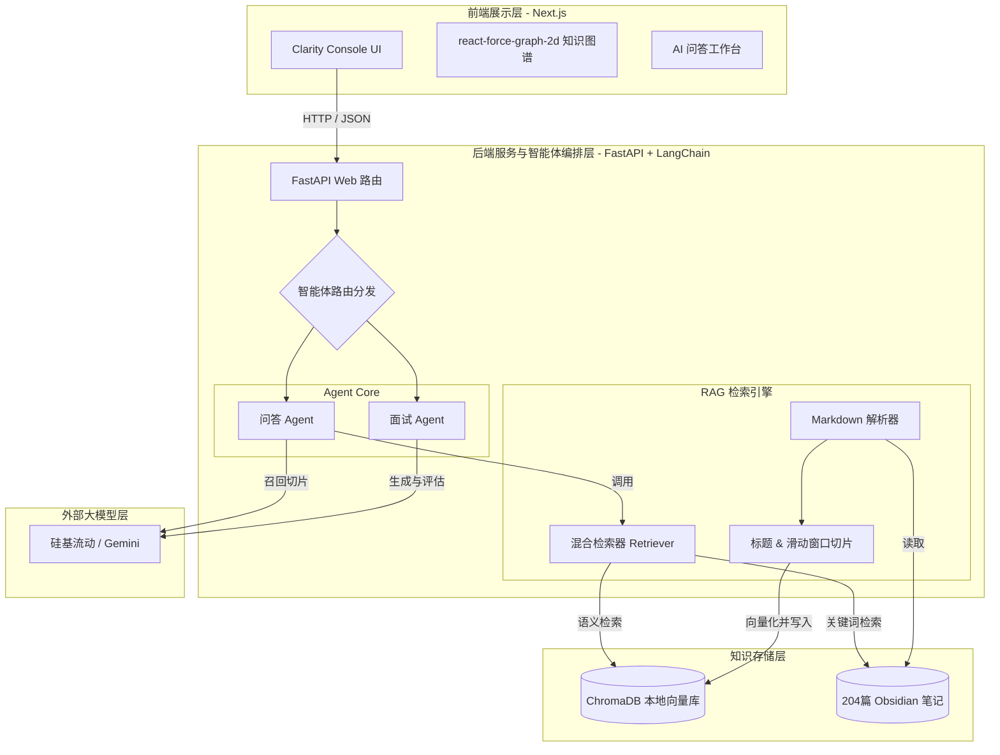

# PM Knowledge Hub 🧠

> 基于 RAG 技术的 AI 产品经理垂直知识库，集语义知识检索、AI 问答助手、模拟面试、知识图谱于一体的智能知识管理系统。

[]()
[]()
[]()

---

## 📌 项目概述

当前 `main` 对应 `v1.6.0-rc.1` 发布候选版，候选代码已提交并推送至远程 `main`；最新正式稳定标签为 `v1.5.0`。由于尚未创建 `v1.6.0` tag 与 GitHub Release，本版本仍不标记为正式发布。

本项目为产品经理（PM）提供了一套本地化的智能学习与复习工作台。系统读取并向量化解析了 **204 篇 AI 产品经理学习笔记**（当前索引 **2579 个知识分片**），通过多模态与语义检索，将碎片化的知识有机融合：

1. 📚 **语义知识检索**：支持对本地知识库进行语义向量和精确关键词双轨召回，解决笔记查找困难的问题。
2. 🤖 **RAG 问答助手**：基于私有知识库实时生成回答，精确展示引用证据链并支持一键回跳 Obsidian。
3. 🎤 **STAR 面试模拟**：结合可切换的大模型 API 与 STAR 评估法则，提供真实的 AI 模拟面试和多维度考核打分。
4. 🗺️ **知识图谱可视化**：使用 `react-force-graph-2d` 绘制可交互的学习大纲及笔记网络，让知识脉络立体化。

---

## 🌐 在线体验

公开演示地址：**[pm-knowledge-hub-demo.tongqtang.chatgpt.site](https://pm-knowledge-hub-demo.tongqtang.chatgpt.site)**

线上演示版复用了本项目原有前端界面，提供营销页、设计页、知识库、AI 助手、模拟面试、学习地图和关于页，适合直接浏览产品流程，无需登录或配置密钥。

| 能力 | Codex Sites 公开演示版 | 本地完整版 |
|---|---|---|
| 产品页面与核心交互 | ✅ | ✅ |
| 演示数据 | 浏览器内置脱敏数据 | 本地 Obsidian 笔记 |
| FastAPI / ChromaDB | — | ✅ |
| 真实 RAG 与模型调用 | — | 可选，需自行配置密钥 |
| API 密钥与付费调用 | **无，不会产生模型费用** | 仅在用户主动配置并调用时产生 |

> 公开站点是安全的产品体验版：不部署后端、不读取本地知识库、不包含环境变量或 API 密钥，也不会请求硅基流动、Gemini 等付费模型服务。完整检索和真实 AI 能力请按下方说明在本地运行。

---

## 🎨 核心模块展示

| 📚 语义知识检索 | 🤖 RAG 问答助手 |
| :---: | :---: |
|  |  |
| *多模态检索结果，直观展示相关度评分* | *带有证据源标注的私有问答控制台* |

| 🎤 STAR 面试模拟 | 🗺️ 知识图谱可视化 |
| :---: | :---: |
|  |  |
| *基于大模型的 STAR 回答四维评价雷达* | *炫酷的可视化学习网络与一度聚焦高亮* |

---

## ⚙️ 系统架构

本系统由**前端展示层**、**后端服务与智能体编排层**、**本地知识存储层**三个核心层次组成：



---

## 🛠️ 技术栈

* **后端**：Python 3.10+ · FastAPI · LangChain · ChromaDB · Sentence-Transformers (MiniLM) · SiliconFlow / Gemini
* **前端**：Next.js 16 (App Router) · React 19 · TypeScript · Vanilla CSS · react-force-graph-2d
* **测试与校验**：pytest · ESLint

---

## 🚀 快速开始

### 1. 前置依赖
* 操作系统：Windows 10/11
* 开发环境：Python 3.10+ / Node.js 18+

### 2. 后端部署 (FastAPI)
1. 进入后端目录，创建并激活虚拟环境：
   ```bash
   cd backend
   python -m venv venv
   # Windows 环境下激活虚拟环境
   .\venv\Scripts\activate
   ```
2. 安装依赖包：
   ```bash
   pip install -r requirements.txt
   ```
3. 在 `backend/` 目录下创建配置文件 `.env`：
   ```env
   # 本地 Obsidian 知识库笔记所在绝对路径
   NOTES_DIR="C:/Users/tangtongqing/Desktop/学习/从零开始成为产品经理/从零开始成为ai产品经理"
   # Chroma 向量数据库存放目录
   CHROMA_DB_PATH="./data/chroma_db"
   # 文本 Embedding 模型名称
   EMBEDDING_MODEL="paraphrase-multilingual-MiniLM-L12-v2"
   # auto 会优先使用硅基流动，其次 Gemini；均无密钥时使用本地 Mock
   AI_PROVIDER="auto"
   SILICONFLOW_API_KEY="你的硅基流动密钥"
   SILICONFLOW_BASE_URL="https://api.siliconflow.cn/v1"
   SILICONFLOW_MODEL="deepseek-ai/DeepSeek-V3"

   # 可选的 Gemini 备用配置
   GEMINI_API_KEY=""
   GEMINI_MODEL="gemini-2.5-flash"
   ```
4. 启动后端服务：
   ```powershell
   python -m uvicorn api.main:app --reload --port 8000
   ```
   出现 `Application startup complete` 后即表示启动成功。可通过以下地址确认服务状态：

   * API 文档：`http://127.0.0.1:8000/docs`
   * 健康检查：`http://127.0.0.1:8000/api/v1/health`

   > ⚠️ **注意**：首次启动或运行单元测试时，系统将通过联网下载 `paraphrase-multilingual-MiniLM-L12-v2` 嵌入模型（大小约 120MB）。此后将完全在本地离线调用。

5. 关闭后端服务：

   在运行后端的终端中按 `Ctrl + C`，等待 Uvicorn 完成正常关闭。

   如果原终端已经关闭或丢失，可在 PowerShell 中先确认占用 8000 端口的进程，再将其停止：

   ```powershell
   $backendPid = (Get-NetTCPConnection -LocalPort 8000 -State Listen).OwningProcess
   Get-Process -Id $backendPid
   Stop-Process -Id $backendPid
   ```

### 3. 前端部署 (Next.js)
1. 进入前端目录，安装相关依赖：
   ```bash
   cd ../frontend
   npm install
   ```
2. 启动前端开发服务器：
   ```bash
   npm run dev
   ```
3. 打开浏览器访问 `http://localhost:3000` 即可开始使用。

---

## 📁 项目结构

```text
pm-knowledge-hub/
├── docs/                  # 📋 项目设计与管理文档
│   ├── pm/                # AI产品管理文档（BRD/MRD/PRD）
│   ├── plans/             # 迭代阶段计划
│   ├── versions/          # 版本发布记录 (CHANGELOG)
│   ├── acceptance/        # 各阶段验收报告
│   └── screenshots/       # 系统运行核心截图
├── backend/               # 🐍 Python 后端服务
│   ├── api/               # FastAPI 路由逻辑 (含图谱 API)
│   ├── ingest/            # Markdown 向量化入库脚本
│   ├── agents/            # QA 问答与面试 Agent
│   ├── tests/             # Pytest 单元与集成测试
│   └── requirements.txt   # 后端依赖配置
├── frontend/              # ⚛️ Next.js 前端界面
│   ├── src/
│   │   ├── app/           # Next.js App Router (首页/知识库/问答/面试/地图)
│   │   └── lib/           # API 通信与客户端接口
│   ├── package.json       # 前端依赖配置
│   └── README.md          # 前端说明文档
└── acceptance_test.md     # 📌 系统验收 checklist（v1.6 RC 发布门禁已通过）
```

Codex Sites 的部署源在本地 `sites-demo/` 独立 Git 工作区中维护，并由主仓库 `.gitignore` 排除，避免将部署仓库误提交为 Git 子模块。线上版本只保留可公开展示的前端与脱敏演示数据。

---

## 🔗 相关文档索引

* **项目看板**：[PROGRESS.md](docs/PROGRESS.md)
* **任务历史**：[TASKS.md](docs/TASKS.md)
* **发布历史**：[CHANGELOG.md](docs/versions/CHANGELOG.md)
* **系统验收报告**：[acceptance_test.md](acceptance_test.md)
* **求职材料**：[简历与面试总手册](docs/demo/PM_KNOWLEDGE_HUB_RESUME_MASTER.md)
* **产品管理文档体系**：
  * [BRD.md — 商业需求](docs/pm/BRD.md) | [MRD.md — 竞品与市场](docs/pm/MRD.md) | [PRD.md — 核心功能需求说明](docs/pm/PRD.md)
  * [ARCHITECTURE.md — 拓扑图与数据流设计](docs/pm/ARCHITECTURE.md) | [METRICS.md — 指标监控](docs/pm/METRICS.md) | [ROADMAP.md — 路线图规划](docs/pm/ROADMAP.md)

---

## 🔒 数据流向与隐私

作为一款面向个人知识库的数据智能体，我们高度重视您的隐私和本地数据安全性：
1. **本地存储**：您的原始 Obsidian 笔记、向量分片及本地向量数据库（ChromaDB）均完全保存在本地磁盘（`backend/data/` 目录下），**不向任何第三方上传笔记全文**。
2. **数据外发披露**：仅当您配置了硅基流动或 Gemini 密钥并且**主动发起**「AI 问答」或「模拟面试评估」时，系统才会把**检索召回的笔记分片（非笔记全文）**与您的提问通过加密连接发送至所选供应商。
3. **完全本地化降级**：如果不希望数据外传，只需留空 `SILICONFLOW_API_KEY` 与 `GEMINI_API_KEY`。系统将自动切换为本地 Mock 模式（离线静态模板回答）。
4. **线上演示隔离**：Codex Sites 公开演示版不包含上述密钥、模型端点、后端服务或原始笔记；站点环境变量为空，所有展示数据均在浏览器本地模拟。

---

## 📄 开源协议

本项目采用 [MIT License](LICENSE) 协议发布。
