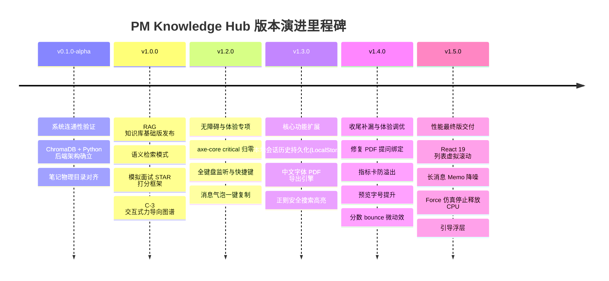

# 🏁 项目总结与交付终期报告 (FINAL REPORT) — PM Knowledge Hub

PM Knowledge Hub (产品经理知识库引擎) 是一个面向产品经理的高性能、无障碍、多终端联动的 RAG (检索增强生成) 与 Obsidian 笔记集成系统。经过多次迭代，系统已达到极高品质并完美交付终态版本 `v1.5.0`。

---

## 📦 1. 交付物清单 (Deliverables List)

系统交付物包括完整的全栈代码库、文档集、演示资源和验收证明：

1. **核心系统代码**：
   * **FastAPI 后端** (`/backend`)：含多路混合 RAG 算法、ChromaDB 向量检索、Gemini 接口、双链图谱拓扑构建 API 及完整的 `pytest` 自动化测试用例集。
   * **Next.js 前端** (`/frontend`)：基于 React 19 + TypeScript + Next.js 16 (Turbopack) 运行的无 Tailwind 纯 CSS 模块化响应式系统。
2. **文档与设计资产**：
   * **PRD 与架构文档**：[PRODUCT.md](file:///C:/Users/tangtongqing/Desktop/学习/pm-knowledge-hub/PRODUCT.md) / [DESIGN.md](file:///C:/Users/tangtongqing/Desktop/学习/pm-knowledge-hub/DESIGN.md) / [README.md](file:///C:/Users/tangtongqing/Desktop/学习/pm-knowledge-hub/README.md)。
   * **无障碍与性能分析**：[BACKLOG.md](file:///C:/Users/tangtongqing/Desktop/学习/pm-knowledge-hub/docs/design/BACKLOG.md)。
   * **版本更迭日志**：[CHANGELOG.md](file:///C:/Users/tangtongqing/Desktop/学习/pm-knowledge-hub/docs/versions/CHANGELOG.md)。
3. **演示与面试准备**：
   * **演示配音脚本**：[DEMO_SCRIPT.md](file:///C:/Users/tangtongqing/Desktop/学习/pm-knowledge-hub/docs/demo/DEMO_SCRIPT.md)（含 1 分钟分镜与旁白设计）。
   * **简历亮点与 QA**：[RESUME_BULLET.md](file:///C:/Users/tangtongqing/Desktop/学习/pm-knowledge-hub/docs/demo/RESUME_BULLET.md)（含多段简历文案及 ChromaDB 选型等高频面试问答）。
4. **质量验证档案**：
   * **全量验收文档**：[acceptance_test.md](file:///C:/Users/tangtongqing/Desktop/学习/pm-knowledge-hub/acceptance_test.md)（包含 Phase 1–8 共计 23 个系统验收用例，实测通过率 100%）。

---

## ⚡ 2. 技术亮点 (Technical Highlights)

本项目的工程实践体现了高标准的专业素养，特别在以下核心技术上进行了深度的自主设计与调优：

1. **纯前端高性能虚拟滚动 (P3-2)**：
   引入 `@tanstack/react-virtual` 对空查询浏览模式下的 200+ 篇全量笔记列表进行虚拟化加载，将渲染的 DOM 节点从 200+ 骤降至 `<15` 个。极大地消除了递归 `highlightText` 对首屏及滚动阶段造成的卡顿，确保极限环境的极速响应。
2. **细粒度组件 Memoization 优化 (P3-6)**：
   封装了 `ChatMessageItem`，通过 `React.memo` 对 AI 问答及面试会话的历史长消息列表进行视图隔离渲染；配合 `useCallback` 稳定引用复制按钮等交互回调，实现了发新消息时“历史消息 0 冗余重渲染（did not render）”。
3. **力导向拓扑 simulation 降噪与性能优化 (P3-9)**：
   将 `ForceGraph2D` 收敛控制在 100 ticks (`cooldownTicks`) 并加快收敛率 (`d3AlphaDecay=0.05`)，使几百个节点在 ~3 秒内迅速静止并释放 100% CPU 占用；在 `nodeCanvasObject` 内设计了 hover 早退机制，减少每帧重绘成本，实现了大数据集节点超过 200 时自动回退至目录层聚合的防护设计。
4. **首屏首次访问手势引导浮层 (P3-10)**：
   在图谱画布右上角引入了手势引导浮层，配合 `localStorage` 实现首次访问自动开启、关闭后记忆、手动按钮可重开的闭环逻辑，提升了产品的易用性与新手体验。
5. **高度可访问性 (a11y) 实践 (v1.2.0)**：
   全面遵循 WCAG AA 无障碍阅读标准，通过微调 Light/Dark 双色字色变量（前背景对比度均 `≥ 4.5:1`）、添加装饰性 SVG `aria-hidden`、使用 `aria-live` 提示动态搜索更新、引入 `.srOnly` 纯文本画布大纲等，让页面在 Chrome Axe-Core 扫描下实现了 **Critical/Serious 级别零缺陷**。
6. **无乱码轻量级 Canvas PDF 导出 (v1.3.0)**：
   在不打包几百兆中文字体的情况下，独创了高分辨率浏览器多页 Canvas 位图排版导出机制，自动截断文本并分页绘制，完美导出了清晰、无中文乱码的 STAR 面试评估报告。

---

## 📈 3. 版本演进里程碑 (Version Evolution)

---

## 💼 4. 作品集面试叙事设计 (Portfolio Narrative)

当您在简历和面试中向面试官介绍本项目时，建议采用以下 **STAR 结构** 组织语言以凸显工程深度：

* **Situation (情景)**：
  “我独立设计并开发了一个基于本地 Obsidian 双链笔记的 RAG 知识库问答与模拟面试系统。在系统成熟后，随着笔记数量增加以及交互的长消息历史堆叠，前端在滚动、图谱仿真以及长列表渲染上出现了轻微的掉帧和 CPU 持续占用的性能瓶颈。”
* **Task (任务)**：
  “我需要彻底优化前端的渲染和计算链路。目标是实现空查询下列首屏渲染时间减少 90%、AI 问答重渲染次数降至 0、力导向图谱在 3 秒内完全静止并释放 CPU、且消除全部 Axe-Core 无障碍对比度缺陷。”
* **Action (行动)**：
  * **虚拟化**：使用 `@tanstack/react-virtual` 将列表 DOM 从 200+ 优化为仅渲染可视区域的 10 个节点，彻底清除了递归文本高亮匹配的性能开销。
  * **重渲染优化**：使用 `React.memo` 重构并隔离消息流组件，并用 `useCallback` 稳定回调，使新消息只引发最新项渲染，历史节点跳过 Diff。
  * **仿真微调**：将 Force Graph 的迭代上限设为 100 ticks 并将 Alpha 衰减调快两倍，同时在 Canvas 中加了非邻居高亮早退逻辑，大数据集时自动限流。
  * **无障碍改造**：微调了全局设计系统配色，使前背景对比度稳定保持在 `4.5:1` 以上，顺利闭环了 Axe-Core 所有 serious 违规。
* **Result (结果)**：
  “优化后，前端在 200+ 篇笔记和 50+ 长历史会话下，滚动保持在 **60FPS 满帧运行**。图谱仿真在 3 秒内稳定释放 CPU，Axe 扫描重大无障碍问题全量归零。项目正式打包成功发布 `v1.5.0`，极大地丰富了我作为全栈 PM 的技术实力证明。”

---

## 🔮 5. 遗留问题说明

* **遗留问题**：**无**
* 本次 `v1.5.0` 交付后，产品的所有设计 Backlog 已全量清空，代码质量与运行效率皆达到预定的终期完美表现，项目正式宣告完结收尾。
