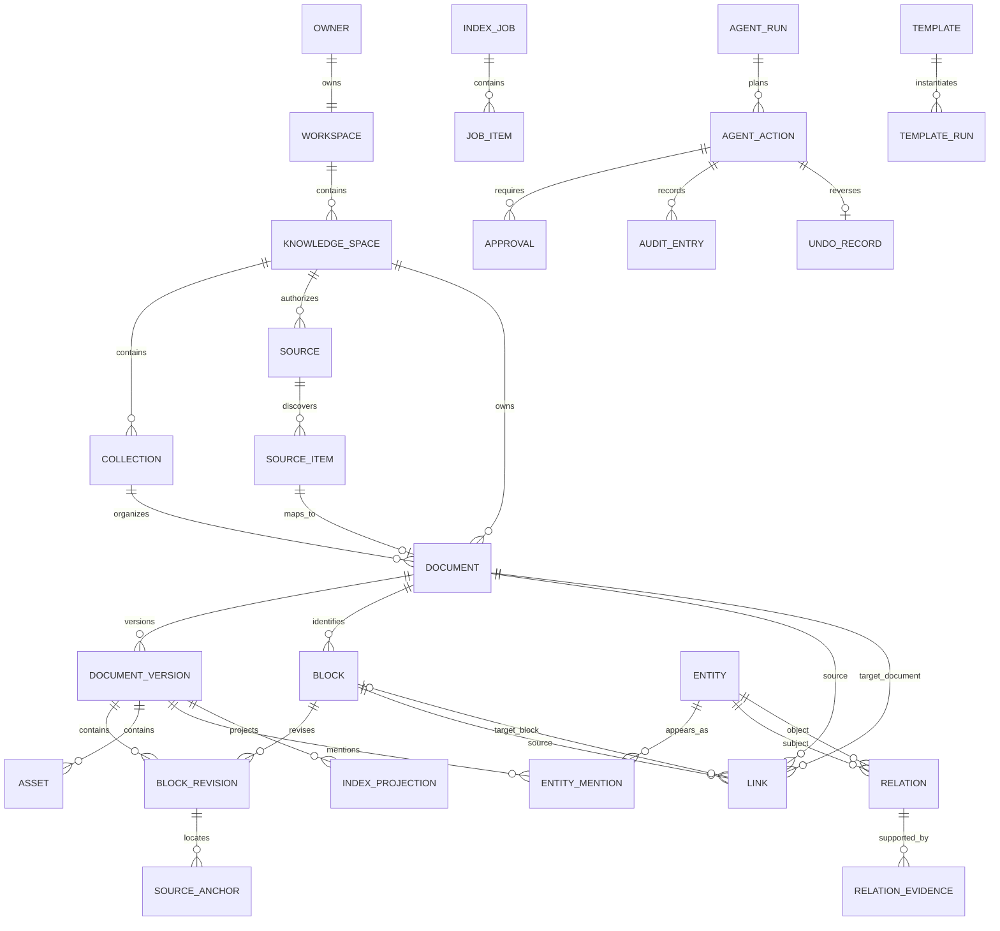

# 个人知识工作台 v2 数据模型（草案）

> 对应架构：[TARGET_ARCHITECTURE.md](TARGET_ARCHITECTURE.md) · 对应需求：[PRD v5 草案](../product/PRD-v5-DRAFT.md) · 文档版本：`v1.0-draft.1` · 更新日期：2026-08-24 · 状态：Proposed

> **文档边界：**本文定义概念模型、身份、版本和约束；字段是逻辑设计，不是已经执行的数据库迁移。正式 SQLite DDL 应在 ADR 通过和原型验收后生成。

## 1. 模型原则

1. 路径、标题、空间名称和向量 ID 都不是永久业务身份；
2. 原始文件、解析结果、业务事实和检索投影分层存储；
3. 一个链接只保存正向事实，反链按目标反向计算；
4. 引用固定证据版本，稳定 URI 默认解析到当前可用版本；
5. 模型推断关系不能自动升级为用户确认事实；
6. 所有高风险写操作都有 Action、Approval、Audit 和 Undo 记录；
7. 当前只有一个本地 owner，但所有顶层对象保留 `owner_id`，不实现团队权限；
8. 删除默认使用状态和回收站，不用级联硬删破坏证据链。

## 2. 概念关系



## 3. 身份与通用字段

### 3.1 ID 规则

- 新业务对象使用不含业务含义的 UUID；首版优先 UUIDv4，避免增加排序 ID 依赖；
- v1.x 迁移对象可使用固定 namespace 的 UUIDv5 生成幂等 ID；
- ID 创建后不因标题、路径、空间名、目录名或内容更新而改变；
- API、链接、审计和索引使用同一业务 ID；向量库内部 ID 不成为外部契约；
- 每张核心表至少具有 `id`、`created_at`、`updated_at`、`status` 和乐观并发 `revision`。

### 3.2 稳定地址

```text
workspace://{workspaceId}/spaces/{spaceId}/documents/{documentId}#block={blockId}
```

规则：

- `workspaceId/spaceId/documentId/blockId` 均为稳定业务 ID；
- Citation 额外保存 `document_version_id` 和 `block_revision_id`，保证当时证据可复核；
- 普通导航 URI 默认打开 Document 当前 active version 中对应 Block；
- 无法精确重定位时显示 `stale` 或 `ambiguous`，不得静默跳到相似但不确定的位置；
- 本地文件路径只通过受控 `open-source` 动作解析，不写入 URI。

## 4. 工作区与目录对象

### 4.1 Owner

| 字段 | 含义 | 约束 |
|---|---|---|
| `id` | 本地所有者 ID | v2 默认仅一条；不可使用系统用户名 |
| `kind` | `local_owner` | 为未来迁移保留，不实现团队用户 |
| `display_name` | 可选本地显示名 | 不进入公开日志 |

### 4.2 Workspace

| 字段 | 含义 | 约束 |
|---|---|---|
| `owner_id` | 所有者 | 必填 |
| `name` | 工作区显示名 | 可修改，不影响 ID |
| `data_root_ref` | 工作区数据根引用 | 后端私有，不向前端返回绝对路径 |
| `schema_version` | 当前数据 schema | 用于升级和回滚 |
| `default_model_policy_id` | 默认模型/外发策略 | 可被 Space 覆盖 |

### 4.3 KnowledgeSpace

| 字段 | 含义 | 约束 |
|---|---|---|
| `workspace_id` | 所属工作区 | 必填 |
| `name` / `description` | 用户定义主题 | 名称不是身份 |
| `sort_order` | 排序 | 只影响展示 |
| `lifecycle` | `active/archived/trashed` | archived 默认不进入查询 |
| `model_policy_id` | 空间模型与外发规则 | 必填或继承 |
| `default_search_scope` | 当前空间/显式组合 | 不能静默扩大范围 |

### 4.4 Collection

| 字段 | 含义 | 约束 |
|---|---|---|
| `space_id` | 所属空间 | 必填 |
| `parent_id` | 父集合 | 可空；不能形成环 |
| `name` | 显示名称 | 同父级可设唯一约束 |
| `kind` | `logical/source_mirror/system` | 物理目录镜像与逻辑目录可区分 |
| `sort_order` | 展示顺序 | 不影响来源路径 |

Document 具有一个主 `space_id`；默认属于零或一个主 Collection。跨空间复用通过 Link 或显式引用完成，不复制同一业务文档。

## 5. 来源与文件身份

### 5.1 Source

| 字段 | 含义 | 约束 |
|---|---|---|
| `space_id` | 授权空间 | 必填；查询不能跨越此边界 |
| `mode` | `reference/managed_copy` | 原位只读或工作区管理副本 |
| `kind` | `directory/file/upload/future_connector` | v2 不启用 connector |
| `root_locator` | 后端私有绝对根定位 | 加密不是首发强制，但禁止出现在 API/日志 |
| `permission` | `read_only/managed` | reference 必须 read_only |
| `availability` | `available/unavailable/permission_lost` | 失联不删除历史版本 |
| `sync_policy` | `manual/on_open/future_watch` | M1 不承诺文件监听 |
| `privacy_policy_id` | 外发/OCR/模型规则 | 可继承 Space |

### 5.2 SourceItem

SourceItem 表示来源中被发现的一个文件或对象，并维护路径历史。

| 字段 | 含义 | 约束 |
|---|---|---|
| `source_id` | 所属来源 | 必填 |
| `relative_locator` | 相对 Source root 的定位 | 规范化、禁止越界 |
| `format` | md/txt/pdf/csv/xlsx/xls/png/jpg/webp… | 与解析能力等级分开 |
| `size/mtime` | 扫描属性 | 用于快速变更检测，不单独判定身份 |
| `content_fingerprint` | 内容哈希 | 去重、更新与移动重定位 |
| `file_identity_hint` | 可选平台标识 | 只能作辅助，不成为永久身份 |
| `document_id` | 映射文档 | 一个 active item 至多映射一个 Document |
| `availability` | present/moved/missing/permission_lost | 不级联删除 Document |

移动检测优先使用同一 Source 内未匹配项的内容指纹、大小、结构和用户确认；仅凭同名不能自动合并。

## 6. 文档、版本、内容块与锚点

### 6.1 Document

| 字段 | 含义 | 约束 |
|---|---|---|
| `space_id` | 主空间 | 必填 |
| `collection_id` | 主集合 | 可空，必须属于同一 Space |
| `title` | 用户可识别标题 | 不作为 ID |
| `document_type` | note/pdf/table/image/compound | 用于能力展示 |
| `active_version_id` | 当前可查询版本 | 只指向 ready/partial_accepted 版本 |
| `lifecycle` | active/archived/trashed | 删除使用状态 |
| `source_state` | linked/copied/unavailable/detached | 区分来源状态 |

### 6.2 DocumentVersion

| 字段 | 含义 | 约束 |
|---|---|---|
| `document_id` | 所属文档 | 必填 |
| `version_no` | 文档内递增版本 | 唯一 |
| `source_item_id` | 产生此版本的来源项 | 可空，支持系统内新建文档 |
| `content_fingerprint` | 版本内容指纹 | 用于幂等与核验 |
| `parser_id/parser_version` | 解析器标识 | 支持重建与比较 |
| `status` | staging/ready/partial_accepted/failed/superseded | staging 不进入默认查询 |
| `created_by` | import/user/agent/migration | 可追溯 |

新版本在最低必要内容和索引投影完成前不替换 `active_version_id`。旧版本保留到备份/保留策略允许清理。

### 6.3 Block 与 BlockRevision

Block 表示可被稳定链接的逻辑内容身份；BlockRevision 表示某个文档版本中的具体内容。

| 对象 | 关键字段 | 约束 |
|---|---|---|
| Block | `document_id`、`kind`、`semantic_key`、`lifecycle` | `block_id` 在文档版本间保持稳定；不存在可靠匹配时创建新 Block |
| BlockRevision | `block_id`、`document_version_id`、`parent_block_id`、`order_key`、`text`、`text_fingerprint`、`metadata_json` | 同一 Block 在一个版本最多一条 revision |

`semantic_key` 可以使用标题祖先、结构位置、表格名称等辅助匹配，但不是外部 ID。匹配结果记录 `exact/relocated/new/stale/ambiguous` 和算法版本。

### 6.4 SourceAnchor

| 字段 | 含义 |
|---|---|
| `block_revision_id` | 具体内容版本 |
| `format` | 来源格式 |
| `locator_json` | 格式化定位数据 |
| `context_fingerprint` | 附近内容指纹，用于重定位 |
| `resolution_status` | exact/relocated/stale/ambiguous/unavailable |
| `confidence` | 自动重定位置信度；用户确认后可为空或 1 |

`locator_json` 最低要求：

| 格式 | 字段 |
|---|---|
| Markdown/TXT | heading path、line/character range、context fingerprint |
| PDF | page、text range；需要时 bounding box |
| CSV/Excel | sheet/table、cell range、record key |
| Image | asset ID、bounding box、OCR text range |

### 6.5 Asset

Asset 表示图片、附件、页面渲染或表格预览等非纯文本对象，保存 `document_version_id`、类型、来源 locator、内容指纹、缓存状态、OCR/描述 provider 和置信度。缓存路径不是业务身份。

## 7. 链接、实体与关系

### 7.1 Link

| 字段 | 含义 | 约束 |
|---|---|---|
| `space_id` | 创建关系的主空间 | 必填 |
| `source_ref_type/id` | Document 或 Block | 必填 |
| `target_document_id` | 目标文档 | 必填 |
| `target_block_id` | 可选精确目标 | 可空 |
| `link_type` | reference/supports/contradicts/extends/example/related/custom | 首批最小集合需产品确认 |
| `origin` | source_explicit/user/agent_confirmed/migration | 模型不能直接写 `user` |
| `created_by` | user/agent/migration/parser | 可追溯 |
| `status` | active/broken/stale/trashed | 目标失联不静默删除 |

Backlink 不单独存表：查询 `Link.target_document_id/target_block_id` 得到反链。只有性能证据成立时才增加可重建物化视图。

### 7.2 Entity 与 EntityMention

| 对象 | 关键字段 | 说明 |
|---|---|---|
| Entity | `space_id`、`canonical_name`、`entity_type`、`aliases_json`、`status` | status 区分 suggested/confirmed/merged/rejected |
| EntityMention | `entity_id`、`block_revision_id`、`anchor_id`、`surface_text`、`extractor`、`confidence` | 每个实体必须能回到出现位置 |

实体默认在 Space 内消歧；跨空间合并必须用户显式允许。

### 7.3 Relation 与 RelationEvidence

| 对象 | 关键字段 | 说明 |
|---|---|---|
| Relation | `space_id`、`subject_entity_id`、`predicate`、`object_entity_id/value`、`direction`、`origin`、`status`、`confidence` | status 区分 suggested/confirmed/conflicted/rejected |
| RelationEvidence | `relation_id`、`block_revision_id`、`anchor_id`、`evidence_role` | 一条事实关系至少有一条可回跳证据 |

图谱中的边可以来自结构、Link 或 Relation，但 API 必须返回 `edge_kind/origin/status/evidence_count`，前端不能用同一样式混合事实与建议。

## 8. 导入任务与检索投影

### 8.1 IndexJob 与 JobItem

| 对象 | 关键字段 | 状态 |
|---|---|---|
| IndexJob | `workspace_id`、`space_id`、`source_id`、`job_type`、`requested_by`、`idempotency_key`、`progress` | queued/running/partial/succeeded/failed/cancelled/waiting_confirmation |
| JobItem | `job_id`、`source_item_id`、`stage`、`attempt`、`error_category`、`checkpoint_json` | queued/running/succeeded/skipped/retryable/failed/cancelled |

JobItem 阶段至少包括 discover、copy、parse、ocr、normalize、match_version、index_lexical、embed、extract_relations 和 finalize。状态变化写入 SQLite 后再执行下一步。

### 8.2 IndexProjection

| 字段 | 含义 |
|---|---|
| `document_version_id` / `block_revision_id` | 投影源 |
| `projection_type` | lexical/vector/graph/preview |
| `generation` | 当前构建代次 |
| `provider/version` | FTS、embedding 或算法版本 |
| `status` | pending/ready/stale/failed |
| `indexed_at` | 完成时间 |

SQLite FTS 和向量库记录的主键使用 `block_revision_id`；业务查询返回结果后必须回到 SQLite 做范围与 active version 校验。

## 9. 查询、引用与会话

### 9.1 QuerySession

保存可选的本地查询/问答会话元数据：`space_scope_json`、`mode`、`model_provider`、创建时间和删除状态。正文可按用户设置保存；指标事件不得复制正文。

### 9.2 Citation

| 字段 | 含义 |
|---|---|
| `session_id/answer_id` | 所属回答或结果集 |
| `document_id/document_version_id` | 稳定文档与证据版本 |
| `block_id/block_revision_id` | 稳定块与证据内容 |
| `anchor_id` | 当时来源位置 |
| `claim_ref` | 支持回答中的哪一项结论 |
| `verification_status` | unverified/verified/insufficient/stale |

Citation 不使用列表序号作为身份；`[1]` 只是一次响应中的显示顺序。

## 10. Agent、审批、审计与撤销

### 10.1 AgentRun

记录 `workspace_id`、`space_scope_json`、`goal`（按用户隐私设置保存）、`model_policy_id`、`plan_version`、状态和时间。Run 不能扩大创建时的空间范围。

### 10.2 AgentAction

| 字段 | 含义 |
|---|---|
| `run_id/tool_name/tool_version` | 使用的登记工具 |
| `risk_level` | R0/R1/R2/R3 |
| `target_refs_json` | 目标对象 ID，不用任意路径 |
| `before_json/after_json` | 去敏差异或摘要 |
| `idempotency_key` | 防重复执行 |
| `status` | planned/approved/running/succeeded/partial/failed/rejected/undone |

### 10.3 Approval、AuditEntry、UndoRecord

- Approval 保存动作计划版本、用户决定、确认范围、时间和失效时间；计划改变后旧批准失效；
- AuditEntry 追加记录计划、策略判断、执行结果、失败和撤销，不作为完整事件溯源；
- UndoRecord 保存 inverse action 或恢复版本引用、可撤销期限和结果；
- R3 永久删除不进入首发；回收站操作仍必须记录影响对象和恢复路径。

## 11. 模板与通用核心边界

| 对象 | 关键字段 | 约束 |
|---|---|---|
| Template | `template_key`、`version`、`capabilities_json`、`input_schema`、`tool_allowlist`、`evaluation_schema` | 不包含职业专用核心表 |
| TemplateRun | `template_id`、`space_scope_json`、`agent_run_id`、`result_refs_json` | 结果引用 Document/Block/Link/Action |

PM 面试、研究综述或项目复盘都通过 Template 配置和通用对象实现。若某模板需要新增底层字段，先判断是否为通用知识能力；否则放在模板扩展 JSON 或独立扩展表，不能污染核心 Document/Link。

## 12. 策略、指标和安全事件

- ModelPolicy：允许的 provider、local/external、最大发送范围、用途和保留说明；
- SourceAuthorization：Source root、权限、允许格式和操作；
- MetricEvent：匿名对象 ID、事件类型、数量、耗时、结果和错误类别，不含正文/路径；
- SafetyEvent：范围、隐私、错误引用、未确认写入、数据损失等类别及版本；
- Tombstone/TrashEntry：对象类型、ID、删除者、过期时间和恢复状态。

## 13. 核心不变量

1. 任一 Document、Link、Relation、Job 和 Agent Action 都能追溯到 Workspace 和 Space；
2. Reference Source 的原文件不会被系统或 Agent 写入；
3. Document 的 active version 必须属于同一 Document 且状态可用；
4. BlockRevision 必须同时属于其 Block 的 Document 和对应 DocumentVersion；
5. Citation 必须引用固定 Version/Revision，不能只保存标题和路径；
6. Backlink 数量等于指向目标的 active Link 查询结果；
7. Confirmed Relation 至少有一条证据或明确 `origin=user_manual`；
8. 未通过审批的 R1～R3 Action 不得进入 running；
9. Agent Action 的目标必须在 AgentRun 固定范围内；
10. 索引投影可以删除和重建，但不能反向成为业务事实来源；
11. archived/trashed Space 默认不进入查询；
12. 硬删不能破坏未过保留期的 Audit、Citation 和 Undo 链。

## 14. Schema 演进与兼容

- SQLite 使用单调递增 `schema_version` 和事务迁移；
- 每次迁移前生成一致性备份，失败自动回滚数据库事务；
- 解析器、embedding、关系抽取和模板分别记录版本，不与 schema version 混用；
- API DTO 提供版本并保持至少一个迁移窗口的兼容；
- 新字段先可空/有默认值，完成回填和验证后再加强约束；
- 检索投影升级通过新 generation 影子构建，完成后原子切换；
- v1.x 数据映射详见 [MIGRATION_PLAN.md](MIGRATION_PLAN.md)。

## 15. 待确认项

1. UUIDv4 + 迁移 UUIDv5 是否满足调试与排序需求；
2. Block 跨版本匹配的首批格式算法和用户确认入口；
3. Link 最小关系类型集合是否需要允许用户自定义；
4. Entity 默认按 Space 隔离，跨空间是否只在查询时临时聚合；
5. Query/Agent 正文的本地保存默认值和保留期限；
6. Trash、Audit、旧 DocumentVersion 和备份的保留策略。

---

*v1.0-draft.1：建立多空间、多格式、稳定锚点、原生反链、typed relations、持久任务和 Agent 审计的统一逻辑模型。*
