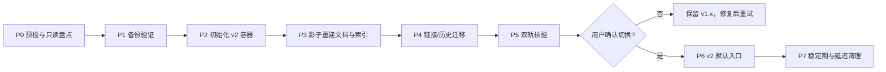
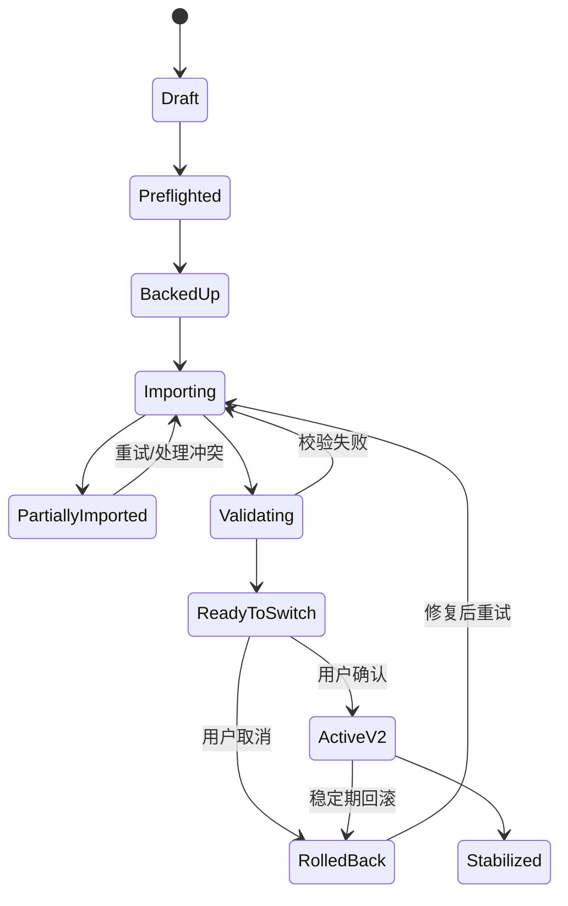

# PM Knowledge Hub v1.x → 个人知识工作台 v2 迁移计划（草案）

> 对应架构：[TARGET_ARCHITECTURE.md](TARGET_ARCHITECTURE.md) · 数据模型：[DATA_MODEL.md](DATA_MODEL.md) · 对应需求：[PRD v5 草案](../product/PRD-v5-DRAFT.md) · 文档版本：`v1.0-draft.1` · 更新日期：2026-08-24 · 状态：Proposed

> **安全边界：**本文是迁移设计，不会执行任何文件移动、删除、数据库转换或索引重建。实际迁移必须在实现、自动化测试、备份验证和用户确认后单独执行。

## 1. 迁移目标

在不修改 v1.x 原始 Markdown 文件的前提下，把单一 `NOTES_DIR`、Chroma 分片、浏览器历史和现有 PM 场景映射到 v2 的 Workspace / Space / Source / Document / Version / Block 模型，并保证：

- 迁移可预览、可重复、可暂停、可核验、可回滚；
- v1.x Chroma 和启发式图谱不被误当成 v2 业务事实；
- 原有 Obsidian 双链可以成为系统原生 Link，但系统不再依赖 Obsidian；
- 旧问答和面试历史尽可能保留；无法可靠映射时明确标记只读历史；
- 迁移失败时 v1.x 仍可启动，原始知识文件保持不变。

## 2. v1.x 事实基线

| 数据/能力 | 当前位置 | 当前身份 | 主要限制 |
|---|---|---|---|
| Markdown 原文 | `NOTES_DIR` | 相对 `source_path` | 单目录；路径承担身份；Obsidian 语法耦合 |
| 解析元数据 | Parser 运行结果 | 路径、标题、章节、tags、wikilinks | 未独立持久化版本和锚点 |
| 内容分片 | Chroma `pm_notes` | 当前 `chunk_id` | Chroma 同时承担内容、目录和向量事实 |
| 向量索引 | `CHROMA_DB_PATH` | collection + embedding model | 无统一投影 generation 和迁移状态 |
| 完整文档读取 | 运行时从 `NOTES_DIR` 回读 | `source_path` | 文件移动/失联处理有限 |
| 图谱 | 目录顺序、标题/关键词启发式 | 路径或章节名 | 不能作为真实语义关系迁移 |
| 问答历史 | 浏览器 `localStorage` | 前端 session ID | 不在后端，可能受容量/浏览器影响 |
| 面试历史 | 浏览器 `localStorage` | 前端 session ID | PM 专用；缺少通用 Template Run |
| 运行指标 | FastAPI `app.state` | 进程内计数 | 重启丢失，不可作为 v2 用户证据 |
| 模式与密钥 | `.env` 和运行配置 | 环境变量 | 需要迁移为策略引用，密钥不能入库 |

迁移实现前必须再次读取当前代码与真实数据目录，不能只依据本文假设。

## 3. 迁移原则

1. **先复制事实元数据，后重建派生索引：**不直接原地升级旧 Chroma；
2. **原文件只读：**迁移预览、正式迁移和回滚都不得改写 `NOTES_DIR`；
3. **新旧隔离：**v2 SQLite、向量索引、缓存和备份使用独立数据根；
4. **幂等：**同一 migration run 重试不会重复创建 Document、Link 或历史；
5. **逐项核验：**批次可以部分成功，失败项按原因重试或跳过；
6. **显式切换：**只有完成数据、检索、引用和回滚验收后才把 v2 设为默认入口；
7. **延迟清理：**旧 Chroma、旧配置和 `localStorage` 在稳定期内保留，不自动删除；
8. **证据分层：**旧启发式图、运行指标和 Mock 数据不迁移为用户确认事实或 E1 数据。

## 4. 目标映射

| v1.x | v2 目标对象 | 映射规则 | 不能自动决定的情况 |
|---|---|---|---|
| `NOTES_DIR` | Workspace + KnowledgeSpace + Source(reference) | 创建一个本地 Workspace；原目录成为只读 Source | Space 名称由用户确认，不能用仓库名定义用户边界 |
| 一级目录/学习路径 | Collection(source_mirror) | 保留目录层级作为来源镜像 | 不自动写成学习顺序或语义关系 |
| Markdown 文件 | SourceItem + Document + DocumentVersion | 相对路径扫描，内容哈希，建立首个版本 | 重复内容、同名文件和疑似移动需要确认 |
| 当前 chunk | Block + BlockRevision + SourceAnchor | 优先重新解析；旧 chunk_id 只作映射参考 | 切块变化导致无法一一匹配时创建新 Block 并记录差异 |
| Obsidian `[[link]]` | Link(origin=`source_explicit`) | 解析目标并建立正向 Link，反链查询生成 | 模糊、缺失或跨目录多命中标为 unresolved |
| 图片嵌入 | Asset + Link/embed relation | 验证授权根内相对定位 | 路径越界或缺失不复制猜测 |
| tags/frontmatter | Document metadata + 可选 Entity/Mention | 保留原始字段与解析版本 | 不把任意 tag 自动升级为确认 Entity |
| 目录顺序边 | 结构投影 | 可作为 Collection 顺序显示 | 不迁移为 Relation 事实 |
| 标题/关键词图边 | Relation suggestion 或丢弃后重算 | 默认不迁移为事实 | 只有用户确认的旧边才可转 confirmed |
| QA 历史 | QuerySession/Answer/Citation legacy record | 前端本地读取后预览导入 | 无稳定来源映射时标记 citation stale/legacy |
| 面试历史 | TemplateRun(`pm-interview-legacy`) | 可选导入为只读历史 | 不自动生成新行动或修改知识库 |
| 进程指标 | 不迁移 | 新系统重新开始持久指标 | 旧计数只留历史文档证据 |
| `.env` 密钥 | 安全配置引用 | 用户重新确认 provider；密钥保持环境/安全存储 | 永不写入 SQLite 或导出包 |

## 5. 标识与幂等策略

### 5.1 MigrationRun

每次迁移创建 `migration_run_id`，保存：

- v1.x 版本、源目录指纹、旧 Chroma 路径摘要；
- 目标 workspace/space/source ID；
- 迁移工具版本、schema version、parser/embedding 版本；
- 各阶段开始/结束时间、逐项结果和校验摘要；
- 备份引用、切换状态和回滚状态。

### 5.2 确定性映射

- 初次迁移的 Workspace/Space/Source 可由 migration run 固定生成后复用；
- SourceItem 和 Document 初始 ID 可使用 `UUIDv5(migration_namespace, source_id + normalized_relative_path)`；
- 文件移动后的长期身份不继续依赖路径，而由 SourceItem mapping、内容指纹和用户确认维持；
- Link 使用 `source_ref + target_ref + link_type + origin_locator` 形成幂等键；
- 历史 Session 使用 `legacy_store + legacy_session_id` 唯一约束；
- 向量投影键使用新 `block_revision_id`，不复用旧 Chroma ID 作为业务 ID。

## 6. 迁移阶段

### P0：预检与只读盘点

操作：

- 确认 v1.x 版本、`NOTES_DIR`、`CHROMA_DB_PATH`、embedding model 和浏览器历史位置；
- 校验 Source root 存在、可读、未越界，统计格式、数量、大小和权限异常；
- 计算源清单和内容指纹，不读取工作区外文件；
- 扫描重复、冲突、损坏、超大文件、失效 wikilink 和未授权资产；
- 估算 v2 数据和备份空间；
- 输出预览，不创建 Document，不写旧目录。

退出条件：用户看见目标工作区、空间名、来源模式、文件数量、跳过项、风险和预计磁盘占用。

### P1：备份与恢复验证

需要备份：

- v1.x Chroma 数据目录的一致性副本；
- 当前 `.env` 的去密配置摘要，不复制密钥到迁移报告；
- QA/面试 `localStorage` 的用户主动导出副本；
- v2 目标数据库若已存在，则先做 SQLite 一致性备份；
- 迁移清单、工具版本和校验哈希。

备份目录必须是明确的工作区数据子目录，不能使用仓库根、用户主目录或未解析环境变量作为覆盖/删除目标。进入 P2 前至少完成一次“从备份恢复到临时位置并读取”的验证。

### P2：初始化 v2 容器

- 创建本地 Owner、Workspace、用户确认名称的 KnowledgeSpace；
- 将原 `NOTES_DIR` 登记为 `Source(mode=reference, permission=read_only)`；
- 目录结构可建立 `Collection(kind=source_mirror)`；
- 初始化独立 SQLite、向量索引、cache、trash 和 backup 目录；
- 写入 schema/parser/index 版本，不修改 v1.x 配置或默认入口。

对于当前 PM 资料，可以建议空间名“PM 知识”，但必须允许用户改名；这只是现有资料主题，不代表 v2 的用户边界。

### P3：影子重建文档、内容块和索引

逐 SourceItem 执行：

1. 读取内容与指纹；
2. 创建/匹配 Document 和首个 DocumentVersion；
3. 使用 v2 Markdown parser 重建 Block、BlockRevision 和 Anchor；
4. 保留 frontmatter/tags/显式 links 的解析结果和 parser version；
5. 写入 SQLite FTS 和新向量 collection/generation；
6. 完成逐项校验后切换该 Document 的 active version；
7. 记录成功、跳过、可重试和失败原因。

不把旧 Chroma documents 直接复制为 v2 Block，因为旧切块、身份和锚点语义不足。旧 Chroma 只用于数量、抽样和搜索结果对比。

### P4：链接、资产和历史

#### 显式链接

- 按相对路径、文件名和别名解析 Obsidian link；
- 唯一匹配才创建 active Link；
- 多匹配、缺失和循环不是错误事实，记录为 unresolved 并提供人工处理；
- 反链通过新 Link 反向查询生成；
- 标准 Markdown link 采用相同 Link 模型。

#### 图谱

- Collection 层级生成结构投影；
- 显式 Link 生成 link edge；
- 旧目录顺序和标题/关键词边不迁移为 confirmed Relation；
- 如保留旧启发式边，只能标记 `legacy_suggestion`，默认隐藏并允许批量丢弃。

#### 浏览器历史

- 前端检测 v1 key：`pmhub-history-qa`、`pmhub-history-interview`；
- 用户主动选择“预览迁移”，前端将去敏结构发送到本地后端；
- 能映射到 Document/Block 的来源转为 Citation；不能映射的显示 legacy/stale；
- PM 面试历史进入可选模板的只读 legacy run；
- 迁移成功不自动删除 `localStorage`，只提供后续用户确认清理。

### P5：双轨核验

| 维度 | 核验方法 | 通过条件 |
|---|---|---|
| 文件完整性 | 迁移前后源清单与内容哈希 | Reference 原文件变化为 0 |
| 文档覆盖 | v1 可读 Markdown 与 v2 ready/accepted 文档对比 | 应迁移项达到冻结门槛；差异逐项有原因 |
| 内容覆盖 | 标题、段落、代码、列表、链接、图片抽样 | 无静默丢失 P0 内容 |
| 链接 | 有效、失效、别名、相对路径和同名样本 | 唯一匹配正确；模糊项不猜测 |
| 搜索 | 版本化查询集跑 v1/v2 对照 | v2 不低于接受基线，范围隔离为 0 错误 |
| 引用 | 打开系统 URI 和本地来源 | 正确版本/块/位置达到目标 |
| 图谱 | 检查每类边的来源与状态 | 事实边 100% 可解释 |
| 历史 | QA/面试抽样和条目计数 | 成功、stale、skip 数量可复算 |
| 恢复 | 中断、重启、重复执行 migration run | 无重复 Document/Link/History |
| 性能 | 参考设备上的查询和重建 | 达到冻结 P50/P95 门槛 |

### P6：显式切换

切换前必须：

- 用户审核迁移摘要和未解决项；
- 备份恢复演练通过；
- v2 核心查询、原文回跳、空间范围和错误恢复通过；
- v1.x 启动方式和数据仍可用；
- 明确选择“将 v2 设为默认入口”。

切换只更新应用配置/启动入口，不移动或删除原文件，不覆盖旧 Chroma。

### P7：稳定期与延迟清理

- 在约定的稳定期内保留 v1.x 只读兼容入口、旧 Chroma 和迁移备份；
- 观察索引新鲜度、锚点、链接、任务恢复和历史使用；
- 清理必须单独列出精确目标、占用、影响和恢复方式，并再次获得用户确认；
- 优先移动到回收站/归档，永久删除不属于自动迁移步骤。

## 7. 迁移状态机

状态和每个 SourceItem checkpoint 持久化到 SQLite。`running` 状态在进程异常退出后必须转为 `retryable` 或由幂等步骤安全恢复。

## 8. 回滚方案

### 8.1 切换前回滚

- 停止 v2 migration worker；
- 保留失败日志和迁移报告；
- 删除目标临时数据不是必要条件，可以标记 migration run abandoned；
- v1.x 不需要改动即可继续使用。

### 8.2 切换后稳定期回滚

- 停止 v2 写操作，导出 v2 新增的用户 Link、Action 和管理副本文档；
- 将默认启动入口恢复到 v1.x；
- 从迁移前备份恢复 v2 SQLite 到独立检查位置，而非覆盖当前数据；
- Reference 原文件无需恢复，因为从未被修改；
- 对只存在于 v2 的管理副本提供导出，不静默丢弃；
- 记录回滚原因、版本、未迁移新增数据和再次迁移条件。

### 8.3 不可自动回写 v1.x 的数据

v2 新建的 Link、Relation、跨格式内容、Agent Action 和模板结果不能安全自动写回原 Markdown。回滚时以可读导出包保留，是否写回原文件属于未来独立功能，必须另行确认。

## 9. 失败分类与处置

| 类别 | 示例 | 自动策略 | 用户动作 |
|---|---|---|---|
| path/permission | Source 不存在、无权限 | 停止该 Source，不影响其他数据 | 重新定位或授权 |
| format/parser | 编码、损坏、插件语法 | 跳过/降级保留文件级记录 | 选择处理方式或等待解析器 |
| duplicate/conflict | 同哈希、同名不同内容 | 不自动覆盖 | 跳过、更新、另存或合并 |
| link_resolution | 同名多目标、缺失目标 | 保留 unresolved | 人工选择或忽略 |
| index/embed | 模型不可用、索引失败 | 保留已解析版本，投影可重试 | 选择模型/重试 |
| storage | 磁盘不足、SQLite 错误 | 停止新写入，保护旧 active version | 释放空间/从备份恢复 |
| history | localStorage 损坏、来源失效 | 跳过坏条目并报告 | 保留原导出，人工检查 |
| policy | 需要外部 OCR/模型但未允许 | 等待确认，不自动外发 | 允许、换本地方式或跳过 |

## 10. 自动化测试要求

- 单元：ID 映射、path normalization、fingerprint、状态机、链接解析和历史转换；
- 集成：临时 Source → SQLite → FTS/Vector → Citation 的完整流水线；
- 故障注入：每个 Job stage 中断、磁盘不足、权限丢失、模型不可用和重复重试；
- 安全：路径穿越、symlink/junction 越界、绝对路径泄露、密钥导出和跨 Space；
- Golden files：Markdown 语法、中文路径、别名 wikilink、图片、空文件、超大文件；
- 回滚：切换前/后恢复、v2 新数据导出和 v1.x 再启动；
- 性能：真实规模影子索引时间、磁盘增长、查询 P50/P95 和重建时间。

## 11. 验收报告结构

每次迁移演练必须输出：

- MigrationRun ID、工具/代码/schema/parser/index 版本；
- 源和目标路径的去敏引用；
- 文件、Document、Version、Block、Link、History 的 success/skip/fail 数量；
- 失败分类、人工决定和未解决项；
- 源文件哈希变化数量；
- 搜索、引用、图谱和性能对照；
- 备份位置引用与恢复验证结果；
- 是否满足切换门槛；
- GO、RETRY、ROLLBACK 或 STOP 决策。

## 12. 进入实施前待确认

1. 迁移默认空间的建议名称和用户改名时点；
2. M1 是否同时提供 reference 与 managed_copy；
3. v1.x 浏览器历史是否值得迁移正文，还是只迁移摘要和来源；
4. 旧启发式图谱建议边是否全部丢弃后重算；
5. v1.x 兼容入口稳定期与备份保留期；
6. 工作区数据根和备份空间预算；
7. 正式迁移前使用哪一份脱敏副本完成至少两次演练。

---

*v1.0-draft.1：定义从单一 NOTES_DIR/Chroma/localStorage 到 v2 统一对象模型的影子迁移、双轨核验、显式切换和回滚方案。*
