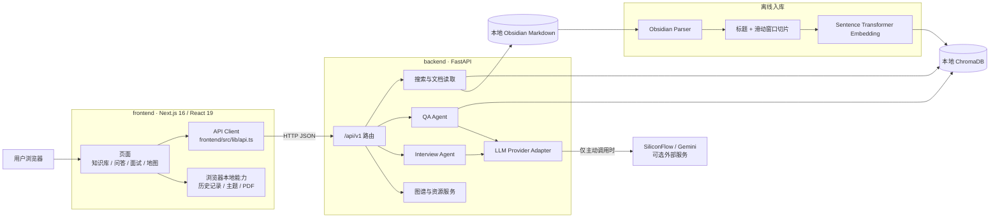
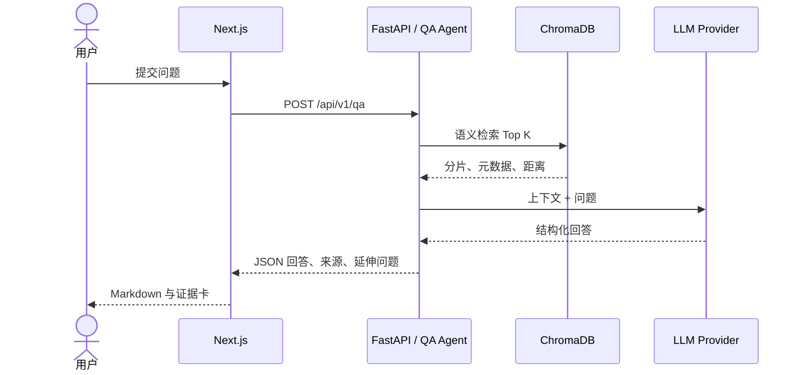

# 系统架构

> 对应版本：`v1.6.0-rc.1`
>
> 更新日期：2026-07-30
>
> 本文只描述当前代码已实现的能力；未来能力以 [PRD](../product/PRD.md) 和 [Roadmap](../product/ROADMAP.md) 为准。

> **v2 目标设计入口：**[目标架构草案](TARGET_ARCHITECTURE.md) · [数据模型草案](DATA_MODEL.md) · [迁移计划草案](MIGRATION_PLAN.md) · [ADR 索引](adr/README.md)。这些文件均为 `Proposed`，不代表当前代码已经实现。

## 1. 架构总览

## 2. 目录与职责

| 目录 | 职责 | 入口 |
|---|---|---|
| `frontend/src/app/` | Next.js App Router 页面 | `page.tsx`、各业务路由 |
| `frontend/src/components/` | 导航、布局、主题、共享展示组件 | `AppLayout.tsx` |
| `frontend/src/lib/` | API 类型与调用、历史记录、PDF、通用工具 | `api.ts` |
| `backend/api/` | FastAPI 应用、版本、安全与路由 | `main.py` |
| `backend/agents/` | 问答、面试与 LLM 供应商适配 | `qa_agent.py` |
| `backend/ingest/` | 笔记解析、切片、向量化和检索 | `vectorizer.py` |
| `backend/tests/` | 后端单元与 API 测试 | `test_*.py` |

## 3. 运行时数据流

### 3.1 知识入库

1. `ObsidianNoteParser` 扫描 `NOTES_DIR` 下的 Markdown。
2. 切片器按标题结构和 token 窗口生成带元数据的分片。
3. Sentence Transformer 生成向量。
4. 分片通过幂等 `upsert` 写入本地 ChromaDB。

### 3.2 浏览与搜索

- 文档目录从 ChromaDB 元数据去重后生成。
- 完整预览按 `source_path` 回读本地 Markdown，并移除 YAML Frontmatter。
- 语义搜索直接使用 ChromaDB 向量相似度。
- 关键词搜索使用 ChromaDB `where_document` 子串过滤。

语义搜索和关键词搜索是两个独立模式。当前代码**没有**实现 BM25、RRF 融合或自动混合重排。

### 3.3 RAG 问答

无可用密钥或外部调用失败时，Agent 使用本地 Mock 回退。当前响应是一次性 JSON，**不是** SSE 流式传输。

### 3.4 面试与本地能力

- 面试 Agent 生成问题并按 STAR 结构返回评估结果。
- 对话历史和主题偏好保存在浏览器本地存储。
- PDF 在浏览器中用 Canvas + jsPDF 生成，不经过后端。
- 图谱由后端聚合节点/边，前端用 `react-force-graph-2d` 渲染。

## 4. API 分组

所有业务接口使用 `/api/v1` 前缀：

- `health`：运行状态、版本与知识库统计。
- `search`：语义搜索、关键词搜索和文档目录。
- `qa`：RAG 问答。
- `interview`：出题与 STAR 评估。
- `graph`：知识图谱节点与边。
- `assets`：受限读取笔记图片资源。
- `metrics`：运行指标。

本地开发时，Next.js 将前端 `/api/*` 请求转发给 FastAPI；浏览器不需要直接处理跨域。

## 5. 数据与隐私边界

- 原始笔记和 ChromaDB 默认保存在本地，不进入 Git。
- 只有用户配置密钥并主动发起问答或面试时，召回分片与输入才发送给所选 LLM 供应商。
- 未配置密钥时可完全使用本地浏览、搜索和 Mock 演示。
- 公开 Codex Sites 版本不部署 FastAPI、ChromaDB、本地笔记或真实模型调用。

## 6. 当前能力边界

以下内容曾出现在旧架构草稿或依赖清单中，但不应被描述为当前已实现：

- LangChain / LlamaIndex 编排层。
- BM25 + RRF 自动混合检索。
- SSE 流式回答。
- 文件监听与增量同步。
- Tailwind CSS 或玻璃拟态设计系统。

这些能力若进入后续版本，应先在 PRD 中确定范围，再补代码、测试和本文档。
