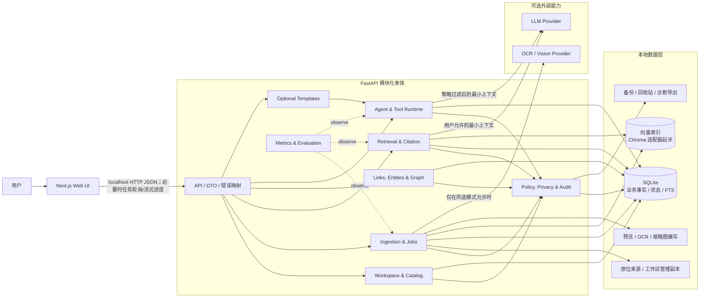
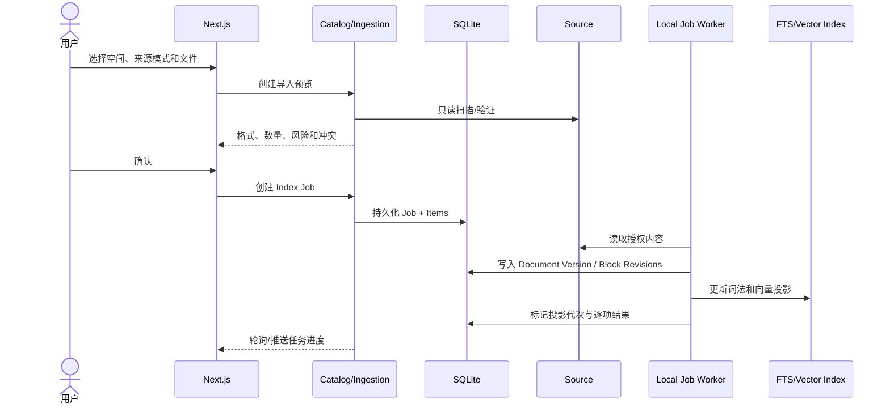
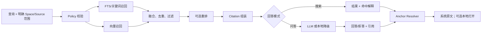
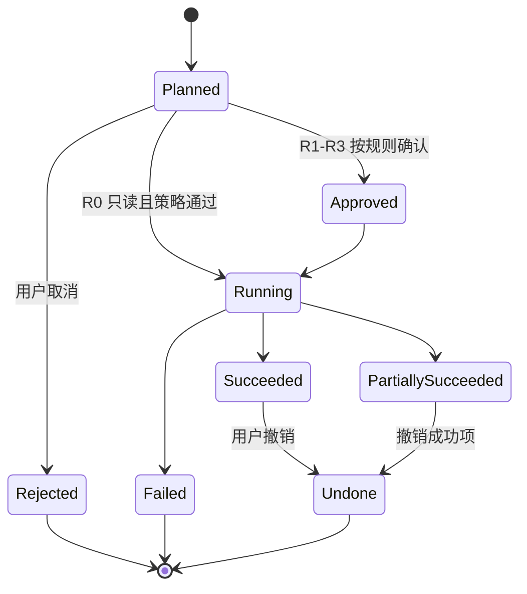

# 个人知识工作台 v2 目标系统架构（草案）

> 对应需求：[PRD v5 草案](../product/PRD-v5-DRAFT.md) · [需求证据矩阵](../product/PRD_EVIDENCE_MATRIX-v5-DRAFT.md) · 文档版本：`v1.0-draft.1` · 更新日期：2026-08-24 · 状态：Proposed

> **文档边界：**本文描述 v2 目标架构，不代表已经实现，也不替代 [v1.x 当前架构](README.md)。具体技术决策在 [`adr/`](adr/README.md) 中逐项评审。

## 1. 结论摘要

v2 采用 **本地优先的模块化单体**：保留 Next.js 前端与 FastAPI 后端，在后端内部按工作区、导入、目录、检索、关系、Agent、模板和治理划分模块；以 SQLite 保存业务事实和任务状态，以 FTS 与向量库保存可重建检索投影。

这套架构优先解决四个根问题：

1. 路径、Chroma metadata 和浏览器 `localStorage` 不再分别承担业务事实；
2. Markdown、PDF、表格和图片进入统一 Document / Version / Block / Asset / Anchor 模型；
3. 搜索、引用、反链、图谱和 Agent 使用同一稳定 ID、空间范围和版本语义；
4. 所有后台任务和 Agent 写操作持久、可恢复、可审查、可撤销。

当前不采用微服务、云端多租户、消息队列、事件溯源、CQRS 或专用图数据库。Neo4j 保留为候选图谱投影层，只有达到本文的复审触发条件后才重新评估。

## 2. 已知约束与设计基线

| 维度 | 当前约束/假设 | 架构影响 |
|---|---|---|
| 产品形态 | 本地优先个人知识工作台；不限职业 | 单机是当前信任边界，场景能力放在模板层 |
| 开发资源 | 单人或小规模维护 | 模块化单体优先，避免分布式运维 |
| 当前技术 | Next.js 16、React 19、FastAPI、ChromaDB、Sentence Transformers | 渐进迁移，不重写前后端框架 |
| v2 设计规模 | 约 10 个空间、10,000 文档、100,000 内容块 | SQLite + 本地索引足够；用基准验证而非预先分布式化 |
| 实时性 | 单用户，无多人实时协作 | 后台任务允许最终一致；不需要事件总线 |
| 来源 | 本地目录、单文件和工作区管理副本 | 必须区分来源授权、原始字节和派生内容 |
| 格式阶段 | M1：Markdown/TXT/可选中文本 PDF；M3：表格和图片 | 解析器使用统一端口，按能力等级增加适配器 |
| 查询目标 | 参考数据集搜索 P95 目标 ≤2 秒 | 词法/向量投影与元数据过滤分层 |
| 安全 | 本地模式不静默联网；Agent 不越权、不无确认写入 | 策略检查置于应用服务与工具执行之间 |
| 团队方向 | Future，不进入 v2 验收 | 预留 owner ID 和服务边界，不实现身份/权限系统 |

如果实际文档规模、并发、部署方式或团队规模显著变化，必须更新基线再评审架构。

## 3. 架构目标与非目标

### 3.1 目标

- 同一核心对象承载多空间、多格式、原生链接、检索、图谱和 Agent；
- 原始来源默认只读，派生数据可重建，业务事实可备份和迁移；
- 单个文件失败不阻塞整个批次，应用重启后任务可继续；
- 当前空间和跨空间范围在 API、检索、图谱和 Agent 中强制执行；
- 外部模型、向量库、OCR 和格式解析器均可替换；
- v1.x 可以分阶段迁移、并行核验和安全回滚。

### 3.2 非目标

- 不把本地个人版设计成伪微服务；
- 不在 M1 引入团队成员、角色权限和云端同步；
- 不把 ChromaDB、文件路径或某个来源工具当作永久身份；
- 不要求一个数据库同时承担原文件、事务、全文、向量和图形渲染；
- 不允许 Agent 直接访问任意文件系统、数据库或系统命令；
- 不承诺 DOCX、PPTX、网页和复杂 Office 版式在首发完整支持。

## 4. 目标架构总览



## 5. 架构风格与进程边界

### 5.1 模块化单体

保留两个本地进程：

- `frontend`：Next.js 页面、交互状态、可访问性和本地启动体验；
- `backend`：FastAPI API、应用服务、业务规则、持久化、任务执行和模型适配。

后端模块可以在同一进程中调用，但必须通过公开应用服务或端口交互，不能跨模块直接修改表。模块化边界用于测试和未来替换，不为每个模块创建独立服务。

### 5.2 后端分层

```text
API routes / DTO
  → Application services / Use cases
    → Domain rules and policy checks
      → Repository / Parser / Search / Model / File adapters
```

- 路由只处理校验、身份为本地所有者的上下文、DTO 和错误映射；
- 应用服务负责事务、空间范围、任务编排和幂等；
- 领域规则负责稳定 ID、状态转换、链接/关系语义和 Agent 风险；
- 适配器负责 SQLite、Chroma、文件系统、格式解析器和外部模型。

不要求为简单 CRUD 建立完整 DDD 聚合；只对导入任务、文档版本、Agent Action 和删除/恢复等高规则对象建立明确状态机。

## 6. 模块职责与依赖

| 模块 | 主要职责 | 可以依赖 | 禁止承担 |
|---|---|---|---|
| Workspace & Catalog | Workspace/Space/Collection/Source/Document 生命周期与范围 | Policy、Metadata Store | 解析文件、生成向量、调用 LLM |
| Ingestion & Jobs | 扫描、解析、切块、OCR、去重、版本和投影任务 | Catalog、Policy、Parser Ports、Stores | 把单一格式写入核心对象 |
| Retrieval & Citation | 过滤、词法/向量召回、融合、重排、拒答和锚点解析 | Catalog、Search Ports、Model Port、Policy | 绕过 Space/Source 范围 |
| Knowledge & Graph | Link、Backlink、Entity、Relation、证据和图谱投影 | Catalog、Policy、Metadata Store | 把模型建议直接写成事实 |
| Agent Runtime | 计划、工具登记、风险判断、确认、执行、撤销和审计 | 公开应用服务、Policy、Model Port | 直接操作文件/表或调用任意命令 |
| Optional Templates | 模板参数、问题链、评价和结果编排 | Agent、Retrieval、Knowledge | 创建职业专用核心数据模型 |
| Policy & Privacy | 范围授权、模型/外发规则、路径保护、删除与审计 | Metadata Store | 用前端提示替代后端强制校验 |
| Metrics & Evaluation | 本地事件、质量评测、性能和发布护栏 | 各模块公开事件/状态 | 采集正文、绝对路径或密钥 |

依赖方向以核心对象和策略为中心。Optional Templates 可以依赖通用能力，通用模块不得依赖 PM 或其他模板。

## 7. 数据分层与事实所有权

| 层 | 内容 | 是否权威 | 恢复方式 |
|---|---|---:|---|
| 来源层 | 原位文件或工作区管理副本 | 原始内容权威 | 用户原文件、工作区备份 |
| 事务层 | Workspace、Space、Source、Document、Version、Block identity、Link、Relation、Job、Agent Audit | 是，业务事实权威 | SQLite 备份与迁移 |
| 内容投影 | Block Revision 文本、结构、锚点、OCR 结果 | 对某版本解析结果权威 | 从来源版本重新解析 |
| 词法索引 | SQLite FTS5 或等价实现 | 否，可重建 | 从 Block Revision 重建 |
| 向量索引 | Chroma 起步，通过端口可替换 | 否，可重建 | 从 Block Revision 重新嵌入 |
| 图谱投影 | 结构边、链接、实体关系的查询/可视化投影 | 否；事实来自 Link/Relation | 从事务层重建 |
| 缓存 | 页面预览、缩略图、临时解析结果 | 否 | 按需重建 |

SQLite 是业务事实单一来源；Chroma 不再保存唯一的文档目录、关系或任务状态。详细对象和约束见 [DATA_MODEL.md](DATA_MODEL.md)。

## 8. 核心数据流

### 8.1 导入与更新



规则：

- 单项失败不回滚其他成功项；
- 新版本完成最低必要投影后才切换为 active，失败时保留旧版本可查询；
- 每个步骤使用 `job_id + item_id + operation` 幂等键；
- 重启后从 SQLite 读取 `queued/running/retryable` 任务恢复；
- 解析器不能直接写向量库或业务表，由 Ingestion 应用服务控制提交。

### 8.2 搜索与有证据回答



查询中的 `space_ids` 是强制参数，不从前端展示状态推断。跨空间必须显式授权，索引查询和事务层二次过滤都执行相同范围。

### 8.3 链接、反链与图谱

- 正向 Link 是业务事实；Backlink 由 `target_ref` 反向查询，不复制第二份事实；
- Relation 是带主语、谓词、宾语和证据的语义命题，和导航 Link 分开；
- 结构边来自 Space/Collection/Document 层级；
- 模型建议先进入 `suggested`，用户确认后才能成为 `confirmed` 事实；
- 图谱 API 只投影用户选择的空间、节点类型、关系类型和证据状态。

### 8.4 Agent 执行



Agent 只能调用 Tool Registry 中登记的应用服务；策略层在计划和执行两个时点检查空间、来源、风险和模型外发规则。详细决策见 [ADR-0006](adr/ADR-0006-controlled-agent-runtime.md)。

## 9. 一致性、版本与删除语义

- SQLite 事务保证业务事实内部一致；外部索引通过持久化任务最终一致；
- 每个索引记录 `projection_generation`，API 不把未完成代次当作最新；
- Citation 固定 `document_version_id + block_id + block_revision_id`，同时允许稳定 URI 打开当前版本；
- Source 失联不删除 Document，状态改为 `unavailable` 并保留最后可用版本；
- 删除索引、解除来源、删除管理副本和删除原文件是四种不同操作；
- 默认删除进入 Trash/Tombstone，可恢复；永久删除不进入首发 Agent；
- 所有批量写操作记录旧值、新值、对象数、确认和 undo 状态。

## 10. 安全与隐私边界

### 10.1 本地服务

- 默认只监听 loopback；公开部署不得复用可访问本地文件的后端配置；
- Source root 经过规范化并保存授权边界，所有文件读取使用 root + 相对定位校验；
- API 不向前端、日志、指标和公开错误返回绝对路径；
- 模型密钥通过环境/安全存储注入，不进入 SQLite、浏览器历史或审计详情；
- 文件解析、预览和 OCR 对大小、格式、超时和资源使用设限。

### 10.2 模型与数据外发

- 每个 Space 具有 Model/Privacy Policy；
- 外部调用记录服务商、用途、对象范围和内容摘要指纹，不记录完整正文；
- 本地模式下外部 Provider Adapter 不可用，而不是仅在 UI 隐藏；
- Agent 提示中的内容不能扩大 Source 权限或启用未登记工具；
- 公开演示使用独立数据目录和配置，不挂载私人 Source。

## 11. 性能与容量策略

| 场景 | 初始策略 | 观察指标 | 扩展触发 |
|---|---|---|---|
| 元数据查询 | SQLite 索引 `space_id/status/updated_at` | P50/P95、慢查询 | 100k blocks 下持续超门槛再优化 schema/索引 |
| 关键词召回 | SQLite FTS5 起步 | Recall、MRR、P95 | 语言分词质量无法满足评测时替换词法适配器 |
| 向量召回 | 当前 Chroma 通过 VectorIndexPort | Recall、P95、重建时间 | 规模、过滤或备份要求无法满足时替换 |
| 图谱 | SQLite typed edges + 聚焦查询 | 图谱 P95、边数、任务成功 | 查询复杂度和规模有证据超过 SQLite 后评估图库 |
| 后台任务 | SQLite Job 表 + 单进程有限并发 Worker | 队列时长、失败/恢复 | 长任务并发或隔离需求有证据后评估独立 Worker |
| 预览/OCR | 按需缓存、大小限制 | 命中率、磁盘占用 | 真实使用表明预生成更有效时调整 |

任何性能优化都必须在版本化数据集、参考设备和冷热缓存口径下复测。

## 12. 可观察性与恢复

- Job、Job Item、Projection、Agent Run 和 Action 状态全部持久化；
- 错误按 `path/permission/format/parser/ocr/index/model/policy/conflict/storage` 分类；
- 事件只记录匿名 ID、状态、耗时、数量和错误类别；
- 启动时检查未完成任务、数据库 schema、索引代次和来源可用性；
- SQLite 使用一致性备份；向量/FTS/图谱投影可从事务层重建；
- 诊断导出默认去除正文、绝对路径、空间名、文件名和密钥；
- 发布否决事件进入独立 Safety Event 记录，并在版本评审中强制展示。

## 13. 部署与目录建议

```text
workspace-data/
├── metadata/knowledge.db        # SQLite 业务事实与 FTS
├── indexes/vector/              # 可重建向量索引
├── managed-sources/             # 用户明确选择的工作区管理副本
├── cache/previews/              # 可删除缓存
├── trash/                       # 可恢复删除
├── backups/                     # 版本化迁移/升级备份
└── logs/                        # 去敏运行日志
```

实际根目录必须可配置，不把用户主目录、仓库根目录或绝对开发路径写入代码。生产打包方式在 M5 决定；M1 可以继续使用本地 Next.js + FastAPI 两进程启动。

## 14. 架构验证计划

| 验证 | 方法 | 通过条件 |
|---|---|---|
| 空间隔离 | 两空间同名/相似内容的搜索、问答、图谱和 Agent 测试 | 未选空间内容为 0 |
| 格式契约 | 每个格式的解析、结构、锚点、失败和重建样本 | 达到格式能力等级，不把降级写成完整支持 |
| 引用稳定 | 编辑、重命名、移动、重导和版本切换 | 锚点准确率达到指标，模糊重定位不静默 |
| 索引恢复 | 在解析、FTS、向量阶段中断并重启 | 成功项保留，任务可恢复，无重复写入 |
| 图谱可信 | 检查事实、建议、冲突和回跳 | 事实边 100% 有来源证据 |
| Agent 安全 | R0～R3、越权、提示注入、重试和撤销测试 | 未确认/越权/重复写为 0，撤销覆盖 100% |
| 迁移 | v1.x 备份、影子重建、切换和回滚演练 | 原文件不变，旧版本可恢复 |
| 性能 | 参考设备上 10k 文档/100k blocks 基准 | 达到冻结后的 P50/P95 门槛 |

## 15. 风险与复审触发器

| 风险 | 当前缓解 | 复审触发器 |
|---|---|---|
| SQLite 写入/查询成为瓶颈 | 单用户、批量事务、索引和有限 Worker | 多进程并发写或基准长期超标 |
| Chroma 过滤、备份或迁移不足 | 只作为可重建适配器 | 评测/恢复门槛无法达到 |
| 双来源模式增加复杂度 | 明确 Source mode 与删除语义 | 用户难以理解或维护成本不可接受 |
| 稳定锚点重定位错误 | 版本化 locator、指纹和显式 stale 状态 | 跨格式准确率无法达到门槛 |
| 图谱语义过度设计 | 最小 typed edges，先验证任务 | 关系类型无人使用或维护成本高 |
| Agent 审核抵消效率 | 小工具集、风险分级和部分批准 | 净节省时间 ≤0 |
| 团队方向要求并发和权限 | 只预留 owner ID | 独立团队 E1 证据和资源成立 |

## 16. 架构决策索引

- [ADR-0001：采用本地模块化单体](adr/ADR-0001-local-modular-monolith.md)
- [ADR-0002：同时支持原位连接与工作区管理副本](adr/ADR-0002-source-modes.md)
- [ADR-0003：SQLite 保存业务事实，检索索引可重建](adr/ADR-0003-canonical-store-and-indexes.md)
- [ADR-0004：稳定对象 ID 与版本化内容锚点](adr/ADR-0004-stable-ids-and-anchors.md)
- [ADR-0005：SQLite typed edges 承载关系事实](adr/ADR-0005-typed-relation-graph.md)
- [ADR-0006：受控 Agent 工具运行时](adr/ADR-0006-controlled-agent-runtime.md)

## 17. 待确认决策

1. M1 是否同时交付 `reference` 和 `managed_copy`，还是先交付原位连接、保留同一接口；
2. SQLite FTS5 对中文评测是否足够，若不足优先采用哪种本地词法适配器；
3. M1 可选中文本 PDF 的最低锚点能力是否必须包含页面坐标；
4. 跨空间搜索默认关闭，还是记忆用户上次显式范围；
5. R1 操作是否允许“本轮一次确认”，以及确认失效条件；
6. 工作区正式数据根目录和备份保留策略；
7. v1.x 兼容入口保留到哪些迁移门槛通过。

---

*v1.0-draft.1：以模块化单体、SQLite 业务事实、可重建索引、typed relation graph 和受控 Agent 为 v2 目标架构。*
