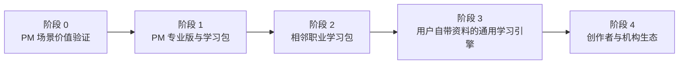

# PM Knowledge Hub 商业需求文档（BRD）

> 文档导航：[产品文档索引](README.md) · [MRD](MRD.md) · [PRD](PRD.md)

> **立项主张：以 PM/AI PM 职业学习为滩头市场，验证“基于个人资料的个性化学习系统”，而不是直接建设综合在线课程平台。**

| 文档属性 | 内容 |
|---|---|
| 文档版本 | v5.0 |
| 文档用途 | 商业机会、战略边界与分阶段投资决策 |
| 业务发起人 | 项目所有者 |
| 决策人 | 项目所有者 |
| 创建日期 | 2026-06-29 |
| 本次修订 | 2026-07-27 |
| 当前状态 | 待战略方向与商业验证评审 |
| 目标读者 | 业务负责人、投资决策人、潜在合作方 |

> **文档边界：**本文回答“为什么值得做、长期形成什么业务、客户为何付费、个人项目应做到哪里、何时扩张以及什么情况下停止”。市场细分和竞品证据详见 [MRD.md](MRD.md)，当前阶段的产品范围和验收详见 [PRD.md](PRD.md)。

---

## 1. 商业决策摘要

### 1.1 核心判断

当前产品只服务 PM/AI PM 求职与学习场景，目标人群较窄；但在需求、付费和留存尚未得到外部验证前，窄市场是降低试错成本的必要选择，不是需要立即纠正的缺陷。

真正需要调整的是长期商业定义：

> **PM Knowledge Hub 不应把“PM 面试工具”视为最终形态，也不应直接变成一个自行生产海量课程的综合在线教育平台。它应从 PM 场景出发，验证一套能够把用户已有资料转化为目标、路径、练习、反馈和能力证据的个性化学习系统。**

PM/AI PM 是第一个可验证、可交付、可形成评价标准的职业学习包。若该模式成立，再向其他数字职业、职业转型和成人自主学习场景扩展。

### 1.2 商业机会

世界经济论坛 [《Future of Jobs Report 2025》](https://www.weforum.org/publications/the-future-of-jobs-report-2025/in-full/)指出，AI 与大数据是增长最快的技能方向之一，近 40% 的岗位核心技能预计在 2030 年前发生变化，77% 的受访雇主计划通过技能提升应对变化。

这一变化带来的机会并不是“互联网上缺少课程”，而是：

- 学习资料越来越多，用户仍难以判断应该学什么、先学什么；
- 通用 AI 可以生成内容，却不了解用户已经掌握什么、真实目标是什么；
- 课程、笔记、练习与反馈分散，难以形成持续改进；
- 用户需要将学习转化为求职、考试、工作表现或作品成果；
- 私人笔记、项目经历和企业资料进入 AI 流程后，可信来源与数据控制更加重要。

客户购买的不是更多资料，而是**从现有资料到可验证学习成果的更短路径**。

### 1.3 长期愿景与近期任务

**长期愿景**

> 成为面向成人职业学习者的个人学习基础设施，让每个人都能把自己的资料转化为一个理解其目标、能力差距和学习历史，并持续调整的学习系统。

**近期任务**

> 在已有 PM/AI PM 场景中，验证外部用户是否愿意持续使用并为“个人资料驱动的学习与训练闭环”付费。

长期愿景决定系统需要具备迁移能力；近期任务决定当前不能同时进入多个市场。

### 1.4 本次请求的决策

本次不申请建设“大型在线学习平台”，只申请以下事项：

| 决策项 | 建议 |
|---|---|
| 战略定位 | 批准“个性化学习系统”为长期方向 |
| 滩头市场 | 保持 PM/AI PM 职业学习与求职场景 |
| 商业决策窗口 | 6 周 |
| 核心产品使用观察 | 其中连续 4 周，与当前 PRD 验证周期一致 |
| 现金预算上限 | ¥10,000 |
| 人力投入上限 | 120 小时 |
| 目标客户访谈 | 至少 15 人 |
| 陪伴式试用 | 至少 10 人 |
| 真实付费验证 | 至少 5 人 |
| 扩张限制 | 未通过滩头市场门槛，不进入相邻职业和内容平台建设 |

---

## 2. 商业问题与客户价值

### 2.1 当前滩头客户

近期个人付费客户具有以下特征：

- 正在准备 PM、AI PM 或相关产品岗位；
- 已有个人笔记、课程资料、项目经历或面试题；
- 有明确期限和结果目标；
- 当前需要组合使用笔记、通用 AI、题库和手工复盘；
- 重视个人资料控制以及回答来源可信度。

### 2.2 长期共同任务

未来不同职业和学习人群是否能共用同一套业务，取决于他们是否存在相同的底层任务：

1. 有明确、可描述的学习或成果目标；
2. 已拥有或能够获得一批可信资料；
3. 需要诊断当前水平和能力差距；
4. 需要把资料组织为可执行的学习路径；
5. 需要通过练习和反馈修正学习计划；
6. 需要形成可以被自己或外部评价的成果证据。

市场扩展应围绕这条共同任务链，而不是简单按照年龄、职业名称或兴趣无限增加人群。

### 2.3 客户购买的价值

| 价值层 | 当前 PM 场景 | 长期成人学习场景 | 可验证方式 |
|---|---|---|---|
| 结果价值 | 更充分地准备面试并形成可讲述成果 | 完成转岗、证书、项目或能力提升目标 | 目标完成率、成果评价 |
| 效率价值 | 减少检索、整理和复盘时间 | 减少无效课程和重复学习 | 完成同等任务所需时间 |
| 个性化价值 | 基于个人经历和知识补弱 | 根据基础、时间和表现调整路径 | 路径调整采用率、练习进步 |
| 可信价值 | 回到个人原文和真实项目证据 | 学习内容与反馈可追溯到可信来源 | 引用追溯率、错误率 |
| 控制价值 | 不整体迁移私人知识库 | 控制资料、模型调用和删除范围 | 数据外发范围、删除能力 |

### 2.4 价值成立条件

客户价值只有在以下条件同时成立时才成立：

- 节省的时间、替代的辅导成本或提高的结果概率明显高于价格；
- 个性化不仅体现在称呼和措辞，而是实际改变学习顺序、难度和反馈；
- 系统输出基于用户选择的可信资料，并明确标识来源与不确定性；
- 用户能完成“学习—练习—反馈—调整”，而不是只生成摘要或答案；
- 配置、导入、维护和隐私成本不会抵消收益；
- 核心流程能够自助完成，不依赖项目所有者长期人工陪伴。

---

## 3. 战略选择与业务边界

### 3.1 选择什么

本业务选择：

- 以成人职业学习和明确成果目标为主；
- 以用户自有资料、授权资料和专业学习包为主要内容来源；
- 以自动化个性学习为主要交付方式；
- 以 PM/AI PM 为首个滩头市场；
- 先验证单边用户价值，再逐步引入创作者和机构；
- 通过订阅、学习包和机构授权盈利，不出售用户数据。

### 3.2 明确不做什么

在现阶段以及可预见的下一阶段，不做：

- 不自行建设覆盖所有学科的海量课程库；
- 不与 Coursera、Udemy、有道等平台比拼内容数量；
- 不同时服务学生、职场人、兴趣学习者和企业所有场景；
- 不进入需要未成年人保护、家长决策和学校渠道的 K12 全学科市场；
- 不把一对一人工定制作为主要交付模式；
- 不在没有稳定用户和供给方前建设开放内容交易市场；
- 不以广告、出售学习数据或模糊数据边界换取增长。

### 3.3 关键取舍

| 取舍 | 选择 | 商业原因 |
|---|---|---|
| 大而全内容平台 vs. 个性化学习层 | 个性化学习层 | 避开内容版权、讲师供应链和规模获客的正面竞争 |
| 同时覆盖多人群 vs. 单一滩头验证 | 单一滩头验证 | 让需求、价值和付费证据可归因 |
| 人工私人定制 vs. 自动化个性学习 | 自动化为主、专家点评为辅 | 控制交付成本并保留高价值服务 |
| 自有内容 vs. 用户资料与合作内容 | 用户资料和授权学习包 | 降低内容生产压力并强化个人相关性 |
| 低价流量模式 vs. 隐私可信的专业工具 | 后者 | 与本地优先和可信来源定位一致 |
| K12 vs. 成人职业学习 | 成人职业学习 | 决策链更短、监管与安全复杂度相对可控 |

---

## 4. 分阶段商业版图

### 4.1 发展路径



### 4.2 各阶段的商业任务

| 阶段 | 服务对象 | 商业命题 | 收入方式 | 进入条件 |
|---|---|---|---|---|
| 0. PM 验证 | 有个人资料的 PM/AI PM 求职者 | 用户是否愿意持续使用并付款 | 订金、试用价、求职周期包 | 当前阶段 |
| 1. PM 产品化 | PM/AI PM 学习和转型用户 | 单一职业能否形成可重复单位经济 | Pro 订阅、学习包、专家点评 | 阶段 0 通过 |
| 2. 相邻职业 | 数据、设计、运营等有相似学习任务的人群 | 同一学习引擎能否低成本迁移 | 订阅、垂直学习包 | 至少一个相邻细分验证通过 |
| 3. 自带资料学习 | 有明确目标和个人资料的成人学习者 | 用户是否愿意用自己的资料建立长期学习系统 | 个人订阅、存储与 AI 用量分层 | 跨细分留存和自助率成立 |
| 4. 生态平台 | 专家、创作者、培训机构及其学习者 | 第三方供给能否提升留存和收入 | 佣金、机构席位、创作者工具费 | 稳定需求、质量标准和结算机制成立 |

### 4.3 扩张原则

- 扩张一个职业学习包，不应复制一套产品或代码；
- 新市场必须复用目标设定、资料处理、学习路径、练习反馈和能力评价中的大部分核心流程；
- 若新市场必须依赖大量人工教研或独立产品体系，则应作为新的业务评估，而不是现有产品自然扩张；
- “更多注册用户”不能替代跨人群付费、留存和学习结果证据；
- 平台化是供需两侧都已出现后的结果，不是起步阶段的产品名称。

---

## 5. 商业模式

### 5.1 收入架构

| 收入层 | 购买者 | 购买内容 | 适用阶段 |
|---|---|---|---|
| 免费层 | 个人学习者 | 基础资料组织、有限学习任务和公开学习包 | 阶段 0 起 |
| 个人 Pro | 高频个人用户 | 长期学习记忆、个性路径、更多资料与 AI 用量、进阶报告 | 阶段 1 起 |
| 专业学习包 | 有明确职业或考试目标的用户 | 目标模型、能力标准、资料结构、任务和评价规则 | 阶段 1 起 |
| 专家服务 | 需要关键反馈的用户 | 简历、作品、模拟面试等高价值点评 | 阶段 1 起；非主要规模收入 |
| 创作者分成 | 专家、讲师、内容机构 | 学习包发布、分发、数据反馈与交易 | 阶段 4 |
| 机构授权 | 培训机构、高校和企业 | 席位、学习管理、组织内容和效果报告 | 阶段 3—4 |

### 5.2 近期推荐模式

近期仍采用“**免费建立信任 + 付费职业学习周期服务**”：

1. 公开内容、演示和基础能力负责获客；
2. 个人用户为更低配置成本、个性路径、训练反馈和报告付费；
3. 专家服务只用于验证高价值反馈，不把创始人时间作为产品主体；
4. 个人市场成立后，再验证相邻职业包和机构授权；
5. 不把尚未验证的平台佣金写入近期收入预测。

### 5.3 定价假设

以下仅用于 PM 滩头市场测试：

| 方案 | 假设价格 | 需要验证的问题 |
|---|---:|---|
| 月度 Pro | ¥39/月 | 用户是否愿意为短期灵活使用付费 |
| PM 求职周期包 | ¥199/6 个月 | 周期包是否比月费更符合求职场景 |
| 本地专业版 | ¥129 一次性 | 用户是否偏好买断和自带模型密钥 |
| 机构试点 | ¥6,000/期，最多 50 人 | 机构是否愿意为统一训练和效果报告付费 |

相邻职业包、长期个人订阅和平台佣金均需重新验证，不沿用本表价格。

### 5.4 Business Model Canvas

| 模块 | 当前设计 | 长期演进 |
|---|---|---|
| 客户细分 | 有个人资料、正在学习或求职的 PM/AI PM | 有明确成果目标的成人职业学习者；创作者与机构 |
| 价值主张 | 用自己的资料完成更快、更可信、可复盘的学习与面试准备 | 把分散资料转化为持续适应的个性化学习系统 |
| 渠道 | PM 社区、GitHub、公开演示、导师和用户推荐 | 职业社区、创作者分发、企业和教育机构合作 |
| 客户关系 | 免费自助、付费自助、早期陪伴式试用 | 长期订阅、学习社群、创作者服务和机构客户成功 |
| 收入来源 | Pro、PM 学习包、本地授权、机构试点 | 多职业学习包、个人订阅、机构席位和平台佣金 |
| 核心资源 | 产品原型、PM 内容和评价标准、用户信任 | 学习引擎、跨职业模板、学习历史、评价数据和供给生态 |
| 核心活动 | 用户研究、价值验证、评价校准、隐私治理 | 学习效果优化、内容质量治理、创作者运营和机构交付 |
| 合作伙伴 | 模型服务商、PM 社区、导师、支付平台 | 专家、内容机构、企业、高校和职业社区 |
| 成本结构 | 研发、模型、托管、支付、获客和支持 | 加上内容审核、创作者分成、机构销售与合规成本 |

---

## 6. 商业目标与度量

### 6.1 商业需求

| ID | 商业需求 | 当前验证指标 |
|---|---|---|
| BREQ-01 | 目标客户必须确认问题高频且值得解决 | 15 名访谈对象中至少 9 名过去 30 天遇到同类问题 |
| BREQ-02 | 产品必须创造高于价格的可感知结果价值 | 10 名试用者中至少 7 名确认节省时间、提高训练质量或替代其他成本 |
| BREQ-03 | 学习成果和项目价值必须能被外部理解 | 5 名独立评审者体验后，至少 4 人能准确复述目标用户、核心价值和个人贡献 |
| BREQ-04 | 输出必须可信，且商业化不得以牺牲用户数据控制换取增长 | 引用追溯率不低于 95%；重大隐私事件为 0；数据处理边界清楚并取得同意 |
| BREQ-05 | 持续维护成本和单位经济必须可承受 | 贡献毛利率不低于 70%，贡献毛利与 CAC 之比不低于 3；验证期时间收益投入比不低于 1 |
| BREQ-06 | 收入增长不能依赖项目所有者持续人工交付 | 陪伴式试用后，可自助完成核心流程的用户比例不低于 70% |

### 6.2 北极星指标

长期北极星指标不是课程数、笔记数或 AI 对话数，而是：

> **每周完成的有效学习闭环数：用户基于可信资料完成学习或练习、获得反馈，并据此执行下一步调整。**

当前阶段同时观察：

- 首次有效闭环完成率；
- 每名用户每周有效闭环数；
- 反馈转化为后续行动的比例；
- 四周有效使用留存；
- 目标成果完成率；
- 付费转化、贡献毛利和获客成本；
- 来源追溯率与重大隐私事件。

### 6.3 十二个月目标

以下目标仅在 PM 滩头商业验证通过后启用：

| 指标 | 基准目标 | 说明 |
|---|---:|---|
| PM 付费客户 | 500 人 | 不是综合在线学习平台用户目标 |
| 平均付费收入 | ¥199/求职周期 | 待真实价格测试 |
| 贡献毛利率 | ≥70% | 包含模型、支付、托管和支持成本 |
| 付费获客成本 | ≤¥53 | 保证贡献毛利/CAC ≥3 |
| 试用到付费转化率 | ≥8% | 待真实流量验证 |
| 30 日有效使用留存 | ≥35% | 求职具有周期性，不套用通用 SaaS 假设 |
| 自助完成率 | ≥70% | 防止退化为人工咨询业务 |
| 重大隐私事件 | 0 | 否决性指标 |

---

## 7. 近期单位经济与投资回报

### 7.1 适用范围

本章只评估 PM 求职周期产品，不代表未来多职业订阅、内容生态或机构业务的经济模型。

### 7.2 基准单位经济假设

| 项目 | 计算 | 金额 |
|---|---|---:|
| 单客户平均收入 | PM 求职周期包基准 | ¥199 |
| 模型与托管成本 | 按受控额度估算 | ¥20 |
| 支付与退款准备 | 约收入的 5% | ¥10 |
| 客户支持与运营变量成本 | 每客户平均 | ¥10 |
| 单客户总变量成本 | 20 + 10 + 10 | ¥40 |
| 单客户贡献毛利 | 199 - 40 | ¥159 |
| 贡献毛利率 | 159 ÷ 199 | 79.9% |
| 目标 CAC 上限 | 159 ÷ 3 | ¥53 |

以上均为待验证假设，不是实际经营数据。

### 7.3 十二个月情景

暂按 ARPPU ¥199、变量成本 ¥40、固定投入 ¥60,000 计算：

| 情景 | 付费客户 | 收入 | 贡献毛利 | 扣除固定投入后 |
|---|---:|---:|---:|---:|
| 保守 | 200 | ¥39,800 | ¥31,800 | **-¥28,200** |
| 基准 | 500 | ¥99,500 | ¥79,500 | **¥19,500** |
| 增长 | 1,500 | ¥298,500 | ¥238,500 | **¥178,500** |

盈亏平衡客户数约为：

```text
¥60,000 ÷ (¥199 - ¥40) ≈ 378 名付费客户
```

### 7.4 财务敏感项

商业结果最受以下变量影响：

1. 用户实际愿意支付的价格；
2. 求职周期结束后的流失；
3. 用户是否愿意为持续学习而非一次面试继续付费；
4. 模型与托管成本；
5. 免费用户转付费比例；
6. 获客成本和创始人支持时间；
7. 相邻职业包能否在不成倍增加研发和教研成本的情况下复用。

---

## 8. 核心能力与长期壁垒

### 8.1 必须形成的业务能力

| 能力 | 商业意义 |
|---|---|
| 目标与能力模型 | 把“学习更多”转化为可评价的成果目标 |
| 来源可信与资料控制 | 形成区别于无来源通用问答的信任 |
| 学习记忆 | 理解用户已学内容、错误、反馈和进步 |
| 个性路径与评价 | 根据能力差距调整任务，而不只是生成内容 |
| 可复用学习包标准 | 低成本进入相邻职业，不复制完整产品 |
| 学习效果数据 | 经授权、匿名化地校准评价和路径质量 |
| 创作者与机构合作能力 | 在后期扩大高质量供给，而非全部自制 |

### 8.2 不构成壁垒的内容

- 接入某一个通用大模型；
- 单纯拥有 RAG、知识图谱或 Agent；
- 生成摘要、闪卡和题目；
- 代码开源或界面功能数量；
- 未经验证的课程和资料数量。

### 8.3 可能形成的防御性

长期壁垒应来自以下组合：

- 用户持续积累且可迁移的学习历史；
- 不同职业的目标模型、能力标准和评价规则；
- 来源可信、结果导向和隐私控制形成的品牌信任；
- 学习包创作者及机构合作网络；
- 经用户授权形成的匿名学习结果基准；
- 与用户现有笔记、资料和工作流程的深度连接。

---

## 9. 市场进入与验证

### 9.1 近期获客路径


### 9.2 渠道假设

| 渠道 | 近期作用 | 验证指标 |
|---|---|---|
| PM 学习与求职内容 | 建立问题认知和专业信任 | 内容到访谈、试用转化 |
| GitHub 与公开演示 | 展示可信度并获得自然反馈 | 访问到有效咨询转化 |
| 求职社群与导师 | 精准触达有明确目标的用户 | 合格线索成本、付费转化 |
| 用户推荐 | 降低获客成本 | 推荐用户占比、转化质量 |
| 相邻职业社群 | 验证学习引擎迁移性 | 相同任务链出现频率 |
| 内容专家与机构 | 验证学习包供给意愿 | 访谈、试制和分成意向 |

### 9.3 低成本战略实验

在平台开发之前，依次完成：

1. 用 PM 用户验证完整学习闭环和真实付费；
2. 选择一个相邻职业，以配置和内容包而非代码分叉完成试制；
3. 分别招募至少 5 名 PM 用户和 5 名相邻职业用户，比较共同任务和差异；
4. 测试“使用平台课程”与“导入自己的资料”两种价值表达；
5. 以人工辅助方式验证个性路径是否改善完成率，再决定自动化投入；
6. 访谈至少 5 名专家或内容创作者，验证其是否愿意按照统一标准发布学习包；
7. 只有需求侧和供给侧均出现重复行为，才评估市场和交易系统。

---

## 10. 投资计划与组织可行性

### 10.1 个人可以完成的范围

- 一个细分市场的可用产品和验证；
- 基于用户资料的学习闭环；
- 一至三个标准化职业学习包；
- 小规模订阅和一次性付费；
- 人工审核的专家或创作者合作试点。

### 10.2 需要团队后才能承担的范围

- 大规模自制或采购课程；
- 多学科内容审核和版权管理；
- 开放创作者市场、结算和争议处理；
- 企业销售、实施和客户成功；
- 未成年人教育和复杂合规；
- 高并发托管、风控、内容安全和全天候支持。

### 10.3 阶段投资

| 阶段 | 投入上限或前提 | 主要交付 |
|---|---|---|
| PM 商业验证 | 6 周决策窗口，其中连续 4 周产品观察；现金 ≤¥10,000、人力 ≤120 小时 | 问题、行为、付费和单位经济证据 |
| PM 产品化 | 验证通过后，年度固定投入 ≤¥60,000 | 可自助交付的个人业务 |
| 相邻职业实验 | PM 业务达到基本留存和毛利门槛 | 一个不分叉代码的相邻学习包 |
| 通用学习引擎 | 至少两个细分市场复用成功 | 跨人群目标、路径和学习记忆 |
| 生态平台 | 需求、供给、质量和交易均被验证 | 创作者工具、机构能力和治理机制 |

---

## 11. 商业风险

| 风险 | 商业影响 | 早期信号 | 应对 |
|---|---|---|---|
| 需求只属于项目所有者 | 无法形成市场 | 外部用户缺少同类高频任务 | 停止商业化，保留个人工具价值 |
| 过早扩大目标人群 | 定位模糊、验证失真 | 不同用户要求完全不同的产品 | 保持单一滩头和阶段门槛 |
| 通用 AI 与大型平台覆盖核心能力 | 差异化和价格下降 | 用户认为 NotebookLM 等已经足够 | 聚焦学习记忆、结果评价、隐私和职业闭环 |
| 个性化只是内容生成 | 不能改善结果 | 使用量高但完成率和能力不变 | 以行为和结果指标评价个性化 |
| 相邻职业无法复用 | 扩张成本过高 | 每个学习包都需要独立开发 | 停止横向扩张，保留垂直业务 |
| 用户不愿导入资料 | 激活率低 | 用户担心隐私或整理成本 | 支持渐进导入、清楚数据边界和低成本试用 |
| 人工定制比例过高 | 毛利和规模受限 | 每个付费用户都需大量一对一服务 | 产品化高频环节，专家只处理高价值节点 |
| 内容质量或版权问题 | 信任、合规和成本受损 | 学习包来源不清、错误无法追溯 | 用户自有、授权内容优先，建立审核标准 |
| 创作者市场冷启动失败 | 平台投入无法回收 | 无稳定购买者或供给者 | 在单边业务成立前不开发市场 |
| 本地部署门槛高 | 激活率低、支持成本高 | 用户无法独立配置 | 测试托管便利层并计算真实支持成本 |
| 私人资料泄露 | 信任和业务直接受损 | 密钥、笔记或路径进入公开环境 | 立即下线、轮换密钥、复盘并暂停增长 |
| 近期 CAC 超过 ¥53 | PM 单位经济不成立 | 渠道无法回收 | 优先内容、社区、推荐和合作渠道 |

---

## 12. 继续、扩张与停止条件

### 12.1 PM 商业化（GO）

6 周内同时满足：

- 至少 9/15 名访谈对象确认高频问题；
- 至少 7/10 名试用者确认获得可感知价值；
- 至少 6/10 名试用者在两周内完成 4 次以上有效学习任务；
- 至少 5 名非关联用户完成真实付款、订金或等价承诺；
- 引用追溯率不低于 95%，重大隐私事件为 0；
- 实测贡献毛利率预计不低于 70%；
- 预计贡献毛利/CAC 不低于 3；
- 陪伴式试用后核心流程自助完成率不低于 70%。

### 12.2 相邻职业扩张（EXPAND）

只有同时满足以下条件才进入第二个职业：

- PM 付费和留存门槛已经通过；
- 新细分用户存在相同的底层学习任务链；
- 至少 5 名目标用户完成真实资料试用；
- 至少 3 名用户出现重复使用或付款行为；
- 新学习包无需复制产品或维护独立代码分支；
- 新增教研和支持成本不使预计贡献毛利率低于 60%。

### 12.3 平台化评估（PLATFORM）

只有同时满足以下条件才评估开放平台：

- 至少两个职业细分验证了复用性；
- 个人订阅存在持续留存，而非只在短期求职使用；
- 至少 5 名外部专家或机构完成学习包试制；
- 内容质量、来源、版权和退款责任有可执行规则；
- 需求侧与供给侧均能在项目所有者不过度介入时完成核心流程；
- 平台建设预算和团队责任人已经明确。

### 12.4 调整（PIVOT）

- 用户认可结果但不愿订阅：测试买断、周期包或按学习包付费；
- 用户需要个性学习但拒绝本地配置：测试托管便利层；
- PM 面试价值明显高于长期学习：保持垂直求职业务，不强行平台化；
- 长期学习价值高于面试训练：从“求职工具”转向“职业学习系统”；
- 相邻市场有需求但需要完全不同产品：作为独立业务重新立项。

### 12.5 停止（STOP）

出现任一情况：

- 少于 5/15 名访谈对象存在同类高频问题；
- 陪伴式试用后仍无人真实付费；
- 单位经济无法达到贡献毛利/CAC ≥3；
- 客户支持成本使贡献毛利率低于 50%；
- 必须依赖大量创始人人工服务才能交付；
- 必须依赖出售数据、误导宣传或不可接受的隐私风险才能增长；
- PM 场景尚未成立，却只能靠增加人群或内容数量制造表面增长。

停止商业化不等于项目失败。产品仍可作为个人学习工具和求职作品集，但不再以大规模商业平台为目标持续投入。

---

## 13. 关键假设

| 假设 | 当前信心 | 最小验证 |
|---|---|---|
| PM 外部用户存在与创始用户相同的问题 | 低 | 15 名问题访谈 |
| 用户愿意导入自己的资料用于学习 | 低 | 10 名真实资料试用 |
| 个性路径能提高完成率或结果质量 | 低 | 对比原流程的行为实验 |
| PM 用户愿意为一个学习周期付费 | 低 | 至少 5 笔真实付款或订金 |
| 学习引擎可以迁移到相邻职业 | 低 | 一个无代码分叉的相邻学习包 |
| 长期学习能缓解求职周期造成的流失 | 低 | 求职后继续使用和续费观察 |
| 专家愿意按照统一标准提供学习包 | 低 | 5 名专家访谈和至少 1 个试制 |
| 隐私和本地控制能转化为购买偏好 | 低 | 定价页与选择实验 |

---

## 14. 审批与信息来源

### 14.1 待审批事项

- [ ] 批准“个性化学习系统”为长期商业方向
- [ ] 批准 PM/AI PM 继续作为唯一滩头市场
- [ ] 批准不建设自营海量课程平台
- [ ] 批准 6 周、现金不超过 ¥10,000、人力不超过 120 小时的商业验证
- [ ] 批准以 5 名真实付费客户作为最低付费证据
- [ ] 批准 GO / EXPAND / PLATFORM / PIVOT / STOP 分阶段门槛

### 14.2 审批记录

| 角色 | 姓名 | 决策 | 日期 | 备注 |
|---|---|---|---|---|
| 业务发起人 | 项目所有者 | 待审批 | — | — |
| 投资决策人 | 项目所有者 | 待审批 | — | — |
| 数据所有者 | 项目所有者 | 待审批 | — | — |

### 14.3 商业分析依据

- [World Economic Forum — Future of Jobs Report 2025](https://www.weforum.org/publications/the-future-of-jobs-report-2025/in-full/)
- [Coursera — 2026 年第一季度经营数据](https://investor.coursera.com/news/news-details/2026/Coursera-Reports-First-Quarter-2026-Financial-Results/default.aspx)
- [Coursera — 完成与 Udemy 的合并](https://investor.coursera.com/news/news-details/2026/Coursera-Completes-Combination-with-Udemy-to-Build-the-Worlds-Most-Comprehensive-Skills-Platform/default.aspx)
- [Duolingo — Company Strategy Overview](https://investors.duolingo.com/company-strategy-overview-0)
- [Strategyzer — Business Model Canvas](https://www.strategyzer.com/business-models-the-toolkit-to-design-a-disruptive-company)
- 市场细分、竞品与需求证据：[MRD.md](MRD.md)

### 14.4 文档分工

| 文档 | 回答的问题 |
|---|---|
| BRD | 为什么值得投资、长期形成什么业务、如何赚钱以及何时扩张 |
| MRD | 哪些市场和客户存在需求、替代方案是什么、从哪里进入 |
| PRD | 当前阶段为滩头用户提供什么行为、范围和验收标准 |
| ARCHITECTURE | 当前产品如何在技术上实现 |
| ROADMAP | 各阶段何时交付和如何安排资源 |

---

*BRD v5.0 — 长期目标是个性化学习系统；PM 是验证商业模型的第一站，而不是永久边界。*
