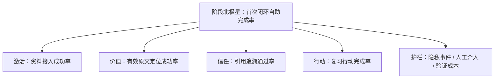

# PM Knowledge Hub 指标与最小验证记录

> 对应需求：[PRD v4.0](PRD.md) · 文档版本：v2.0 · 更新日期：2026-08-03 · 状态：有效

本期指标服务于 4 周业务价值验证。实现质量、用户价值和商业假设必须分层，不能用测试通过数替代用户结果。

## 1. 指标层级

阶段北极星只适用于 PM 滩头验证，不是长期产品北极星。

## 2. 核心指标定义

| ID | 指标 | 计算口径 | 目标 | 最低样本 | 证据状态 |
|---|---|---|---:|---:|---|
| M-01 | 首次闭环自助完成率 | 一次初始说明后，无额外人工操作完成首次闭环人数 / 真实资料试用人数 | ≥70% | 10 人 | 未验证 |
| M-02 | 资料接入成功率 | 成功建立独立索引人数 / 尝试接入人数 | 记录基线 | 10 人 | 未验证 |
| M-03 | 知识定位中位时间 | 标准任务开始到打开有效原文的中位秒数 | ≤60 秒且较原流程下降 ≥50% | 20 个配对任务 | 未验证 |
| M-04 | 有效原文定位成功率 | 限定时间内找到有效原文任务数 / 全部标准任务数 | ≥90% | 20 个任务 | 未验证 |
| M-05 | 引用追溯通过率 | 回答引用能回到支持结论的原文数 / 抽查引用数 | ≥95% | 30 条引用 | 未验证 |
| M-06 | 有效训练次数 | 完成作答并查看反馈的训练次数 | 4 周 ≥8 次/核心用户 | 4 周 | 未验证 |
| M-07 | 复习行动完成率 | 已完成复习行动 / 已创建复习行动 | ≥70% | ≥8 次训练 | 未验证 |
| M-08 | 演示理解率 | 正确复述四项核心信息的评审者 / 全部评审者 | ≥80% | 5 人 | 未验证 |
| M-09 | 人工介入率 | 发生额外人工介入的试用者 / 全部试用者 | 记录并降低 | 10 人 | 未验证 |
| M-10 | 时间收益投入比 | 用户节省总时长 / 验证期维护投入时长 | ≥1.0 | 4 周 | 未验证 |
| M-11 | 重大隐私事件 | 私人正文、路径、密钥或跨用户数据非预期暴露 | 0 | 全部试用 | 目标 |

## 3. 已取得的实现与质量基线

| 结果 | 日期/环境 | 可支持的结论 | 不能支持的结论 |
|---|---|---|---|
| 后端 53/53 测试通过 | 2026-07-24 | 测试覆盖的 API 行为正确 | 用户愿意使用或付费 |
| 前端 lint/build 通过 | 2026-07-24 | 代码可构建 | 真实浏览器均无缺陷 |
| 390×844、1440×1000 核心流程通过 | 2026-07-24 | 双视口可完成已测任务 | 所有设备兼容 |
| 首页 LCP 1.544s、CLS 0 | 单次实验室抽查 | 当前部署的性能基线 | 生产 SLA 或长期稳定性 |
| 助手页 FCP 0.548s、CLS 0 | 单次实验室抽查 | 当前部署的性能基线 | 用户感知价值 |
| 生产依赖审计 0 漏洞 | 2026-07-27 记录 | 当时生产依赖门禁通过 | 未来持续安全 |

## 4. 最小记录模型

| 字段 | 必填 | 示例/说明 | 禁止内容 |
|---|---:|---|---|
| `participant_id` | 是 | `P-001`，匿名 | 姓名、手机号、公司 |
| `task_id` | 是 | `KT-01`、`IV-01` | — |
| `mode` | 是 | `local` / `live` / `fallback` / `public_demo` | 模型密钥 |
| `started_at` / `completed_at` | 是 | ISO 8601 | — |
| `result` | 是 | success / fail / abandoned | — |
| `failure_category` | 条件必填 | path / permission / retrieval / model / ui | 堆栈中的私人路径 |
| `source_opened` | 知识任务必填 | true / false | 来源标题/摘录 |
| `citation_verified` | 抽查必填 | pass / fail / insufficient | 原文内容 |
| `review_action_status` | 训练必填 | none / created / completed | 行动正文 |
| `manual_interventions` | 是 | 次数 + 阶段分类 | 私人对话全文 |
| `notice_version` | 接入必填 | `privacy-v1` | — |
| `notes` | 否 | 受控阻塞分类补充 | 笔记、回答、密钥、绝对路径 |

## 5. 事件规范

| 事件 | 触发条件 | 必要参数 | 用途 |
|---|---|---|---|
| `setup_started` | 开始接入 | participant、time | 激活漏斗 |
| `notes_directory_validated` | 目录校验结束 | result、duration、error_category、note_count | 接入成功与阻塞 |
| `index_build_completed` | 索引成功 | duration、note_count、chapter_count | 激活 |
| `privacy_notice_confirmed` | 确认数据边界 | mode、notice_version | 知情选择 |
| `knowledge_task_completed` | 打开有效原文或结束任务 | task、mode、duration、result | M-03/M-04 |
| `citation_opened` | 打开来源 | session、source_index、mode | 信任行为 |
| `citation_verification_recorded` | 抽查完成 | pass/fail/insufficient | M-05 |
| `interview_feedback_viewed` | STAR 反馈进入可见区 | session、mode | M-06 |
| `review_action_saved/completed` | 行动保存/完成 | action_id、timestamps | M-07 |
| `manual_intervention_logged` | 发生人工帮助 | stage、category、duration | M-01/M-09 |
| `demo_comprehension_recorded` | 限时任务结束 | four_answers、duration | M-08 |
| `validation_exported` | 记录导出成功 | row_count、range | 审计和复算 |

## 6. 采集策略

1. 前 3 名试用者使用受控表格或本地记录，先验证字段是否足够。
2. 只有重复记录负担成为明显阻塞时，才开发 F-07 页面或自动事件。
3. 原始数据保存在受控本地位置；对外只输出汇总和匿名记录。
4. 演示数据与真实试用数据分表、分模式统计，不得混算。
5. 所有百分比同时报告分子、分母；样本不足时写“证据不足”。

## 7. 决策门槛

| 决策 | 门槛 |
|---|---|
| GO：继续 PM 滩头验证 | M-01、M-04、M-05 达标，且 M-11 为 0 |
| PIVOT：调整接入或价值主张 | 用户问题成立，但接入摩擦或行动闭环未达标 |
| STOP：停止产品化投入 | 问题频率低、无自助完成或时间收益投入比长期 <1.0 |
| EXPAND：验证相邻职业 | 达到 BRD 的付费、留存和复用门槛后另立项 |

工程门禁通过是 GO 的必要条件，但不是充分条件。
