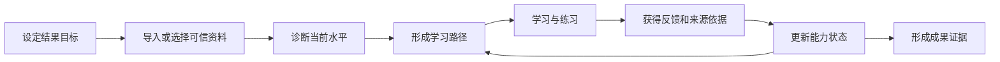

# PM Knowledge Hub 市场需求文档（MRD）

> 文档导航：[产品文档索引](README.md) · [BRD](BRD.md) · [PRD](PRD.md)

| 文档属性 | 内容 |
|---|---|
| 文档版本 | v3.0 |
| 产品阶段 | PM 滩头市场验证；长期市场重新定义 |
| 产品负责人 | 项目所有者 |
| 创建日期 | 2026-06-29 |
| 本次修订 | 2026-07-27 |
| 研究截止日 | 2026-07-27 |
| 当前状态 | 有效；外部需求、付费与跨市场复用待验证 |
| 上游依据 | [BRD.md](BRD.md) |

---

## 1. 执行结论

### 1.1 本文回答的问题

本 MRD 回答六个市场问题：

1. 在线学习市场已经有哪些主要商业形态？
2. “不同人群、不同资料、个性化学习”是否仍有市场机会？
3. 哪类客户的需求与现有产品最匹配？
4. PM/AI PM 应是永久目标市场，还是进入更大市场的滩头？
5. 综合内容平台、个性化学习系统和人工私人定制之间应如何选择？
6. 在扩展人群和引入内容供给方前，需要获得哪些证据？

### 1.2 市场判断

- 在线学习和 AI 个性化学习需求已经被大型平台验证，但同时也是高度拥挤的市场。
- Coursera、Udemy 等拥有课程、大学、企业、讲师、证书和分发网络；新进入者不适合正面竞争内容数量。
- Duolingo、Khan Academy、有道等依靠垂直内容、教研数据和长期用户行为提供自适应学习，新进入者难以快速复制。
- Google NotebookLM、Quizlet 等已经能把用户资料转成学习指南、测验和闪卡，说明“用户自带资料学习”是现实需求，也意味着简单的 AI 内容生成不是市场空白。
- 当前可进入的机会不是“做一个覆盖所有人的课程网站”，而是：**服务有明确结果目标、已有碎片资料、需要持续诊断和反馈的成人学习者，把资料转化为可执行、可追溯、可调整的学习闭环。**
- PM/AI PM 市场较窄，但与现有资产、专业经验和评价能力最匹配，适合作为滩头市场。
- 长期可扩展市场应按共同任务链而非人口标签定义：职业转型、岗位提升、专业证书和项目型学习均可能适用，但必须逐个验证。
- 当前已确认的长期用户样本仍只有项目所有者本人，不能据此推导大众市场规模或付费意愿。

### 1.3 市场策略

> **定位为“成人职业学习的个性化学习系统”，以 PM/AI PM 为首个学习包；不定位为自营海量内容平台。**

市场进入顺序：

1. 验证有个人资料的 PM/AI PM 学习与求职用户；
2. 产品化 PM 专业版和标准学习包；
3. 选择一个任务链相似的数字职业做迁移实验；
4. 验证用户自带资料的跨职业学习需求；
5. 需求侧成立后，再引入专家、创作者和机构供给；
6. 只有双边行为成立后，才评估开放内容平台。

---

## 2. 研究范围与证据质量

### 2.1 研究范围

本次研究覆盖五类相邻市场：

- 个人知识管理与本地笔记；
- 基于用户资料的 AI 学习与研究；
- 在线课程、职业技能和证书平台；
- 垂直自适应学习与 AI 辅导；
- AI 面试、练习与职业成果训练。

暂不对以下市场作进入判断：

- K12 全学科教育；
- 学校教学管理系统；
- 企业知识管理平台；
- 纯兴趣内容社区；
- 招聘撮合和人才测评平台。

### 2.2 研究方法

| 方法 | 样本 | 用途 |
|---|---|---|
| 内部资产盘点 | 204 篇笔记、现有产品和验收记录 | 确认产品起点与可复用能力 |
| 官方产品与经营资料 | Coursera、Duolingo、Khan Academy、NotebookLM、Quizlet、有道等 | 核验市场形态、能力和进入壁垒 |
| 相邻工具研究 | Obsidian、Notion、ChatGPT Projects、Yoodli | 核验用户当前替代工作流 |
| 创始用户观察 | 项目所有者本人 | 形成初始任务和问题假设 |
| 桌面研究 (Desk Research) | V2EX、知乎、牛客网等公开社区讨论 | 提取目标用户高频痛点，弥补缺乏直接访谈的局限，详见 [Community_Research_Report.md](Community_Research_Report.md) |
| 外部用户访谈 | 尚未执行（暂由桌面研究和AI模拟走查替代） | 验证问题普遍性、频率和替代方案满意度 |
| 真实资料试用 | 尚未执行 | 验证导入意愿、个性化价值和隐私顾虑 |
| 付费测试 | 尚未执行 | 判断是否存在可持续商业空间 |

### 2.3 证据等级

| 等级 | 定义 | 本文用法 |
|---|---|---|
| E1 已验证外部事实 | 官方资料、经营披露或可复查产品说明 | 可用于判断市场存在、竞品能力和行业门槛 |
| E2 已验证内部事实 | 运行记录、知识资产和产品验收记录 | 可用于判断当前起点，不能证明外部需求 |
| E3 单用户证据 | 项目所有者真实使用和观察 | 可形成滩头假设，不可外推 |
| E4 桌面研究数据 | 公开社区讨论的二手资料分析 | 可补充验证真实用户痛点，作为直接访谈前的次级研究 |
| H 待验证假设 | 尚无访谈、行为、留存或付费证据 | 必须进入验证计划 |

### 2.4 证据限制

- 注册用户、月活用户和企业客户数量只能证明市场规模和竞品实力，不能证明本产品会获得用户；
- 竞品提供某项功能只能证明任务存在，不能证明该功能本身能收费；
- AI 生成学习资料不等于学习效果改善；
- 用户口头表达兴趣不等于导入资料、持续使用或付款；
- 在缺少可靠人群数量、转化率和付费数据前，不提供虚构的 TAM、SAM、SOM。

---

## 3. 市场结构

### 3.1 市场不是单一赛道

“面向不同人群提供不同学习资料，再进行个性化学习”至少包含三门不同的生意：

| 市场形态 | 核心资产 | 代表方案 | 主要进入壁垒 |
|---|---|---|---|
| 内容与证书平台 | 大规模课程、讲师、院校、证书和分发 | Coursera、Udemy | 版权与供给、品牌、渠道、企业销售、规模获客 |
| 垂直自适应学习 | 专业教研、结构化知识、题库和行为数据 | Duolingo、Khan Academy、有道 | 教研质量、数据规模、评价体系、长期留存 |
| 用户自带资料学习 | 用户资料、来源理解、生成与交互体验 | NotebookLM、Quizlet | 激活成本、长期记忆、学习效果、通用平台竞争 |

PM Knowledge Hub 更适合第三类市场，并通过第一类的专业学习包和第二类的目标评价方法增强价值；不适合从第一天同时经营三类业务。

### 3.2 市场规模与竞争强度信号

- Coursera 在 2026 年第一季度披露累计注册学习者达到 2.05 亿；2026 年完成与 Udemy 的合并，双方 2025 年合计年收入超过 15 亿美元。这表明职业在线学习需求巨大，也表明综合平台竞争需要远超个人项目的供给和资本能力。
- Duolingo 截至 2025 年第四季度披露 1.331 亿月活、5270 万日活和 1220 万付费用户，并从语言扩展至数学、音乐和国际象棋。这说明“先建立垂直优势，再扩展相邻学习领域”比起步即覆盖所有人群更可行。
- 好未来披露其 AI 学习设备在 2025 年 2 月最后一个自然周达到 110 万周活设备，并拥有自研、采购或授权的内容体系。这说明 K12 个性化学习依赖内容、硬件、教研和规模化运营的组合。

这些数据不用于估算本产品收入，只用于判断市场成熟度和进入壁垒。

### 3.3 结构性机会

大型平台的优势集中在内容和分发，通用 AI 工具的优势集中在生成和问答。两者之间仍存在以下待验证机会：

- 用户有大量自己的资料，但不愿整体迁移到一个课程平台；
- 用户的目标来自具体岗位、证书、项目和时间约束，而不是“浏览感兴趣内容”；
- 用户需要系统记住其掌握程度、错误和反馈，而不是每次重新提问；
- 用户需要以真实来源为依据形成练习和成果；
- 用户需要在多个来源之间建立一条学习路径；
- 用户重视私人资料控制，希望理解哪些内容离开本地；
- 专业创作者可能擅长内容和评价，却没有能力独立开发个性化学习产品。

---

## 4. 市场任务定义

### 4.1 共同 Job to Be Done

本产品未来市场不以“学生、职场人、兴趣人群”这样宽泛的人口分类定义，而以共同任务定义：

> 当我需要在有限时间内达到一个明确的职业或学习目标时，我希望系统理解我已有的资料、当前水平和时间约束，为我安排下一步学习与练习，并根据结果持续调整，使我不必在课程、笔记、AI 和手工计划之间反复组织。

### 4.2 通用学习任务链

### 4.3 当前 PM 任务链

当前 PM 场景是通用任务链的一个具体实例。未来扩展必须证明新细分也能复用该闭环。

---

## 5. 市场细分

### 5.1 细分矩阵

| 细分 | 典型目标 | 问题强度 | 与现有资产匹配度 | 当前证据 | 决策 |
|---|---|---:|---:|---|---|
| S1 有个人资料的 PM/AI PM 学习与求职者 | 面试、转岗、能力提升、作品展示 | 高 | 高 | E3：项目所有者 | **当前滩头市场** |
| S2 没有个人知识库的 PM 求职者 | 快速备考和结构化学习 | 中 | 中低 | H | 后续验证标准 PM 学习包 |
| S3 有个人资料的相邻数字职业学习者 | 数据、设计、运营等转岗或提升 | 中至高 | 中 | H | **第一相邻市场候选** |
| S4 职业证书与项目型成人学习者 | 证书、作品、工作项目 | 中至高 | 中 | H | 跨职业引擎成立后评估 |
| S5 一般自主学习者 | 兴趣或开放式知识学习 | 低至中 | 中 | H | 目标不明确、付费弱，不优先 |
| S6 专家和内容创作者 | 将专业方法包装为可交付学习产品 | 供给侧 | 低 | H | 需求侧成立后验证 |
| S7 培训机构、高校和企业 | 批量学习、管理和效果报告 | 中至高 | 低 | H | 后期机构市场 |
| S8 K12 学习者、家长和学校 | 全学科成绩与教学管理 | 高 | 低 | E1 市场成熟；无内部能力 | **近期排除** |

### 5.2 滩头用户画像

**角色名称：有个人资料和明确目标的 PM/AI PM 学习者**

| 维度 | 描述 |
|---|---|
| 触发事件 | 获得面试机会、计划转岗、准备特定岗位、发现能力短板 |
| 已有资产 | Obsidian/Markdown 笔记、课程资料、项目经历、面试题或工作文档 |
| 当前替代方案 | 笔记搜索、通用 AI、来源型 AI 工具、题库、面试工具和手工复盘 |
| 核心约束 | 时间有限；资料分散；不愿公开私人经历；希望保持原有结构 |
| 成功结果 | 更快形成可信回答、完成练习和补弱，并形成可展示成果 |
| 购买者 | 当前假设为本人；独立付费尚未验证 |

### 5.3 第一相邻市场的选择标准

第二个市场不能仅因“人数多”而进入，必须满足：

- 用户同样拥有碎片资料和明确结果目标；
- 能力差距和学习结果可以定义；
- 学习周期足够长，存在重复使用；
- 用户愿意导入资料或使用专业学习包；
- 核心流程可以通过配置复用，不需要开发独立产品；
- 项目所有者能够找到专业合作者校准内容和评价；
- 监管、未成年人保护和版权风险可控。

依据以上标准，优先研究其他数字职业的转岗与能力提升；暂不优先 K12 全学科和开放式兴趣学习。

### 5.4 市场规模结论

| 层级 | 当前结论 |
|---|---|
| 已确认用户 | 1 名长期用户，即项目所有者 |
| 当前可验证市场 | 有个人资料和明确 PM/AI PM 学习目标的用户 |
| 第一可扩展市场 | 具有相同任务链的其他数字职业学习者 |
| 长期可服务市场 | 有明确成果目标、可信资料和持续反馈需求的成人学习者 |
| 供给侧市场 | 专家、创作者、培训机构和企业 |
| 商业市场规模 | 未知；缺少细分人群、问题频率、留存和付费数据 |

---

## 6. 市场需求

### 6.1 当前滩头需求

为保持与现有 [PRD.md](PRD.md) 的可追溯性，`MR-01` 至 `MR-06` 保持当前 PM 阶段定义。

| ID | 市场需求 | 优先级 | 当前证据 |
|---|---|---|---|
| MR-01 | 延续现有个人知识资产，不要求整体迁移到新的内容系统 | Must | 单用户验证 |
| MR-02 | 从问题快速回到可核验的原始资料，而不只获得生成答案 | Must | 单用户验证；相邻市场 E1 |
| MR-03 | 将练习结果转化为明确的补弱方向和后续行动 | Must | 单用户验证 |
| MR-04 | 对私人资料、模型调用和公开内容保持透明控制 | Must | 单用户验证；风险明确 |
| MR-05 | 让外部评审者在有限时间内理解学习成果和个人贡献 | Should | 待外部评审 |
| MR-06 | 降低初次配置、资料导入和持续维护成本 | Should | 待外部用户验证 |

### 6.2 长期学习系统需求

以下需求用于指导市场验证，不直接进入当前 PRD：

| ID | 市场需求 | 商业意义 | 进入产品的前提 |
|---|---|---|---|
| MR-07 | 根据目标、基础、期限和可投入时间形成个性路径 | 区别于静态资料库 | 个性路径能改善完成率 |
| MR-08 | 持续记录掌握程度、错误、反馈和进步 | 支撑长期留存和个性化 | 用户同意并持续使用 |
| MR-09 | 根据学习表现调整顺序、难度和练习方式 | 形成真实自适应，而非表面个性化 | 评价准确性得到验证 |
| MR-10 | 用统一标准将不同职业内容包装为学习包 | 支撑低成本市场扩张 | 至少两个细分复用成功 |
| MR-11 | 支持专家或机构发布、维护和评价学习包 | 建立第三方供给 | 需求侧稳定且有供给意愿 |
| MR-12 | 输出可被本人、导师或机构理解的成果证据 | 支撑求职、证书和企业采购 | 成果指标与真实目标相关 |
| MR-13 | 在隐私、便利和模型能力之间提供可理解选择 | 建立可信的付费分层 | 用户选择行为得到验证 |

### 6.3 个性化的市场验收定义

“个性化学习”不能仅指生成不同措辞。市场价值至少应体现在：

- 不同基础的用户获得不同起点；
- 不同目标和期限获得不同学习顺序；
- 练习结果会改变后续任务和难度；
- 系统能记住已掌握内容和反复错误；
- 解释和练习基于用户选择的可信资料；
- 用户能看到系统为何推荐下一步，并可以调整；
- 个性化使完成率、效率或成果质量至少一项明显改善。

---

## 7. 竞争与替代方案

### 7.1 综合内容与职业学习平台

| 方案 | 已确认的市场能力 | 核心优势 | 对本产品的含义 |
|---|---|---|---|
| Coursera + Udemy | 大规模课程、证书、企业学习、AI 辅导和课程建设；合并后 2025 年合计收入超过 15 亿美元 | 内容供给、大学与企业合作、品牌和全球分发 | 不竞争课程总量；寻找内容之外的个人资料和学习闭环 |
| Coursera Coach | 基于课程内容提供学习辅助、实时反馈、职业指导和互动教学 | 课程上下文、教学研究和规模用户 | 通用“AI 学习教练”已被大型平台覆盖 |
| Udemy AI | 课程问答、个性化测验、技能映射和企业学习路径 | 讲师市场、企业客户和技能内容 | 企业个性学习需要内容、技能模型和组织数据 |

### 7.2 垂直自适应学习

| 方案 | 已确认的市场能力 | 核心优势 | 对本产品的含义 |
|---|---|---|---|
| Duolingo | 语言、数学、音乐和国际象棋；AI 扩大内容生产和对话练习 | 极强的习惯、游戏化、内容结构和行为数据 | 证明“垂直先行、再扩相邻领域”的路径 |
| Khanmigo | AI 导师与教师助手；根据兴趣、对话和学习历史调整辅导 | Khan Academy 内容、教学法和学校场景 | 学习历史和教学行为比通用聊天更重要 |
| 网易有道 | 全学段答疑、题库、知识图谱、学习画像、个性路径和教育解决方案 | 长期教研、题库、硬件、学校和家庭渠道 | K12 不是个人项目适合进入的早期市场 |

### 7.3 用户自带资料学习

| 方案 | 已确认的市场能力 | 核心优势 | 对本产品的含义 |
|---|---|---|---|
| Google NotebookLM | 从用户来源生成学习指南、闪卡、测验和引用；Learning Guide 进行引导式辅导 | 通用来源理解、多模态生成和 Google 生态 | 是最接近的通用替代品；仅生成学习资料不足以差异化 |
| Quizlet | 从笔记、课件和 PDF 生成学习指南、练习题、闪卡和辅导 | 大量学习集、主动回忆工具和学生品牌 | 学习准备自动化已成熟；需要在目标和长期反馈上形成区别 |
| Obsidian | 本地 Markdown、搜索、链接、标签和图谱 | 数据所有权、插件生态和个人知识工作流 | 可作为资料层与渠道，不应重复建设笔记工具 |
| Notion AI | 工作区和连接来源搜索、引用和协作 | 工作空间、团队协作和内容组织 | 托管便利和协作是本地产品的潜在弱点 |
| ChatGPT Projects | 文件、对话、指令和长期任务上下文 | 通用模型能力和低学习门槛 | 通用 AI 会持续覆盖基础问答和计划生成 |

### 7.4 练习与职业结果工具

| 方案 | 已确认的市场能力 | 核心优势 | 对本产品的含义 |
|---|---|---|---|
| Yoodli | 面试练习、追问和沟通反馈 | 语音交互、专项训练和低压力练习 | 面试训练不是空白市场；应连接个人资料和后续补弱 |
| 通用 AI 对话 | 模拟面试、解释知识、生成计划 | 低成本、灵活、随手可用 | 单次问答和生成内容很难单独收费 |
| 人工导师 | 根据个人情况提供高质量反馈 | 判断力、情境理解和信任 | 可作为高价值补充，但不适合作为规模化主体 |

### 7.5 值得警惕的市场事实

Quizlet 曾推出独立 AI 导师 Q-Chat，但官方页面注明该功能已于 2025 年 6 月停止；Quizlet 同时继续提供练习、学习指南和闪卡等 AI 工具。由此可以推断：

- 一个会聊天的 AI 导师不等于稳定产品；
- 个性化必须嵌入高频学习行为，而不是成为孤立入口；
- 产品壁垒来自内容、任务、反馈、习惯和结果的组合；
- 不应把底层模型或单个 AI 功能作为商业成立依据。

### 7.6 事实型能力对比

“已确认”表示官方资料明确描述；“部分”表示可完成部分任务；“—”表示本次研究未确认，不代表绝对不具备。

| 方案 | 用户自带资料 | 来源追溯 | 学习路径 | 练习反馈 | 长期学习记忆 | 专门职业成果 |
|---|---|---|---|---|---|---|
| Coursera / Udemy | 部分 | 课程内 | **已确认** | **已确认** | 部分 | 课程与证书 |
| Duolingo / Khanmigo | 平台内容为主 | 平台内容 | **已确认** | **已确认** | **已确认** | 特定学科 |
| NotebookLM | **已确认** | **已确认** | 部分 | **已确认** | 笔记本上下文 | — |
| Quizlet | **已确认** | 部分 | **已确认** | **已确认** | 部分 | 考试学习为主 |
| Obsidian / Notion | **已确认** | **已确认或可回跳** | — | — | 内容长期保存 | — |
| Yoodli | 部分 | — | 训练流程 | **已确认** | 部分 | **面试与沟通** |
| PM Knowledge Hub 当前形态 | **已交付** | **已交付** | PM 场景部分交付 | 文本训练已交付 | 部分交付 | **PM 求职与作品** |

---

## 8. 市场定位与差异化

### 8.1 当前定位

> 对于已经维护个人 Obsidian/Markdown 资料、正在准备 PM 或 AI PM 面试与能力提升的用户，PM Knowledge Hub 是一个本地优先的职业学习工作台，帮助用户用自己的原始资料完成检索、核验、练习、反馈和补弱。不同于通用知识问答或独立面试工具，它把训练结果重新连接到个人来源和后续学习。

### 8.2 长期定位

> 对于有明确职业目标和个人资料的成人学习者，本产品是一个来源可信、持续适应的个人学习系统，将分散资料转化为个性路径、练习反馈和成果证据。不同于综合在线课程平台，它不要求用户从平台课程重新开始；不同于通用 AI，它持续理解用户的目标、能力差距和学习历史。

### 8.3 差异化优先级

| 差异化 | 当前重要性 | 长期防御性 | 说明 |
|---|---:|---:|---|
| 复用个人原始资料 | 高 | 中 | 通用工具也能导入，但迁移和组织成本仍有机会 |
| 来源可追溯 | 高 | 中 | 是信任基础，未来会成为行业标配 |
| 学习反馈回到下一步行动 | 高 | 高 | 从内容生成转向学习闭环 |
| 长期能力状态和学习记忆 | 中 | 高 | 能提高迁移成本并改善个性化 |
| 职业目标与评价标准 | 高 | 高 | 需要专业方法和结果校准 |
| 本地优先和数据控制 | 高 | 中高 | 对敏感资料用户有价值，但增加使用门槛 |
| 多职业学习包标准 | 低 | 高 | 只有跨市场复用后才成立 |
| 创作者和机构生态 | 低 | 高 | 只有需求侧规模形成后才成立 |

### 8.4 不采用的差异化表达

- “比所有平台功能更多”；
- “拥有更强的通用大模型”；
- “使用 RAG、知识图谱或 Agent”；
- “覆盖所有学习人群”；
- “无限生成个性化内容”；
- “保证通过面试或考试”。

---

## 9. 进入市场与扩展验证

### 9.1 PM 滩头验证

| 验证问题 | 方法 | 最低样本 | 进入下一阶段的信号 |
|---|---|---:|---|
| 用户是否经常遇到资料调用与训练脱节 | 问题访谈，不先展示产品 | 15 人 | 至少 9 人过去 30 天遇到同类问题 |
| 替代方案是否需要多个工具拼接 | 追问最近一次真实行为 | 15 人 | 至少 8 人使用两个以上工具 |
| 用户是否愿意导入自己的脱敏资料 | 陪伴式真实试用 | 10 人 | 至少 7 人完成导入和首次闭环 |
| 个性路径和反馈是否改变后续行动 | 两周行为试点 | 10 人 | 至少 6 人完成 4 次有效任务 |
| 用户是否愿意付款 | 试用后给出真实价格 | 10 人以上 | 至少 5 名非关联用户付款或付订金 |

### 9.2 相邻职业验证

在 PM 付费门槛通过后：

1. 选择一个资料形态、目标周期和评价方式相近的数字职业；
2. 先访谈至少 8 人，不直接展示现有 PM 功能；
3. 用同一学习引擎和新的配置包制作试点，不建立代码分支；
4. 招募至少 5 名用户使用自己的脱敏资料；
5. 验证至少 3 名用户重复使用或付款；
6. 记录新市场带来的独有需求、教研成本和支持成本；
7. 只有复用率和单位经济成立，才进入第二个正式市场。

### 9.3 用户自带资料价值表达实验

需要比较两种市场主张：

- A：提供经过整理的专业学习资料；
- B：把你已有的资料变成个性化学习系统。

测试指标包括：

- 落地页到试用转化；
- 用户愿意导入资料的比例；
- 首次有效闭环完成率；
- 两周重复使用；
- 付款和退款；
- 对隐私、便利和专业内容的优先级选择。

### 9.4 供给侧验证

在开发创作者平台前：

| 验证对象 | 关键问题 | 最小证据 |
|---|---|---|
| 职业导师 | 是否愿意把方法、任务和评价标准整理为学习包 | 5 人访谈，至少 1 个试制 |
| 内容创作者 | 是否认可订阅、买断或分成模式 | 至少 3 份明确意向 |
| 培训机构 | 是否需要自有资料、个性路径和效果报告 | 至少 3 家访谈 |
| 学习者 | 是否愿意为第三方专业学习包付款 | 至少 5 笔真实购买或预售 |

供给意向不能替代购买行为；平台开发必须以后者为前提。

---

## 10. 市场风险与应对

| 风险 | 影响 | 市场信号 | 应对 |
|---|---|---|---|
| PM 人群过窄且付费弱 | 无法支撑独立业务 | 访谈有共鸣但无人付款 | 保留作品集或测试一次性学习包 |
| 过早面向所有学习者 | 定位和渠道失焦 | 不同用户没有共同任务 | 坚持成人职业学习和阶段扩展 |
| NotebookLM 等通用工具快速增强 | 基础能力商品化 | 用户用通用工具已完成大部分任务 | 聚焦目标评价、长期记忆和结果闭环 |
| 大型课程平台加入个性学习 | 内容优势进一步放大 | 平台将 AI 教练覆盖更多课程 | 不比内容量，连接用户自有与跨来源资料 |
| 用户不愿导入资料 | 自带资料模式失去基础 | 激活低、隐私顾虑高 | 渐进导入、本地模式、清楚授权与删除 |
| 个性化不能改善学习结果 | 用户不持续付费 | 对话多但完成率不变 | 用结果指标而非生成量评估 |
| 每个职业都需要重做产品 | 横向扩张不经济 | 独有需求和教研成本过高 | 停止扩张或拆分独立业务 |
| 人工服务成为主要交付 | 毛利低、无法规模化 | 创始人时间随客户数线性增长 | 自动化高频任务，专家服务高价分层 |
| 创作者供给质量不稳定 | 信任与退款风险 | 来源不清、评价标准不一致 | 小规模邀请制、审核和可追溯来源 |
| K12 市场诱惑导致偏航 | 合规和组织复杂度失控 | 尚无能力却开始全学科扩张 | 明确列为近期排除市场 |
| 本地优先限制大众采用 | 可服务市场缩小 | 用户更偏好托管便利 | 测试托管层，不放弃透明数据边界 |

---

## 11. 待验证假设与决策问题

### 11.1 关键假设

| 假设 | 当前信心 | 需要的证据 |
|---|---|---|
| 外部 PM 用户存在同类高频任务 | 低 | 问题访谈和最近行为 |
| 用户愿意导入自己的学习资料 | 低 | 真实资料试用 |
| 结果导向的闭环优于单次 AI 问答 | 低 | 完成率、后续行动和结果对比 |
| PM 用户愿意为职业学习周期付费 | 低 | 真实付款或订金 |
| 求职后仍存在持续学习需求 | 低 | 求职后的留存和续费 |
| 相邻职业可以复用同一学习引擎 | 低 | 无代码分叉的第二学习包 |
| 创作者愿意提供结构化学习包 | 低 | 访谈、试制和商业意向 |
| 本地与隐私优势能够抵消配置摩擦 | 低 | 选择实验和转化数据 |

### 11.2 待决策问题

- 当前产品名是否只服务 PM 品牌，长期是否需要独立的上层品牌？
- 第一相邻职业应选择数据、设计、运营还是其他目标更明确的细分？
- 用户最愿意为专业内容、个性路径、长期记忆还是隐私控制付费？
- 求职周期包与长期订阅能否共存？
- 托管便利层是否会显著提高激活，且不破坏数据控制定位？
- 专家点评应作为高价增值服务，还是用于提高学习包质量？
- 什么学习结果足以支持机构采购？

---

## 12. 研究来源

以下优先使用产品或企业官方资料：

### 12.1 综合职业学习平台

- [Coursera — 2026 年第一季度经营数据](https://investor.coursera.com/news/news-details/2026/Coursera-Reports-First-Quarter-2026-Financial-Results/default.aspx)
- [Coursera — 完成与 Udemy 的合并](https://investor.coursera.com/news/news-details/2026/Coursera-Completes-Combination-with-Udemy-to-Build-the-Worlds-Most-Comprehensive-Skills-Platform/default.aspx)
- [Coursera Coach — 个性化学习、职业指导与互动教学](https://blog.coursera.org/announcing-ai-powered-capabilities-enabling-educators-to-use-coursera-coach-to-deliver-interactive-personalized-instruction/)
- [Udemy Business — AI 个性化学习](https://business.udemy.com/spotlight/ai-enabled-learning/)

### 12.2 垂直与自适应学习

- [Duolingo — Company Strategy Overview](https://investors.duolingo.com/company-strategy-overview-0)
- [Khan Academy — Khanmigo 个性化兴趣](https://blog.khanacademy.org/new-khanmigo-interests/)
- [Khan Academy — 利用学习历史改进 AI 辅导](https://blog.khanacademy.org/how-khan-academy-is-building-a-better-ai-tutor-our-most-recent-learnings/)
- [网易有道 — AI 教育解决方案](https://ai.youdao.com/new/ai-education.s)
- [好未来 — 2025 Form 20-F](https://ir.100tal.com/static-files/d098ab68-8afd-4c08-92d6-0e186768da0e)

### 12.3 用户资料、知识与练习工具

- [Google NotebookLM — 学习指南、闪卡与测验](https://blog.google/innovation-and-ai/models-and-research/google-labs/notebooklm-student-features/)
- [Quizlet — AI 学习工具](https://quizlet.com/features/ai-study-tools)
- [Quizlet — Q-Chat 页面及停止说明](https://quizlet.com/blog/meet-q-chat)
- [Obsidian Search](https://obsidian.md/help/plugins/search)
- [Obsidian Graph view](https://obsidian.md/help/plugins/graph)
- [Notion Enterprise Search](https://www.notion.com/help/enterprise-search)
- [ChatGPT Projects](https://openai.com/academy/projects/)
- [Yoodli Overview](https://support.yoodli.ai/en/articles/9550461-yoodli-overview)

### 12.4 社区桌面调研与定性调研

- [真实用户痛点调研报告 (Social Listening Report)](Community_Research_Report.md)

---

## 13. 下游承接

- 当前 [PRD.md](PRD.md) 继续只承接 `MR-01` 至 `MR-06`，不因长期愿景而一次性增加跨职业和平台功能。
- `MR-07` 至 `MR-13` 是未来市场需求假设，只有达到 [BRD.md](BRD.md) 的扩张门槛后才进入产品规划。
- [ROADMAP.md](ROADMAP.md) 应在 PM 商业验证通过后，再增加相邻职业实验；不得把“平台化”直接排入近期版本。
- 任何未来市场扩展必须更新本 MRD 的用户行为、付费、留存、复用成本和竞争证据。

---

*MRD v3.0 — PM 是滩头市场；长期机会是基于个人资料和明确目标的成人个性化学习系统，而不是自营海量课程平台。*
