# PM Knowledge Hub 产品需求文档（PRD）

> 文档导航：[产品文档索引](README.md) · [BRD](BRD.md) · [MRD](MRD.md) · [证据矩阵](PRD_EVIDENCE_MATRIX.md) · [高保真原型索引](../design/HIGH_FIDELITY_PROTOTYPES.md)

| 文档属性 | 内容 |
|---|---|
| 文档版本 | v4.0 |
| 产品基线 | `v1.6.0-rc.1` |
| 状态 | 评审稿；当前需求与验收的唯一事实源 |
| 产品负责人 | 项目所有者 |
| 协作角色 | 产品、设计、研发、测试、外部 PM 试用者、评审者 |
| 创建日期 | 2026-06-29 |
| 本次重构 | 2026-08-03 |
| 上游依据 | [BRD v3.0](BRD.md) · [MRD v3.0](MRD.md) |
| 当前实现依据 | [系统架构](../architecture/README.md) · [交付状态](../delivery/STATUS.md) |

| 联系人 | 角色 | 责任 |
|---|---|---|
| 项目所有者 | 产品负责人 / 数据所有者 | 决定范围、优先级、数据边界和验收结果 |
| 项目维护者 | 设计与研发 | 按本文实现、补齐原型并维护产品行为 |
| 测试与评审参与者 | 质量与外部评审 | 按验收标准复核，不把演示结果当成用户效果 |

> 约束：本文中的“已实现”只表示代码或测试证据存在；“目标”表示仍需验证；“假设”表示尚无足够用户证据。业务规则与原型冲突时，以业务规则和验收标准为准。

---

## 一、产品简介

### 1.1 文档目的

本文定义 PM Knowledge Hub 当前阶段需要解决的问题、产品行为、数据边界和验收口径。它供产品、设计、研发、测试和评审共同使用。市场机会由 [MRD](MRD.md) 负责，技术实现由[系统架构](../architecture/README.md)负责，历史结果由[验收记录](../quality/ACCEPTANCE.md)负责。

### 1.2 产品背景与问题

目标用户已经维护个人 Obsidian/Markdown 资料。面试准备时，他们需要跨多个工具完成“找资料—核验原文—组织回答—获得反馈—回到薄弱知识”的链路。当前项目已经实现浏览、检索、带来源问答、文本面试反馈和知识图谱，但外部用户的资料接入、自助完成和业务价值尚未被充分验证。

本期核心问题不是继续增加 AI 功能，而是回答三个问题：

1. 外部 PM 用户能否在不修改代码的情况下接入自己的资料；
2. 用户能否更快取得可信原文，并把训练反馈转成后续行动；
3. 本地完整版、降级模式和公开演示版的能力边界是否始终清楚。

### 1.3 本期范围

本期是相对周期为 4 周的业务价值验证。范围包含：

| 范围 | 目标状态 | 需求模块 |
|---|---|---|
| 资料接入、独立索引、隐私确认和失败恢复 | P0；需补齐并验证 | F-01 |
| 知识浏览、语义/关键词搜索和原文查看 | P0；保持当前能力 | F-02 |
| 带来源问答、证据不足提示和失败恢复 | P0；保持当前能力 | F-03 |
| 文本面试、STAR 反馈、历史和报告导出 | P0/P1；验证行动闭环 | F-04 |
| 目录/笔记层知识图谱 | P1；不阻塞核心链路 | F-05 |
| 本地、降级和公开演示三种模式的真实标识 | P0 | F-06 |
| 最小业务验证记录、人工介入记录和结果导出 | P0；需补齐 | F-07 |

### 1.4 未来目标

未来目标不进入本期验收。达到进入条件后，必须重新立项并更新 PRD。

| 未来方向 | 进入条件 |
|---|---|
| 混合检索或重排 | 当前检索在标准任务中出现可重复的召回缺口 |
| 流式回答 | 等待成为主要阻塞，且对照实验显示流式体验改善任务完成 |
| Obsidian 自动增量同步 | 手工更新成为高频、可量化的阻塞 |
| 固定多轮面试、总结或语音训练 | 单轮文本训练不能形成有效闭环，且目标用户列为 Must |
| 托管或免安装版本 | 本地安装成为主要激活流失原因 |
| 长期学习记忆和自适应路径 | `MR-07` 至 `MR-09` 得到行为证据并通过商业门槛 |
| 第二职业学习包 | 达到 BRD 的 `EXPAND` 门槛，且无需复制产品代码 |
| 创作者或机构平台 | 达到 BRD 的 `PLATFORM` 门槛 |

### 1.5 本期不做

- 不建设账号、团队空间、权限、计费和云端多租户；
- 不替代 Obsidian 的内容创作与长期维护；
- 不支持非 PM 职业、K12、通用课程平台或第三方学习包交易；
- 不承诺面试通过、录用、涨薪或学习结果；
- 不开发完整埋点平台；人工记录能可靠验证时优先人工记录；
- 不把公开演示数据、静态原型、自动化测试或单用户结果写成真实市场效果。

### 1.6 名词术语

| 术语 | 定义 |
|---|---|
| 本地完整版 | Next.js + FastAPI + 本地笔记/索引；用户可选真实外部模型 |
| 本地模式 | 不配置外部模型，仍可浏览和搜索；AI 功能使用明确的本地降级 |
| 真实 AI 模式 | 用户配置供应商并主动调用，必要问题与检索片段可能发送到外部模型 |
| 公开演示版 | 浏览器内置脱敏数据；无本地后端、私人资料和真实模型调用 |
| 有效原文 | 能直接支持当前任务判断或回答的用户原始资料 |
| 首次闭环 | 完成资料接入、知识定位、来源核验和一次训练 |
| 人工介入 | 用户需要项目所有者额外操作或解释才能继续核心流程 |

### 1.7 证据边界与已知限制

- 当前已确认的长期用户只有项目所有者；外部 PM 用户的高频需求、留存和付费均未验证。
- `204` 篇笔记、`2579` 个分片、测试通过数和性能抽查属于实现或质量证据，不代表用户价值。
- 新增高保真图 `P-07` 至 `P-11` 是目标设计，不代表已经开发。
- `P-07` 至 `P-11` 的可编辑视觉事实源为 [Figma 高保真原型](https://www.figma.com/design/7sQuypYVJEEuxaaJu3WqqD)，文内 PNG 由对应 Frame 直接导出。
- 当前截图 `P-01` 至 `P-06` 是已实现界面截屏，不是独立设计源文件。
- 外部模型的准确性、可用性和供应商政策可能变化；产品必须提供可理解的降级与恢复。
- Firefox 与 WebKit 尚无完整自动化回归证据；PDF 当前为图像化页面，文本可访问性仍需改善。

---

## 二、用户角色描述

### 2.1 角色划分原则

产品角色按会改变页面、默认值、提示、数据边界或验收规则的状态划分，不按年龄、公司、职位或泛化 Persona 划分。同一名 PM 用户会在不同角色状态之间迁移。

### 2.2 产品角色

| 角色 ID | 名称 | 进入条件 | 核心目标 | 产品策略 | 退出条件 |
|---|---|---|---|---|---|
| R-01 | 首次接入者 | 未配置有效目录或索引 | 安全接入自己的资料 | 分步说明本地/外发边界，失败可恢复 | 索引健康且确认运行模式 |
| R-02 | 证据检索者 | 有明确知识问题或面试主题 | 快速找到并核验原文 | 搜索结果、回答引用和原文保持可追溯 | 打开有效原文或确认证据不足 |
| R-03 | 训练复盘者 | 开始或恢复一次面试训练 | 获得具体反馈并形成后续行动 | STAR 四维反馈、历史、导出和复习动作 | 反馈保存且复习行动被记录 |
| R-04 | 外部评审者 | 进入公开演示版 | 快速理解价值、边界和项目取舍 | 脱敏数据、显式演示标识、无真实调用 | 能复述目标用户、问题、价值和边界 |
| R-05 | 验证记录者 | 进入 4 周验证工作流 | 记录结果而不收集私人正文 | 只记录任务结果、模式、耗时和介入点 | 可导出复核并形成阶段建议 |

### 2.3 市场人群与产品角色映射

| 市场人群 | 可能进入的产品角色 | 不作为独立角色的原因 |
|---|---|---|
| 有个人资料的 PM/AI PM 学习者 | R-01、R-02、R-03 | 职业标签本身不改变页面；任务状态会改变 |
| 项目所有者 | R-01 至 R-05 | 同时承担用户、数据所有者和验证者职责 |
| PM 同行、导师、面试官视角评审者 | R-04 | 只使用脱敏演示，不进入私人数据流程 |
| 非 PM 职业学习者 | 无 | 属于未来市场，当前不进入产品范围 |

### 2.4 角色状态迁移

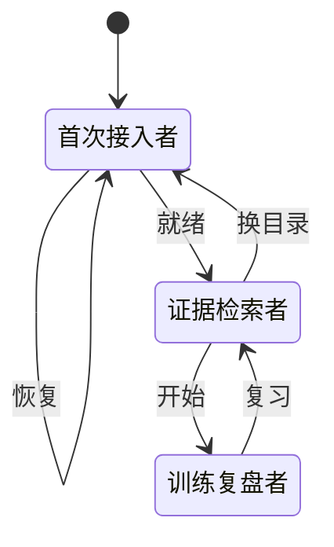

### 2.5 角色体验矩阵

| 产品行为 | R-01 | R-02 | R-03 | R-04 | R-05 |
|---|---|---|---|---|---|
| 默认入口 | 接入向导 | 首页/知识库 | 面试历史或开始页 | 公开首页 | 验证记录页 |
| 数据来源 | 用户选择目录 | 独立本地索引 | 训练会话与可选模型 | 浏览器脱敏数据 | 去正文的任务记录 |
| 关键提示 | 本地保存、外发条件 | 来源与证据不足 | 真实/降级、复习行动 | 演示边界 | 禁止记录正文/密钥 |
| 失败恢复 | 改选目录、重试 | 清空/重试/原文浏览 | 保留输入、重试、导出失败提示 | 保持页面可浏览 | 人工补记与导出重试 |
| 主要成功信号 | 无需改代码完成接入 | 找到有效原文 | 形成明确行动 | 3 分钟内正确复述 | 可复核地形成阶段判断 |

---

## 三、产品概述

### 3.1 产品目标与关键结果

| Objective | Key Results（目标，不是已达成） |
|---|---|
| O1 更快取得可用的个人知识证据 | 同一组 20 个任务中，知识定位中位时间较原流程下降至少 50%，且不超过 60 秒；成功找到有效原文的任务占比不低于 90% |
| O2 让训练形成后续改进 | 4 周完成不少于 8 次有效训练；每次保留反馈；复习行动完成率不低于 70% |
| O3 建立可核验的信任 | 至少 30 条引用的追溯通过率不低于 95%；重大隐私事件为 0；真实、降级和演示状态均清楚 |
| O4 让外部评审者理解产品 | 5 名独立评审者体验 3 分钟后，至少 4 人能复述目标用户、问题、价值和数据边界 |
| O5 验证外部用户自助完成 | 10 名真实资料试用者中至少 7 名在一次初始说明后自行完成首次闭环；记录所有介入点 |
| O6 控制验证成本 | 4 周时间收益投入比不低于 1.0；不新增无法追溯到 O1-O5 的功能 |

### 3.2 成功指标的证据分层

| 层级 | 指标或结果 | 当前结论 |
|---|---|---|
| 已取得的实现结果 | 53/53 后端测试；前端 lint/build 通过；390×844 与 1440×1000 核心流程通过 | 证明实现质量，不证明用户价值 |
| 已取得的线上抽查 | 首页 LCP 1.544 秒、CLS 0；助手页 FCP 0.548 秒、CLS 0 | 单次实验室抽查，不等于生产 SLA |
| 未来产品实验目标 | 定位时间、有效原文成功率、训练行动完成率、自助完成率、理解度 | 需按本期样本与口径验证 |
| 尚未验证假设 | 用户愿意导入资料、接受本地维护、持续训练或付费 | 证据信心低，不能写成结论 |

### 3.3 产品功能结构

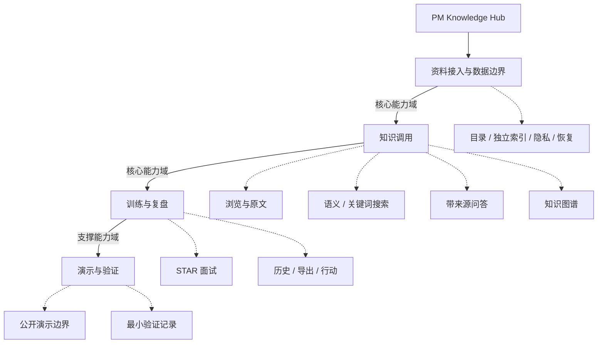

### 3.4 总体业务流程

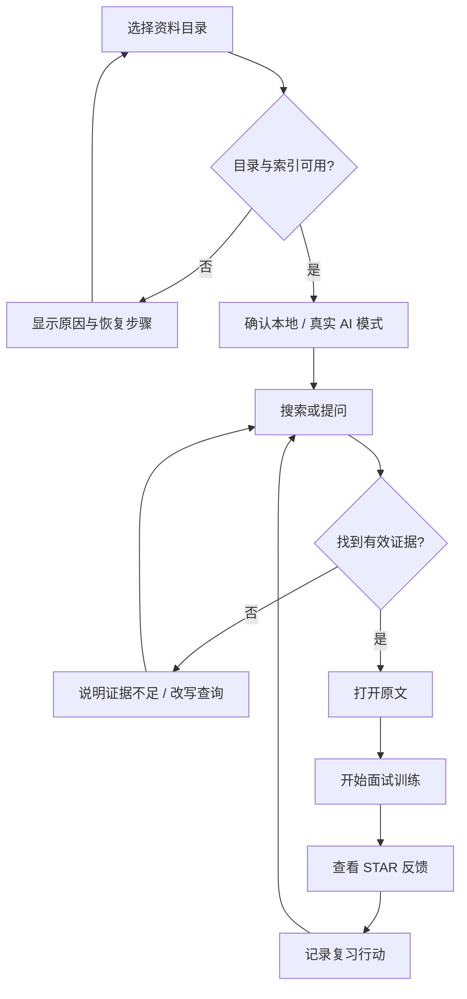

### 3.5 功能摘要与优先级

| 功能 ID | 功能 | 优先级 | 用户价值 | 实施复杂度 | 当前状态 |
|---|---|---:|---|---|---|
| F-01 | 资料接入与首次使用 | P0 | 高 | 中高 | 部分实现；目标原型已补齐 |
| F-02 | 知识浏览与检索 | P0 | 高 | 中 | 已实现 |
| F-03 | AI 问答与证据 | P0 | 高 | 中高 | 已实现；业务价值待验证 |
| F-04 | 面试训练与复盘 | P0/P1 | 高 | 中高 | 反馈已实现；行动闭环部分实现 |
| F-05 | 学习地图 | P1 | 中 | 中 | 已实现 |
| F-06 | 公开演示与模式标识 | P0 | 高 | 中 | 已实现；理解度待验证 |
| F-07 | 业务验证记录 | P0 | 高 | 低至中 | 未完整实现；目标原型已补齐 |
| F-08 | 复制、主题、微动效等便利能力 | P2 | 低至中 | 低 | 已实现，不扩大范围 |

优先级依据：P0 直接决定首次闭环、隐私或业务判断；P1 提升持续使用但不应阻塞核心链路；P2 是便利性和表现层增强。

---

## 四、功能需求说明

### 4.1 F-01 资料接入与首次使用（P0）

| 字段 | 内容 |
|---|---|
| 目标 | 外部 PM 用户不修改源代码即可接入自己的目录，并理解数据边界 |
| 主要角色 | R-01、R-05 |
| 前置条件 | 本地完整版已安装；用户拥有可读取的 Markdown/Obsidian 目录 |
| 触发条件 | 首次运行、索引缺失、用户主动更换目录 |
| 当前状态 | `NOTES_DIR` 与 `CHROMA_DB_PATH` 已存在；图形化流程与外部自助性待实现/验证 |

#### 业务规则

| ID | 规则 |
|---|---|
| FR-SETUP-01 | 用户必须通过配置模板或界面选择目录，不得修改源代码；只扫描选择目录内的受支持文件 |
| FR-SETUP-02 | 每名试用者必须使用独立索引路径和浏览器历史空间，不得复用他人私人索引 |
| FR-SETUP-03 | 主动调用外部模型前，必须展示数据位置、发送范围、供应商和清理方式 |
| FR-SETUP-04 | 无效、空、无权限或不含支持文件的目录必须返回具体原因与下一步操作 |
| FR-SETUP-05 | 更换目录时先验证新路径；未经用户确认不得覆盖或混用旧索引 |
| FR-SETUP-06 | 配置失败不得修改原始笔记，不得把内容发送到外部服务 |

#### 页面、状态与交互

| 状态 | 页面行为 | 允许操作 |
|---|---|---|
| 默认 | 显示目录选择、本地保存说明和索引位置 | 浏览、粘贴路径、稍后设置 |
| 校验中 | 显示进行中状态，继续按钮禁用 | 取消校验 |
| 校验成功 | 显示笔记数、目录数和独立索引摘要 | 进入隐私确认 |
| 空目录 | 说明未发现支持文件和支持格式 | 改选、重新扫描 |
| 无效/无权限 | 显示错误码、原因和恢复步骤 | 改选、重试、复制诊断 |
| 建立索引失败 | 保留路径与旧索引，说明已写入数量 | 重试或返回 |
| 刷新恢复 | 恢复已确认配置，不暴露密钥 | 继续未完成步骤 |

桌面端使用主任务卡 + 数据边界侧栏；移动端改为单列，主操作可在首屏连续完成。按钮触控目标不小于 44×44 像素；错误不能只用颜色表达。

#### 数据对象、持久化与事件

| 对象/事件 | 必要字段 | 保存位置/限制 |
|---|---|---|
| `LibraryConfig` | `notes_path`、`index_path`、`mode`、`validated_at` | 本地配置；不得上传绝对路径到业务分析 |
| `IndexStatus` | 状态、笔记数、目录数、错误码、最近成功时间 | 本地后端 |
| `setup_started` | 匿名试用者 ID、时间、客户端模式 | 不含路径和正文 |
| `notes_directory_validated` | 结果、耗时、错误分类、笔记数 | 路径只做本地诊断 |
| `index_build_completed/failed` | 耗时、数量、错误分类 | 不含分片正文 |
| `privacy_notice_confirmed` | 选择模式、说明版本 | 不记录密钥 |

#### 验收标准

| ID | 可测试验收 |
|---|---|
| AC-SETUP-01 | 给定有效目录，用户无需修改代码即可完成校验并看到笔记数和独立索引位置 |
| AC-SETUP-02 | 给定两个试用配置，交叉抽样不得出现另一配置的标题、正文、路径或历史 |
| AC-SETUP-03 | 给定未确认隐私说明的用户，真实 AI 调用入口不可继续；确认后记录说明版本 |
| AC-SETUP-04 | 给定不存在、空或无权限目录，页面分别显示原因、恢复动作且不进入空白/无限加载 |
| AC-SETUP-05 | 建立索引失败后刷新页面，原始笔记与旧索引不变，用户可直接重试 |
| AC-SETUP-06 | 在 390×844 和 1440×1000 下完成目录选择、隐私确认和失败恢复，无页面级横向滚动 |

#### 依赖与高保真原型

依赖：本地配置模板、解析/索引命令、健康检查、隐私说明和独立历史策略。

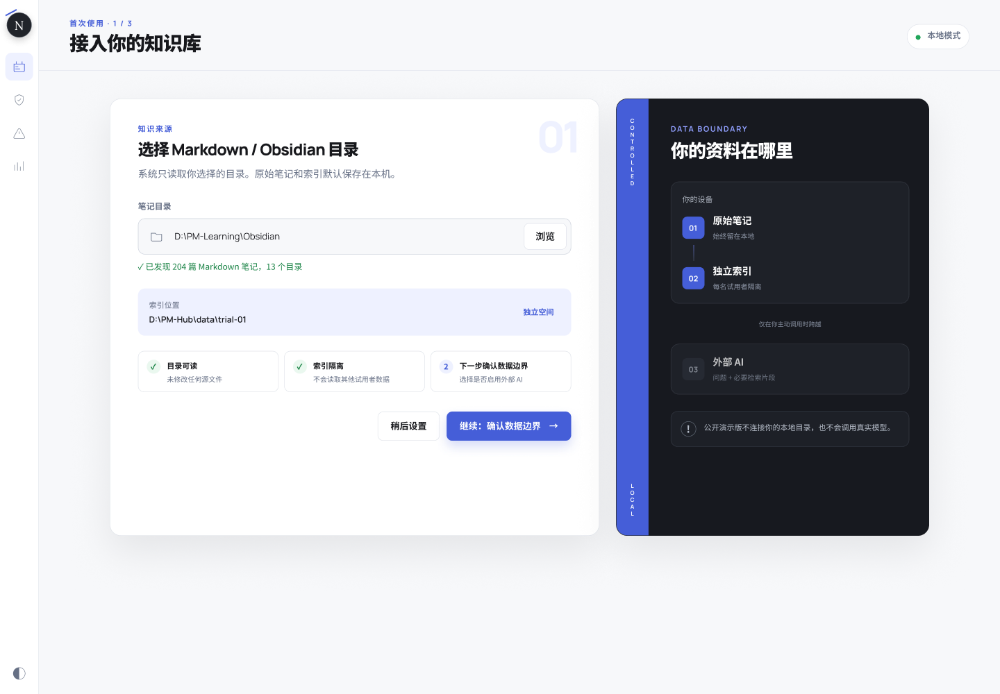

*P-07 · 资料接入成功态 · 对应 FR-SETUP-01/02、AC-SETUP-01；目标设计，尚未实现。*

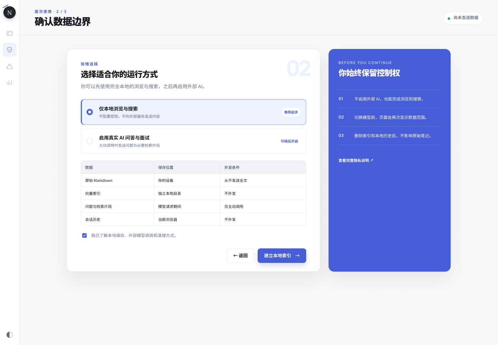

*P-08 · 数据边界确认 · 对应 FR-SETUP-03、AC-SETUP-03；目标设计，尚未实现。*

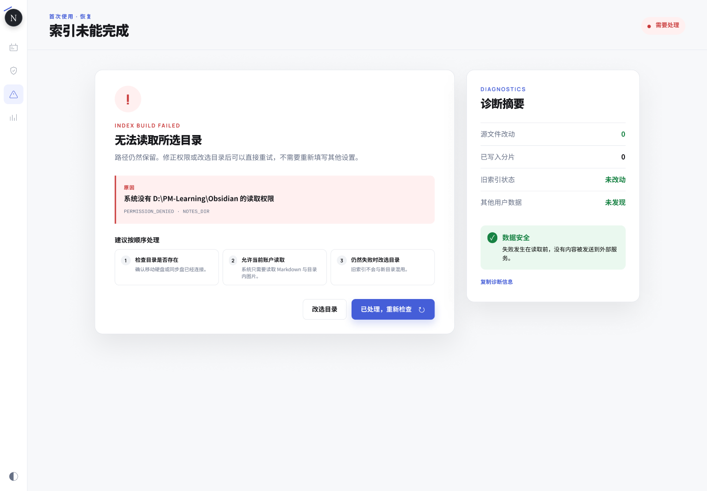

*P-09 · 索引失败恢复 · 对应 FR-SETUP-04/06、AC-SETUP-04/05；目标设计，尚未实现。*

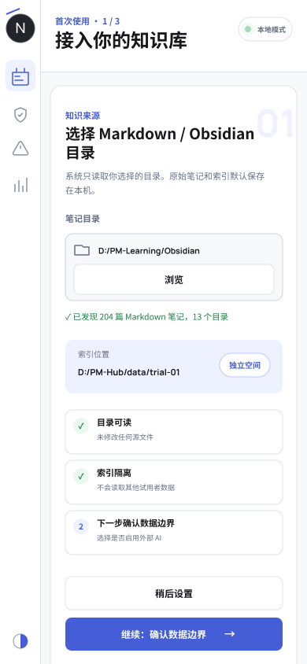

*P-11 · 移动端资料接入 · 对应 AC-SETUP-06；目标设计，尚未实现。*

### 4.2 F-02 知识浏览与检索（P0）

| 字段 | 内容 |
|---|---|
| 目标 | 从目录、关键词或自然语言快速进入相关原文 |
| 主要角色 | R-02 |
| 前置条件 | 索引健康；至少一篇可读取笔记 |
| 触发条件 | 进入知识库、从首页搜索、从图谱/来源跳转 |
| 当前状态 | 已实现并有验收截图；外部用户价值待验证 |

#### 业务规则

| ID | 规则 |
|---|---|
| FR-KB-01 | 目录浏览以唯一笔记为单位，完整正文不显示 YAML Frontmatter |
| FR-KB-02 | 语义和关键词是独立搜索模式；不得描述成已实现的自动混合检索 |
| FR-KB-03 | 搜索结果必须包含标题、匹配内容和可理解的相关性信息 |
| FR-KB-04 | 选择结果后显示原文上下文；本地环境可打开对应 Obsidian 笔记 |
| FR-KB-05 | 只允许读取 `NOTES_DIR` 内的图片；失败时就地说明并允许重试 |
| FR-KB-06 | 清空查询后恢复目录浏览并移除全部高亮 |

#### 状态、交互、数据与事件

| 状态 | 行为 |
|---|---|
| 默认/空查询 | 显示目录与唯一笔记列表 |
| 加载中 | 列表或预览显示忙碌状态，旧内容不得误标为新结果 |
| 无结果 | 说明未找到，提供改写建议和清空入口 |
| 搜索失败 | 保留查询，显示重试；页面其他区域仍可使用 |
| 原文/图片失败 | 就地提示，不导致整页不可用 |
| 多目录切换 | 结果只属于当前独立索引，不跨用户或目录混用 |

`SearchTaskRecord` 只记录匿名试用者、查询类型、开始/完成时间、是否找到有效原文和失败原因。事件包括 `knowledge_search_submitted`、`search_results_viewed`、`source_opened`、`search_failed`；不得采集查询对应的私人正文。

#### 验收标准

| ID | 可测试验收 |
|---|---|
| AC-KB-01 | 选择目录和笔记后，列表无重复、正文完整且 Frontmatter 不作为正文显示 |
| AC-KB-02 | 输入查询后显示相关结果；清空后恢复目录浏览和无高亮状态 |
| AC-KB-03 | 选择结果能进入对应上下文，本地 Obsidian 链接指向相应笔记 |
| AC-KB-04 | 有效图片正常显示；越界或缺失图片不被读取且有可理解反馈 |
| AC-KB-05 | 服务失败后查询仍保留，点击重试可再次请求 |

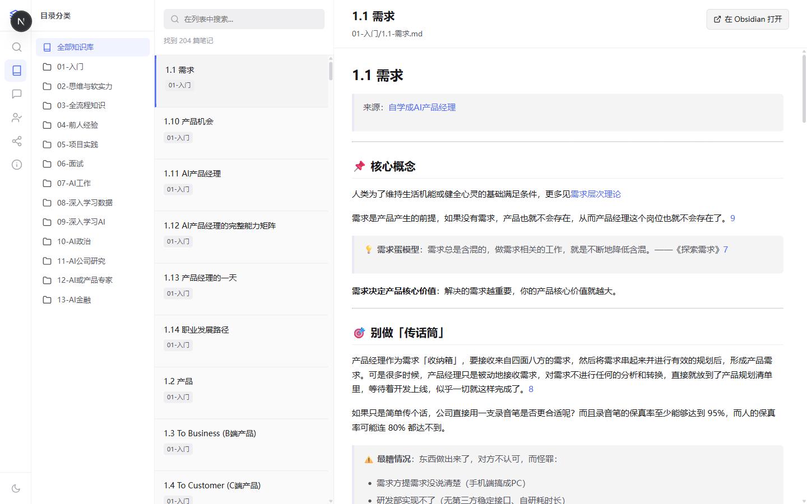

*P-03 · 知识浏览与完整原文 · 对应 FR-KB-01/04；当前实现截图。*

### 4.3 F-03 AI 问答与证据（P0）

| 字段 | 内容 |
|---|---|
| 目标 | 基于个人资料回答，并让每条关键结论可回到来源 |
| 主要角色 | R-02 |
| 前置条件 | 索引可用；用户已确认运行模式 |
| 触发条件 | 提交有效问题或选择推荐问题 |
| 当前状态 | 已实现真实/Mock 返回、来源卡、历史、重试和撤销 |

#### 业务规则

| ID | 规则 |
|---|---|
| FR-QA-01 | 有效问题提交后必须显示处理中、成功或失败状态 |
| FR-QA-02 | 编号引用必须与来源卡一一对应，来源卡包含标题、路径和原文摘录 |
| FR-QA-03 | 无充分个人来源时不得伪造引用，必须明确说明证据不足或模型补充 |
| FR-QA-04 | 真实、Mock/降级和公开演示状态必须可见，不得只依赖技术术语 |
| FR-QA-05 | 会话最多本地保存 50 条；删除后在当前反馈窗口可撤销 |
| FR-QA-06 | 超时或供应商失败时保留用户输入，提供重试或本地替代结果 |

#### 状态、数据与事件

默认态显示任务说明和建议问题；加载中禁止重复提交；空来源显示证据不足；成功态显示回答、来源与推荐问题；失败态显示原因和重试；删除态显示撤销提示；刷新后恢复本地历史。移动端历史侧栏关闭时不得留在 Tab 顺序中。

`QASession` 包含会话 ID、消息、来源、模式、时间；本地保存在浏览器。事件包括 `qa_question_submitted`、`qa_response_completed`、`qa_response_failed`、`citation_opened`、`qa_session_deleted/restored`。业务分析不得记录问题全文、回答全文、来源摘录或密钥。

#### 验收标准

| ID | 可测试验收 |
|---|---|
| AC-QA-01 | 提交有效问题后显示回答；处理中有忙碌状态，失败不出现空白或无限加载 |
| AC-QA-02 | 回答引用编号与来源卡一一对应，点击编号可定位对应来源 |
| AC-QA-03 | 无有效来源时回答明确说明证据不足且来源数为 0，不生成虚假引用 |
| AC-QA-04 | 无密钥、超时或供应商错误时显示模式与恢复路径并保留输入 |
| AC-QA-05 | 刷新后历史可恢复；删除可撤销；超过上限只保留最近 50 条 |
| AC-QA-06 | 移动端关闭历史侧栏后，隐藏控件不进入键盘焦点顺序 |

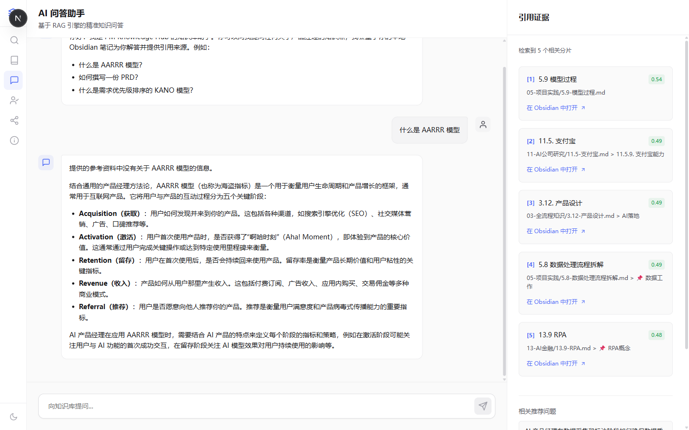

*P-04 · 带来源的问答 · 对应 FR-QA-02/03；当前实现截图。*

### 4.4 F-04 面试训练与复盘（P0/P1）

| 字段 | 内容 |
|---|---|
| 目标 | 让一次文本练习产生具体反馈和可执行复习行动 |
| 主要角色 | R-03 |
| 前置条件 | 用户已确认模式；可使用真实模型或明确降级 |
| 触发条件 | 开始新练习、恢复历史或从薄弱知识进入 |
| 当前状态 | 出题、STAR 反馈、历史、撤销和图像化 PDF 已实现；行动闭环待补齐 |

#### 业务规则

| ID | 规则 |
|---|---|
| FR-IV-01 | 开始后显示一道明确问题，真实与演示/降级状态不得混淆 |
| FR-IV-02 | 反馈必须分别覆盖 Situation、Task、Action、Result，并给出总分、改进建议、建议回答和后续问题 |
| FR-IV-03 | 评分只能作为模型反馈，不得写成招聘或能力认证结论 |
| FR-IV-04 | 会话刷新后可恢复；删除可撤销；导出包含问题、回答和完整反馈 |
| FR-IV-05 | 用户必须能把反馈转成一条可编辑、可完成的复习行动；自动推荐仍是未来候选 |
| FR-IV-06 | 本期不承诺固定三轮、指定轮次恢复、语音或完整面试总结 |

#### 状态、数据与事件

覆盖未开始、出题中、待作答、评估中、成功、降级、失败、导出中/成功/失败、历史删除/撤销和刷新恢复。重复提交在评估中被禁止；返回或关闭不丢失已保存会话。

`InterviewSession` 保存问题、回答、反馈、模式和时间；`ReviewAction` 保存行动描述、来源主题、状态和完成时间。事件包括 `interview_started`、`answer_submitted`、`feedback_viewed`、`review_action_saved/completed`、`interview_report_exported/failed`；业务验证不记录回答全文。

#### 验收标准

| ID | 可测试验收 |
|---|---|
| AC-IV-01 | 开始练习后显示问题和当前模式；加载期间不能重复开始 |
| AC-IV-02 | 提交回答后显示 STAR 四维反馈、总分、改进建议、建议回答和后续问题 |
| AC-IV-03 | 失败时保留回答并提供重试或降级，不产生空白会话 |
| AC-IV-04 | 历史刷新后恢复，删除可撤销；报告中文可读且内容完整 |
| AC-IV-05 | 每次有效训练可关联至少一条后续行动，并能标记完成 |
| AC-IV-06 | 导出 PDF 的视觉结果可读；文本可访问性未改善前必须在限制中说明 |

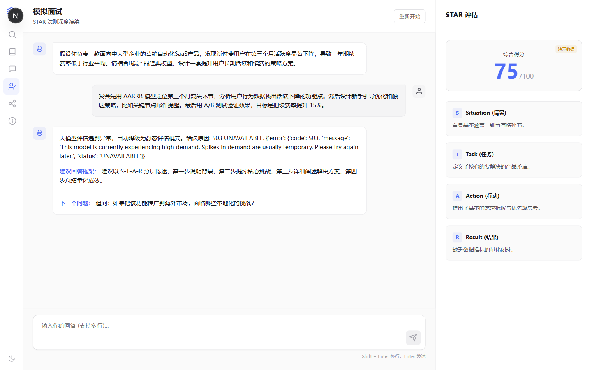

*P-05 · STAR 面试反馈 · 对应 FR-IV-01/02；当前实现截图。*

### 4.5 F-05 学习地图（P1）

| 字段 | 内容 |
|---|---|
| 目标 | 帮助用户探索目录和笔记之间的关系，并回到原文 |
| 主要角色 | R-02 |
| 前置条件 | 图谱接口和索引可用 |
| 触发条件 | 进入学习地图或从知识页切换 |
| 当前状态 | 目录/笔记层、过滤、聚焦、重置和文本摘要已实现 |

#### 业务规则与状态

| ID | 规则 |
|---|---|
| FR-MAP-01 | 支持目录聚合和笔记展开两层；笔记层可按目录过滤 |
| FR-MAP-02 | 悬停/选择节点突出一度关系并显示详情；本地笔记可回跳 Obsidian |
| FR-MAP-03 | 节点过多时提示过滤或降级到目录层，不阻塞核心任务 |
| FR-MAP-04 | Canvas 必须提供等价文本摘要；核心操作不只依赖悬停 |
| FR-MAP-05 | 首次操作引导可关闭、记忆并再次打开；加载失败可重试 |

覆盖默认、加载、空图、成功、过密警告、接口失败、选中和重置状态。事件只记录层级、筛选、节点类型和结果，不记录私人标题。`map_level_changed`、`map_filter_applied`、`map_node_opened` 为目标事件。

#### 验收标准

| ID | 可测试验收 |
|---|---|
| AC-MAP-01 | 切换层级和目录过滤后，图谱只显示对应范围且总数提示正确 |
| AC-MAP-02 | 悬停/选择显示上下文；点击笔记可打开相应本地原文 |
| AC-MAP-03 | 大规模节点触发提示或降级，不造成持续阻塞 |
| AC-MAP-04 | 键盘/辅助技术可读取节点摘要，重置与帮助按钮有可访问名称 |
| AC-MAP-05 | 接口失败时显示原因和重试，页面仍可返回其他核心任务 |

*P-06 · 目录层知识图谱 · 对应 FR-MAP-01/02；当前实现截图。*

### 4.6 F-06 公开演示与模式标识（P0）

| 字段 | 内容 |
|---|---|
| 目标 | 让评审者快速理解产品，同时不误解数据和 AI 能力 |
| 主要角色 | R-04 |
| 前置条件 | 公开站点可访问，使用脱敏演示数据 |
| 触发条件 | 访问公开首页或任何业务页 |
| 当前状态 | 核心页面已上线；理解度尚未完成目标样本验证 |

#### 业务规则

| ID | 规则 |
|---|---|
| FR-DEMO-01 | 无需登录、安装或密钥即可体验首页、知识、问答、面试、地图和关于页 |
| FR-DEMO-02 | 所有可能误解为真实能力的位置必须标明演示数据、无本地后端和无真实模型调用 |
| FR-DEMO-03 | 发布材料不得包含原始笔记、密钥、私人索引或个人绝对路径 |
| FR-DEMO-04 | 公开站点的模拟结果不得作为真实用户效果、模型质量或业务指标 |
| FR-DEMO-05 | 404、空分类或功能不可用时提供返回首页和核心入口 |

模式标识至少区分“本地完整版·真实 AI”“本地完整版·降级”和“公开演示·脱敏数据”。模式变化不能只靠颜色。公开页面不得请求本地 `/api/` 或付费模型端点。

#### 验收标准

| ID | 可测试验收 |
|---|---|
| AC-DEMO-01 | 未登录用户可进入七个公开页面并完成主要演示交互 |
| AC-DEMO-02 | 任一业务页均能识别公开演示边界；关于页与实际部署一致 |
| AC-DEMO-03 | 扫描公开资源不发现密钥、私人路径、原始笔记或真实 API 请求 |
| AC-DEMO-04 | 5 名独立评审者体验 3 分钟后至少 4 人正确复述目标用户、问题、价值和边界 |
| AC-DEMO-05 | 不存在的路由和空分类提供恢复路径，不以纯文本错误结束 |

*P-01 · 当前工作台桌面 · 对应 FR-DEMO-01/02；当前实现截图。*

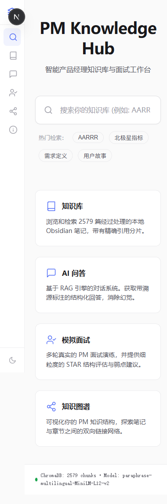

*P-02 · 当前工作台移动端 · 对应 AC-DEMO-01；当前实现截图。*

### 4.7 F-07 业务验证记录（P0）

| 字段 | 内容 |
|---|---|
| 目标 | 用最小记录判断是否 GO、PIVOT 或 STOP，不采集私人正文 |
| 主要角色 | R-05 |
| 前置条件 | 已定义匿名试用者 ID、标准任务和指标口径 |
| 触发条件 | 新增试用者、完成一次标准任务/训练、记录介入或阶段导出 |
| 当前状态 | 运行计数部分存在；业务验证记录未完整交付 |

#### 业务规则

| ID | 规则 |
|---|---|
| FR-VAL-01 | 每个标准任务记录开始、完成、成功、失败原因和模式 |
| FR-VAL-02 | 每次有效训练关联反馈是否查看、复习行动及完成状态 |
| FR-VAL-03 | 统一区分真实 AI、降级和公开演示，不混算用户结果 |
| FR-VAL-04 | 记录配置是否成功、首次闭环、人工介入次数和阻塞原因 |
| FR-VAL-05 | 记录可导出或人工复核；不得包含正文、回答全文、来源摘录和密钥 |
| FR-VAL-06 | 样本不足时只能得出“证据不足”，不得以百分比包装成市场结论 |

#### 状态、数据与事件

覆盖无记录、录入中、保存成功、校验失败、导出中/失败和样本不足。重复导入按试用者 ID + 任务 ID 去重；删除记录需确认并保留可恢复备份。

`ValidationRecord` 包含匿名参与者、任务、模式、开始/完成时间、结果、介入次数、阻塞分类、行动状态和说明版本。`validation_record_saved`、`manual_intervention_logged`、`validation_exported` 为目标事件。

#### 验收标准

| ID | 可测试验收 |
|---|---|
| AC-VAL-01 | 每个标准任务可得到用时、成功与否和失败原因，且不含私人正文 |
| AC-VAL-02 | 每次有效训练可关联行动状态并计算训练次数与行动完成率 |
| AC-VAL-03 | 报表可分别查看真实、降级和演示模式，不将演示结果计入真实用户指标 |
| AC-VAL-04 | 每名试用者可计算是否自助完成、介入次数和主要阻塞 |
| AC-VAL-05 | 导出结果能按定义复算 O1-O6 指标；缺失字段会被标记而非静默忽略 |

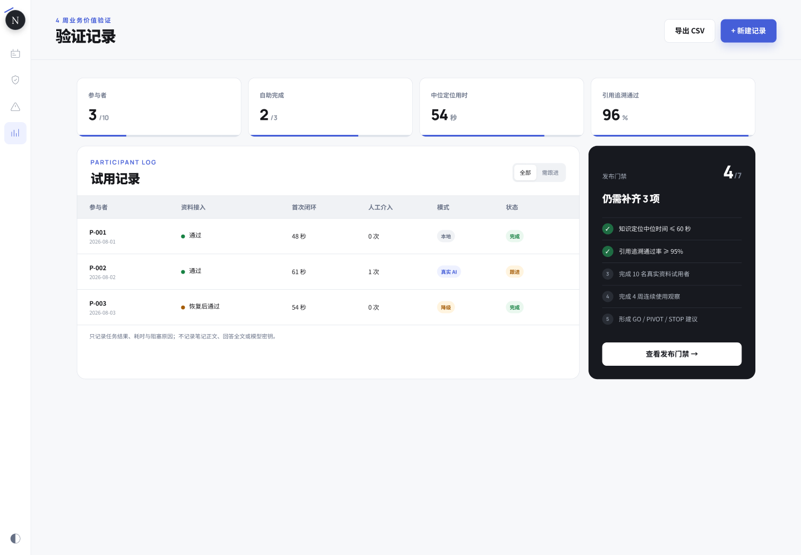

*P-10 · 业务验证记录 · 对应 FR-VAL-01 至 05、AC-VAL-01 至 05；目标设计，尚未实现。*

---

## 五、其他产品需求

### 5.1 性能与响应目标

| 场景 | 目标 | 验收方法 |
|---|---|---|
| 首页/核心页面可交互 | 本地正常环境 3 秒内可操作 | 冷启动与热启动各 5 次，记录中位数 |
| 搜索反馈 | 提交后 200 毫秒内出现加载反馈；结果目标 2 秒内返回 | 开发工具与任务记录 |
| 图谱 | 超过 200 节点触发过滤提示或目录降级 | 受控数据集测试 |
| 页面稳定性 | 关键页面 CLS < 0.1 | 桌面/移动实验室测试 |

2026-07-24 的 LCP/FCP 数值只作为抽查基线，不作为已经满足的生产 SLA。

### 5.2 监控与分析

| 事件 | 触发条件 | 必要参数 | 禁止采集 |
|---|---|---|---|
| `knowledge_task_completed` | 打开有效原文或结束任务 | 匿名 ID、任务 ID、模式、耗时、结果 | 查询全文、笔记正文 |
| `citation_opened` | 用户打开来源 | 会话 ID、来源序号、模式 | 摘录、绝对路径 |
| `review_action_completed` | 复习行动完成 | 行动 ID、创建/完成时间 | 行动正文 |
| `manual_intervention_logged` | 发生人工帮助 | 阶段、阻塞分类、耗时 | 私人对话、密钥 |
| `demo_comprehension_recorded` | 完成限时理解任务 | 四项回答是否正确、耗时 | 姓名等非必要身份信息 |

### 5.3 兼容性矩阵

| 环境 | 本期级别 | 视口/版本 | 验收 |
|---|---|---|---|
| Chromium 桌面 | P0 | 1440×1000，当前稳定版 | 全核心流程 |
| Chromium 移动模拟 | P0 | 390×844 | 全核心流程，无横向溢出 |
| Firefox 桌面 | P1 | 当前稳定版 | 浏览、搜索、问答、面试冒烟 |
| WebKit/Safari | P1 | 当前稳定版 | 浏览、搜索、问答、面试冒烟 |
| Windows 10/11 本地服务 | P0 | Python 3.10+、Node 18+ | 安装、索引、启动、关闭 |

### 5.4 无障碍

- 所有功能可用键盘完成，焦点可见且顺序与视觉一致；
- 动态加载、错误、删除和导出结果通过 `aria-live`/`role` 传达；
- 文本和关键图形对比度达到 WCAG AA；状态不只用颜色表达；
- 触控目标至少 44×44 像素；
- Canvas 图谱提供文本摘要；所有关键信息图有替代文本；
- 侧栏、弹窗和浮层关闭后不能继续接收焦点；打开后焦点进入合理位置；
- PDF 文本可访问性是已知缺口，修复前不得宣称报告对屏幕阅读器友好。

### 5.5 数据、安全与隐私

- 原始笔记、索引和会话默认本地保存；本地存储不等于加密或安全存储；
- 只有用户配置供应商并主动调用时才发送必要问题和检索片段；
- 图片读取必须限制在 `NOTES_DIR` 允许范围内；
- 日志和业务记录不得包含密钥、正文、回答全文、来源摘录和个人绝对路径；
- 公开站点不得包含密钥、私人路径、原始笔记或真实模型请求；
- 删除索引和历史必须与删除原始笔记分离，危险操作说明影响范围并要求确认。

### 5.6 内容与国际化

- 本期界面和交付语言为简体中文；技术名词保留英文时首次出现需解释；
- 不使用“保证通过”“完全杜绝幻觉”“行业领先”等无法证实的表述；
- 日期使用 `YYYY-MM-DD`，时间口径注明时区；
- 错误信息先说明用户可执行动作，再显示技术错误码。

### 5.7 降级与恢复

| 失败 | 降级 | 恢复 |
|---|---|---|
| 后端离线 | 首页标记离线；静态说明仍可读 | 检查服务并重试 |
| 索引不可用 | 禁止将空结果伪装成无相关资料 | 返回接入/恢复页 |
| 外部模型不可用 | 明确进入降级；保留输入 | 重试、切换供应商或继续本地浏览 |
| 本地历史损坏/超额 | 当前任务不中断，提示未保存 | 清理或导出后重试 |
| 图片/PDF 导出失败 | 就地提示，不影响原会话 | 重试或保存文本信息 |
| 公开页面 404 | 品牌化错误页 | 返回首页或核心工作台 |

---

## 六、风险分析

### 6.1 概率—影响矩阵

| 概率 \ 影响 | 低 | 中 | 高 |
|---|---|---|---|
| 高 | R-08 | R-02、R-04 | R-01 |
| 中 | R-07 | R-03、R-06 | R-05 |
| 低 | — | R-09 | R-10 |

### 6.2 风险清单

| ID | 风险 | 概率 | 影响 | 等级 | 预防 | 发生后应对 |
|---|---|---:|---:|---|---|---|
| R-01 | 外部用户证据不足 | 高 | 高 | 极高 | 先访谈与真实资料试用 | 结论标记证据不足，不扩大市场声明 |
| R-02 | 长期愿景造成范围膨胀 | 高 | 中 | 高 | 未来目标设进入门槛 | 移出本期并更新 Roadmap |
| R-03 | 原型与需求不一致 | 中 | 中 | 中 | 原型标需求 ID、PRD 为准 | 记录设计待修项并重新评审 |
| R-04 | 引导过多或零打扰失败 | 高 | 中 | 高 | 首次分步、后续可跳过 | 观察介入点并调整频率 |
| R-05 | 索引/历史状态冲突或数据混用 | 中 | 高 | 极高 | 独立路径、切换前校验 | 停止试用、隔离环境、复核并告知 |
| R-06 | 本地数据损坏或容量失败 | 中 | 中 | 中 | 不修改源笔记、限制历史数 | 保留原始资料、重建索引、提示未保存 |
| R-07 | 移动端或兼容性缺口 | 中 | 低 | 中 | 双视口门禁、跨浏览器冒烟 | 降级非核心布局并修复阻塞 |
| R-08 | 把静态演示写成生产能力 | 高 | 低 | 中 | 模式标识与文案审查 | 立即更正文案与发布材料 |
| R-09 | PDF 文本不可访问 | 低 | 中 | 中 | 明示限制、评估文本型导出 | 提供网页内容或后续修复 |
| R-10 | 私人资料或密钥泄露 | 低 | 高 | 极高 | 最小数据、公开资源扫描 | 停止发布、撤销密钥、清理并复盘 |

### 6.3 风险处置决策

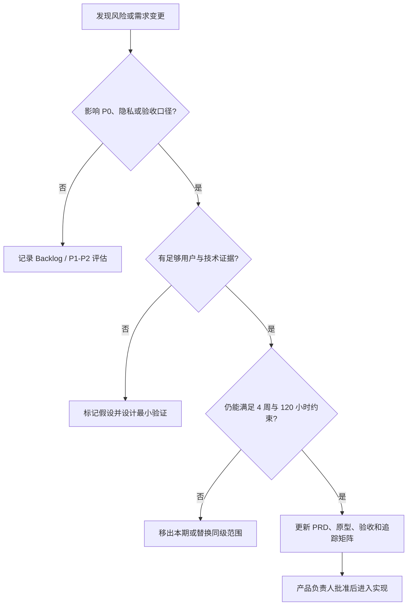

### 6.4 需求变更门槛

以下变更必须由产品负责人批准并同时更新 PRD、原型和验收：新增 P0、改变数据外发、改变角色/模式、改变发布门禁、引入不可逆数据操作。普通文案、无行为变化的视觉修正和 P2 缺陷可走 Backlog，但不得绕过隐私或无障碍要求。

---

## 七、相关文档

| 类型 | 文档 | 用途 |
|---|---|---|
| 商业 | [BRD](BRD.md) | 商业决策、投入边界和阶段门槛 |
| 市场 | [MRD](MRD.md) | 市场问题、用户任务、竞争与扩展条件 |
| 研究 | [社区调研](Community_Research_Report.md) | 定性桌面研究；不能替代访谈 |
| 需求证据 | [PRD 证据矩阵](PRD_EVIDENCE_MATRIX.md) | 需求来源、状态、落点和文档处置 |
| 用户体验 | [用户旅程](USER_JOURNEY.md) | 角色状态、核心任务和失败恢复 |
| 指标 | [指标体系](METRICS.md) | 指标口径、最小记录与事件规范 |
| 路线图 | [Roadmap](ROADMAP.md) | 当前验证期与未来进入门槛 |
| 设计 | [设计系统](../design/README.md) | 视觉、布局、组件和交互原则 |
| 原型 | [高保真原型索引](../design/HIGH_FIDELITY_PROTOTYPES.md) | 当前截图、目标设计与缺口状态 |
| 架构 | [系统架构](../architecture/README.md) | 当前代码、API、数据流和技术边界 |
| 测试 | [系统验收](../quality/ACCEPTANCE.md) | 自动化与端到端结果 |
| 线上验证 | [Web 测试报告](../quality/web-test-2026-07-24/TEST_REPORT.md) | 公开站点黑盒结果和已知缺陷 |
| 版本 | [CHANGELOG](../delivery/CHANGELOG.md) | 历史变化 |
| 当前状态 | [交付状态](../delivery/STATUS.md) | 当前版本与发布事实 |

---

## 八、附件

### 8.1 原型与演示入口

- 可编辑高保真源文件：[Figma · PRD v4 高保真原型](https://www.figma.com/design/7sQuypYVJEEuxaaJu3WqqD)
- 本地交互参考：[PRD v4 原型入口](../design/prototypes/prd-v4/index.html)
- 公开演示：<https://pm-knowledge-hub-demo.tongqtang.chatgpt.site>
- 本地运行入口：`http://localhost:3000`
- API 文档：`http://127.0.0.1:8000/docs`

### 8.2 高保真资产索引

| 编号 | 资产 | 类型 | 对应需求 | 状态 |
|---|---|---|---|---|
| P-01 | 工作台桌面 | 实现截图 | F-06 | 已验证 |
| P-02 | 工作台移动端 | 实现截图 | F-06 | 已验证 |
| P-03 | 知识浏览与原文 | 实现截图 | F-02 | 已验证 |
| P-04 | 带来源问答 | 实现截图 | F-03 | 已验证 |
| P-05 | STAR 面试反馈 | 实现截图 | F-04 | 已验证 |
| P-06 | 目录层知识图谱 | 实现截图 | F-05 | 已验证 |
| P-07 | 资料接入成功态 | 目标设计 | F-01 | 待实现 |
| P-08 | 数据边界确认 | 目标设计 | F-01/F-06 | 待实现 |
| P-09 | 索引失败恢复 | 目标设计 | F-01 | 待实现 |
| P-10 | 业务验证记录 | 目标设计 | F-07 | 待实现 |
| P-11 | 移动端资料接入 | 目标设计 | F-01 | 待实现 |

完整路径和设计说明见[高保真原型索引](../design/HIGH_FIDELITY_PROTOTYPES.md)。

### 8.3 当前实现结果与验证记录

截至 2026-07-30，可证明的事实包括：

- `v1.6.0-rc.1` 候选代码已同步远程 `main`，尚未创建 `v1.6.0` 正式标签和 Release；
- 本地完整版已实现浏览、独立语义/关键词搜索、带来源问答、文本 STAR 评估、图谱、历史和 PDF；
- 公开演示版不连接 FastAPI、ChromaDB、本地笔记或真实模型；
- 2026-07-24 复测的两个 S1 阻断项已关闭，仍有安全响应头、移动侧栏焦点、PDF 文本可访问性和 404 恢复等 S2 项；
- 自动化、构建和静态检查不能替代 O1-O6 的真实用户验证。

### 8.4 待确认问题与决策记录

| ID | 问题 | 当前保守假设 | 决策时点 |
|---|---|---|---|
| Q-01 | 复习行动由用户手工记录还是产品生成 | 本期先手工记录 | 验证准备阶段 |
| Q-02 | 配置模板是否足够，是否必须图形化向导 | 前 3 名先用模板 + 清晰说明 | 第 3 名真实资料试用后 |
| Q-03 | 外部用户是否接受本地服务维护 | 不假定接受 | 完成首轮 8 人访谈后 |
| Q-04 | 面试是否必须支持语音 | 文本保持本期基线 | 完成外部需求验证后 |
| Q-05 | 切换目录时如何清理旧索引和历史 | 默认不覆盖，要求显式确认 | 首名外部真实资料试用前 |
| Q-06 | 验证记录做界面还是受控表格 | 可靠人工记录优先 | 确认记录频次后 |

### 8.5 需求—原型—验收追踪矩阵

| 需求组 | 原型 | 验收 | 主要证据 |
|---|---|---|---|
| FR-SETUP-01～06 | P-07～P-09、P-11 | AC-SETUP-01～06 | 配置代码、目标原型、后续试用 |
| FR-KB-01～06 | P-03 | AC-KB-01～05 | 代码、系统验收 |
| FR-QA-01～06 | P-04 | AC-QA-01～06 | 代码、真实/降级测试 |
| FR-IV-01～06 | P-05 | AC-IV-01～06 | 代码、PDF 与验收 |
| FR-MAP-01～05 | P-06 | AC-MAP-01～05 | 图谱 API、截图与无障碍摘要 |
| FR-DEMO-01～05 | P-01、P-02、P-08 | AC-DEMO-01～05 | 线上黑盒测试 |
| FR-VAL-01～06 | P-10 | AC-VAL-01～05 | 目标原型、未来验证记录 |

### 8.6 修订记录

| 版本 | 日期 | 变更 |
|---|---|---|
| v3.0 | 2026-07-27 | 区分当前实现、商业验证增量与未来候选 |
| v4.0 | 2026-08-03 | 按 8 章重构；重划产品角色；统一功能模块模板；补齐状态、事件、验收、风险、追踪矩阵和 5 张高保真目标原型 |

---

*PRD v4.0 — 本期范围、业务规则和验收以本文为准；未来目标、静态原型和当前实现证据不得互相替代。*
