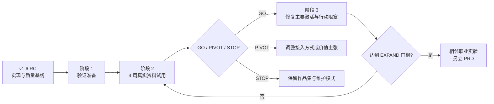

# PM Knowledge Hub 产品路线图

> 对应需求：[PRD v4.0](PRD.md) · 文档版本：v2.0 · 更新日期：2026-08-03 · 状态：有效

路线图描述阶段目标和进入门槛，不把候选能力写成已承诺版本。当前发布事实以[交付状态](../delivery/STATUS.md)为准。

## 1. 当前结论

| 版本/阶段 | 状态 | 结论 |
|---|---|---|
| `v1.5.0` | 最新稳定标签 | 性能与体验优化已发布 |
| `v1.6.0-rc.1` | 远程 `main` 候选版 | 移动端、证据闭环、失败恢复和公开演示门禁通过；尚未正式 Release |
| PRD v4 业务价值验证 | 当前产品阶段 | 先验证外部 PM 用户资料接入、知识定位、行动闭环和自助完成 |
| `v1.7.0` | 未承诺候选 | 旧路线图中的混合检索、SSE、增量同步和多轮面试不再自动进入排期 |

## 2. 阶段路线

## 3. 当前阶段：验证准备（相对 1-2 周）

| 交付 | 目标 | 完成门槛 |
|---|---|---|
| 配置模板/接入页 | 无需改代码接入目录 | 3 种目录异常可恢复 |
| 独立索引策略 | 防止跨试用者混用 | 两套环境交叉抽样为 0 |
| 数据边界说明 | 用户作出知情选择 | 主动调用前确认说明版本 |
| 标准任务与记录 | 可复算 O1-O6 | 不含正文、密钥和绝对路径 |
| 招募与同意 | 真实 PM 资料试用 | 资料使用和删除边界明确 |
| 发布材料清理 | 公开信息可信 | 无个人路径、私人笔记或虚假能力 |

## 4. 4 周业务价值验证

只允许：

- 使用外部 PM 用户的授权脱敏资料完成接入、定位、核验和训练；
- 记录任务用时、结果、模式、行动状态和人工介入；
- 修复阻碍标准任务、隐私或验收的缺陷；
- 做公开演示理解度测试；
- 输出 GO / PIVOT / STOP 建议。

不允许借验证名义加入语音、多轮、自动路径、跨职业、团队空间或平台化能力。

## 5. 条件式候选池

| 候选能力 | 当前状态 | 进入条件 | 优先证据 |
|---|---|---|---|
| 图形化完整导入向导 | 候选 | 配置模板导致主要激活流失 | 前 3 名试用阻塞 |
| 混合检索/RRF | 候选 | 当前检索存在重复召回缺口 | 标准任务失败样本 |
| 流式回答 | 候选 | 等待时间成为主要阻塞 | 任务用时与访谈 |
| 自动增量同步 | 候选 | 手工更新高频且影响任务 | 维护日志 |
| 面试复习行动区 | 本期目标 | 反馈不能被可靠转成行动 | 训练记录 |
| 固定多轮面试 | 候选 | 单轮不能形成有效训练 | 训练完成与复访 |
| 语音训练 | 候选 | 文本使用不足且目标用户列为 Must | 外部访谈/使用 |
| 文本可访问 PDF | 质量候选 | PDF 成为高频交付或辅助技术阻塞 | 导出使用与 a11y 验证 |
| 托管/免安装 | 候选 | 本地安装是主要激活流失 | 接入漏斗 |
| 长期学习记忆/自适应 | 未来目标 | 行为证据显示能改善完成率 | MR-07～09 验证 |
| 第二职业学习包 | 未来目标 | PM 付费与留存达标，且代码可复用 | BRD `EXPAND` |
| 创作者/机构平台 | 未来目标 | 需求侧和供给侧真实交易成立 | BRD `PLATFORM` |

## 6. 发布门禁

任一正式版本必须同时满足：

1. 对应 PRD 的全部当前 P0 验收通过；
2. 前端 lint/build、后端测试和生产依赖审计通过；
3. 桌面与 390×844 核心流程无阻塞；
4. 引用、失败恢复、删除/撤销和数据隔离通过端到端复核；
5. 公开资源无密钥、私人路径和原始笔记；
6. VERSION、README、PRD、Roadmap、STATUS 和实际发布状态一致；
7. 产品负责人明确作出发布决定。

## 7. 需求变更纪律

- 新 P0、数据外发、角色、模式或发布门禁变化必须更新 PRD 后再实现。
- 候选能力没有满足进入条件时，不分配版本号，不写“已承诺”。
- 本地实现、Git 提交、远程分支、tag 和 Release 分别记录；缺少任一项时使用准确状态。
- 历史路线保留在 [CHANGELOG](../delivery/CHANGELOG.md) 和[实施历史](../delivery/IMPLEMENTATION_HISTORY.md)，不在当前路线图重复维护。
