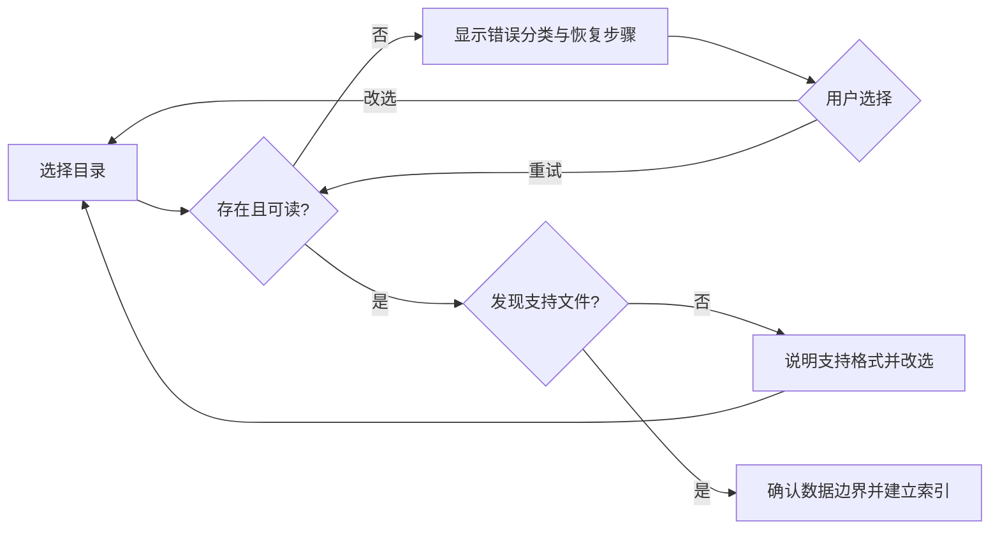

# PM Knowledge Hub 用户旅程与服务蓝图

> 对应需求：[PRD v4.0](PRD.md) · 文档版本：v2.0 · 更新日期：2026-08-03 · 状态：有效

本文按会改变产品行为的角色状态描述旅程。市场人群和长期 Persona 见 [MRD](MRD.md)。

## 1. 角色与核心任务

| 角色 | 进入条件 | 核心任务 | 成功信号 |
|---|---|---|---|
| R-01 首次接入者 | 未配置有效资料或索引 | 安全接入目录并确认数据边界 | 无需改代码完成配置 |
| R-02 证据检索者 | 有明确知识问题 | 找到并核验有效原文 | 在目标时间内打开证据 |
| R-03 训练复盘者 | 开始或恢复练习 | 获取具体反馈并形成复习行动 | 行动被记录和完成 |
| R-04 外部评审者 | 进入公开演示 | 理解价值与能力边界 | 3 分钟内正确复述 |
| R-05 验证记录者 | 开展 4 周验证 | 记录结果与介入点 | 可复核地形成阶段建议 |

## 2. 旅程 A：首次资料接入（P0）

| 阶段 | 1. 选择目录 | 2. 校验资料 | 3. 确认数据边界 | 4. 建立索引 | 5. 进入任务 |
|---|---|---|---|---|---|
| 用户行为 | 浏览或粘贴路径 | 查看笔记数、目录数和索引位置 | 选择仅本地或真实 AI | 等待建立并处理异常 | 进入知识库 |
| 页面/触点 | 接入页 P-07/P-11 | 校验结果 | 隐私确认 P-08 | 成功或恢复 P-09 | 首页/知识库 |
| 关键信息 | 只读所选目录 | 独立索引、不改源文件 | 外发内容与触发条件 | 进度、错误和旧索引状态 | 当前模式 |
| 主要风险 | 路径难懂 | 空目录或权限失败 | 用户未真正知情 | 失败后数据混用 | 模式被遗忘 |
| 机会/要求 | 无需改代码 | 错误分类可执行 | 主动确认说明版本 | 保留路径、可重试 | 持续模式标识 |
| 成功指标 | 路径选择完成 | 校验成功率 | 说明确认率 | 索引成功率/恢复率 | 首次闭环开始 |

### 异常恢复

## 3. 旅程 B：面试前快速知识定位（P0）

| 阶段 | 1. 明确问题 | 2. 搜索/提问 | 3. 查看结果 | 4. 核验来源 | 5. 回到原文 |
|---|---|---|---|---|---|
| 用户行为 | 输入主题 | 选择搜索或问答 | 阅读匹配或回答 | 打开编号引用与摘录 | 在页面或 Obsidian 阅读 |
| 页面/触点 | 首页/知识库/助手 | 搜索框/输入框 | 结果列表/回答 | 来源卡 | 完整预览/Obsidian |
| 关键提示 | 当前目录与模式 | 加载、可取消/重试 | 相关性与证据范围 | 证据不足不伪造 | 原始路径 |
| 主要风险 | 查询过宽 | 服务失败 | 结果不相关 | 引用错配 | 打开失败 |
| 恢复 | 提供示例 | 保留输入重试 | 改写或切换模式 | 明示证据不足 | 就地错误与重试 |
| 成功指标 | 有效任务开始 | 有反馈 | 选择结果 | 引用追溯通过 | 定位用时和成功率 |

## 4. 旅程 C：文本面试与复盘（P0）

| 阶段 | 1. 开始练习 | 2. 作答 | 3. 查看反馈 | 4. 形成行动 | 5. 返回知识 |
|---|---|---|---|---|---|
| 用户行为 | 获取一道问题 | 输入并提交 | 阅读 STAR 四维反馈 | 编辑并保存复习行动 | 打开来源或重新搜索 |
| 页面/触点 | 面试开始页 | 输入区 | 评分与建议区 | 行动区（待补） | 知识库/助手 |
| 关键提示 | 真实/降级 | 提交状态 | 评分不是招聘结论 | 可编辑、可完成 | 关联主题 |
| 主要风险 | 难度不合适 | 重复提交/丢失 | 反馈空泛 | 行动未记录 | 推荐无关 |
| 恢复 | 再练一道 | 保留回答重试 | 降级并说明 | 手工记录优先 | 用户主动选择来源 |
| 成功指标 | 训练开始 | 有效回答 | 反馈查看 | 行动保存/完成 | 复习动作发生 |

本期不承诺固定三轮、语音、自动难度、自动学习计划或基于得分重排路径。

## 5. 旅程 D：公开演示理解（P0）

| 阶段 | 1. 进入公开站 | 2. 理解定位 | 3. 体验流程 | 4. 核对边界 | 5. 完成复述 |
|---|---|---|---|---|---|
| 用户行为 | 无需登录进入 | 阅读目标用户和问题 | 操作脱敏数据 | 查看 About/模式标识 | 回答四个理解问题 |
| 关键提示 | 公开演示 | PM/AI PM 滩头 | 无真实 AI | 本地版与演示版差异 | 不诱导答案 |
| 风险 | 路由失败 | 价值不清 | 误以为真实能力 | 隐私边界隐藏 | 项目所有者提示过多 |
| 恢复 | 品牌化 404 | 首页结构化说明 | 每页模式标签 | About 一致 | 独立限时任务 |
| 成功指标 | 核心页可达 | 价值理解 | 任务完成 | 边界理解 | 4/5 评审者正确复述 |

## 6. 服务蓝图

| 用户动作 | 前台行为 | 后台/本地行为 | 证据 | 失败补偿 |
|---|---|---|---|---|
| 选择目录 | 显示路径与校验 | 只读扫描支持文件 | 笔记/目录数 | 错误分类、改选/重试 |
| 提交搜索 | 显示加载与结果 | 查询独立本地索引 | 匹配内容 | 保留查询、重试 |
| 提交问答 | 显示模式、回答与来源 | 检索；可选调用外部模型 | 来源卡/摘录 | Mock/错误状态 |
| 提交面试回答 | 显示反馈 | 可选模型评估 | STAR 反馈 | 保留回答、降级 |
| 保存复习行动 | 显示行动状态 | 本地保存最小记录 | 行动状态 | 未保存提示 |
| 导出验证记录 | 显示导出状态 | 汇总去正文指标 | CSV/人工复核 | 缺失字段标记 |

## 7. 旅程验证问题

1. 前 3 名外部用户能否仅凭说明完成目录接入？
2. 隐私确认是否让用户正确理解“原始笔记不外发”和“必要片段可能外发”的区别？
3. 知识定位是否比用户原流程更快，且引用追溯不下降？
4. STAR 反馈是否实际产生后续复习行动？
5. 评审者能否在无人解释时理解公开演示边界？
6. 人工介入集中在哪一步，是否值得产品化解决？
