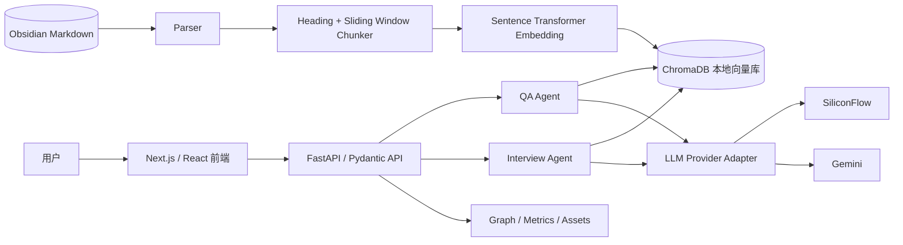
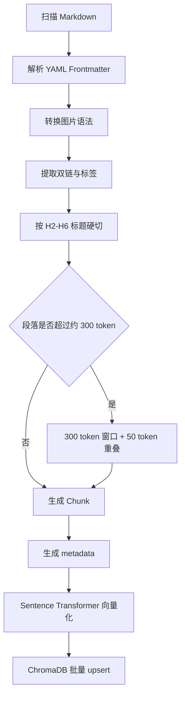
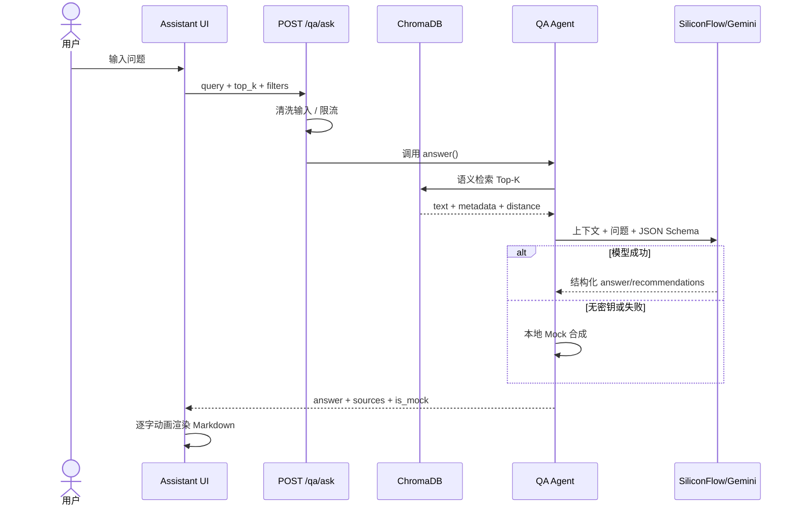
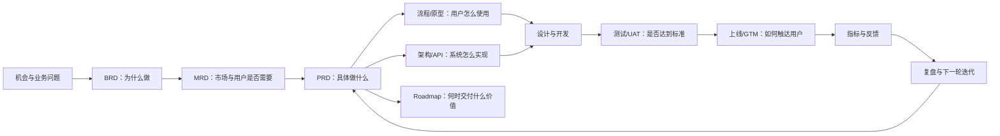

    # PM Knowledge Hub｜简历与面试总手册

> 用途：产品经理、AI 产品经理、B 端/平台产品、产品运营及业务支持岗位的简历投递、网申项目说明与面试准备。  
> 项目角色：产品负责人（个人项目，AI 辅助开发）  
> 项目周期：2026.06—2026.07  
> 当前版本：`v1.6.0-rc.1`；最新正式稳定标签：`v1.5.0`  
> 在线体验：[pm-knowledge-hub-demo.tongqtang.chatgpt.site](https://pm-knowledge-hub-demo.tongqtang.chatgpt.site)

---

## 1. 使用方法

1. 一页简历：通用产品经理优先使用第 3.1 节固定 4 条主投版；篇幅紧张时使用三点精简版。
2. 网申项目说明：使用第 4 节“项目完整介绍”和第 5 节“产品全流程”。
3. AI 产品面试：重点准备第 6–9 节的架构、原理、实现边界与技术细节。
4. 面试前复习：先背第 11 节口述稿，再按第 12 节问题库自测。
5. 所有表述以第 10 节“已实现与规划边界”为准，不把 Roadmap 写成上线结果。
6. 产品基础面试：重点复习第 16 节，掌握每种方法的定义、步骤、本项目实践与不足。

---

## 目录

1. [项目速览](#2-项目速览)
2. [按岗位 JD 选择的简历版本](#3-按岗位-jd-选择的简历版本)
3. [项目完整介绍](#4-项目完整介绍)
4. [产品经理完整实现流程](#5-产品经理完整实现流程)
5. [技术架构与数据流](#6-技术架构与数据流)
6. [核心理论与当前实现](#7-核心理论与当前实现)
7. [关键数据结构与 API](#8-关键数据结构与-api)
8. [指标、测试与发布](#9-指标测试与发布)
9. [已实现与规划边界](#10-已实现与规划边界)
10. [面试口述稿](#11-面试口述稿)
11. [面试官高频问题与回答框架](#12-面试官高频问题与回答框架)
12. [投递与面试禁区](#13-投递与面试禁区)
13. [证据索引](#14-证据索引)
14. [JD 调研来源](#15-jd-调研来源)
15. [产品经理理论知识与项目实践](#16-产品经理理论知识与项目实践)

---

## 2. 项目速览

### 2.1 一句话介绍

> 面向使用 Obsidian/Markdown 管理知识的产品经理学习与求职人群，针对个人资料难调用、AI 回答难核验、训练反馈难沉淀等问题，设计并上线覆盖知识发现、来源核验、面试训练和学习复盘的 AI 知识工作台。

### 2.2 三句话介绍

> PM Knowledge Hub 面向使用 Obsidian/Markdown 管理知识、正在准备产品经理面试的学习者，解决个人资料难调用、AI 回答难核验和训练反馈难沉淀的问题。产品将 204 篇 Markdown 笔记构建为 2579 个本地知识分片，提供语义检索、证据型 RAG 问答、STAR 模拟面试、知识图谱和本地会话管理。项目完成了从问题定义、需求规划和交互设计，到 AI 辅助开发、验收及公开体验版上线的 0→1 产品设计与交付；外部真人需求、留存和付费仍待验证。

### 2.3 可核验数据

| 指标 | 当前事实 | 证明位置 |
|---|---:|---|
| 原始知识笔记 | 204 篇 | `/api/v1/health`、验收报告 |
| 当前知识分片 | 2579 个 | ChromaDB collection、健康检查 |
| 一级知识章节 | 13 个 | 知识库与学习地图 |
| 后端自动化测试 | 53 项通过 | 2026-07-24 Web 测试报告、2026-07-28 本地复验 |
| 系统验收案例 | 27 个 | Phase 1–8 的 23 个 + Phase 9 的 4 个 |
| 前端生产路由 | 7 条 | `/`、`/design`、`/knowledge`、`/assistant`、`/interview`、`/map`、`/about` |
| 版本跨度 | v0.1 → v1.6 RC | CHANGELOG、TASKS、Roadmap |

### 2.4 技术栈

- 产品方法：BRD、MRD、PRD、核心用例、用户旅程、需求状态与验收条件、Roadmap、指标体系、Backlog、验收门禁、3 类 AI 模拟用户走查（C 类证据）。
- 后端：Python、FastAPI、Pydantic、ChromaDB、Sentence-Transformers、SiliconFlow/Gemini、pytest、slowapi。
- 前端：Next.js 16、React 19、TypeScript、React Markdown、TanStack Virtual、react-force-graph-2d、jsPDF。
- 工程与交付：Git/GitHub、版本管理、Codex Sites、响应式与无障碍验收。

---

## 3. 按岗位 JD 选择的简历版本

### 3.1 通用产品经理

项目名称：PM Knowledge Hub｜AI 产品经理本地知识工作台  
项目角色：产品负责人（个人项目，AI 辅助开发）｜2026.06—2026.07  
项目形态：本地完整版＋无后端/无真实 AI 的公开体验版  
作品链接：[在线体验](https://pm-knowledge-hub-demo.tongqtang.chatgpt.site)｜[GitHub 仓库](https://github.com/tangtongqing/pm-knowledge-hub)

项目介绍：面向使用 Obsidian/Markdown 管理知识的产品经理学习与求职人群，针对资料难调用、AI 回答难核验、训练反馈难沉淀等问题，设计并上线集知识检索、来源核验、面试训练和学习复盘于一体的 AI 知识工作台。

#### 主投版（固定 4 条）

- 用户研究与问题定义｜基于本人管理的 204 篇 Obsidian 笔记，分析来源型 AI、通用大模型、笔记与面试工具 4 类替代方案，并开展 3 类 AI 模拟访谈（非真人），识别跨章节检索、事实核验、工具切换和配置门槛等问题，明确目标用户、核心场景和任务链路。
- 需求分析与产品规划｜围绕“降低知识调用和事实核验成本”形成 5 个核心用例及 40 项功能与质量需求；综合用户价值、任务频率和实现成本确定 MVP 范围，将产品从通用知识库收敛为产品经理求职知识工作台，规划“资料导入—知识检索—来源核验—模拟作答—复盘”的主链路。
- 产品方案与交互设计｜完成 7 个产品页面的信息架构、核心流程、状态规则和 PRD；设计双模式检索、引用与原文联动、模型降级及会话恢复等机制，保障回答可核验、数据边界清晰和异常可恢复。
- 项目推进与上线交付｜拆解产品方案并推进 v0.1 至 v1.6 RC 共 9 轮迭代，完成需求验收与核心流程联调，推动知识库、AI 助手、模拟面试、学习地图等模块上线公开体验版，沉淀 7 份核心 PM 文档、产品案例和演示材料。

#### 三点精简版

- 用户研究与产品规划｜基于 204 篇个人知识资产、4 类替代方案和 3 类 AI 模拟访谈（非真人），识别资料调用、事实核验和配置门槛等问题，形成 5 个核心用例及 40 项功能与质量需求，确定 MVP 范围。
- 产品方案与交互设计｜完成 7 个产品页面的信息架构与核心流程，设计双模式检索、引用与原文联动、模型降级和会话恢复等机制。
- 项目推进与上线交付｜推进 v0.1 至 v1.6 RC 共 9 轮迭代，完成需求验收与核心流程联调，上线公开体验版并沉淀 7 份核心 PM 文档、产品案例和演示材料。

#### 通用产品经理关键词映射

| JD 关键词 | 项目真实证据 | 建议位置 |
|---|---|---|
| 用户研究、需求洞察 | 个人高频场景、公开竞品研究、在线社区公开讨论分析、3 类 AI 模拟访谈；无直接真人样本 | 第 1 条，并明确“模拟/C 类” |
| 竞品分析、产品定位 | MRD 对来源型 AI、笔记工具、面试工具和传统搜索的比较 | 第 1 条 |
| 需求分析、PRD、版本规划 | BRD/MRD/PRD、核心用例、需求状态、验收条件、Roadmap | 第 2 条 |
| 优先级、范围管理 | 按核心任务、用户价值、可信度影响与成本分期；保留明确延期项 | 第 2 条 |
| 原型、交互、信息架构 | 7 路由可运行产品、核心流程、异常状态、响应式和可访问性设计 | 第 3 条；不虚构独立 Figma 原型 |
| 项目管理、产品上线、版本迭代 | TASK-001—034、Backlog、CHANGELOG、发布门禁、公开体验版 | 第 4 条 |
| 数据分析、指标体系 | 系统运行指标已落地；任务成功率、留存、转化与收入尚无 | 面试展开；主简历不写增长结果 |
| 跨部门协作、团队管理 | 无真人团队证据，项目使用 AI 辅助开发和评审 | 明确为缺口，不写入 |

**适配关键词**：问题定义、竞品分析、需求分析、产品规划、PRD、交互设计、项目推进、验收、版本迭代、产品上线。

### 3.2 AI 产品经理

- **AI 场景定义**：从个人知识管理和求职训练场景切入，将需求拆解为知识召回、可追溯问答、STAR 评估和学习路径四类任务，完成产品目标、AI 能力边界、异常降级及版本路线设计。
- **RAG 产品方案**：基于 ChromaDB 将 204 篇笔记索引为 2579 个分片，落地语义检索、独立关键词检索、Top-K 上下文注入及“引用编号—原文摘录—Obsidian 回跳”证据链，提升回答可核验性。
- **模型与结构化输出**：抽象 SiliconFlow/Gemini 供应商适配层，通过 Pydantic Schema 约束问答、推荐问题和 STAR 评分结构；无密钥或请求失败时自动切换本地 Mock，保证核心流程可演示。
- **安全与成本判断**：限制输入长度、过滤控制字符和常见提示注入，设置问答/面试接口 10 次/分钟限流；区分本地真实 AI 与线上无密钥体验版，避免泄露笔记和产生公开站点模型费用。
- **交付验证**：完成 Next.js—FastAPI—ChromaDB—模型服务全链路，以 53 项后端测试、27 个系统案例和七条前端路由验证；将 BM25/RRF、SSE 和三轮面试状态机作为下一阶段能力而非虚构成果。

**适配关键词**：LLM、RAG、Agent、Prompt、模型能力边界、技术可行性、API、结构化输出、数据隐私、降级策略、AI 场景落地。

### 3.3 B 端/平台产品经理

- **业务抽象**：把不同目录、Markdown 语法、双链、标签、图片与本地路径统一为标准化知识数据模型，形成笔记解析、切片、索引、检索和展示的平台链路。
- **平台能力设计**：规划健康检查、语义/关键词/目录检索、问答、面试、图谱、指标和受限图片资源等 API，通过 Pydantic 统一请求响应结构，降低前后端协作歧义。
- **权限与数据边界**：采用本地 ChromaDB 和本地会话存储，模型调用仅发送用户主动提问与 Top-K 召回片段；图片接口限制根目录和扩展名，密钥仅存放于被 Git 忽略的 `.env`。
- **稳定性与运维**：设计后端离线提示、模型失败 Mock、接口限流、健康状态、运行指标与重试路径，并通过发布门禁区分“代码完成、远端同步、tag、Release”等交付状态。
- **实施交付**：沉淀架构图、API 合约、部署说明、验收清单和版本记录，上线独立演示环境，具备方案说明、培训演示和后续私有部署的基础。

**适配关键词**：业务流程、平台产品、需求管理、API、系统架构、数据模型、权限/安全、实施交付、稳定性、跨系统协同。

### 3.4 产品运营

- **用户与产品定位**：面向产品经理学习和求职人群，拆解知识检索、AI 问答及面试训练场景，形成价值主张、使用路径、功能说明和数据安全说明，降低首次理解成本。
- **指标体系**：设计有效召回率、引用点击率、重试率、面试完成率和 STAR 得分成长率等指标；实现索引容量、累计问答/面试次数及真实/演示模型占比看板，为后续运营分析建立数据基础。
- **反馈与体验闭环**：基于多轮产品评审、异常反馈和浏览器验收建立 Backlog，按 P1/P2/P3 推进移动端、错误恢复、证据原文、会话撤销、可访问性和性能优化。
- **内容与发布运营**：完成客户营销页、产品能力、使用场景、部署服务、规划价格、FAQ、联系入口和一分钟演示脚本，上线无需登录的公开体验站点。
- **增长验证规划**：明确当前尚无真实 DAU、留存、转化或收入数据；下一步通过公开站点招募目标用户，验证首次核心任务完成率、7 日回访、预约转化与价格接受度。

**适配关键词**：用户运营、产品运营、指标看板、反馈闭环、内容运营、活动/发布、转化漏斗、留存、数据驱动迭代。

### 3.5 业务支持/项目支持

- **流程机制建设**：建立 TASK 编号、阶段计划、优先级、完成定义、验收门禁和版本记录，形成从需求进入、方案评审、开发跟进到发布归档的闭环流程。
- **信息与文档管理**：维护 BRD/MRD/PRD、架构、指标、Roadmap、Backlog、进度和验收文档，统一版本事实，减少需求、实现和发布说明之间的信息偏差。
- **重点项目推进**：围绕证据链、移动适配、错误恢复和性能等重点问题进行拆解、排序、跟进与复验，推动 v1.6 RC 门禁通过。
- **AI 工具应用**：将 AI 用于需求梳理、方案对比、文档处理、测试分析和代码辅助，同时通过结构化输出、人工验收和证据回溯控制结果质量。
- **交付结果**：完成 53 项后端测试、27 个系统验收案例、远程 GitHub 存档和公开体验站点，形成可复用的项目资料与演示资产。

**适配关键词**：流程优化、项目管理、进度跟进、文档管理、数据整理、风险跟踪、跨角色协同、AI 提效、闭环管理。

---

## 4. 项目完整介绍

### 4.1 背景与问题

个人在学习产品经理知识时积累了 204 篇 Obsidian 笔记，分布于 13 个主题目录。原有方式存在四个问题：

1. 关键词必须准确，难以召回跨章节或表达不同但语义相近的知识。
2. 通用大模型可以生成答案，但不一定基于个人笔记，结论缺少证据。
3. 静态笔记无法形成“提问—练习—评价—复习”的学习闭环。
4. 原始笔记包含个人知识资产，不适合默认上传到云端数据库。

### 4.2 用户与核心任务

- 核心用户：准备产品经理、AI 产品经理面试，并使用 Markdown/Obsidian 管理知识的人。
- 核心任务一：用自然语言找到曾经记录但记不清位置的知识。
- 核心任务二：基于个人笔记获得答案，并能回到原文核验。
- 核心任务三：练习产品面试题，获得 STAR 结构反馈和参考答案。
- 核心任务四：从目录和关联图谱理解完整知识结构。

### 4.3 竞品与差异化

| 方案 | 优势 | 主要不足 | 本项目选择 |
|---|---|---|---|
| ChatGPT/Claude 上传文档 | 使用门槛低、模型能力强 | 个人知识管理连续性与本地跳转弱 | 保留模型生成能力，增加本地索引和证据链 |
| Notion AI | 文档与 AI 一体化 | 对 Obsidian/本地 Markdown 迁移成本高 | 直接读取原有 Markdown 目录 |
| 开源 RAG Demo | 技术可控 | 通常缺少完整交互、面试场景和交付材料 | 补齐可运行产品、客户页面和验收证据 |
| 传统全文搜索 | 快、可解释 | 依赖精确词，语义泛化弱 | 同时提供语义与关键词入口 |

### 4.4 产品价值主张

> 让用户继续使用已有的 Markdown/Obsidian 知识体系，在需要做方案、复盘或准备面试时，通过检索、提问和练习快速调用知识，并让每个关键结论都能回到原文。

### 4.5 产品模块

1. 知识库：章节浏览、全文预览、语义检索、关键词高亮。
2. AI 助手：RAG 问答、引用来源、延伸问题、会话历史、重试和复制。
3. 模拟面试：动态/静态出题、STAR 四维评估、参考答案、追问和 PDF 导出。
4. 学习地图：章节/笔记两级力导向图、过滤、聚焦、关联高亮和 Obsidian 跳转。
5. 工作台与指标：健康状态、笔记/分片数量、查询量及真实/演示模型比例。
6. 产品营销：功能、场景、安全、服务、规划价格、FAQ 和联系入口。

### 4.6 商业化假设

- 开源本地版：免费，满足个人检索和基础问答。
- 个人 Pro：规划价格 ¥39/月，候选能力包括自动同步、完整面试流程和增强配置。
- 团队私有部署：按知识迁移、权限、模型和集成范围定制。
- 当前状态：只验证方案和预约需求，尚未产生真实付费收入。

---

## 5. 产品经理完整实现流程

### 阶段 1：机会识别

- 从自身学习流程观察问题，形成问题陈述和用户任务。
- 判断问题是否值得产品化：频率高、内容规模持续增长、通用搜索解决不完整。
- 输出：[BRD](../product/BRD.md)。

### 阶段 2：市场与竞品

- 从检索、个性化、证据、隐私、部署和展示体验比较替代方案。
- 得出差异化方向：本地优先 + 垂直 PM 场景 + 证据回跳 + 面试训练。
- 输出：[MRD](../product/MRD.md)。

### 阶段 3：需求定义

- 用核心用例描述触发场景、用户目标、成功结果和关联需求。
- 绘制用户旅程，识别查找、理解、练习和复盘中的机会点。
- 定义主流程、异常流程、输入限制、数据结构和验收标准。
- 输出：[PRD](../product/PRD.md)、[用户旅程](../product/USER_JOURNEY.md)。

### 阶段 4：优先级与范围

- 在 MRD/PRD 中记录 Must/Should/Could、当前状态和验收条件。
- 结合核心任务、用户价值、可信度影响和实现成本进行范围判断；由于缺少真实 Reach 数据，不宣称完成了可复核的 RICE 量化评分。
- 先完成可演示的核心闭环，再补体验、性能和发布可信度。
- 时间受限时，将 BM25/RRF、SSE、增量同步和三轮面试状态机延期至 v1.7，并保留明确门禁。

### 阶段 5：方案与架构

- 将产品拆成前端展示层、API/Agent 层、本地检索层、知识存储层和外部模型层。
- 决定 ChromaDB 本地持久化，避免个人笔记进入云端向量库。
- 通过供应商适配层隔离 SiliconFlow/Gemini 差异。
- 输出：[架构文档](../architecture/README.md)。

### 阶段 6：设计与交互

- 完成工作台、知识库、问答、面试、地图和关于页的信息架构。
- 设计加载、空、错误、离线、Mock 和恢复状态。
- 支持响应式、键盘路径、`aria-live`、`prefers-reduced-motion` 等可访问性能力。
- 依据产品设计评审维护 [Backlog](../design/BACKLOG.md)。

### 阶段 7：项目推进

- 用 TASK-001—034 拆分产品文档、引擎、前端、联调、体验和发布任务。
- 每项任务记录状态、时间、依赖和验收结论。
- 用 CHANGELOG、VERSION、远端 main、tag 和 Release 分别记录发布事实。
- 先关闭 P1 发布问题，再进入下一阶段 P0 引擎升级。

### 阶段 8：测试与验收

- 后端：parser、chunker、vectorizer、provider、路由和异常测试。
- 前端：lint、production build、真实浏览器路径、桌面/移动视口和可访问性检查。
- 业务：检索结果、完整文档、真实模型、STAR 反馈、图谱、引用、图片和恢复路径。
- 当前结果：53 项 pytest、27 个系统案例、七条生产路由通过。

### 阶段 9：上线与运营

- 本地完整版保留真实知识库与可选模型调用。
- 公开版使用脱敏浏览器数据，不部署后端、原始笔记或模型密钥。
- 营销页提供价值、能力、场景、安全、价格、FAQ 和联系入口。
- 运行指标先监控系统使用，真实用户增长指标留待用户招募后验证。

### 阶段 10：复盘与迭代

- v1.2：无障碍与核心体验。
- v1.3：会话历史、面试 PDF、关键词高亮。
- v1.4：错误修复与细节优化。
- v1.5：虚拟列表、消息 Memo、图谱性能。
- v1.6 RC：移动端、证据链、图片、错误恢复和发布可信度。
- v1.7：混合检索、真实 SSE、增量同步和完整面试状态机。

---

## 6. 技术架构与数据流

### 6.1 总体架构



### 6.2 知识入库流程



实现文件：

- [parser.py](../../backend/ingest/parser.py)：Frontmatter、双链、图片、标签、标题和 Obsidian URI。
- [chunker.py](../../backend/ingest/chunker.py)：标题硬切 + 句子边界滑动窗口。
- [vectorizer.py](../../backend/ingest/vectorizer.py)：Embedding、ChromaDB 持久化、upsert 与检索。

### 6.3 RAG 问答流程



### 6.4 模拟面试流程（核心逻辑：真实依据与异常兜底）

该模块旨在解决如何保证 AI 出题不脱离个人知识库，且在各种异常情况下保证可用性：

1. **随机查询触发**：从“产品经理、需求分析、北极星指标”等预设核心种子词中随机选择查询词作为起点。
2. **基于真实笔记召回**：拿着种子词去本地 ChromaDB 召回 5 个相关片段（支持用户手动指定章节过滤）。**产品价值**：保证 AI 随后的出题是基于用户真实学过的笔记内容，而非大模型凭空捏造。
3. **动态场景生成**：只要配置了大模型，就从中随机挑选一条材料，指令 AI 生成一道真实的场景型面试题及主题标签。
4. **无网/无密钥兜底机制 (Mock)**：如果用户未配置 API 密钥或召回失败，系统不会卡死，而是自动从内置的 5 道经典静态题库中随机出题。**产品价值**：体现了对边缘场景（Edge Case）的防错与降级设计。
5. **结构化输出约束 (Pydantic Schema)**：用户回答后，为了保证前端雷达图和评分卡片能稳定渲染，后端强制使用 Pydantic Schema 命令 AI 必须以严格的 JSON 格式返回：总分、综合评价、STAR 四维反馈、参考答案和追问。
6. **评估失败保护与重试**：如果 AI 评估超时或报错，系统会返回一个友好的静态 Mock 评价。**更重要的是，系统会保留用户的输入草稿并提供重试按钮**。**产品价值**：极致保护用户的心智成本，防止因系统错误导致用户大段文字输入丢失。

实现文件：[interview_agent.py](../../backend/agents/interview_agent.py)。

### 6.5 知识图谱流程（核心逻辑：图谱降噪与性能优化）

该模块旨在将离散的 Markdown 笔记转化为可视化的知识网络，重点解决了图谱杂乱不可读和渲染卡顿的问题：

- **读取骨架顺序**：从 `学习路线总览.md` 中解析双链（Wikilink），以此作为知识架构的正向顺序骨架。
- **防止死链 (Ghost Nodes)**：将解析出的链接与 ChromaDB 中实际存在的 `source_path` 严格取交集。**产品价值**：避免在图谱上展示出用户写了规划但还没实际入库的“空笔记”，防止点击报错。
- **主干与分支构建**：
  - 章节层：形成 13 个大聚合节点，按学习顺序建立高权重（粗）主干边。
  - 笔记层：建立章内笔记顺序连线、跨章首尾连线，以及基于标题相似度的关键词关联线。
- **信息过载截断 (图谱降噪)**：关键词关联只连接每组前 15 对相邻笔记。**产品价值**：防止高频词（如“产品”）让图谱变成一团密集的、不可读的“蜘蛛网”，有效降低认知负荷。
- **物理引擎优化 (防 CPU 卡死)**：前端使用 `react-force-graph-2d` 渲染，特意配置了 `cooldownTicks=100` 与 `d3AlphaDecay=0.05`。**产品价值**：图谱物理引力会在短时间内迅速衰减并静止，避免无休止的计算将用户的电脑 CPU 跑满，极大优化了设备性能体验。

实现文件：[graph.py](../../backend/api/routes/graph.py)、[map/page.tsx](../../frontend/src/app/map/page.tsx)。

---

## 7. 核心理论与当前实现

### 7.1 RAG 是什么

RAG（Retrieval-Augmented Generation）把“检索”和“生成”连接起来：先从可信知识库取回相关片段，再把片段作为上下文交给大模型。它的价值不是保证零幻觉，而是缩小模型可用信息范围，并提供可核验来源。

本项目对应：

1. Retrieval：ChromaDB 语义检索 Top-K。
2. Augmentation：把标题、章节和片段编号拼成参考上下文。
3. Generation：模型按 Schema 输出回答和延伸问题。
4. Grounding：回答中的 `[n]` 映射到来源卡与原文摘录。

### 7.2 Embedding 与语义检索

- Embedding 将文本映射为高维向量，语义相近的文本在向量空间中距离更近。
- 项目使用 `paraphrase-multilingual-MiniLM-L12-v2`，支持中英文混排，本地下载后可离线运行。
- ChromaDB 返回 `distance`，前端和 API 统一解释为“越小越相似”。当前 collection 没有显式配置距离度量，因此面试时不要武断宣称使用了自定义余弦参数。

### 7.3 为什么要切片

- 整篇文档过长会带来噪声、Token 成本和召回粒度问题。
- 只按固定长度切会破坏章节结构。
- 项目先按 H2–H6 标题硬切，再对超长段落按句子边界做滑动窗口软切。
- 当前参数：约 300 token 上限、50 token 重叠；token 数使用“字符数 ÷ 1.5”粗估，不等同于真实 tokenizer。

### 7.4 关键词与语义检索的区别

| 方式 | 优势 | 局限 | 当前实现 |
|---|---|---|---|
| 语义检索 | 能理解近义表达和自然语言问题 | 专有词可能不稳定 | ChromaDB `query_texts` |
| 关键词检索 | PRD、AARRR 等精确词可靠 | 不理解同义表达 | ChromaDB `where_document $contains` |
| BM25 + RRF | 可融合精确词与语义排名 | 增加索引、排序和评估复杂度 | **规划于 v1.7，当前未实现** |

虽然依赖中存在 `rank-bm25`，但业务代码尚未接入 BM25/RRF；面试时必须以代码事实为准。

### 7.5 Prompt 与结构化输出（JSON 表格约束）

- System Instruction 规定角色、事实边界、回答长度、格式和引用规则。
- 模型输出使用 Pydantic Schema 强制规范为 JSON 格式；Gemini 使用 `response_schema`，SiliconFlow 使用 JSON Schema + `json_object`。
- **具体的 JSON 数据契约示例（以模拟面试模块为例）**：
  ```json
  {
    "score": 85, // 强制为 0-100 的整数
    "evaluation": "综合结论...", // 强制为字符串，且在后端限定了 max_length=1200
    "star_feedback": { // 嵌套对象，拆解 STAR
      "situation": "场景描述...", // 强制字符串，最大长度 400
      "task": "任务目标...", 
      "action": "具体行动...", 
      "result": "量化结果..."
    },
    "suggested_answer": "参考答案...", 
    "next_question": "追问：如果..." 
  }
  ```
  *产品视角解释：这段格式硬性规定就是大模型必须填写的“答题卡”。不管大模型想说什么，它都必须把内容塞进这几个格子里。*
- 返回数据再次通过 `model_validate` 校验，一旦大模型未能按上述格式返回（比如漏了 `score` 字段，或者把 `score` 写成了中文字符串），后端即刻抛出异常拦截并降级为本地兜底模板，绝不允许坏数据进入前端导致白屏崩溃。
- 温度：问答 `0.3`，STAR 评估 `0.4`，动态出题 `0.7`；低温用于稳定，高温用于题目多样性。

### 7.6 STAR 面试理论

- S（Situation）：是否说明背景、限制和冲突。
- T（Task）：是否明确目标、职责和指标。
- A（Action）：是否展示关键判断、拆解、协同和执行。
- R（Result）：是否有可量化结果、复盘和后续影响。

项目将四维反馈、总分、综合结论、参考答案和追问固化为结构化 Schema，便于前端稳定渲染和 PDF 导出。

### 7.7 客户端逐字输出与真实流式输出

- 当前实现：后端先返回完整 JSON，前端 `TypewriterMarkdown` 再按字符逐步展示。
- 停顿规则：普通字符约 14ms，逗号/换行约 38ms，句号/问号约 90ms；长文本逐步加速。
- 可访问性：检测 `prefers-reduced-motion`，用户减少动画时直接展示全文。
- 当前不是 SSE：网络等待期间仍需等完整响应，无法降低首包时间。
- v1.7 计划：后端 `text/event-stream`、首包/结束事件、断线与超时恢复。

### 7.8 前端性能方法

- 知识列表：TanStack Virtual，估算行高 80px，`overscan=3`，只渲染可视区附近节点。
- 消息列表：`React.memo` 隔离历史消息，`useCallback` 稳定复制与动画回调。
- 图谱：限制仿真 tick、加速 alpha 衰减，节点过多时建议章节聚合。
- 会话：localStorage 最多保存 50 条，捕获容量异常并优雅放弃保存。
- 面试报告：Canvas 绘制中文内容后通过 jsPDF 分页导出，避免直接嵌入大体积中文字库。

### 7.9 安全与隐私

- 用户输入最大 2000 字，过滤 ASCII 控制字符和常见提示注入标记。
- QA、出题和评估接口按 IP 限制为 10 次/分钟。
- API Key 仅存在本地 `.env`，Git 忽略；供应商适配层不打印密钥。
- 原始笔记、ChromaDB 和会话历史保存在本地。
- 仅主动调用真实 AI 时发送问题与召回片段，不发送整库。
- 图片接口只允许 `_images` 根目录内的白名单扩展名，并校验解析后的父路径，防止路径穿越。

---

## 8. 关键数据结构与 API

### 8.1 Chunk 元数据

| 字段 | 作用 |
|---|---|
| `chunk_id` | `<source_path>_chunk<N>`，支持幂等 upsert |
| `text` | 实际向量化和召回的片段文本 |
| `source_path` | 原始笔记相对路径 |
| `title/chapter/section` | 展示和过滤维度 |
| `tags` | 标签字符串 |
| `obsidian_uri` | 回到本地原文 |
| `chunk_index/token_count` | 切片顺序与长度信息 |

### 8.2 主要 API

| 方法 | 路径 | 作用 |
|---|---|---|
| GET | `/api/v1/health` | 版本、笔记数、分片数、Embedding 模型 |
| GET | `/api/v1/search/semantic` | 语义检索，支持 top_k/章节/标签 |
| GET | `/api/v1/search/keyword` | 关键词包含检索 |
| GET | `/api/v1/search/documents` | 全量/分章笔记浏览 |
| POST | `/api/v1/qa/ask` | RAG 问答与证据来源 |
| POST | `/api/v1/interview/start` | 动态或静态出题 |
| POST | `/api/v1/interview/evaluate` | STAR 结构化评估 |
| GET | `/api/v1/graph` | 章节/笔记图谱 |
| GET | `/api/v1/metrics` | 查询量与模型模式指标 |
| GET | `/api/v1/assets/{filename}` | 受限笔记图片资源 |

---

## 9. 指标、测试与发布

### 9.1 指标体系设计与埋点落地

**北极星指标候选：单次会话有效召回率**，关注用户是否在一次知识任务中获得匹配且无需频繁重试的来源。
- **计算逻辑**：(发生点击引用或复制行为的会话数) / (总搜索会话数)。指标越高，代表 RAG 核心意图理解越准。

- **检索质量**：有效召回、引用点击、重试率、响应时间。
  - **有效召回与引用点击**：前端监听用户点击回答中的 `[1]` 溯源标签或“一键复制”行为。若引用点击率极低，则说明溯源防幻觉功能可能是伪需求。
  - **重试率（反向指标）**：同一 Session 内，30 秒内连续发起文本距离相近的提问且未发生互动，记为 1 次“重试”。重试率高说明首次检索不准。
  - **响应时间**：前端计算 `收到完整JSON时间戳 - 发送请求时间戳`，监控 P90 耗时。

- **面试价值**：完成率、STAR 得分成长率、平均答题字数。
  - **面试漏斗完成率**：定义漏斗从事件A（生成题目）到事件B（提交回答）。B 的流失率畸高代表 UI 输入压力大或出题太难。
  - **STAR 得分成长率**：规划建立用户体系及 `interview_records` 表，拉取同一用户“近期 3 次面试均分”对比“首次均分”。如果大盘均分显著上涨，即可作为产品跑通 PMF 的核心护城河证据。
  - **平均答题字数**：前端在提交瞬间计算 `length(输入框文本)`，字数过低说明用户仅作为搜索引擎使用，未建立“认真作答”的心智。

- **系统运行**：collection_count、total_queries、live_queries、mock_queries。
  - 由于是轻量级个人项目，主要指标在 **后端（FastAPI）利用计数器实时落地**。
  - **collection_count**：动态调用 ChromaDB 的 `count()` 方法，监控入库笔记切片规模。
  - **查询状态漏斗**：在 `interview_agent.py` 埋入计数器。每次收到提问 `total_queries +1`；真实大模型调用成功 `live_queries +1`；若触发本地静态数据兜底则 `mock_queries +1`。能直观监控外部 API 稳定性与系统降级率。

- **商业验证**：首次核心任务完成率、7 日回访、Pro 预约转化、价格接受度。
  - 规划通过前端打点追踪“首次核心任务完成率”（入库-提问-结果）以及“7日回访”（留存）。
  - **假门测试 (Fake Door)**：计划在体验版埋设“Pro 预约”按钮但暂不开发真实的计费收银台，以极低研发成本测算用户的“Pro 预约转化”与“价格接受度”。

*【面试备注建议】：汇报时需诚实说明“目前系统后台跑通并落地的只有系统运行指标（后端 API 监控），而留存、点击漏斗、得分成长等属于标准的数据规划，将在公测版接入 Mixpanel 并在后台建表，进行下一步商业验证”。*

### 9.2 质量门禁

- pytest：47 passed。
- 前端：ESLint 0 error、production build 七路由成功。
- 视口：390×844 与 1440×1000 核心页面无横向溢出。
- 业务：引用编号、原文摘录、笔记图片、模型降级、错误重试、删除撤销和图谱路径均有验收记录。
- 可访问性：语义按钮、focus、`aria-live`、progressbar、隐藏文本大纲和减少动画支持。

### 9.3 发布纪律

“本地完成”“Git commit”“推送远程 main”“创建 tag”“发布 GitHub Release”是五个不同状态。当前 v1.6 RC 已完成代码、验收、提交和远程同步，但尚无 v1.6 正式 tag/Release，因此不能写成正式发布。

---

## 10. 已实现与规划边界

| 能力 | 当前状态 | 面试表述 |
|---|---|---|
| Markdown 解析、标题/滑窗切片 | 已实现 | 可展示代码和测试 |
| ChromaDB 语义检索 | 已实现 | 当前 RAG 主召回方式 |
| 关键词包含检索 | 已实现 | 独立入口，不是 BM25 |
| BM25 + RRF 融合 | 未实现，v1.7 | 只能讲设计和验收计划 |
| 证据编号、摘录、原文跳转 | 已实现 | 不能承诺“零幻觉” |
| SiliconFlow/Gemini 真实调用 | 本地完整版可选 | 需用户主动配置密钥 |
| 无密钥/失败 Mock | 已实现 | 体现稳定性，不等于真实 AI |
| 客户端逐字动画 | 已实现 | 完整响应后逐字显示 |
| 后端 SSE 流式传输 | 未实现，v1.7 | 不宣称降低首包延迟 |
| STAR 单题评估与追问 | 已实现 | 有动态/静态题目和结构化反馈 |
| 三轮面试状态机 | 未实现，v1.7 | 当前不是完整多轮闭环 |
| Obsidian 全量 ingest/upsert | 已实现 | 重复执行幂等 |
| Obsidian 增量同步 | 未实现，v1.7 | 当前需手动全量处理 |
| 公开体验站点 | 已实现 | 无后端、无真实 AI、无密钥 |
| 3 类子智能体模拟访谈 | 已完成，C 类证据 | 只能用于形成假设和反证，必须明确“模拟/非真人” |
| 外部真人访谈与可用性测试 | 尚无 | 不得写成用户验证或用户反馈 |
| 真实 DAU/留存/收入 | 尚无 | 只能讲指标设计和验证计划 |

### 10.1 当前项目真正证明了什么

- 证明本人能够从个人高频问题出发，完成问题定义、竞品桌面研究、需求规划、交互设计、AI 辅助实现、验收和公开体验版上线。
- 证明产品已形成可运行的知识浏览、语义检索、带来源问答、STAR 单题评估、知识图谱和本地会话能力。
- 证明本人能够通过需求状态、TASK、Backlog、风险、版本和发布门禁管理个人项目范围与质量。
- 不证明外部 PM 用户普遍存在同类需求，也不证明产品改善了任务成功率、留存、转化、收入或面试结果。
- 不证明真实团队中的跨部门推进、资源协调和影响力。

### 10.2 数据与证据分类

| 类型 | 当前数据 | 正确解释 |
|---|---|---|
| 研究材料 | 个人场景观察、公开竞品资料、桌面研究报告、3 类子智能体模拟访谈 | 模拟访谈为 C 类假设材料，真人样本数为 0 |
| 产品/交付数据 | 204 篇笔记、2579 个分片、7 条前端路由、v0.1→v1.6 RC | 证明交付规模与产品状态，不等于用户价值 |
| 技术质量数据 | 53 项后端测试、27 个系统案例、lint/build、浏览器黑盒验收 | 证明功能、稳定性和可交付性，不等于业务结果 |
| 真实用户结果 | 暂无 | 不写任务成功率、留存、转化、收入或付费意愿结论 |

### 10.3 面试被追问时的诚实解释

> 这是我主导的 AI 辅助个人项目。需求起点来自本人长期管理 204 篇 PM 笔记的真实场景，竞品部分使用公开资料；我还用 3 个子智能体模拟不同用户做反证走查，但它们不是外部真人访谈。当前已经完成产品设计、实现、验收和公开演示，能证明 0→1 产品交付能力；市场需求和用户效果仍需要真人任务测试和行为数据验证。

---

## 11. 面试口述稿

### 11.1 30 秒版本

> 我以产品负责人身份完成了一个 AI 辅助个人项目，面向使用 Obsidian/Markdown 管理知识、正在准备产品经理面试的学习者，提供本地优先的知识检索、来源核验和 STAR 训练。我完成问题定义、竞品研究、BRD/MRD/PRD、交互方案、开发推进和上线验收，把 204 篇笔记构建为 2579 个本地分片；当前 53 项后端测试与 27 个系统案例通过，并上线了无后端、无真实 AI 的公开体验版。项目证明了 0→1 产品设计与交付能力，尚未证明真人用户效果和市场成功。

### 11.2 两分钟版本

> 项目来源于我准备产品经理求职时遇到的真实问题：两百多篇 Obsidian 笔记虽然覆盖面广，但关键词搜索很难找跨章节知识，也没有办法把复习转化为面试训练。我先比较来源型 AI、通用大模型、笔记工具和开源 RAG 方案，再通过重度 Obsidian、轻量笔记和 AI 工具重度用户三类子智能体模拟访谈做反证走查。模拟材料只用于形成假设，不能替代真人研究；基于现有证据，我将产品定位为“本地优先、结论可追溯的产品经理知识工作台”。
>
> 产品规划阶段，我完成了 BRD、MRD、PRD、核心用例、需求状态、验收条件、用户旅程、指标体系和 Roadmap。由于没有真实 Reach 数据，我没有把优先级包装成精确的 RICE 结论，而是根据核心任务、用户价值、可信度影响和实现成本，先交付“Markdown 入库—语义检索—带来源问答”MVP，再扩展 STAR 训练和学习地图。技术方案上，我把 204 篇 Markdown 笔记解析、切片并索引为 2579 个 ChromaDB 分片，模型通过统一适配层连接 SiliconFlow 或 Gemini，并设计无密钥和失败降级。针对 AI 不稳定，我重点做了引用编号、原文摘录、Obsidian 回跳、输入清洗、限流和重试。
>
> 项目推进上，我通过 TASK 看板、版本记录、风险清单和发布门禁管理从 v0.1 到 v1.6 RC 的迭代，完成 53 项后端测试和 27 个系统验收案例。最后补齐营销页、服务说明、规划价格和公开演示，并把线上演示与本地真实数据、后端和模型调用隔离。当前项目证明的是功能、质量和可交付性，还没有真人任务成功率、留存、转化或付费数据；最新正式稳定标签仍为 v1.5.0，v1.6 只能称为 RC。

### 11.3 五分钟讲解顺序

1. 30 秒：用户问题与产品定位。
2. 45 秒：竞品差异与 MVP 优先级。
3. 90 秒：RAG、证据链、面试 Agent 的方案与取舍。
4. 60 秒：TASK、风险、测试和版本推进。
5. 45 秒：上线、营销、定价与隐私边界。
6. 30 秒：真实不足、数据验证和 v1.7 规划。

### 11.4 STAR 面试展开版

| STAR | 展开内容 |
|---|---|
| **S｜背景** | 个人在产品经理学习与求职过程中积累 204 篇 Obsidian 笔记，传统关键词搜索难以调用跨章节内容；通用 AI 能生成回答，但个人事实、模型推断和来源之间缺少稳定边界。 |
| **T｜任务** | 以产品负责人身份，在个人项目和 AI 辅助开发条件下，完成本地优先的知识检索、来源核验和面试训练产品，并形成可运行、可验收、可公开展示且不泄露私人数据的交付物。 |
| **A｜关键行动** | ① 结合个人场景、公开竞品研究和 3 类子智能体模拟访谈形成待验证假设；② 输出 BRD/MRD/PRD、核心用例、需求状态、验收条件、指标和 Roadmap；③ 设计知识浏览、证据型问答、STAR 训练和图谱流程，以及异常、降级、隐私与响应式状态；④ 通过 TASK、Backlog、版本和发布门禁推进 AI 辅助实现与验收。 |
| **决策依据** | 用核心任务、用户价值、可信度影响和实现成本决定范围；先完成“入库—检索—带来源问答”MVP，把 STAR 和图谱作为后续扩展，并优先修复证据、移动和错误恢复问题。 |
| **关键取舍** | 使用本地 ChromaDB 保留数据控制，但接受本地配置门槛；公开版只提供脱敏流程演示，不部署后端、私人笔记或真实模型；将 BM25/RRF、SSE、增量同步和三轮面试状态机延期，避免把规划写成结果。 |
| **R｜交付结果** | 将 204 篇笔记构建为 2579 个本地分片，形成 7 条前端路由；当前 53 项后端测试、27 个系统案例通过，候选代码同步远程 main，并上线隔离真实数据与模型调用的公开体验版。 |
| **反思** | 当前证明的是 0→1 产品设计、质量管理和上线交付，不是市场成功；3 类访谈均为 AI 模拟、真人样本为 0，也没有留存、转化或收入数据。若重新推进，应先用真实资料完成任务对照和自助性测试，再决定是否投入混合检索、托管导入和商业化。 |

---

## 12. 面试官高频问题与回答框架

### 12.1 产品与需求

#### Q1：为什么要做这个产品，而不是直接用 ChatGPT？

- ChatGPT 解决通用生成，但项目要解决个人知识连续性、证据回溯和 Obsidian 原文联动。
- 差异不只在模型，而在本地数据、垂直任务、可核验交互和面试训练闭环。
- 真实不足：通用模型仍可能在生成质量上更强，本项目价值在场景整合和数据控制。

#### Q2：需求来自哪里？做过多少用户访谈？

- 来源包括个人高频场景、自身流程观察、公开竞品研究和多轮产品评审。
- 另外完成了重度 Obsidian、轻量笔记和 AI 工具重度用户三类子智能体模拟访谈，采用“最近一次具体行为”和反证式提问；它们属于 C 类假设材料，不是真人样本。
- 因此面试时应回答“真人访谈为 0，模拟访谈用于完善假设和研究提纲”，不能说“访谈了 3 名用户”。

#### Q3：为什么优先做这四个模块？

- 检索解决“找到”，证据问答解决“理解与核验”，模拟面试解决“输出练习”，图谱解决“结构认知”。
- 四个模块串成从知识输入到训练反馈的主链路。
- 依据核心任务、用户价值、可信度影响和实现成本确定范围；由于缺少真实 Reach 数据，不宣称存在精确的 RICE 量化结论。

#### Q4：MVP 是什么？

- 最小闭环：导入 Markdown → 语义检索 → 基于召回回答 → 展示来源。
- 面试、图谱、PDF、营销页属于 MVP 后的场景扩展和产品化。
- 若重新做，会先验证检索任务完成率，再扩展面试功能。

#### Q5：最重要的产品取舍是什么？

- 选择 v1.6 先修复可信度、移动和证据闭环，把 BM25/RRF、SSE 等重工程能力延期。
- 原因：无法核验和无法稳定使用会直接破坏核心价值；底层升级可以在有明确基线后继续。
- 取舍通过 Roadmap 和验收门禁公开记录，避免静默删减。

#### Q6：如何证明这个产品有效？

- 当前证明的是功能、质量和可交付性，不是市场成功。
- 已有证据：204/2579 数据规模、53 项测试、27 个验收案例、公开演示。
- 市场有效性仍需通过任务成功率、复访、预约和付费意愿验证。

### 12.2 AI 与技术

#### Q7：完整 RAG 流程是什么？

解析笔记 → 标题/滑窗切片 → Embedding → ChromaDB → 用户问题向量检索 Top-K → 拼接编号上下文 → 模型结构化生成 → 返回答案、来源与推荐 → 前端引用定位。

#### Q8：为什么选择 ChromaDB？

- 嵌入本地进程、支持持久化和 metadata 过滤，部署复杂度适合个人知识库。
- 避免原始知识分片进入云端向量服务，减少凭证、配额和订阅成本。
- 如果未来做多人团队和高并发，需要重新评估 Qdrant、Milvus、pgvector 等方案。

#### Q9：为什么是 300/50 切片？

- 300 token 在信息完整性和检索粒度间折中，50 token 用于缓解跨边界语义丢失。
- 先按标题切保留文章结构，再对超长段落滑窗。
- 当前参数来自工程经验，尚未用黄金数据集完成对比实验；后续应比较 200/40、300/50、500/80 的 Recall@K 和人工相关性。

#### Q10：你们用的是余弦相似度吗？

- 理论上常见语义检索会使用余弦或其他向量距离。
- 当前代码没有为 Chroma collection 显式配置 `hnsw:space`，业务只使用 Chroma 返回的 distance，并约定越小越相似。
- 因此不能声称做了自定义余弦配置；若需固定，应显式配置并重建 collection 后测试。

#### Q11：混合检索如何实现？

- 当前只有语义检索和独立的关键词包含检索，还没有融合排序。
- v1.7 设计是 BM25 与向量分别召回，记录两路 rank，再用 RRF `1/(k+rank)` 融合 Top-K。
- 需要黄金查询集对比单路与融合的 Recall@K、MRR 和人工相关性。

#### Q12：如何减少幻觉？

- 检索缩小信息范围；Prompt 要求区分知识库事实和通用补充。
- 关键结论标 `[n]`，前端映射到标题、章节、距离、500 字摘录和原文跳转。
- Pydantic 限制输出结构；没有资料时明确提示不足。
- 只能说降低风险和提升可核验性，不能承诺零幻觉。

#### Q13：如何保证大模型输出格式的稳定性？（结构化输出的具体实现）

- 核心痛点：前端需要提取分数画仪表盘、提取 STAR 评价渲染独立卡片。如果大模型返回非结构化的纯文本，前端解析必定报错崩溃。
- 数据契约：在 `interview_agent.py` 中使用 Pydantic 定义了严密的 JSON Schema。强制要求 AI 像“填空”一样返回带有指定字段的 JSON 格式表格。
- 字段级约束：评分强制要求为 `score: int` 且限定在 0-100；STAR 评价嵌套在 `star_feedback` 对象中，S/T/A/R 四个维度都有独立的字段，并施加了 `max_length` 的字数硬性约束。
- 结果兜底：后端拿到 JSON 后，会再次使用 `model_validate` 校验。一旦 AI 乱答或缺省关键字段，后端会立刻抛出异常并自动降级为静态评估模板（Mock），绝不把错误数据抛给前端导致白屏崩溃。

#### Q14：为什么要做供应商适配层？

- Agent 不直接依赖特定 SDK，只调用统一 `generate_structured_json`。
- auto 模式优先已配置的 SiliconFlow，其次 Gemini，否则 Mock。
- 可分别配置 QA/Interview 模型，便于成本和质量权衡。

#### Q15：模型失败怎么办？

- 无密钥：直接走本地 Mock。
- 供应商异常：捕获异常并降级，前端显示演示标识。
- 前端网络/后端失败：保留用户输入并提供就地重试。
- SiliconFlow 禁止自动多次重试，避免单次慢请求叠加成数分钟。

#### Q16：逐字输出是怎么做的？

- 完整 JSON 返回后，前端按 Unicode 字符数组递增 visibleCount。
- 根据标点设置自然停顿，长文本逐步加速，并同步滚动。
- 减少动画偏好时直接显示全文。
- 这不是 SSE；真实流式需要后端改为事件流协议。

#### Q17：为什么不用 WebSocket？

- 当前场景主要是服务端单向推送文本，SSE 比 WebSocket 更简单，具备 HTTP 语义和自动重连基础。
- 若未来需要实时双向语音面试、打断和多模态流，再考虑 WebSocket/WebRTC。

#### Q18：图谱关系怎么来的？

- 显式来源：学习路线总览里的双链和顺序。
- 补充来源：标题关键词相邻关系。
- 为控制密度，每个关键词最多补 15 对相邻边。
- 这是学习导航关系，不宣称是严格的知识推理图谱。

#### Q19：性能优化做了什么？

- 204+ 笔记列表使用虚拟化，首屏实际 DOM 约 11 个、中段不超过约 15 个。
- 消息行使用 React.memo，稳定回调，避免长会话历史重复渲染。
- 图谱限制 100 ticks 并加速 alpha 衰减；大规模时回退章节聚合。
- 这些是渲染与 CPU 指标，不等于用户留存提升。

#### Q20：如何保护本地文件？

- NOTES_DIR、ChromaDB 和密钥不进入 Git。
- 图片只允许 `_images` 根目录与白名单扩展名，resolve 后校验父目录。
- 模型只收到 Top-K 片段和问题，不上传整个目录。
- 公开站点完全不连接本地后端或真实模型。

### 12.3 项目推进与质量

#### Q21：个人项目如何体现项目管理？

- 按阶段和依赖拆分 TASK，明确完成定义和验收人/方式。
- 用版本、Backlog 和门禁记录范围、风险及发布状态。
- 将无法按期实现的能力延期并保留验收标准。
- 如实说明个人项目不能替代真实跨部门协作证据。

#### Q22：遇到的最大问题是什么？（以及具体的解决方法）

> **面试答题建议**：面试官问这个问题是在考查你的**问题解决能力（Problem Solving）与抗压思维**。请从以下 4 个实际问题中选择 **1 个最符合你面试岗位方向的** 进行回答。回答时结构为：**【遇到的具体问题】➔【核心解决方法】➔【最终结果/产出】**。

---

##### 选项 1：大模型 API 调用慢且不稳定（偏 技术 / 工程 / 架构 岗位）
*   **【遇到的具体问题】**：
    在接入外部大模型（如 Gemini API）时，因网络波动、供应商 Rate Limit 或服务不稳定，AI 响应时间经常长达 5~10 秒甚至直接报错。这导致前端页面长时间空白，用户以为系统崩了，体验极差。
*   **【具体解决方法】**：
    1. **设置超时与 Mock 降级**：后端配置 5 秒硬性超时机制。超时或调用失败时不盲目无限重试，而是自动切入本地 Mock 降级模式，返回预设的高质量备用响应。
    2. **前端加载感知优化**：在等待期间引入 Skeleton 骨架屏和动态加载动画，消除用户漫长等待的焦虑感。
    3. **降级状态透明化**：在降级返回的数据顶部增加明显标识（如“当前服务繁忙，已为您切换至本地快速响应”），保障用户知情权。
*   **【最终结果】**：即使第三方 API 完全不可用，系统核心问答与演示流程依然保持 100% 可用，极大地提升了系统的容错性与稳定度。

---

##### 选项 2：RAG 检索回答“不知出处”，引发 AI 幻觉信任危机（偏 业务 / AI 应用落地 岗位）
*   **【遇到的具体问题】**：
    早期的 RAG 问答虽然能生成回答，但用户无法核实答案的真实出处，担心 AI “胡说八道（幻觉）”。因为缺乏证据支撑，用户不敢将回答直接用于工作或复习，产品信任度极低。
*   **【具体解决方法】**：
    1. **后端数据流重构**：修改 Prompt 与 API 数据结构，强制大模型在生成回答时输出带 Sources 索引的引用切片。
    2. **前端引用锚点映射（Anchor Mapping）**：在回答文中引入学术论文式的引用编号（如 `[1]`、`[2]`）。
    3. **交互闭环设计**：用户鼠标悬浮（Hover）在编号上可卡片预览原文片段；点击编号可自动平滑滚动并高亮跳转至对应笔记的精确源段落。
*   **【最终结果】**：建立了“回答 ➔ 引用编号 ➔ 原文摘录 ➔ 原始笔记”的完整验证闭环，有效消除了用户对 AI 幻觉的疑虑，使产品从“AI 聊天工具”升级为“严谨的知识检索系统”。

---

##### 选项 3：海量数据与图谱渲染造成前端性能卡顿（偏 体验 / 交互 / C端 岗位）
*   **【遇到的具体问题】**：
    当知识库导入超过 200+ 篇笔记且图谱节点繁多时，前端页面出现了严重的 DOM 节点过载，滑动页面出现肉眼可见的卡顿（帧率降至 20fps 以下），图谱渲染严重阻塞主线程。
*   **【具体解决方法】**：
    1. **DOM 虚拟化（Virtualization）**：对长列表采用虚拟列表技术，仅渲染屏幕可视区域内的 DOM 节点，大幅降低页面内存占用。
    2. **组件渲染隔离**：使用 React `Memo` 与 `useMemo` 缓存高频更新的视图，避免主页面无意义的全局重绘。
    3. **图谱分级聚合（Clustering）**：知识图谱引入动态聚合降级算法，海量节点时先按主题聚类展示，点击展开，并优化了力导向图物理仿真的收敛终止条件。
*   **【最终结果】**：列表滚动卡顿感完全消除，图谱加载与渲染时间缩短了 70% 以上，在复杂数据量下依然保持了 60fps 的流畅体验。

---

##### 选项 4：需求范围蔓延导致“文档承诺超前于代码”（偏 项目管理 / 执行交付 岗位）
*   **【遇到的具体问题】**：
    开发中期需求不断膨胀（如想加多模态、重排序、高级图谱过滤），导致 PRD 越写越长，而个人开发精力有限，代码进度严重滞后于文档承诺，项目面临无法按期交付的风险。
*   **【具体解决方法】**：
    1. **强制冻结需求并确定基线（Baseline）**：重新审视《需求说明书》，强行划定 v1.6 为交付基线，果断剔除所有非核心功能。
    2. **建立 Backlog 边界表**：把高级功能统一放入 v1.7 边界需求池，向自己和团队明确“当前版本绝不增加新范围”。
    3. **聚焦核心闭环**：集中 100% 的精力优先跑通“文档导入 ➔ 向量检索 ➔ 问答溯源 ➔ 效果评估” 4 个核心主流程。
*   **【最终结果】**：按时交付了包含核心闭环的可运行版本，体现了敏捷开发中“Done is better than perfect（先完成再完美）”的范围控制与执行力。

#### Q23：如何做验收？

- 功能层：主路径、空状态、错误、恢复和边界输入。
- 接口层：状态码、Schema、真实/Mock 标识和数据数量。
- 体验层：桌面/移动、键盘、可访问性和无横向溢出。
- 工程层：pytest、lint、build、版本与远程同步事实。

#### Q24：如果有真实团队，怎么分工？

- PM：用户研究、需求、优先级、指标和验收。
- 设计：信息架构、交互、视觉和可用性测试。
- 后端/算法：解析、检索、Agent、评估和安全。
- 前端：工作台、证据交互、会话、图谱和性能。
- QA/运营：黄金数据集、回归、灰度、用户反馈和指标复盘。

### 12.4 数据、运营与商业化

#### Q24：北极星指标为什么选“有效召回率”？

> **面试答题建议**：当面试官问“为什么选这个指标作为北极星指标”时，核心是在考察你的**产品价值观、指标拆解能力以及是否懂“虚荣指标”与“真实用户价值”的区别**。建议按以下逻辑层层递进回答：

---

##### 1. 为什么不选“DAU / 提问次数”这类常见指标？（拒绝虚荣指标）
* **提问次数和 DAU 是“数量/虚荣指标”**。在 RAG 或 AI 问答产品中，如果 AI 总是胡说八道或者答非所问，用户就会被迫**反复重试、不断追问**。这会导致提问次数和停留时长剧增，但此时的数据增长**代表的是用户受挫，而不是产品价值**。因此不能用单纯的调用量作为北极星指标。

##### 2. 为什么不选“算法 Recall@K / 向量相似度”？（拒绝纯技术视角）
* 纯算法上的 Recall@K 属于**技术内部指标**。向量相似度高（如 Cosine Distance < 0.2）只代表文本在数学空间上接近，**并不等于检索出的内容真正解答了用户的业务问题**。产品经理不能只看算法指标，必须站在“用户实际体验”的角度。

##### 3. 为什么最终选择“有效召回率（Effective Recall Rate）”？（对齐核心价值）
* **产品核心价值**是“帮助用户真正找到并用上自己的知识，解决真实工作/面试问题”。
* **“有效召回”是连接【技术检索】与【用户痛点解决】的关键枢纽**。它不仅要求系统能“找得到（Recall）”，更要求找出来的知识切片是“对的、可信的、被用户实际使用了的（Effective）”。

##### 4. 落地逻辑：“有效”二字在产品上如何定量衡量？
我们通过 **【显式反馈 + 隐式行为】** 联合定义一次问答是否属于“有效召回”：
1. **显式信号**：用户对回答点击了“采纳 / 复制 / 导出 / 赞”。
2. **隐式信号**：用户点击了回答中的**引用来源编号（[1]、[2]）**并跳转到了原文段落（证明引用有效）；且在接下来的 2 分钟内**没有发生针对同类问题的频繁重试（Re-query）**。
3. **指标公式**：
   $$\text{有效召回率} = \frac{\text{获得有效行为确认（点击引用/采纳/无重试）的问答次数}}{\text{总问答请求次数}} \times 100\%$$

##### 5. 该指标对团队演进的牵引作用（为什么它能作为北极星）
“有效召回率”能够倒逼整个产品和技术链路进行全流程优化：
* **倒逼数据层**：优化 Chunking 文本切片粒度（防止切片过碎或上下文丢失）；
* **倒逼检索层**：促使团队引入混合检索（Hybrid Search: 关键词 + 向量）；
* **倒逼产品 UX 层**：优化引用溯源的交互设计，让证据高亮呈现。

#### Q25：怎么做冷启动？

- 招募已有 Markdown/Obsidian 知识库的 PM 学习者作为种子用户。
- 提供示例 Vault、快速导入和三条首次任务模板。
- 用任务完成率、首次问答成功、引用点击和 7 日回访判断激活。
- 通过求职社群、产品社区和作品集内容获取首批反馈。

#### Q26：如何设计 A/B 测试？以及在项目中具体怎么落地实现？

> **面试答题建议**：回答 A/B 测试时，切忌只说“分成两组看数据”。优秀的 PM 需要展现出**假设推演 ➔ 指标设计 ➔ 分流与埋点技术实现 ➔ 统计学评估 ➔ 小样本防坑策略** 的完整闭环。

---

##### 1. 实验假设与方案设计（Hypothesis & Variants）
* **背景与假设**：新用户冷启动时面对空白输入框常产生“不知道问什么”的认知负荷。假设**“先选择场景模板（如‘模拟面试/笔记复盘’）”比“空白搜索框”能降低使用门槛，从而提升首次成功问答率**。
* **对照组 A (Control)**：首页仅展示极简空白搜索框（类似 Google / ChatGPT 首页）。
* **实验组 B (Variant)**：首页展示场景卡片（如“PM 常见面试题”、“项目经验总结”），点击直接带入结构化 Prompt 模板。

##### 2. 指标体系设计（Metrics Architecture）
* **核心主指标 (Primary Metric)**：**首次核心任务完成率**（新用户 5 分钟内成功发起提问并获得有效引用的转化率）。
* **护栏指标 (Guardrail Metrics)**（防止局部优化破坏全局体验）：
  1. 首页首屏跳出率（Bounce Rate）
  2. 首次完成问答的平均耗时（Time to Complete Task）
  3. 系统报错与异常率（Error Rate）

##### 3. 具体技术与产品落地实现（Technical Implementation）
1. **分流机制 (Traffic Splitting & Feature Flag)**：
   * **分流算法**：基于 `User_ID` 或 `Device_UUID` 进行 Hash 哈希取模（`hash(User_ID) % 100`），实现 50/50 均匀且固定的分流，确保同一用户多次访问时组别一致。
   * **Feature Flag**：在后端配置开关或使用轻量分流服务，API 响应时返回 `experiment_variant: 'A' | 'B'` 控制前端渲染。
2. **全链路埋点采集 (Event Tracking)**：
   * `page_view`：上报用户所属组别 (`variant_A` / `variant_B`)。
   * `click_template`（仅 B 组）：记录模版点击率。
   * `submit_query`：记录首次提问提交事件。
   * `query_success`：记录首次成功获得有效引用的响应事件。
3. **统计显著性校验 (Statistical Significance)**：
   * 计算 Z 检验（Z-test）与 P 值（P-value），要求 $p < 0.05$ 且置信区间不跨 0，确认差异并非随机波动后再全量上线。

##### 4. 0→1 阶段样本量不足时的应对策略（实事求是防坑点）
* **踩坑认知**：在 0→1 早期或个人项目中，流量较小，很难达到最小样本量（Minimum Sample Size）。如果样本只有几十个就强行计算 P 值套用 A/B 测试，属于“伪科学”。
* **替代落地方案**：当样本量不足时，采用 **可用性测试 (Usability Testing)** 替代。邀请 5~10 位种子用户进行“出声思维（Think Aloud）”走查，观察他们在 A 组与 B 组界面上的操作卡顿点与真实主观反馈，用定性研究指导产品迭代。

#### Q27：定价依据是什么？

- ¥39/月目前是产品假设，不是经过支付数据验证的最优价格。
- 可用 Van Westendorp 价格敏感度、预约转化和不同权益包进行验证。
- 个人版价值锚点是自动同步、面试训练和省时；团队版按迁移、权限、模型与服务成本定价。

#### Q28：这个项目赚钱吗？

- 当前没有收入，营销页用于产品包装和需求验证。
- 不把“规划价格”“预约入口”描述成已商业化。
- 商业验证的下一步是访谈、预约和小规模付费试点。

#### Q29：项目还有哪些不足？（及具体的深度分析与改进路径）

> **面试答题建议**：被问到“项目不足”时，**切忌只抛出简短结论**。面试官考察的是你的**技术/业务深度认知**以及**后续迭代思维（Roadmap 规划能力）**。回答时请按照 **【当前局限】➔【技术/业务影响】➔【下一步优化方案】** 展开：

---

##### 1. 用户研究与数据层：缺少大规模真实用户的留存与转化数据
* **【当前局限】**：目前需求主要基于“个人高频场景 + 社区桌面研究（Desk Research）+ AI 模拟走查”，缺乏大规模真实用户的自然行为数据（如 7 日/30 日留存率、真实付费转化率）。
* **【为什么是局限】**：定性反馈和桌面研究只能验证“需求存在”，不能代替定量规模数据对 PMF（产品市场匹配度）的验证。
* **【下一步优化方案】**：接入 PostHog 埋点系统，发布 Beta 试用版并招募 50~100 位目标 PM 种子用户，建立 Cohort 留存分析看板，用真实的 30 日留存率和核心功能复购/付费意愿来验证商业闭环。

---

##### 2. 检索算法层：尚未使用 BM25 + RRF 混合检索，且缺少“黄金数据集”评估
* **【当前局限】**：目前仅采用了基于 ChromaDB 的**单模态向量语义检索（Dense Retrieval）**，且缺乏标注好的 Ground Truth（黄金数据集）来进行自动化定量评估。
* **【为什么是局限】**：
  1. 纯向量检索对专有名词、特定代码或精确词组（如“PRD 第 3 条”）的召回率偏低（语义相似但关键词不匹配）；
  2. 没有黄金数据集，在调整 Chunk 切片大小或 Embedding 模型时，无法量化测量 Recall@K 和 MRR（平均倒数排名）的指标提升。
* **【下一步优化方案】**：引入 **BM25 关键词检索**，结合 **RRF（Reciprocal Rank Fusion，倒数排名融合算法）** 实现“密集+稀疏”的混合检索（Hybrid Search）；同时人工标注 50 组标准问答测试集，接入 RAGAS 评估框架实现自动化指标回归。

---

##### 3. 前端交互层：“逐字输出”是前端打字机动画，而非真正的 SSE 流式响应
* **【当前局限】**：当前前端看到的“逐字吐出”效果，本质上是后端一次性生成完整回答后返回，前端用 JS 定时器模拟的“打字机特效”，并非真正的 HTTP 流式传输（Server-Sent Events, SSE）。
* **【为什么是局限】**：没有真正降低 **TTFT（Time To First Token，首字响应时间）**。用户仍需等待后端完整生成 3~5 秒后才能看到文字开始打出，没有从根本上消除等待焦虑。
* **【下一步优化方案】**：后端 FastAPI 改造为 `StreamingResponse` 导出流式 API，前端使用 `fetch-event-source` 监听 EventStream，实现真正的“大模型边生成、前端边流式渲染”，将首字延迟从 5 秒降至 500 毫秒以内。

---

##### 4. 业务逻辑层：模拟面试仍是“单题评估”，缺少三轮可恢复状态机
* **【当前局限】**：目前的 AI 模拟面试功能是“一问一答”式的单题独立评估，每次交互都是独立的，没有保存完整的追问上下文，也不支持中断后恢复。
* **【为什么是局限】**：真实面试是层层递进的多轮压力面试（Pressure Interview），单题评估无法模拟面试官针对上一个回答中的漏洞进行深度追问的真实场景。
* **【下一步优化方案】**：基于 LangGraph 或有限状态机（FSM）重构面试 Agent，设计包含“出题 ➔ 追问 ➔ 评级 ➔ 终面总结”的三轮可恢复状态机，并支持 Session 持久化与中断恢复。

---

##### 5. 团队协作层：个人项目无法充分证明“跨团队沟通与影响力”
* **【当前局限】**：项目从 Product 到 Development 全流程由个人完成，缺乏在大厂真实复杂环境下的跨部门沟通碰撞（如与前端/后端/测试的排期拉扯、与法务合规的排查、与运营的联合发版）。
* **【为什么是局限】**：面试官可能会顾虑个人项目经验是否能直接复用到团队协作中。
* **【下一步应对策略】**：在面试中坦诚承认这一局限，并主动将“个人项目体现的全栈产品闭环能力与执行力”，结合“过去实习/工作经历中的跨团队沟通协作案例”共同回答，证明自己既懂端到端落地，又具备成熟的团队协作心态。

---

## 13. 投递与面试禁区

不要写：

- “实现 BM25 + RRF 混合检索”——当前未实现。
- “SSE 流式首字输出”——当前是客户端动画。
- “完整三轮 Agent 面试”——当前是单题出题和评估。
- “100% 消除幻觉”——只能降低风险并增强核验。
- “提升留存/转化/收入”——没有真实用户业务数据。
- “带领跨部门团队”——这是个人项目。
- “v1.6 正式发布”——当前只是远程 main 的 RC。

可以写：

- 以 AI 辅助个人项目方式完成 0→1 产品设计与上线交付。
- 204 篇笔记、2579 个分片、53 项后端测试、27 个系统案例、七条路由。
- 真实模型可选、本地 Mock 降级、证据可追溯、隐私和成本分层。
- 完成 3 类子智能体模拟访谈并形成待验证假设，但必须标注“模拟/C 类/非真人”。
- 有公开体验、文档、版本、验收和商业化假设；没有真人用户结果。

---

## 14. 证据索引

- 产品文档：[BRD](../product/BRD.md) · [MRD](../product/MRD.md) · [PRD](../product/PRD.md) · [用户旅程](../product/USER_JOURNEY.md)
- 规划与指标：[Roadmap](../product/ROADMAP.md) · [Metrics](../product/METRICS.md) · [Architecture](../architecture/README.md)
- 交付管理：[当前状态](../delivery/STATUS.md) · [实施历史](../delivery/IMPLEMENTATION_HISTORY.md) · [CHANGELOG](../delivery/CHANGELOG.md) · [Backlog](../design/BACKLOG.md)
- 质量证明：[系统验收](../quality/ACCEPTANCE.md) · [线上黑盒测试](../quality/web-test-2026-07-24/TEST_REPORT.md) · [终期报告](../delivery/FINAL_REPORT.md)
- 代码入口：[Parser](../../backend/ingest/parser.py) · [Chunker](../../backend/ingest/chunker.py) · [Vectorizer](../../backend/ingest/vectorizer.py) · [QA Agent](../../backend/agents/qa_agent.py) · [Interview Agent](../../backend/agents/interview_agent.py) · [Provider](../../backend/agents/llm_provider.py)
- 前端入口：[API Client](../../frontend/src/lib/api.ts) · [逐字输出](../../frontend/src/components/TypewriterMarkdown.tsx) · [知识库](../../frontend/src/app/knowledge/page.tsx) · [学习地图](../../frontend/src/app/map/page.tsx)
- JD 依据：[本手册第 15 节](#15-jd-调研来源)

---

## 15. JD 调研来源

本手册的岗位版本依据 2026-07-23 可公开访问的近期招聘信息整理。投递具体岗位时，应再次打开目标 JD，将最相关的 5–10 个关键词自然放入对应版本。

| 岗位方向 | 近期高频要求 | 参考来源 |
|---|---|---|
| 应届/通用产品经理 | 需求调研、PRD、原型、竞品、需求评审、项目跟进 | [BOSS 直聘：应届生产品经理](https://www.zhipin.com/zhaopin/5ab13882d76bb77e3nJ_2dq7/) |
| AI 产品经理/实习 | AI 场景、需求整理、原型、用户反馈、产品迭代 | [BOSS 直聘：人工智能产品经理实习](https://www.zhipin.com/zhaopin/0e5920648e2c95dc33Fz3Nq-/) |
| AI 大模型产品经理 | LLM、RAG、Agent、PRD、API/架构、数据迭代 | [猎聘：AI 产品经理（大模型应用方向）](https://www.liepin.com/a/76613903.shtml) |
| AI 业务产品负责人 | 业务场景挖掘、ROI/技术可行性、方案交付、持续运营 | [猎聘：AI 产品专项负责人](https://www.liepin.com/a/77449759.shtml) |
| 产品/用户运营 | 用户生命周期、数据看板、增长策略、A/B 测试、反馈闭环 | [BOSS 直聘：产品/用户运营](https://www.zhipin.com/zhaopin/6b0af850f8d6d7b21HZz2t2/) |
| 项目型/B 端产品 | 需求梳理、方案输出、跨部门协同、质量与实施交付 | [猎聘：产品项目经理](https://www.liepin.com/a/76727167.shtml) |

---

## 16. 产品经理理论知识与项目实践

这一节不只解释名词，而是回答三个问题：这套方法解决什么问题、标准做法是什么、在 PM Knowledge Hub 中如何真正使用。

### 16.1 产品文档和交付物之间的关系



核心原则：文档不是为了显得专业，而是为了减少决策和协作中的歧义。BRD、MRD、PRD 的边界可以因公司而异，但必须始终回答“为什么、为谁、做什么、如何判断成功”。

### 16.2 BRD：商业需求文档怎么做

#### 理论定义

BRD（Business Requirements Document）用于说明项目为什么值得投入。阅读对象通常是业务负责人、管理层、产品负责人及资源决策者。它关注商业问题和投入理由，不应过早陷入按钮、字段等功能细节。

#### BRD 需要回答的问题

1. 当前发生了什么业务或用户问题？
2. 哪类用户或业务环节受到影响？
3. 为什么现在需要解决？不解决的代价是什么？
4. 目标和非目标是什么？
5. 预期用户价值与业务价值是什么？
6. 有哪些方案、成本、依赖、假设和风险？
7. 用什么指标判断项目值得继续？

#### 标准结构

| 模块 | 写作要点 |
|---|---|
| 背景 | 用事实和场景描述问题，不先写解决方案 |
| 目标用户/业务方 | 明确谁遇到问题、谁受益、谁决策 |
| 问题与机会 | 描述频率、严重程度、现有替代方式和机会窗口 |
| 目标与非目标 | 规定本阶段解决什么、不解决什么 |
| 价值 | 用户价值、效率、成本、收入、风险或战略价值 |
| 方案概览 | 只写方向和选项，不展开详细交互 |
| 成功标准 | 北极星、业务指标、阶段门槛 |
| 成本与风险 | 人力、技术、数据、合规、依赖及缓解方案 |
| 决策请求 | 希望获得立项、资源、试点还是进一步调研许可 |

#### 本项目实践

- 背景：204 篇笔记持续增长，传统搜索依赖准确关键词，复习和面试准备效率低。
- 用户价值：快速召回个人知识、核验 AI 结论、形成面试训练闭环。
- 项目价值：同时沉淀个人知识资产和可展示的 AI 产品作品。
- 方案方向：本地知识库 + RAG 问答 + 模拟面试 + 可视化工作台。
- 主要风险：真实模型费用和稳定性、笔记隐私、检索质量、时间范围和作品可信度。
- 风险处理：本地 ChromaDB、按需模型调用、Mock 降级、版本分期和验收门禁。

对应文档：[BRD](../product/BRD.md)。

#### 反思与改进

当前 BRD 更像个人项目立项材料，商业收入和市场规模数据不足。正式企业项目中还应补充现状基线、财务影响、相关业务方、资源投入和 ROI 假设；无法验证的行业比例不能写成确定事实。

#### 面试表达

> BRD 阶段重点不是列功能，而是证明问题值得解决。我先从 204 篇笔记的检索和训练问题出发，明确用户价值、替代方案、风险与成功条件，再决定是否进入产品方案，而不是先有 RAG 技术再寻找场景。

### 16.3 MRD：市场需求文档怎么做

#### 理论定义

MRD（Market Requirements Document）用于说明目标市场、用户需求和竞争格局，回答“市场上谁有这个问题、现有方案为何不够、产品应该占据什么位置”。它连接 BRD 的商业机会与 PRD 的产品需求。

#### 标准研究流程

1. 定义市场边界：服务什么人、什么场景、什么区域和产品形态。
2. 用户分群：按需求、行为、付费能力或使用成熟度分群，而不是只按年龄性别。
3. 收集需求：访谈、问卷、行为数据、客服反馈、销售信息和桌面研究。
4. 分析替代方案：直接竞品、间接竞品和“不做任何改变”的现状方案。
5. 建立竞品矩阵：用户、核心任务、能力、价格、渠道、体验、技术与壁垒。
6. 识别机会：高频未满足需求、体验断点、成本变化或技术窗口。
7. 形成定位：目标用户 + 核心场景 + 关键价值 + 相对差异。
8. 输出市场级需求和优先级，不急于写页面细节。

#### 常用分析工具（原理与落地简析）

*   **1. TAM / SAM / SOM（市场规模三层估算）**
    *   **TAM (Total Addressable Market, 潜在总市场)**：理论上的市场天花板（如：全球所有知识工作者的软件市场）。
    *   **SAM (Serviceable Available Market, 可服务市场)**：产品形态和语言能覆盖的市场（如：中国区使用 Markdown/Obsidian 笔记的专业人士）。
    *   **SOM (Serviceable Obtainable Market, 早期可获得市场/滩头市场)**：1~3 年内通过现有资源真正能切入的细分市场（如：准备 PM 求职面试的 5 万校招/转行人群）。
    *   *PM 视角*：用来回答“这个赛道故事够不够大（TAM），以及我们第一步切入哪里能活下来（SOM）”。

*   **2. STP 理论（市场细分与定位三步法）**
    *   **S (Segmentation, 市场细分)**：将大市场按特征切碎（如：按职业切分为 PM、程序员、设计师）。
    *   **T (Targeting, 目标选择)**：挑选最适合切入的目标人群（如：选择“正在准备面试的 PM 学习者”）。
    *   **P (Positioning, 产品定位)**：在用户心智中建立独一无二的标签（如：“第一款支持 RAG 闭环验证的 PM 面试知识库”）。
    *   *PM 视角*：解决“产品到底卖给谁，以及凭什么选你而不选别人”的问题。

*   **3. 竞品四象限 / 竞品矩阵（Competitor Matrix）**
    *   **四象限图**：选取两个最关键的差异化维度（如：X 轴=交互门槛低➔高，Y 轴=知识内化深度低➔高），将自己的产品与竞品（Notion, ChatGPT, NotebookLM）放入 4 个象限，找出空白的生态位。
    *   **竞品矩阵表**：用表格从功能、价格、人群、优缺点横向对比。
    *   *PM 视角*：直观展示产品的“差异化卖点（UVP）”与竞争护城河。

*   **4. SWOT 分析（战略态势分析）**
    *   **S (Strengths, 优势)** / **W (Weaknesses, 劣势)**：内部条件（如：RAG 结合个人笔记的闭环 vs 个人开发无大流量）。
    *   **O (Opportunities, 机会)** / **T (Threats, 威胁)**：外部环境（如：大模型 API 成本下降 vs 巨头发布免费同类工具）。
    *   *PM 视角*：适合在 MRD/BRD 末尾做综合战略总结。*注意：不能用来替代真实的用户调研证据。*

*   **5. 波特五力 / PESTEL（行业结构与宏观环境分析）**
    *   **波特五力**：分析行业的盈利吸引力（包含：供应商/买家议价能力、潜在进入者、替代品威胁、同业竞争）。
    *   **PESTEL**：从 **P**olitical(政治)、**E**conomic(经济)、**S**ocial(社会)、**T**echnological(技术)、**E**nvironmental(环境)、**L**egal(法律) 6 个宏观维度分析大趋势。
    *   *PM 视角*：适用于大公司做年度战略规划或 0 到 1 开辟新赛道。*注意：在个人工具或小型 MVP 项目中不必机械套用，避免流于空话套话。*

#### 本项目实践

- 市场边界：使用 Markdown/Obsidian 管理知识、准备产品岗位求职的个人用户。
- 替代方案：ChatGPT/Claude 上传文档、Notion AI、开源 RAG 工具和传统全文搜索。
- 比较维度：知识检索、面试练习、个性化、本地部署成本、证据追溯和视觉体验。
- 机会判断：通用大模型生成能力强，但个人知识连续性与本地原文联动弱；开源 RAG 技术可控，但通常缺少完整产品体验。
- 定位结果：产品思维驱动的本地 AI 知识工作台，突出垂直 PM 场景、证据链和面试训练。

对应文档：[MRD](../product/MRD.md)。

#### 反思与改进

当前主要使用桌面研究和个人体验，没有完成正式用户访谈、问卷和可支付市场测算。因此可以讲竞品分析与定位逻辑，不能宣称已经证明市场规模或需求强度。

#### 面试表达

> MRD 中没有只比较功能数量，而是围绕用户核心任务比较个性化、证据、隐私和迁移成本，最终发现“继续使用现有 Obsidian 知识体系并能回到原文”是更有差异的切入点。

### 16.4 PRD：产品需求文档怎么做

#### 理论定义

PRD（Product Requirements Document）把经过验证的需求转化为可设计、可开发、可测试的产品规则。高质量 PRD 的标准不是篇幅长，而是研发、设计和测试能在较少口头补充的情况下理解目标、边界与验收方式。

#### PRD 标准结构

1. 文档信息：版本、负责人、状态、更新记录、相关文档。
2. 背景与目标：问题、目标用户、产品目标、非目标和成功指标。
3. 名词与范围：关键定义、本期范围、依赖和假设。
4. 用户角色与场景：Persona、Job Stories、用户故事和权限差异。
5. 功能架构：模块关系与本期优先级。
6. 主流程和异常流程：流程图、状态流转、前置/后置条件。
7. 详细需求：功能规则、交互、字段、校验、边界和文案。
8. 数据与接口：数据模型、埋点、API 输入输出和权限。
9. 非功能需求：性能、可用性、安全、隐私、兼容和可访问性。
10. 验收标准：Given-When-Then 或可观察结果。
11. 风险、灰度、回滚和后续规划。

#### 单条需求的写法

以“回答证据来源”为例：

| 项目 | 写法 |
|---|---|
| 用户故事 | 当用户阅读 AI 回答时，希望查看每个结论的笔记来源，以便判断回答是否可信 |
| 前置条件 | 本次问答至少召回一个知识分片 |
| 主流程 | 回答产生 `[n]` → 前端转为锚点 → 点击定位第 n 张来源卡 → 展示标题、章节、距离和摘录 |
| 业务规则 | 编号必须与传入上下文顺序一致；摘录最多 500 字；无来源不得伪造编号 |
| 异常 | 模型未输出编号时仍展示来源列表；路径无效时不提供跳转 |
| 数据 | title、source_path、section、distance、excerpt、obsidian_uri |
| 验收 | `[1]` 点击后定位 `source-1`；来源标题和 500 字以内原文可见；图片无 404 |

#### 本项目实践

- 建立交付基线表，明确每项能力在 v1.6 的真实状态、承诺版本和验收门禁。
- 使用核心用例、需求 ID、状态和验收条件连接复习、问答、模拟面试、图谱探索与 Obsidian 跳转。
- 根据核心任务、用户价值、可信度影响和实现成本确定范围；没有保留 RICE 原始评分表，因此不宣称完成量化排序。
- 定义 Markdown 解析、切片、检索、STAR、图谱、历史记录和关键词高亮需求。
- 建立错误矩阵，覆盖模型超时、向量库不可用、零结果和损坏笔记。
- 在产品复核后把 BM25/RRF、SSE、增量同步和三轮面试标记为 v1.7，而不是继续表述为已完成。

对应文档：[PRD](../product/PRD.md)。

#### 反思与改进

早期 PRD 曾出现目标能力超前于实际代码的问题，例如写了混合检索和 SSE，但基线尚未实现。后续通过“当前基线—承诺里程碑—验收门禁”三列修正。这说明 PRD 必须持续维护，不能写完后与代码脱节。

#### 面试表达

> 我的 PRD 不只描述页面，而是把用户故事、流程、数据、异常、非功能要求和验收标准连接起来。后来发现文档承诺超前于代码，我增加了交付基线表，强制区分已实现和规划能力。

### 16.5 用户研究：如何获得真实需求

#### 理论方法

| 方法 | 适合回答的问题 | 常见误区 |
|---|---|---|
| 深度访谈 | 用户为什么这样做、痛点和决策逻辑 | 诱导用户认同方案、只问“想不想要” |
| 情境观察 | 实际流程、绕过行为和隐性问题 | 只听用户描述、不观察真实行为 |
| 问卷 | 需求分布、频率和人群差异 | 样本偏差、问题含糊、样本过少却算比例 |
| 可用性测试 | 用户能否完成具体任务 | 教用户操作、只问主观喜好 |
| 数据分析 | 用户做了什么、在哪一步流失 | 把相关性当因果，不结合定性研究 |
| 日记研究 | 长周期行为、触发和使用变化 | 记录负担过高、缺少提示和激励 |

#### 访谈基本流程

1. 明确研究目标和待验证假设。
2. 选择具有目标行为的受访者，不只找朋友。
3. 先问过去真实行为，再问困难、替代方案和付出。
4. 避免展示方案后询问“你会不会用”。
5. 记录原话、行为、频率和情绪，聚类形成洞察。
6. 将洞察转化为机会，而不是直接照抄用户提出的功能。

#### 本项目实践

当前需求来源于个人高频使用、现有工作流观察、**在线社区公开讨论分析（整理了知乎/V2EX/牛客网上的面试准备、知识内化、AI回答可靠度等高频诉求）**和多轮产品评审。通过桌面研究补足了没有外部真人访谈样本的短板。

为完善假设和反证清单，使用三个子智能体分别模拟：

1. 重度 Obsidian/Markdown 用户；
2. 资料分散在微信收藏、飞书/Notion、PDF 和本地文档的轻量笔记用户；
3. 高频使用 ChatGPT、Claude、NotebookLM 的 AI 工具重度用户。

模拟访谈采用“最近一次具体行为—现有替代方案—放弃时刻—采用焦虑—反证”的问题结构，形成以下 C 类待验证假设：

- 用户可能需要的不是更多内容，而是从个人资料中找到能支撑面试回答的事实；
- 来源追溯对个人项目、数字和公司事实更重要，不一定是所有方法论问题的必经步骤；
- 本地优先同时带来隐私价值和安装维护成本；
- 非 Obsidian 用户可能不愿迁移 Markdown，只接受少量常见格式材料临时导入；
- NotebookLM、Claude、ChatGPT 和 Obsidian 的组合是强替代方案，工具切换摩擦未必足以推动迁移或付费；
- 知识图谱可能是辅助展示能力，不一定直接改善求职准备结果；
- 面试准备可能是阶段性任务，长期留存和订阅意愿仍需真人行为验证。

这些内容只能写成“3 类 AI 模拟用户走查形成待验证假设”，不能写成“访谈 3 名用户”“用户反馈显示”或任何统计比例。

#### 后续研究计划

- 招募 5–8 名使用 Obsidian/Markdown 的 PM 求职者。
- 观察任务：寻找一条两周前记录的产品知识、核验 AI 结论、完成一次面试练习。
- 记录：任务成功率、时间、卡点、替代工具、隐私顾虑和付费意愿。
- 研究输出：问题优先级、旅程断点、功能假设和下一轮可用性测试脚本。

### 16.6 Persona、JTBD、用户故事与 Job Story

#### 概念区别

- Persona：典型用户的目标、行为、能力和环境，不应只是虚构姓名年龄。
- JTBD（Jobs to Be Done）：用户在特定情境下“雇佣”产品完成的进步。
- 用户故事：`作为某类用户，我希望完成某事，以便获得某价值`，适合需求拆分。
- Job Story：`当……时，我想要……，以便……`，更强调触发情境和动机。

#### 本项目实践

- Persona 核心特征：知识量较大、使用 Markdown/Obsidian、面临 PM 求职或复习任务、重视隐私和证据。
- 情境假设示例：当面试前需要复习 A/B 测试时，希望用自然语言定位相关片段，以便快速回忆并回到原文。
- 用户故事示例：作为模拟面试用户，希望提交回答后看到 STAR 四维反馈，以便知道表达结构中的短板。

#### 选择思路

当前可复核的项目材料以核心用例、需求 ID、用户故事和验收条件为主；Job Story 仅作为理论模板和情境表达示例，不在主投简历中宣称存在独立、完整的 Job Story 决策记录。

### 16.7 用户旅程图怎么做

#### 理论结构

用户旅程通常包含：阶段、用户目标、行为、触点、想法、情绪、痛点、机会、指标和责任方。它用于发现跨页面、跨渠道的问题，而不是单纯画流程图。

#### 制作步骤

1. 选择一个具体用户和任务，不能把所有用户塞进一张图。
2. 按真实时间顺序划分阶段。
3. 填写每阶段行为、触点和情绪证据。
4. 标记高痛点和高价值“关键时刻”。
5. 形成产品机会、服务动作和衡量指标。

#### 本项目实践

- 旅程一：输入模糊问题 → 查看召回 → 阅读答案 → 核验来源 → 回到 Obsidian。
- 旅程二：开始面试 → 阅读题目 → 输入回答 → 查看 STAR → 导出/回看 → 再次练习。
- 旅程三：打开学习地图 → 选择章节 → 聚焦笔记 → 查看关联 → 回原文复习。
- 由旅程发现的机会：证据锚点、失败重试、会话历史、删除撤销、移动端分层和图谱引导。

对应文档：[用户旅程](../product/USER_JOURNEY.md)。

### 16.8 需求优先级：MoSCoW、RICE 与 Kano

#### MoSCoW

- Must：缺失就无法交付核心价值或违反硬约束。
- Should：重要但可在短期以替代方案运行。
- Could：有价值但不影响核心闭环。
- Won't now：明确本期不做，避免隐性范围膨胀。

适合版本范围沟通，但如果所有功能都被标成 Must 就失去作用。

#### RICE

公式：`RICE = Reach × Impact × Confidence ÷ Effort`。

- Reach：一定周期影响多少用户/任务。
- Impact：对目标指标的影响程度。
- Confidence：证据可靠程度。
- Effort：人月、复杂度或开发成本。

RICE 是辅助决策而非自动决策，数字必须说明口径。

#### Kano

- 基本型：没有会不满，例如数据不丢失、错误可恢复。
- 期望型：做得越好满意度越高，例如检索准确率和响应速度。
- 兴奋型：超预期但不是基础，例如可交互学习图谱。

#### 本项目实践

- Must：笔记入库、检索、问答证据、隐私和可恢复主流程。
- Should：模拟面试、历史会话、移动适配和 PDF。
- Could/兴奋项：知识图谱动画、首次手势引导、营销动效。
- v1.6 取舍：先修复发布可信度、移动和证据 P1，将重工程 P0 排到 v1.7。
- 当前没有保留可复核的 RICE 原始评分表；主投简历只写“根据核心任务、用户价值、可信度影响和实现成本确定范围”，不把理论方法包装成已量化执行。

### 16.9 产品策略、价值主张与 MVP

#### 产品策略的基本组成

1. 服务谁：目标用户和优先细分市场。
2. 解决什么：高频、高痛且现有方案不足的问题。
3. 提供什么价值：用户获得的核心结果。
4. 为什么选择你：差异化和可持续优势。
5. 如何取舍：不做什么、先验证什么。
6. 如何衡量：目标结果和关键指标。

#### MVP 理论

MVP 不是“功能做得差的最小版本”，而是用最少投入验证最关键价值假设的可用方案。应该先定义待验证假设，再决定最小功能。

#### 本项目实践

- 核心假设：自然语言语义检索 + 可追溯回答比传统关键词搜索更适合复习个人 PM 知识。
- 最小闭环：Markdown 解析 → 切片入库 → 语义检索 → RAG 回答 → 来源展示。
- 后续扩展：模拟面试验证知识输出价值；图谱帮助结构化探索；会话/PDF/营销页提升产品化。
- 差异化：本地知识资产、Obsidian 回跳、PM 垂直场景和可公开展示的完整体验。

### 16.10 Roadmap 与需求管理

#### Roadmap 理论

好的 Roadmap 应优先表达用户/业务结果和战略主题，而不只是功能发布日期。常见层级：Now/Next/Later、季度主题、目标—机会—方案或版本里程碑。

Roadmap 需要同时管理：目标、范围、依赖、风险、门禁和变更原因。日期越远，确定性应该越低。

#### 本项目实践

- v0.1：概念和工程验证。
- v1.0：核心 RAG、面试、图谱和交付资料。
- v1.2–v1.5：无障碍、功能扩展、体验和性能。
- v1.6 RC：证据可信度、移动、错误恢复和发布事实。
- v1.7：混合检索、SSE、增量同步、三轮面试状态机。

#### 需求变更流程

`发现问题 → 记录 Backlog → 评估影响/紧急度/成本 → 排优先级 → 更新 PRD/Roadmap → 实现 → 验收 → 更新版本事实`。

项目通过 PRD 基线表、TASKS、Backlog、CHANGELOG 和 acceptance_test 形成可追踪链路。

### 16.11 指标体系：北极星、漏斗与护栏

#### 指标层级

- 北极星指标：代表用户持续获得核心价值的行为结果。
- 一级指标：获取、激活、留存、收入、推荐或核心任务质量。
- 诊断指标：解释一级指标为什么变化。
- 护栏指标：防止优化主指标时破坏体验、成本或安全。

#### 常用框架（原理与项目落地拆解）

*   **1. AARRR 海盗模型（用户增长与生命周期模型）**
    *   **Acquisition (获取)**：用户从哪里来？（如：通过 GitHub、知乎文章或搜索引擎进入首页的访客）。
    *   **Activation (激活)**：用户第一次体会到产品核心价值（Aha Moment）。（如：新用户第一次导入 Markdown 笔记并成功完成一次 RAG 问答）。
    *   **Retention (留存)**：用户是否持续回头使用？（如：7 日 / 30 日回访率）。
    *   **Revenue (变现)**：如何实现商业化？（如：Pro 版订阅制、按 Token 调用量计费）。
    *   **Referral (自传播)**：用户是否愿意推荐给他人？（如：导出面试评估报告分享至求职社群）。

*   **2. HEART 模型（Google 体验评估框架）**
    *   **Happiness (愉悦度)**：主观满意度（如：回答点赞率、NPS 净推荐值）。
    *   **Engagement (参与度)**：使用深度（如：单人周均提问次数、图谱交互时长）。
    *   **Adoption (接受度)**：新功能采用率（如：上线“模拟面试”后，有百分之多少的老用户点击使用）。
    *   **Retention (留存率)**：持续使用的用户比例（如：周活跃重访率）。
    *   **Task Success (任务成功率)**：核心任务效率（如：检索成功率、5 秒内无报错响应率）。

*   **3. 漏斗模型（Funnel Model）**
    *   **定义**：将用户在产品内的连续操作步骤按顺序绘制为转化漏斗，用以定位流失断崖点。
    *   **本项目案例（模拟面试漏斗）**：
        `进入模拟面试页 (100%)` ➔ `点击开始练习 (80%)` ➔ `提交回答 (50%)` ➔ `查看 STAR 评估报告 (45%)` ➔ `点击重新练习 (15%)`
    *   *PM 作用*：通过发现“提交回答环节流失了 30%”，可倒逼优化输入框 Prompt 提示与交互负荷。

*   **4. 指标树（Metric Tree / 北极星拆解树）**
    *   **定义**：将最终的业务结果或北极星指标，按数学公式（乘法/加法）拆解为底层可被具体动作影响的子因子。
    *   **本项目拆解示例**：
        $$\text{周有效问答总量} = \text{周活跃用户数 (WAU)} \times \text{人均提问次数} \times \text{单次有效召回率}$$
        *(进一步拆解：单次有效召回率 = (1 - 检索空跑率) × (1 - 幻觉重试率))*
    *   *PM 作用*：明确团队职责，防止目标悬空——前端负责提升 WAU 和交互体验，后端算法负责提升单次有效召回率。

#### 本项目实践

- 北极星候选：单次会话有效召回率。
- 检索指标：召回相关性、引用点击率、重试率、响应时间。
- 面试指标：开始—提交—查看评估—再次练习的完成率与 STAR 成长。
- 已实现系统指标：分片数、总查询、真实模型调用、Mock 调用。
- 护栏：错误率、调用成本、隐私事件、页面性能和无障碍问题。

#### 指标口径示例

首次核心任务完成率 = 首次访问后成功获得至少一条可打开来源的用户数 ÷ 开始提问的用户数。

需要明确用户、时间窗口、成功事件、去重和异常流量，避免只写指标名称。

### 16.12 信息架构、交互与产品设计

#### 理论要点

- 信息架构：内容如何分类、命名、导航和检索。
- 用户流程：用户从触发到完成目标的步骤和分支。
- 线框图/原型：验证结构和交互，不等于最终视觉稿。
- 设计系统：颜色、字体、间距、组件、状态和行为规则。
- 状态设计：默认、加载、空、错误、禁用、成功、离线和权限状态。
- 可访问性：键盘、焦点、对比度、语义标签、读屏和减少动画。

#### 本项目实践

- 知识库采用“章节—列表—正文”三栏，移动端改为分层布局。
- 问答采用“历史—对话—证据”结构，让答案和来源同时可见。
- 面试采用对话与评估双区，得分使用 progressbar 语义。
- 图谱提供章节聚合和笔记展开，避免一次展示 204 个节点造成认知负担。
- 对所有核心页面补充加载、错误、重试、Mock、撤销和离线状态。
- 动画遵循 `prefers-reduced-motion`，核心文字对比度按 WCAG AA 方向调整。

### 16.13 项目管理：敏捷、看板、DoR/DoD 与风险

#### 敏捷不是只开会

敏捷的核心是短周期交付、快速反馈、透明优先级和持续改进。Scrum 是一种框架，看板强调可视化流程与限制在制品；应根据团队和任务选择，而不是机械套仪式。

#### 常用机制（敏捷与项目管理概念详解）

*   **1. Backlog（产品需求池 / 待办列表）**
    *   **概念**：动态维护并按优先级排序的所有需求、缺陷（Bug）、技术优化和业务机会的集合。
    *   *PM 视角*：Backlog 是 PM 的“武器库”，需要定期进行需求梳理（Grooming），剔除无价值需求，确保高优先级的需求最先被排入开发。

*   **2. Sprint（冲刺周期）**
    *   **概念**：Scrum 敏捷开发中一个**固定时长（通常为 1~2 周）的短周期迭代**。
    *   *PM 视角*：在 Sprint Planning 启动会上与团队承诺本周期的交付目标；在 Sprint 运行期间防止临时插入需求（范围冻结），保障团队按节奏交付。

*   **3. DoR (Definition of Ready, 就绪定义 / 准入标准)**
    *   **概念**：一个需求**允许进入开发阶段的前置硬性条件**。
    *   *PM 视角*：防止“需求没想清楚就丢给开发”。例如：必须满足“PRD 已评审通过、UI 原型完成、后端 API 接口对齐、异常边界流程已补充”才算符合 DoR，才能开始开发。

*   **4. DoD (Definition of Done, 完成定义 / 准出标准)**
    *   **概念**：一个任务**算作真正开发完成、达到上线质量的交付标准**。
    *   *PM 视角*：防止开发说“我写完了”但其实没经过测试或遗漏文档。在本项目中，DoD 规定：不仅功能代码写完，还必须通过 pytest 自动化测试、lint 代码规范检查、build 编译无错、浏览器 UI 走查通过，且同步更新了产品文档。

*   **5. RAID 矩阵（风险与依赖管理框架）**
    *   **R (Risks, 风险)**：尚未发生但可能发生的潜在隐患（如：外部大模型 API 可能响应超时）。
    *   **A (Assumptions, 假设)**：目前假设成立的前置条件（如：假设目标用户有整理 Markdown 笔记的习惯）。
    *   **I (Issues, 问题)**：当前已经发生并阻碍进度的瓶颈（如：列表卡顿问题）。
    *   **D (Dependencies, 依赖项)**：本任务依赖的前置模块或第三方接口（如：前端交互依赖后端返回的数据结构）。

*   **6. RACI 矩阵（团队责任分配矩阵）**
    *   **R (Responsible, 执行者)**：具体干活、完成具体任务的人（如：写代码的工程师）。
    *   **A (Accountable, 终责人/决策者)**：对该任务最终结果负全责的人（通常是 PM 或项目负责人，**每个任务有且仅有 1 个 A**）。
    *   **C (Consulted, 被咨询者)**：提供专业建议或辅助审核的人（如：架构师、安全/法务人员）。
    *   **I (Informed, 知情人)**：需要被随时同步进度的人（如：相关业务方、部门 Leader）。

#### 本项目实践

- TASK 编号记录任务、范围、时间和状态。
- Phase A–D 管理文档、引擎、前端和交付阶段。
- P0/P1/P2/P3 区分战略承诺、发布阻塞和体验优化。
- DoD 不只要求代码完成，还包含 pytest、lint、build、浏览器验收和文档更新。
- 风险包括模型不稳定、笔记隐私、移动溢出、性能和发布事实漂移，并分别设置降级、隔离、修复或门禁。

#### 个人项目边界

这些实践可以证明任务拆解、范围和质量管理，但不能等同于真实团队中的资源协调、冲突处理和影响力。面试中应主动说明，再用其他实习或团队经历补充。

### 16.14 验收、UAT 与发布管理

#### 理论区别

- 单元测试：验证函数或组件逻辑。
- 集成测试：验证模块和接口协作。
- 端到端测试：验证真实用户路径。
- UAT：业务/用户确认产品能否满足使用目标。
- 回归测试：变更后确认旧能力没有被破坏。
- 发布门禁：上线前必须满足的质量、合规和运营条件。

#### 验收标准写法

推荐 Given-When-Then：

> Given 用户已完成一次带来源的问答；When 点击回答中的 `[1]`；Then 页面滚动到第一张来源卡，显示标题、章节与不超过 500 字的原文摘录。

#### 本项目实践

- 27 个系统案例覆盖连接、知识库、真实 AI、STAR、图谱、构建、可访问性、历史/PDF/高亮和 v1.6 发布门禁。
- Phase 9 单独验证响应式、证据/图片、错误恢复/撤销和运行时版本。
- 明确本地代码、远端 main、tag 和 Release 的状态差异，防止文档先于发布事实。

### 16.15 GTM、商业模式与定价

#### GTM（Go-to-Market）理论

GTM 回答产品如何进入市场：目标客户、核心信息、渠道、销售/自助模式、定价、激活、客户成功和反馈机制。

#### 商业模式基本问题

1. 谁付费、为什么付费？
2. 收费单位是什么：账号、席位、用量、功能还是服务？
3. 获客、服务和模型调用成本是多少？
4. 免费版和付费版如何区分，但不伤害核心价值？
5. 如何验证价格和支付意愿？

#### 常见定价方法

- 成本加成：适合服务型交付，但可能忽略用户价值。
- 竞品定价：提供市场参照，但容易同质化。
- 价值定价：根据节省时间、降低风险或创造收益定价。
- Van Westendorp：通过“太便宜/便宜/贵/太贵”问题探索价格区间。
- Conjoint：比较功能组合和价格偏好，研究成本较高。

#### 本项目实践

- 免费本地版：降低首次使用和信任门槛。
- 个人 Pro：规划 ¥39/月，用自动同步、增强面试和配置能力验证付费意愿。
- 团队私有部署：按迁移、权限、模型、环境和支持范围定制。
- 页面已经具备价值说明、功能、场景、安全、价格、FAQ 和联系入口。
- 当前没有支付系统和真实收入，价格只是待验证假设。

### 16.16 A/B 测试与实验设计

#### 标准流程

1. 从数据或研究提出可证伪假设。
2. 定义实验单元、对照组、实验组和随机分配方式。
3. 设置主指标、诊断指标和护栏指标。
4. 预估最小可检测效应、样本量和实验周期。
5. 避免实验中途反复查看并提前停止。
6. 检查分流、样本污染、显著性和业务意义。
7. 根据结果上线、继续实验或放弃，并记录结论。

#### 本项目可执行实验

假设：首次进入 AI 助手时展示三个场景模板，比空输入框更能帮助新用户完成首次成功问答。

- 对照组：空输入框 + 简短占位文案。
- 实验组：需求分析、指标设计、面试复盘三个模板。
- 主指标：首次核心任务完成率。
- 诊断指标：模板点击、问题提交、来源点击。
- 护栏：退出率、错误率、平均完成时间。

当前未实施真实 A/B 测试。用户量不足时应先做 5 人可用性测试和事件日志验证，而不是用小样本强行计算显著性。

### 16.17 复盘怎么做

#### 常用方法

- Start/Stop/Continue：开始做、停止做、继续做。
- 5 Whys：连续追问根因，避免只修表面问题。
- 时间线复盘：目标、关键事件、偏差、原因、经验和行动项。
- 数据复盘：预期指标、实际结果、分群差异、异常和下一步实验。

#### 本项目复盘

- Continue：本地优先、证据链、验收门禁和公开演示。
- Stop：把规划中的技术能力提前写成已实现，或使用无法自证的增长结果。
- Start：真实用户访谈、黄金检索集、事件埋点和小规模付费验证。
- 根因案例：文档与代码不一致不是单次笔误，而是缺少统一交付基线，因此在 PRD、VERSION、CHANGELOG 和验收中建立一致性门禁。

### 16.18 面试时讲理论的通用框架

不要只背定义，使用下面的五步回答：

1. **定义**：这个方法解决什么问题。
2. **选择**：为什么这个项目需要它，而不是为了套框架。
3. **实践**：具体输入、分析过程、产出和决策。
4. **结果**：产生了什么可核验交付或质量变化。
5. **反思**：证据不足、方法局限和下一步怎么改。

示例：

> 需求优先级的目标是用一致标准决定“先做什么、暂时不做什么”。在这个项目里，我没有真实用户规模支撑 Reach，也没有保留可复核的 RICE 评分表，因此没有事后补造分数。我根据核心任务、用户价值、可信度影响和实现成本，先完成直接影响可用性与可信度的检索和证据闭环，再分阶段加入图谱及体验功能，并将 BM25/RRF、SSE 等重工程能力留到后续版本。


---

## 17. 目标岗位 JD 深度匹配与定制面试题库

### 17.1 目标岗位基本信息与 JD 原文

**岗位基本信息**：
* **职位名称**：需求分析实习生
* **薪资待遇**：200-250元/天 (包含餐补、通讯补贴、节日福利、五险一金等)
* **工作地点**：郑州
* **出勤要求**：5天/周，至少 6 个月
* **学历要求**：硕士及以上学历

**岗位职责与任职资格**：

**岗位职责**：
1. 负责与客户需求沟通，编写需求调研提纲；
2. 负责根据收集的需求梳理业务流程，并制作系统原型图；
3. 完成数据库模型设计并编写数据库查询脚本、存储过程等；
4. 负责整理和编制需求规格说明书、概要设计文档、详细设计文档等；
5. 与开发人员沟通设计细节，跟进开发进度，并做功能测试对功能进行确认；
6. 负责对客户进行系统功能培训；
7. 负责系统日常运维工作。

**任职资格**：
1. 硕士及以上学历；
2. 熟练使用常用办公软件（如 Office 等）；
3. 熟悉 MySQL、SQL Server 等数据库软件、Axure 原型软件以及 PowerDesigner 数据库建模软件；
4. 具有良好的沟通协调能力，以及较强的文字表达能力和自学能力；
5. 处理和解决事务问题能力强；
6. 工作积极，有责任心，具有团队合作精神和服务意识。

---

### 17.2 结合本项目的定制面试高频题与通俗高分回答（含术语大白话拆解）

> **JD 核心特征与实习生应聘策略解读**：
> 1. **岗位类型**：偏向 **ToB / 系统实施 / 需求分析师 (SA)** 的实习岗位。
> 2. **面试官对实习生的核心期望**：
>    * **工具开箱即用**：熟练掌握 **SQL / PowerDesigner / Axure**，能上手写数据脚本和画原型。
>    * **文档极度严谨**：由于涉及需求规格说明书与详细设计，团队需要你“文字功底强、逻辑严密、不写有歧义的文案”。
>    * **自学与落地能力**：看重硕士学历背后的逻辑归纳与快速学习能力，以及 6 个月稳定出勤的责任心。

---

#### Q1：看你岗位要求熟悉数据库，你在 PM Knowledge Hub 项目中是如何进行数据库模型设计的？

💡 **【先看大白话名词拆解】**：
*   **关系型数据库 (MySQL)**：就像 Excel 表格，一行一行很规整，用来存文件名、上传时间这种结构化的信息。
*   **向量数据库 (ChromaDB)**：AI 专用的数据库，用来存文章被切碎后的段落以及把文字转换成的“数学向量”。
*   **第三范式 (3NF)**：就是**“表格设计不存重复废话”**的规则。比如“文档名”只在文档表里存一次，段落表里只需要记录 `doc_id`（文档编号），不需要把文档名重复存一遍，防止以后改文档名时漏改。
*   **PowerDesigner**：专业画数据库表格结构图（ER 图）的软件。

🗣️ **【面试口述高分回答】**：
> “在我的 AI 知识库项目中，我采用了**‘结构化业务数据 + 非结构化 AI 向量数据’**的混合设计思路：
>
> 1. **主表（文档元数据表）**：用 MySQL 存储。记录 `doc_id`（文档编号）、文件名、文件大小、上传时间、以及解析状态（如：解析中/已完成/失败）。
> 2. **子表（文本切片表）**：将大文章切碎成几百字的小段落，每段记录 `chunk_id`、段落文字内容、字符在原文的位置，并通过 `doc_id` 这个外键关联到主表。
> 3. **向量表**：在 ChromaDB 中为每个段落存储对应的 Embedding 向量，方便后续做语义搜索。
>
> 在设计时我遵循了**数据库第三范式（3NF）**，避免数据冗余。我也熟练掌握 **PowerDesigner** 进行数据库建模，并能熟练编写 SQL 语句（如 `JOIN` 多表关联查询、`GROUP BY` 统计分析）来快速提取业务数据。”

---

#### Q2：JD 要求编写“需求规格说明书、概要设计、详细设计文档”，你的项目中是如何规范输出这些文档的？

💡 **【先看大白话名词拆解】**：
*   **需求规格说明书 (PRD/SRS)**：相当于**“盖房子的需求单”**。写清楚这个系统是干嘛的、给谁用、包含哪些功能、要求几秒内响应。
*   **概要设计文档 (HLD)**：相当于**“盖房子的总结构图”**。写清楚系统分几层（前端界面、后端服务、数据库、AI 模型），数据怎么在这些模块之间流动。
*   **详细设计文档 (DD)**：相当于**“水电气线路施工细则”**。把每一个 API 接口的入参出参格式（Schema）、数据库每个字段的格式、报错时的提示文案写得清清楚楚。

🗣️ **【面试口述高分回答】**：
> “我的项目严格按照软件工程的标准规范，输出了完整的三个层次的文档：
>
> 1. **需求规格说明书 (SRS/PRD)**：明确写清了产品定位（针对 PM 求职者的知识库）、核心用例（Use Cases）、功能清单，以及非功能需求（如 AI 响应超时阈值设为 5 秒）。
> 2. **概要设计文档 (HLD)**：画出了系统的整体技术架构图，梳理了‘前端界面 ➔ 后端 FastAPI ➔ ChromaDB 向量检索 ➔ 大模型生成’的全链路数据流转图。
> 3. **详细设计文档 (DD)**：详细定义了每个 API 接口的字段格式（Request/Response Schema）、数据库表结构、模拟面试的三轮状态转换逻辑，以及接口超时或报错时的 Mock 降级分支。
>
> 这种三层文档体系确保了从业务需求到技术代码之间有清晰的映射，绝不留模糊空间。”

---

#### Q3：你如何与客户/用户沟通需求，并将其转化为系统原型与业务流程图？

💡 **【先看大白话名词拆解】**：
*   **需求调研提纲**：去见客户前列好的提问清单，防止聊天偏题。
*   **业务流程图 (Flowchart)**：用方框和箭头画出用户一步步怎么操作，包括正常步骤和报错分支。
*   **Axure 原型**：画出网页/APP 样子的软件，旁边附带文字说明。

🗣️ **【面试口述高分回答】**：
> “我的处理流程分为三步：
>
> 1. **事前准备（调研提纲）**：沟通前我会先编制《需求调研提纲》，多问‘您在实际工作中哪个环节最耗时、最痛苦’（挖掘真实痛点），而不是全盘接收客户直接提出的‘帮我加个按钮’这种表面要求。
> 2. **流程梳理（流程图）**：把收集到的需求梳理成主干业务流程图（Flowchart）。不仅画出‘正常顺利完成’的路径，还会专门画出‘异常分支’（比如网络断开、文件格式不对、数据为空时系统该怎么反应）。
> 3. **原型绘制（Axure）**：使用 **Axure** 绘制中/高保真交互原型。在原型界面旁边，我会写明详细的**交互说明文案**（例如：按钮点击后变灰防重点击、输入框字数限制、加载动画展示等），确保后续开发人员看原型就能明白全部逻辑。”

---

#### Q4：在开发过程中，你如何与开发人员沟通设计细节、跟进进度并做功能测试确认？

💡 **【先看大白话名词拆解】**：
*   **DoR (就绪定义)**：需求开工前的“检查清单”（PRD 审过了吗？原型画好了吗？没做好不准开工）。
*   **DoD (完成定义)**：代码写完后的“验收清单”（代码写完不算完，必须跑通测试、没报错、文档更新了才算完）。
*   **UAT (用户验收测试)**：产品经理或客户亲自去页面上点击试用，检查和原本的需求单是否一致。

🗣️ **【面试口述高分回答】**：
> “在项目跟进和质量把控上，我有非常规范的落地机制：
>
> 1. **开工前（DoR 门禁）**：在需求交付开发前，严格检查 PRD 细节、Axure 原型和接口定义是否对齐，确保需求没有歧义才允许进入开发。
> 2. **开发中（敏捷跟进）**：通过 TASK 任务看板跟踪每日进度，发现开发人员被技术难题或依赖模块卡住（Block）时，第一时间协调资源协助解决。
> 3. **开发后（DoD 与 UAT 验收）**：
>    * 我编写了详细的**测试用例**（覆盖正常流程、边界极限值、异常报错）；
>    * 后端通过 `pytest` 跑自动化接口测试，前端进行界面走查；
>    * 最终由我对照 PRD 验收标准进行 **UAT 验收**，确认所有功能打勾、没有阻塞性 Bug 后，才签字准许发布。”

---

#### Q5：系统上线后，你如何开展用户功能培训与日常运维工作？

💡 **【先看大白话名词拆解】**：
*   **用户培训**：把复杂的系统教给不会用的人（写操作指南、录演示视频）。
*   **日常运维**：系统出问题时去查日志（Log）、看报错代码（如 500/404），定位原因并推动修复。

🗣️ **【面试口述高分回答】**：
> “系统交付上线后，我主要从培训与运维两方面保证系统稳定运行：
>
> 1. **用户功能培训**：编制结构化的《用户操作手册》，针对管理员和普通用户制作不同的图文/视频教程。重点培训‘核心主流程’和‘常见操作误区’，降低用户的上手门槛。
> 2. **日常运维与故障闭环**：建立‘日志排查机制’。当收到用户反馈报错时，我会通过查看系统后台日志（Logging）、数据库连接状态和 API 接口响应码，快速定位是‘网络超时’、‘数据库查询卡顿’还是‘数据格式错误’。定位问题后第一时间推动开发修复，并将高频问题补充进 FAQ（常见问题解答）文档中，形成闭环。”
