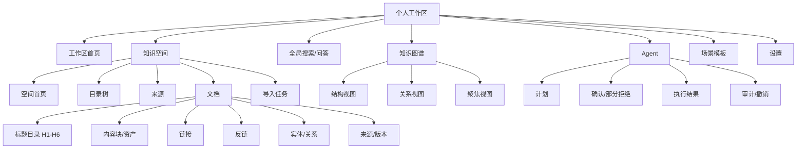

# 个人知识工作台 v2 信息架构（草案）

> 对应需求：[PRD v5 草案](../product/PRD-v5-DRAFT.md) · [用户旅程](../product/USER_JOURNEY-v2-DRAFT.md) · [目标架构](../architecture/TARGET_ARCHITECTURE.md) · 文档版本：`v1.0` · 更新日期：2026-08-26 · 状态：项目所有者已验收；v2 设计基线

> **文档边界：**本文描述 v2 目标导航、页面和状态，不代表正式前端已经实现。v1.x 当前设计仍以 [设计系统](README.md)和正式前端实现为准。

## 1. 已确认的设计理解

- 产品是不限职业的个人知识工作台，不再以 PM 面试为主导航；
- 用户从一个本地 Workspace 进入多个 Knowledge Space，并管理目录、来源和多格式文档；
- 搜索、问答、原文阅读、链接、反链、图谱和 Agent 围绕当前空间与显式范围展开；
- 图谱必须支持空间、目录、文档、标题和内容块逐级展开，并展示真实关系和证据；
- Agent 是通用工具入口，计划、范围、风险、确认、结果和撤销持续可见；
- PM 面试、研究综述等是可选模板，不进入通用主流程；
- 桌面端承担完整管理，移动端优先搜索、阅读、反链和 Agent 审批。

## 2. 设计原则

1. **空间优先：**先回答“我在哪里、操作哪些资料”，再展示工具；
2. **证据连续：**搜索、问答、图谱和 Agent 都能回到同一文档锚点；
3. **逐层展开：**大规模目录和图谱按需加载，不一次铺满，也不退化为一级标题；
4. **工具统一：**搜索与问答共享范围和结果；页面内 Agent 与全局 Agent 共享运行记录；
5. **模板后置：**模板只组合通用能力，不成为主导航默认入口；
6. **状态优先：**空、加载、部分成功、失败、证据不足、权限丢失和确认状态都需要设计；
7. **本地可见：**数据位置、模型模式、来源状态和外发条件在关键触点持续可见；
8. **渐进复杂：**新用户先完成首次知识闭环，高级关系和批量操作按需出现。

## 3. 方案比较与选择

| 方案 | 结构 | 优点 | 风险 | 决策 |
|---|---|---|---|---|
| A 知识空间优先 | Workspace → Space → Collection/Document；搜索、图谱、Agent 为全局工具 | 范围清楚；符合多项目模型；未来扩展自然 | 需要处理全局导航和空间树的双层关系 | **已确认** |
| B 功能优先 | 文档、搜索、问答、图谱、Agent 同级；Space 只是筛选器 | 接近 v1.x，迁移简单 | 空间边界弱，容易串库和重复跳转 | 不采用 |
| C 命令中心 | 统一搜索/Agent 作为主要入口 | 熟练用户效率高 | 新用户发现性差，高风险操作不适合全靠对话 | 仅保留命令入口 |

最终采用方案 A，并在顶部提供全局搜索/命令入口，吸收方案 C 的效率优势。

## 4. 全局信息架构



## 5. 应用壳层

### 5.1 桌面布局

```text
┌──────────┬────────────────────┬──────────────────────────────────────┐
│ 全局栏   │ 空间上下文栏       │ 主工作区                             │
│ 56–64px  │ 220–280px          │ 自适应                               │
│          │                    │ 顶部：面包屑 / 范围 / 模式 / 任务    │
│ 工作区   │ 空间切换           │                                      │
│ 搜索     │ 目录树             │ 页面内容                             │
│ 图谱     │ 来源/导入状态      │                                      │
│ Agent    │ 最近文档           │ 可选右侧证据/Agent 面板              │
│ 模板     │                    │                                      │
│ 设置     │                    │                                      │
└──────────┴────────────────────┴──────────────────────────────────────┘
```

- 全局栏固定展示跨空间能力；
- 空间上下文栏只在进入 Space/Document 等上下文页面时展示，可折叠；
- 主工作区顶部栏持续显示当前 Space、查询范围、本地/外部模式和后台任务；
- 右侧面板承载证据、链接、关系或页面内 Agent，不使用模态框覆盖主要内容；
- `Esc` 关闭临时面板，`/` 聚焦全局搜索，`Ctrl/Cmd+K` 打开命令入口。

### 5.2 全局栏

| 入口 | 目标 | 范围规则 |
|---|---|---|
| 工作区 | 空间总览、最近工作和任务 | Workspace |
| 搜索 | 统一搜索/问答 | 默认当前 Space；跨空间需显式选择 |
| 图谱 | 结构、关系、聚焦图 | 默认当前 Space |
| Agent | 全局复杂任务和历史 | 创建 Run 前固定范围 |
| 模板 | 用户主动启用的任务模板 | 使用模板时选择 Space |
| 设置 | 来源、模型、隐私、索引和数据 | Workspace/Space 分层设置 |

### 5.3 顶部状态栏

顶部栏按从左到右展示：

1. 面包屑：Workspace / Space / Collection / Document；
2. Scope Chip：当前空间、来源数量和是否跨空间；
3. Model Chip：本地、外部 AI 或演示；
4. 全局搜索/命令；
5. Job Center：导入、OCR、索引和失败数量；
6. Agent Approval：等待确认的操作数量。

Scope 和 Model 不是装饰标签；点击后必须能查看和修改当前范围或策略。

## 6. 页面清单与建议路由

| 页面 | 建议路由 | 主要任务 | 关联需求 |
|---|---|---|---|
| 工作区首页 | `/workspace` | 查看空间、最近文档、任务和待处理事项 | F-01、F-11 |
| 新建空间 | `/spaces/new` | 命名空间、选择目标和隐私继承 | F-01、F-10 |
| 空间首页 | `/spaces/:spaceId` | 浏览目录、来源、活动和空间统计 | F-01～F-03 |
| 来源与导入 | `/spaces/:spaceId/sources` | 连接原位/管理副本、预览和任务恢复 | F-02、F-10、F-11 |
| 文档阅读器 | `/spaces/:spaceId/documents/:documentId` | 阅读、定位、链接、反链、实体和版本 | F-03、F-04 |
| 搜索/问答 | `/search?spaces=` | 混合检索、有证据回答和拒答 | F-05、F-07 |
| 知识图谱 | `/graph?spaces=&view=` | 结构、关系和聚焦探索 | F-06 |
| Agent | `/agent` | 计划、确认、执行、审计和撤销 | F-08 |
| 场景模板 | `/templates` | 启用和运行可选模板 | F-09 |
| 设置 | `/settings` | 来源、模型、隐私、索引和数据 | F-10、F-11 |

路由是设计建议，不是已实现 API 契约；实现阶段可在保持信息架构的前提下调整。

## 7. 工作区首页

首页不再用四张功能卡解释产品，而是让用户继续工作。

优先级从高到低：

1. 等待用户处理：失败导入、Agent 确认、失效来源和链接冲突；
2. 知识空间：名称、目标、文档/格式、更新时间和最近闭环；
3. 继续工作：最近文档、上次查询和未完成行动；
4. 后台任务：导入/OCR/索引进度；
5. 新建空间与导入资料。

空状态只显示一个主行动“创建第一个知识空间”和一个次行动“了解数据边界”，不展示虚假指标。

## 8. 知识空间与文档阅读器

### 8.1 空间上下文栏

- 空间切换器和归档状态；
- 可折叠 Collection 树；
- 来源与导入任务入口；
- 最近文档和固定文档；
- 空间设置。

目录树节点显示类型、失败/失联状态和未处理建议，但不显示技术 chunk 数。

### 8.2 文档三层结构

```text
空间上下文栏
  │
  ├─ 文档主体：标题、来源、正文、精确锚点
  │
  └─ 知识面板
      ├─ 目录 H1-H6
      ├─ 链接
      ├─ 反链
      ├─ 实体与关系
      └─ 来源与版本
```

点击搜索引用、图谱节点、反链或 Agent 证据都进入相同 Document URI，并高亮对应 Block。来源失联时仍可显示最后可用版本，但明确标注不能打开本地文件。

## 9. 搜索与问答

搜索和问答共享同一范围、查询输入和结果集：

- `搜索` 标签展示列表、命中原因、格式、空间和具体锚点；
- `问答` 标签基于同一检索结果生成回答、拒答或冲突提示；
- 范围选择器默认当前 Space，跨空间选择后持续显示；
- 结果可以切换文档、内容块、表格、图片和实体类型；
- 点击结果在阅读器打开；点击引用高亮固定 Version/Block；
- “证据不足”保留用户问题，提供扩大范围、改写查询或仅看搜索结果，不生成伪来源。

搜索结果、回答和原文不使用三套互不相通的历史。

## 10. 知识图谱

### 10.1 三种视图

| 视图 | 主要问题 | 默认节点 | 展开方式 |
|---|---|---|---|
| 结构视图 | 我的资料如何分层？ | Space/Collection/Document | 点击逐级展开到 H1-H6/Block |
| 关系视图 | 内容之间为何相关？ | Document/Block/Entity | 按 Link/Relation 类型过滤 |
| 聚焦视图 | 这个对象的上下游是什么？ | 当前对象 + 1 层邻居 | 按需增加到 2 层 |

### 10.2 节点和边

- 节点类型：Space、Collection、Document、Heading、Block、Entity；
- 边类型：contains、links_to、references、supports、contradicts、extends、example、suggestion；
- 结构边、显式链接、确认关系和 AI 建议使用形状/线型/文字共同区分；
- AI 建议默认隐藏或单独筛选，不能与 confirmed 事实混合；
- 点击节点打开证据面板；点击边显示方向、来源、创建者、时间和支持锚点；
- 超大图采用局部加载、聚合和过滤，不设置“超过 200 个节点退回一级目录”的产品规则；
- Canvas 下提供可搜索的关系列表和键盘可达替代视图。

## 11. Agent 与模板

### 11.1 两个入口

- 全局 Agent 页面：复杂目标、批量计划、历史、审计和撤销；
- 页面内 Agent 面板：使用当前 Document/Search/Graph 上下文发起任务。

二者共享 AgentRun，不创建两套历史。

### 11.2 Agent 页面结构

```text
运行历史｜对话与计划｜范围 / 差异 / 审批 / 逐项结果
```

- R0 只读任务通过策略后直接执行并显示证据；
- R1 可逆创建展示计划；是否允许本轮确认由 ADR 决策；
- R2 批量修改展示旧值、新值和影响数量，支持部分拒绝；
- R3 删除/外发二次确认，永久删除不进入首发；
- 计划、目标版本或范围改变后，旧批准失效；
- 执行后展示逐项结果、审计 ID 和撤销入口。

### 11.3 模板

模板页面不在首次使用时主动引导 PM 面试。用户可选择 PM 面试、研究综述、Agent 学习复盘或未来模板；每个模板说明使用哪些空间、工具、模型和写入结果。

## 12. 移动端信息架构

底部导航：`首页｜空间｜搜索｜Agent｜更多`。

| 能力 | 移动端首发 | 处理方式 |
|---|---:|---|
| 切换空间 | 是 | 顶部空间选择器 |
| 搜索/问答 | 是 | 单栏结果与证据抽屉 |
| 阅读文档 | 是 | 正文为主，目录/反链使用底部 Sheet |
| 图谱聚焦 | 是 | 当前节点 + 一层邻居；列表替代 |
| Agent 审批 | 是 | 显示范围、差异摘要和逐项选择 |
| 批量导入/复杂管理 | 否/降级 | 提示在桌面继续，不裁切桌面布局 |
| 完整大图编辑 | 否 | 聚焦视图和关系列表 |

移动端触控目标至少 44×44px；不依赖 hover；系统返回后恢复合理焦点。

## 13. 状态模型

| 状态 | 必须展示 | 主要恢复动作 |
|---|---|---|
| 空 | 价值、不会发生什么、第一步 | 创建空间/导入 |
| 加载 | 与页面形状一致的 skeleton、当前阶段 | 取消长任务 |
| 部分成功 | 成功/跳过/失败逐项数量 | 查看失败、重试、跳过 |
| 失败 | 原因分类、是否改变数据 | 保留输入、重试、更换方式 |
| 证据不足 | 已查范围、为什么不足 | 改写、扩范围、看搜索结果 |
| 来源失联 | 最后版本、失联原因 | 重新定位、解除连接 |
| 关系冲突 | 两个结论及各自证据 | 保留、合并、拒绝 |
| 等待确认 | 范围、对象、旧值/新值、风险 | 修改、部分拒绝、确认、取消 |
| 可撤销 | 执行结果、撤销范围和期限 | 撤销/进入历史 |

## 14. 可访问性和键盘

- 页面只有一个 H1，标题结构不跳级；
- 目录树使用 tree/treeitem 语义，支持方向键和展开状态；
- 搜索结果、图谱关系列表和任务行使用真实链接/按钮；
- 图谱颜色之外使用线型、图标和文字标签区分关系；
- 动态任务、错误和 Agent 结果使用合适的 `aria-live`；
- 焦点不会落在关闭的侧栏或隐藏 Canvas；
- 支持 `prefers-reduced-motion`，布局变化不使用宽度动画造成眩晕；
- 主要文本保持可读行宽，数据数字使用 tabular figures。

## 15. 原型覆盖

| ID | 页面/状态 | 原型 screen | 重点验收 |
|---|---|---|---|
| V5-P01 | 工作区首页 | `workspace` | 多空间不是功能卡；待处理优先 |
| V5-P02 | 新建空间/选择来源 | `source` | 两种 Source mode、数据边界 |
| V5-P03 | 导入任务 | `import` | 阶段、逐项结果和部分失败 |
| V5-P04 | 文档阅读器 | `document` | H1-H6、锚点、来源和知识面板 |
| V5-P05 | 范围搜索 | `search` | 当前/跨空间范围、混合结果 |
| V5-P06 | 有证据问答 | `answer` | 引用、冲突和证据不足 |
| V5-P07 | 链接/反链 | `links` | 正向 Link、Backlink 和状态 |
| V5-P08 | 图谱结构 | `graph` | 逐级展开，不退化到一级目录 |
| V5-P09 | 图谱聚焦/证据 | `graph-focus` | typed edge、证据和建议确认 |
| V5-P10 | Agent 审批 | `agent` | 计划、差异、部分拒绝和撤销 |
| V5-P11 | 场景模板 | `templates` | PM 非默认，模板复用核心 |
| V5-P12 | 隐私设置 | `settings` | Space policy、模型和删除语义 |
| V5-P13 | 错误恢复 | `recovery` | 来源失联、任务恢复和安全状态 |
| V5-P14 | 移动核心闭环 | `mobile` | 搜索、阅读、反链和 Agent 审批 |

可运行原型和使用说明见 [V2_PROTOTYPE_SPEC.md](V2_PROTOTYPE_SPEC.md)。

## 16. 决策记录

| ID | 决策 | 备选 | 理由 | 状态 |
|---|---|---|---|---|
| UX-D01 | 采用知识空间优先 IA | 功能优先、命令中心 | 空间范围和多项目是 v2 核心 | 已确认 2026-08-25 |
| UX-D02 | 搜索与问答共享入口 | 保持两个独立页面 | 共享范围、结果和证据，减少断点 | 已确认 2026-08-25 |
| UX-D03 | 图谱提供结构/关系/聚焦视图 | 目录/笔记两级切换 | 支撑真实层级和可解释关系 | 已确认 2026-08-25 |
| UX-D04 | Agent 同时有全局页和上下文面板 | 仅聊天页、仅浮层 | 兼顾复杂任务和当前内容操作 | 已确认 2026-08-25 |
| UX-D05 | 模板不占据通用主流程 | PM 面试主导航 | 不按职业限制目标用户 | 已确认 2026-08-25 |
| UX-D06 | 桌面完整管理、移动核心闭环 | 移动复制桌面三栏 | 避免裁切，匹配设备任务 | 已确认 2026-08-25 |
| UX-D07 | v2 原型覆盖 V5-P01～P14 | 少量孤立成功态截图 | 同时验证导航、异常和安全状态 | 已确认 2026-08-25 |

## 17. 实现前门槛

- [ ] 可运行原型的核心链接、范围和返回路径通过走查；
- [ ] 工作区首页不出现 PM 默认用户或固定 13 目录；
- [ ] 图谱能从文档展开到多级标题并查看 typed edge 证据；
- [ ] Agent 计划、部分拒绝、确认、结果和撤销状态完整；
- [ ] 桌面 1440×1000 和移动 390×844 无横向溢出；
- [ ] 空、加载、部分成功、失败、证据不足和权限丢失有恢复；
- [ ] 原型、PRD、数据模型和 ADR 使用同一术语；
- [ ] 原型验收后再拆分正式前端实施任务。

---

*v1.0-draft.1：确认知识空间优先的信息架构，并定义多空间、统一检索、真实图谱、受控 Agent、模板和移动端结构。*
