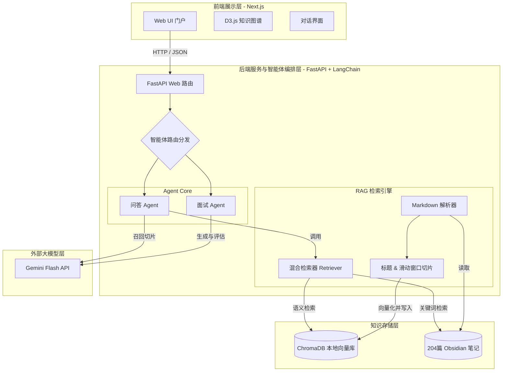
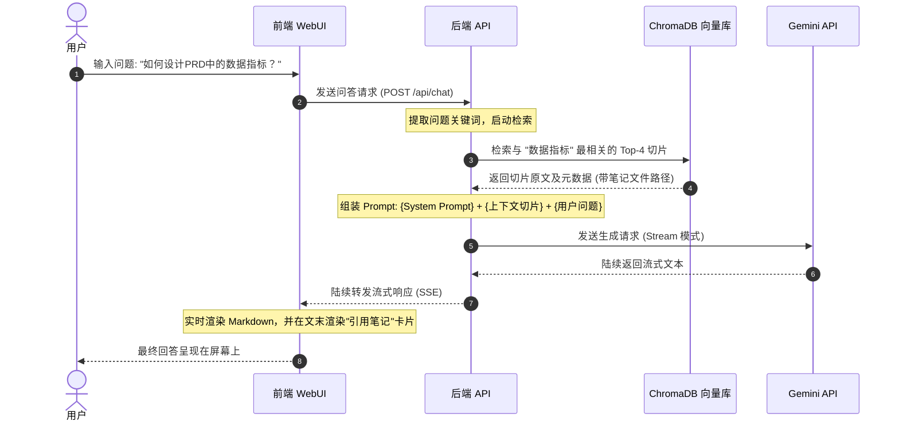

# 系统架构设计文档 (System Architecture)
# PM Knowledge Hub · AI产品经理垂直知识库智能体

**文档版本**：v1.0  
**创建时间**：2026-06-29  
**作者**：项目PM

---

## 1. 系统架构总览

本系统采用三层软件架构设计：**前端展示层 (Next.js)**、**后端服务与智能体编排层 (FastAPI + LangChain)**、**知识存储层 (ChromaDB + Markdown)**。由于是本地部署项目，数据传输均在本地进行（除 LLM API 请求外），保证了数据的隐私与极低的传输延迟。

---

## 2. 核心组件职责说明

### 2.1 前端展示层 (Next.js + Tailwind CSS)
- **Web UI 门户**：负责整体界面的渲染。遵循深色系（Dark Theme）设计，采用 HSL/OKLCH 色彩空间，避免粗暴的渐变文字与过度圆角，提供极高品质的视觉交互。
- **D3.js 知识图谱**：读取后端的双链拓扑数据，使用力导向图（Force-Directed Graph）将 204 篇笔记以网状关联的形式可视化呈现，支持节点拖拽、点击预览与高亮定位。
- **对话界面**：提供流式对话（Streaming）的交互体验，自动解析并渲染 Markdown 及公式，支持高亮代码块。

### 2.2 后端服务层 (FastAPI)
- **FastAPI 接口**：暴露轻量级的 RESTful API，用于处理前后台对话请求、图谱数据导出、面试模拟管理等。
- **智能体路由分发**：根据用户输入或当前页面上下文，将请求路由至不同的 Agent 执行单元。

### 2.3 智能体编排层 (LangChain / LlamaIndex)
- **问答 Agent**：基于 RAG 模型，将用户的问题、检索出的笔记切片组装为 Prompt，调用 Gemini Flash 接口生成带有引用标记的回答。
- **面试 Agent**：控制面试模拟流程（提问 → 记录回答 → 判断是否结束 → 综合评估），利用内置的 STAR 规则 Prompt 对用户作答进行百分制打分。

### 2.4 RAG 检索引擎
- **混合检索器**：集成向量检索（负责概念泛化）与关键词检索（BM25，负责术语精确匹配），通过倒数重排（RRF）算法融合，权重比例为 7:3。
- **切片策略器**：针对 Obsidian 的特殊双链及多级标题进行定制解析，防止信息截断，并包含一定量的上下文 Overlap。

### 2.5 存储层
- **ChromaDB**：本地部署的轻量向量数据库，用于保存笔记切片的 Embedding 向量以及元数据（文件名、标签、章节、双链关联）。
- **Obsidian 笔记库**：用户在本地磁盘上的原始 Markdown 文件，作为检索召回后的正文原文映射。

---

## 3. RAG 核心数据流

---

*文档版本：v1.0 | 状态：草稿 | 下一步：更新 PRD 与用户旅程图*
