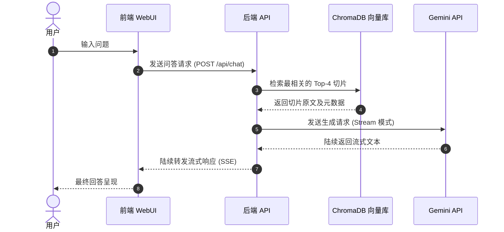
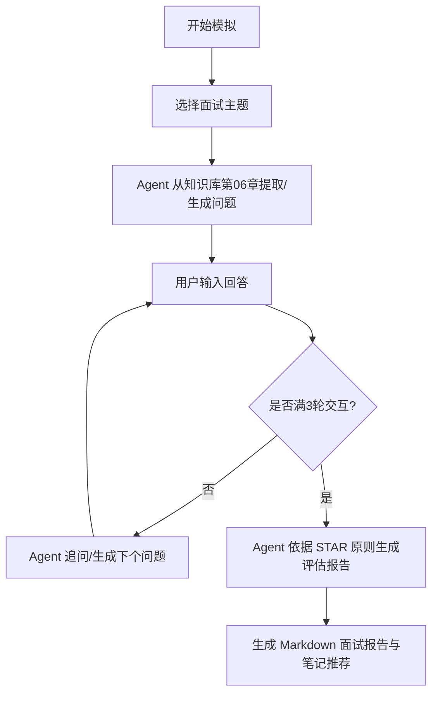

# PRD — 产品需求文档
# PM Knowledge Hub · AI产品经理垂直知识库智能体

**文档版本**：v1.2
**创建时间**：2026-06-29  
**文档状态**：🟢 有效；按交付基线持续维护
**依赖文档**：[BRD.md](BRD.md) · [MRD.md](MRD.md)

---

## 0. 交付基线与承诺边界

本 PRD 同时记录“当前可验证能力”和“已承诺目标能力”。未达到验收标准的目标不得在 README、进度报告或发布说明中表述为已完成。

| 能力 | 产品优先级 | v1.6.0-rc.1 基线 | 承诺里程碑 | 验收门禁 |
|---|---|---|---|---|
| 引用来源与证据核验 | P0 | `[n]` 引用、来源摘录、锚点定位、Obsidian 跳转 | v1.6 | 正文引用与来源一一对应；图片无 404；失败可重试 |
| 向量 + BM25 + RRF 混合检索 | P0 | 当前为 ChromaDB 语义检索 | v1.7 | 分别记录向量/BM25 排名；RRF Top-4 可复现；有召回对照测试 |
| SSE 流式回答 | P0 | 当前为同步 JSON 响应 | v1.7 | `text/event-stream`；首包与结束事件可测试；断线/超时可恢复 |
| Obsidian 增量同步 | P0 | 当前为手动全量 ingest/upsert | v1.7 | 新增、修改、删除三类文件变更可增量反映，失败有日志与重试 |
| 面试主题、三轮状态机与总结报告 | P1 / 核心承诺 | 当前为随机起题 + 单题评估 | v1.7 | 可选主题；固定三轮；状态可恢复；结束生成总结与复习入口 |

**版本决策**：采用混合路线。v1.6 先关闭发布可信度、移动可用性、文档一致性和证据闭环四个 P1；上述未实现能力保持承诺并进入 v1.7，不做静默删减。

---

## 1. 产品概述与核心价值

### 1.1 产品定义
**PM Knowledge Hub** 是一款为产品经理（PM）求职者量身定制的本地双链知识检索与智能化面试模拟系统。系统深度整合用户在 Obsidian 中积累的 204 篇 Markdown 格式的产品经理学习笔记，通过本地 RAG（检索增强生成）技术和多智能体编排，让“静态笔记”活起来，成为可交互、能考核、可展示的求职级 AI 产品。

### 1.2 核心用户故事 (Job Stories)

- **[Story 1] 语义检索场景**：当我在面试前需要复习“A/B测试指标设计”时，我想要输入模糊的自然语言（如“如何设计A/B测试的流量分流指标”），以便系统能精准定位并召回我笔记中关于分流和指标设计的段落，并提供直观的引用源链接。
- **[Story 2] 面试模拟场景**：当我想自我模拟面试以检验表达能力时，我想要选择一个 AI 面试官智能体，由它从我的知识库中随机抽取或生成一道面试真题，以便我作答后，系统能根据 STAR 原则进行点评和打分。
- **[Story 3] 知识网络探索**：当我想建立系统的产品方法论网络时，我想要查看一个可交互的知识图谱，以便我能直观发现不同章节（如“深入学习数据”与“AI金融”）之间的交叉关联和引用热度。
- **[Story 4] 双链跳转联动**：当我在系统内阅读 AI 问答的引用来源时，我想要能够一键唤醒并跳转到我本地的 Obsidian 软件并定位到对应文件，以便我能快速在该笔记上下文中进行手写编辑。
- **[Story 5] 笔记同步更新**：当我在本地 Obsidian 中修改或新增笔记时，我希望系统能够感知到变化并增量更新向量数据库，以便在下一次对话中系统能立刻引用我最新总结的知识，无需重构整库。

---

## 2. 功能需求详述

### 2.1 功能优先级矩阵 (RICE 评估)

| 模块 | 功能项 | 描述 | 优先级 | Reach | Impact | Confidence | Effort | RICE 得分 |
|---|---|---|---|---|---|---|---|---|
| **RAG 检索** | 混合检索与流式对话 | 向量搜索与 BM25 融合，支持 Streaming 输出 | **P0 (Must)** | 10 | 3 | 90% | 2 | 13.5 |
| **RAG 检索** | 引用来源卡片展示 | 展示引用笔记的文件路径，支持一键打开 | **P0 (Must)** | 10 | 3 | 90% | 1.5 | 18.0 |
| **面试模拟** | STAR 面试评估 Agent | AI 面试出题、作答记录、STAR 框架评估与打分 | **P1 (Should)** | 8 | 3 | 80% | 3.5 | 5.5 |
| **知识可视化**| D3.js 关联拓扑图谱 | 将 204 篇笔记的关系通过力导向图可视化 | **P1 (Should)** | 7 | 2 | 80% | 3 | 3.7 |
| **辅助功能** | 全文关键词高亮搜索 | 传统的关键词全局搜索，匹配项加亮 | **P2 (Could)** | 9 | 1.5 | 90% | 1.5 | 8.1 |
| **辅助功能** | 检索与对话历史记录 | 本地保存历史会话，支持随时查阅 | **P2 (Could)** | 8 | 1 | 90% | 2 | 3.6 |

---

### 2.2 核心模块一：RAG 语义知识库 (P0)

#### 2.2.1 Obsidian Markdown 解析与切片策略
为了确保检索的上下文完整且没有冗余信息，系统必须执行针对性的预处理流：
- **双链语法清洗**：过滤并重构 Obsidian 特有的双链标记（如 `[[3.11-PRD\|PRD]]` 解析为 `[PRD](file://...)`）。
- **图片嵌入转换**：将 `![[images.png]]` 转化为本地相对路径图片链接 ``，确保前端可以正确渲染笔记内包含的 257 张图片。
- **切片规则 (Slicing Specification)**：
  - **规则 1（硬切片）**：以 Markdown 的标题（如 `##`）作为主分隔符。每一节作为独立文档块（Chunk）。
  - **规则 2（软切片）**：如果一节（Section）的长度超过 300 Token，则采用 300 Token 的固定滑动窗口进行切割，重叠长度（Overlap）为 50 Token，保证滑动边界的语义不丢失。
  - **元数据嵌入**：每个切片必须打上元数据标签，详见 2.2.3 节。

#### 2.2.2 混合检索引擎与倒数重排 (RRF)
- **语义检索**：使用 ChromaDB 的 Cosine 相似度，对用户问题进行向量匹配。
- **精确匹配**：集成轻量级 BM25 算法进行关键词精确度召回。
- **倒数重排融合 (RRF)**：
  $$RRF\_Score(d) = \frac{1}{60 + Rank_{vector}(d)} + \frac{1}{60 + Rank_{bm25}(d)}$$
  提取最终 RRF Score 前 4 名的切片传入大语言模型，混合权重倾向于语义检索（比例控制在 7:3）。
- **RAG 数据流向设计**：详细时序图见 [ARCHITECTURE.md](ARCHITECTURE.md#3-rag-核心数据流)。以下是该流程的简要时序展示：

#### 2.2.3 元数据 Schema 设计表

| 字段名 | 类型 | 说明 | 示例值 |
|---|---|---|---|
| `file_name` | String | 笔记的原始文件名 | `"3.11-PRD.md"` |
| `chapter` | String | 所属目录 of 笔记 | `"03-全流程知识"` |
| `tags` | List | 笔记中以 `#` 定义的标签列表 | `["#PRD", "#需求分析"]` |
| `obsidian_uri` | String | 唤醒本地 Obsidian 的协议链接 | `"obsidian://open?vault=2bPM&file=03-全流程知识/3.11-PRD"` |
| `parent_section`| String | 当前切片所在的三级/二级标题名 | `"2.2 核心模块一：RAG"` |

---

### 2.3 核心模块二：面试模拟智能体 (P1)

#### 2.3.1 对抗流程与追问机制
面试 Agent 具有专门的流程管理状态，整体流程流转如下图所示：

详细流程说明：
1. **初始化**：用户选择面试方向（如：传统 PM / AI PM）。
2. **抽取真题**：Agent 从本地 `06-面试` 文件夹匹配的相关真题切片中，随机抽取或生成首问（如“请讲一个你从 0 到 1 设计的 AI 功能案例”）。
3. **输入与判断**：当用户提交作答后，智能体将使用追问 Prompt 启发用户深入表达（如“在此过程中，你面临的最大工程限制是什么？你是如何进行功能剪裁的？”）。一轮面试会话包含 **3 轮** 交互。
4. **STAR 报告生成**：最后一轮回答结束后，Agent 触发评估流程。

#### 2.3.2 STAR 规则评估 Prompt 约束结构
评估模块必须严格按照以下维度输出报告，且严禁生成假大空的鼓励词：
- **【Situation】**（占比 20%）：评估是否说明了项目背景、业务背景和所处环境。
- **【Task】**（占比 20%）：评估是否明确了产品目标和面临的约束。
- **【Action】**（占比 40%）：评估是否展现了产品经理的核心动作（如原型设计、协调开发、切片策略决策等）。
- **【Result】**（占比 20%）：评估是否有量化的指标或可度量的产品成效。
- **【评分与改进建议】**：给出百分制总体得分，并根据得分推荐 2-3 篇当前知识库中用户需要重新复习的笔记文件名。

---

### 2.4 核心模块三：D3.js 知识关联图谱 (P1)
- **图谱渲染**：利用 D3.js 的力导向图算法绘制 204 个笔记节点的关系。
- **层级色调**：节点颜色根据所属的 13 个文件夹类别进行 OKLCH 色相区分，例如 `09-深入学习AI` 节点使用冷青色（oklch(0.75 0.20 200)），`06-面试` 使用冷蓝色。
- **双链高亮交互**：
  - 点击某一节点，只保留该节点及其直接相连（1度关联）的节点和线条，其余节点半透明淡出。
  - 侧边栏预览面板呈现该笔记的 Markdown 概要和跳转链接。

---

### 2.5 辅助功能 (P2)
- **对话历史记录**：使用本地 IndexedDB 或本地 JSON 文件存储对话历史，用户可删除会话或一键清空。
- **全文关键词高亮**：在传统的知识库导航界面，用户可以通过输入关键词直接触发正则表达式全局匹配，并在 Markdown 原文中通过黄底加亮显示匹配的内容。

---

## 3. 非功能需求与性能指标 (Non-Functional Requirements)

### 3.1 性能与体验指标
- **首字节响应 (TTFB)**：LLM 接口在流式输出模式下，首字吐出延迟必须在 1.5 秒以内。
- **本地检索效率**：混合检索引擎（ChromaDB + BM25）在 204 篇笔记规模下的总召回耗时在本地不得超过 300ms。
- **图谱渲染帧率**：在主流浏览器中，D3.js 知识图谱初次加载与拖拽动画帧率应保持在 55fps 以上。

### 3.2 运行环境与安全约束
- **数据隐私与安全**：严禁将任何用户笔记数据上传至云端向量库，所有的 ChromaDB 数据库和索引文件均需在本地保存（路径：`backend/data/chroma/`）。
- **敏感信息隐藏**：Gemini/智谱 API Key 等凭证必须以本地环境变量文件 `.env` 的方式独立加载，绝不能写入代码中，并在 Git 追踪中强制屏蔽。

---

## 4. 异常处理与边缘情况矩阵 (Error Handling & Edge Cases)

| 场景 / 异常事件 | 表现形式 | 系统预期行为 (容错与引导策略) |
|---|---|---|
| **API 调用超时 / 网络断开** | 调用大模型生成时无响应，超过 15 秒无首包返回。 | 1. 停止加载动画，在对话框内展示红字提示：“网络请求超时，请检查本地网络或 API Key 余额”。 2. 激活“重试”按钮。 |
| **ChromaDB 向量数据库连接失败** | 后端启动时无法挂载本地 ChromaDB。 | 1. 后端自动在终端抛出严重警告，但在 API 接口层保持不挂起状态。 2. 页面顶部展示全局 Banner 提示：“向量库未就绪，系统已自动降级为纯关键词检索模式”。 |
| **检索无内容 (Zero Search Result)** | 用户提问极为生僻，召回匹配度得分低于设定阈值。 | 1. 杜绝 LLM 幻觉，系统提示：“知识库中暂未发现相关主题，以下是基于您已有知识体系的泛化回答...”。 2. 并在回答结尾处标注：“注：本次回答未引用本地笔记”。 |
| **笔记文件存在语法错误** | Obsidian 笔记头部包含不完整的 YAML Frontmatter，导致解析失败。 | 1. 解析脚本捕获 `YamlParseException`，将该文件标记为跳过并计入日志，而不是中断整个 ingestion 流程。 2. 终端输出 warning：“跳过损坏的文件: xxx.md”。 |

---

*PRD版本：v1.2 | 状态：有效 | 下一步：完成 v1.6 发布门禁并进入 v1.7 P0 引擎一致性开发*
