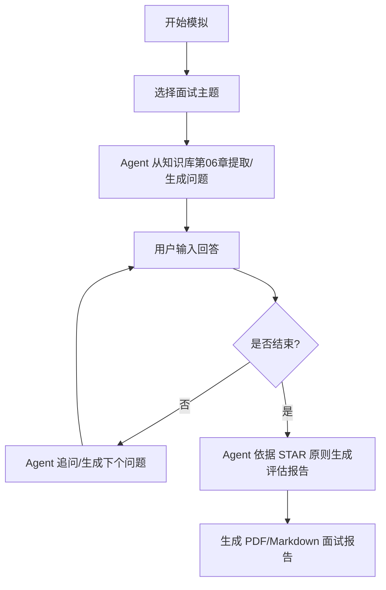

# PRD — 产品需求文档
# PM Knowledge Hub · AI产品经理垂直知识库智能体

**文档版本**：v1.0  
**创建时间**：2026-06-29  
**文档状态**：🔄 草稿  
**依赖文档**：[BRD.md](BRD.md) · [MRD.md](MRD.md)

---

## 1. 估值与产品范围

### 1.1 产品定义
**PM Knowledge Hub** 是一款专为产品经理求职者设计的本地双链知识检索与面试模拟系统。系统通过解析用户已有的 204 篇 Obsidian 笔记，将其转化为支持语义检索（RAG）和多智能体交互的本地知识库。

### 1.2 核心用户故事 (Job Stories)
- **检索场景**：当我在面试前需要复习“数据分析”相关知识时，我想要输入自然语言（如“如何设计A/B测试的指标”），以便系统能精准定位并提取我笔记中关于A/B测试的核心段落，并给出笔记来源链接。
- **面试场景**：当我想自我模拟面试时，我想要选择一个面试官智能体，由它从我的知识库中随机抽取并生成面试题，在我输入回答后根据 STAR 原则进行点评和打分，以便我能查漏补缺。
- **系统探索**：当我想直观了解我的知识网络时，我想要查看一个可交互的知识图谱，以便我能发现不同章节（如“深入学习数据”与“AI金融”）之间的交叉关联。

---

## 2. 功能需求说明

### 2.1 整体功能框架
系统采用三栏式布局（导航栏、核心工作区、右侧上下文面板），包含以下三个主要功能模块。

---

### 2.2 模块一：RAG 语义知识库 (P0)

#### 2.2.1 笔记导入与预处理 (后端)
- **Obsidian 格式兼容**：解析 Markdown 语法，包括 Obsidian 的 `[[双链链接]]` 以及 `![[图片嵌入]]` 语法，将其转化为标准 Markdown。
- **混合切片策略**：
  1. 优先按 `##` 和 `###` 标题进行语义切片。
  2. 对超长段落进行 300 Token 的滑动窗口切片（Overlap 设为 50 Token）。
- **向量化与存储**：采用免费的本地 Embedding 工具或免费 API（如 Gemini / 智谱）将切片向量化，并存入本地 `ChromaDB`。

#### 2.2.2 混合检索引擎 (后端)
- **混合检索 (Hybrid Search)**：结合语义检索（Vector Search）与关键词检索（BM25），比重为 7:3。
- **元数据过滤**：支持按章节（如 `03-全流程知识`）或标签（如 `#PRD`）进行硬过滤。

#### 2.2.3 知识库问答界面 (前端)
- **对话面板**：支持流式输出 (Streaming) 的对话框。
- **引用可追溯性**：每个回答下方必须展示引用的笔记切片，点击可折叠查看，并显示本地文件路径（例如：`file:///docs/03-全流程知识/3.11-PRD.md`）。

---

### 2.3 模块二：面试模拟智能体 (P1)

#### 2.3.1 面试流程设计

#### 2.3.2 评估规则 (System Prompt 预设)
面试智能体需采用以下结构对用户的回答进行评估：
- **S (Situation)**：是否描述了清晰的背景？
- **T (Task)**：是否明确了任务目标？
- **A (Action)**：是否详细阐述了具体的产品动作和决策？
- **R (Result)**：是否有可度量的结果（即使是模拟的）？
- **综合打分**：百分制，并给出改进意见和对应的笔记复习推荐。

---

### 2.4 模块三：可交互知识图谱 (P1)
- **图谱渲染**：在前端通过 D3.js 渲染 204 篇笔记的关系网络（节点为笔记，连线为 Obsidian 双链链接）。
- **交互逻辑**：
  - 支持滚轮缩放、拖拽节点。
  - 点击节点可在右侧面板预览该笔记的摘要和核心标签。
  - 支持在图谱中搜索特定节点并高亮其关联链路。

---

## 3. 非功能需求与安全设计

### 3.1 性能指标
- **检索延迟**：本地 ChromaDB 检索耗时应低于 500ms。
- **首包时间 (TTFB)**：LLM 流式输出首字返回时间应低于 1.5s。
- **解析吞吐**：204 篇笔记的首次初始化向量化时间在本地应低于 5 分钟。

### 3.2 安全与隐私 (本地化)
- **本地运行**：ChromaDB 向量数据必须存储在本地 `backend/data/chroma/` 目录下，禁止上传至云端。
- **凭证安全**：API Key 必须通过本地 `.env` 文件读取，并在 `.gitignore` 中屏蔽，防止意外提交至公共仓库。

### 3.3 可维护性与日志
- **系统日志**：后端每次检索需记录召回得分（Recall Score）和检索耗时。
- **测试覆盖**：后端核心检索与解析模块单元测试覆盖率需达到 70% 以上。

---

*PRD版本：v1.0 | 状态：草稿 | 下一步：绘制用户旅程图*
