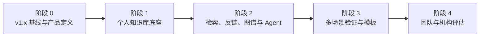
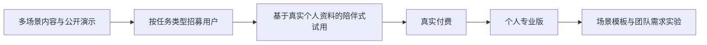

# 个人知识工作台商业需求文档（BRD，v2 工作名）

> 文档导航：[产品文档索引](README.md) · [MRD](MRD.md) · [现行 PRD v4](PRD.md) · [PRD v5 草案](PRD-v5-DRAFT.md)

> **立项主张：面向需要管理、检索、连接和学习个人资料的用户建设“本地优先的个人知识工作台”；PM、AI/Agent 学习、研究和项目管理都是可选场景，不设单一职业边界。**

| 文档属性 | 内容 |
|---|---|
| 文档版本 | v5.2 |
| 当前仓库名 | `pm-knowledge-hub`；不代表 v2 用户边界 |
| 文档用途 | 商业机会、战略边界与分阶段投资决策 |
| 业务发起人 | 项目所有者 |
| 决策人 | 项目所有者 |
| 创建日期 | 2026-06-29 |
| 本次修订 | 2026-08-24 |
| 当前状态 | v2 产品方向已确认；外部需求、付费与跨市场复用仍待验证 |
| 目标读者 | 业务负责人、投资决策人、潜在合作方 |

> **文档边界：**本文回答“为什么值得做、长期形成什么业务、客户为何付费、个人项目应做到哪里、何时扩张以及什么情况下停止”。市场细分和竞品证据详见 [MRD.md](MRD.md)，v1.x 当前范围详见 [PRD v4](PRD.md)，v2 目标范围详见 [PRD v5 草案](PRD-v5-DRAFT.md)。

---

## 1. 商业决策摘要

### 1.1 核心判断

当前已交付的 v1.x 产品从 PM/AI PM 求职与学习场景起步，并依赖单一 Obsidian/Markdown 目录。它证明了本地检索、来源问答、面试训练和知识地图可以组成一个可运行工作台，但 PM 只是现有实现来源，不应继续定义 v2 的目标用户。

v2 的核心决策是按照共同问题而不是职业名称定义用户：

> **凡是需要把多个主题、多种格式的个人资料组织为可检索、可追溯、可连接并可通过 Agent 安全操作的知识系统，都是 v2 的目标使用场景。验证样本必须覆盖不同主题和任务，不能再只从 PM/AI PM 人群获取。**

PM 面试训练作为现有内置场景继续保留；Agent 学习、研究资料、工作项目、职业学习和兴趣知识可以使用同一核心。场景模板用于降低上手成本，不构成用户准入条件或商业扩张顺序。

### 1.2 商业机会

世界经济论坛 [《Future of Jobs Report 2025》](https://www.weforum.org/publications/the-future-of-jobs-report-2025/in-full/)指出，AI 与大数据是增长最快的技能方向之一，近 40% 的岗位核心技能预计在 2030 年前发生变化，77% 的受访雇主计划通过技能提升应对变化。

这一变化带来的机会并不是“互联网上缺少课程”，而是：

- 学习资料越来越多，用户仍难以判断应该学什么、先学什么；
- 通用 AI 可以生成内容，却不了解用户已经掌握什么、真实目标是什么；
- 课程、笔记、练习与反馈分散，难以形成持续改进；
- 用户需要将学习转化为求职、考试、工作表现或作品成果；
- 私人笔记、项目经历和企业资料进入 AI 流程后，可信来源与数据控制更加重要。

客户购买的不是更多资料，而是**把分散资料变成可管理、可连接、可检索、可追溯并能推动学习、研究或工作的个人知识系统**。PM 面试只是其中一种可选成果路径。

### 1.3 长期愿景与近期任务

**长期愿景**

> 成为用户可控制的个人知识基础设施：让用户把不同来源和格式的资料组织为多个知识空间，在可靠检索、真实关系和可控 Agent 的帮助下理解、连接、学习并采取行动。

**近期任务**

> 先完成可自助使用的个人知识库底座，并邀请具有不同资料主题和任务目标的个人用户验证持续使用与付费；PM/AI PM 用户可以参与，但不能成为唯一或默认样本。

长期愿景决定系统需要具备迁移能力；近期任务通过共同问题控制范围，而不是通过某个职业限制用户。

### 1.4 本次请求的决策

本次不申请建设“大型在线学习平台”，只申请以下事项：

| 决策项 | 建议 |
|---|---|
| 战略定位 | 已确认“个人知识工作台 + 垂直场景包”为 v2 方向 |
| 首发目标用户 | 有多个知识主题、多种格式资料，并重视检索、来源和数据控制的个人用户；不限职业 |
| 内置场景 | PM 面试保留为现有模板；同时允许 Agent 学习、研究、项目和其他自定义知识空间 |
| 产品底座 | 现在即支持多知识空间、统一文档模型和系统原生链接，不等待市场扩张后再重构 |
| 内容范围 | 用户可导入自己的 Markdown、PDF、表格和图片等资料，格式支持按版本分阶段交付 |
| 搜索与图谱 | 混合检索、精确来源定位和真实关系图谱属于个人知识库核心能力 |
| Agent | 允许对话式查询和受控管理；写操作必须可预览、确认、撤销和审计 |
| 团队知识库 | 列入长期计划；个人知识库未通过质量门槛前不进入协作、权限和多租户开发 |
| 商业决策窗口 | 6 周 |
| 核心产品使用观察 | 其中连续 4 周，与当前 PRD 验证周期一致 |
| 现金预算上限 | ¥10,000 |
| 人力投入上限 | 120 小时 |
| 目标用户访谈 | 至少 15 人，覆盖不少于 3 类资料主题或任务，不以 PM 为唯一来源 |
| 陪伴式试用 | 至少 10 人 |
| 真实付费验证 | 至少 5 人 |
| 扩张限制 | 个人知识核心未通过门槛前，不进入团队知识库、内容平台和复杂机构能力 |

---

## 2. 商业问题与客户价值

### 2.1 首发目标用户

首发用户由共同问题定义，而不是由职业定义。他们具有以下一种或多种特征：

- 同时维护两个以上知识主题、学习方向或项目；
- 已有 Markdown、PDF、表格、图片、课程资料、研究材料或工作文件；
- 需要跨文件和跨格式查询并回到可信原文；
- 希望建立链接、反链和知识结构，而不绑定某个笔记工具；
- 希望通过 Agent 降低整理成本，但不接受失去文件控制权；
- 重视个人资料控制以及回答来源可信度。

典型场景包括但不限于 PM/AI PM、Agent 与 AI 学习、研究主题、职业技能、工作项目、证书准备和兴趣知识整理。

### 2.2 长期共同任务

未来不同职业和学习人群是否能共用同一套业务，取决于他们是否存在相同的底层任务：

1. 有明确、可描述的学习或成果目标；
2. 已拥有或能够获得一批可信但分散的资料；
3. 需要按照主题、项目或目标建立彼此隔离又可选择关联的知识空间；
4. 需要跨格式检索、核验原文并理解资料之间的真实关系；
5. 需要把知识转化为学习、练习、研究、写作或项目行动；
6. 需要系统记住反馈和进展，并保持数据边界透明；
7. 需要形成可以被自己或外部评价的成果证据。

市场扩展应围绕这条共同任务链，而不是简单按照年龄、职业名称或兴趣无限增加人群。

### 2.3 客户购买的价值

| 价值层 | 首发个人知识场景 | 可扩展场景 | 可验证方式 |
|---|---|---|---|
| 结果价值 | 完成一次可信查询、知识整理、学习或项目行动 | 完成研究、职业、证书、项目或能力目标 | 目标完成率、成果评价 |
| 效率价值 | 减少跨工具检索、整理和核验时间 | 减少重复学习与信息搬运 | 完成同等任务所需时间 |
| 个性化价值 | 按空间、目标和资料范围提供不同结果 | 根据历史、目标和反馈调整任务 | 建议采用率、任务改善 |
| 可信价值 | 回到个人原文和具体内容位置 | 所有输出可追溯到可信来源 | 引用追溯率、错误率 |
| 控制价值 | 不整体迁移私人知识库 | 控制资料、模型调用和删除范围 | 数据外发范围、删除能力 |
| 组织价值 | 把不同主题和项目资料分开管理 | 用多个知识空间管理不同目标和来源 | 首次建库成功率、空间切换错误率 |
| 连接价值 | 从回答回到个人原文 | 通过系统原生链接、反链和图谱理解知识结构 | 精确回链率、有效关系使用率 |

### 2.4 价值成立条件

客户价值只有在以下条件同时成立时才成立：

- 节省的时间、替代的辅导成本或提高的结果概率明显高于价格；
- 个性化不仅体现在称呼和措辞，而是实际改变学习顺序、难度和反馈；
- 系统输出基于用户选择的可信资料，并明确标识来源与不确定性；
- 用户能完成“学习—练习—反馈—调整”，而不是只生成摘要或答案；
- 配置、导入、维护和隐私成本不会抵消收益；
- 核心流程能够自助完成，不依赖项目所有者长期人工陪伴。

---

## 3. 战略选择与业务边界

### 3.1 选择什么

本业务选择：

- 以有个人资料管理、知识查询、学习、研究或项目行动需求的个人用户为主；
- 以用户自有资料、授权资料和专业学习包为主要内容来源；
- 以通用个人知识工作台承载多个知识空间和多格式资料；
- 系统内部建立独立于 Obsidian 等来源工具的文档标识、链接与反链；
- 以混合检索、精确证据和真实关系图谱作为可信基础；
- Agent 只通过受控工具操作用户授权范围内的资料；
- 以可信知识闭环和受控自动化为主要交付方式；
- PM、Agent 学习、研究和项目等场景共享同一核心，不设职业准入顺序；
- 先验证单边用户价值，再逐步引入创作者和机构；
- 通过订阅、学习包和机构授权盈利，不出售用户数据。

### 3.2 明确不做什么

在现阶段以及可预见的下一阶段，不做：

- 不自行建设覆盖所有学科的海量课程库；
- 不与 Coursera、Udemy、有道等平台比拼内容数量；
- 不同时服务学生、职场人、兴趣学习者和企业所有场景；
- 不进入需要未成年人保护、家长决策和学校渠道的 K12 全学科市场；
- 不把一对一人工定制作为主要交付模式；
- 不把产品绑定为 Obsidian 插件或要求用户采用特定笔记工具；
- 不在个人知识库成熟前开发团队空间、成员权限和云端多租户；
- 不允许 Agent 在无预览、无确认和无撤销能力时执行破坏性操作；
- 不在没有稳定用户和供给方前建设开放内容交易市场；
- 不以广告、出售学习数据或模糊数据边界换取增长。

### 3.3 关键取舍

| 取舍 | 选择 | 商业原因 |
|---|---|---|
| 大而全内容平台 vs. 个性化学习层 | 个性化学习层 | 避开内容版权、讲师供应链和规模获客的正面竞争 |
| 按职业限制用户 vs. 按共同问题聚焦 | 按共同问题聚焦 | 不限制 PM 之外用户，同时保持需求和指标可归因 |
| 人工私人定制 vs. 自动化个性学习 | 自动化为主、专家点评为辅 | 控制交付成本并保留高价值服务 |
| 自有内容 vs. 用户资料与合作内容 | 用户资料和授权学习包 | 降低内容生产压力并强化个人相关性 |
| 低价流量模式 vs. 隐私可信的专业工具 | 后者 | 与本地优先和可信来源定位一致 |
| 个人自主使用 vs. K12/机构管理 | 个人自主使用 | 决策链更短、监管与权限复杂度相对可控 |
| PM 专用代码 vs. 通用核心与场景包 | 通用核心、PM 场景包 | 避免进入相邻主题时复制数据模型和代码 |
| 依赖来源工具双链 vs. 系统原生关系 | 系统原生链接与反链 | 用户不必使用 Obsidian，引用与关系可以跨格式存在 |
| 完全自治 Agent vs. 受控 Agent | 读取可自动、写入需确认 | 保持效率的同时控制误操作和数据风险 |

---

## 4. 分阶段商业版图

### 4.1 发展路径



### 4.2 各阶段的商业任务

| 阶段 | 服务对象 | 商业命题 | 收入方式 | 进入条件 |
|---|---|---|---|---|
| 0. 基线与定义 | 当前项目所有者和评审者 | 能否在不丢失 v1.x 事实的前提下完成 v2 定义 | 暂不新增收入 | 当前阶段 |
| 1. 个人知识库底座 | 有多个主题和多种格式资料的个人用户 | 用户能否自助建库、组织、检索并回到原文 | 免费层、本地专业版假设 | PRD v5、数据模型和核心原型通过评审 |
| 2. 知识闭环 | 高频个人用户 | 反链、图谱、混合检索和 Agent 是否改善理解与行动 | 个人 Pro、AI 用量分层假设 | 个人底座达到导入、性能、可追溯和安全门槛 |
| 3. 多场景验证 | 知识管理、学习、研究和项目等个人用户 | 通用核心能否承载不同任务并形成付费价值 | 个人订阅、场景模板、专家点评 | 至少 3 类任务完成真实使用与付费验证 |
| 4. 团队与机构评估 | 小团队、专家、培训机构 | 共享空间、权限和组织内容能否形成新增价值 | 团队席位、机构授权、后期佣金 | 个人知识库成熟且协作需求被独立验证 |

### 4.3 扩张原则

- 增加一个场景模板，不应复制一套产品或代码；
- 增加一个知识主题不等于进入一个新市场；通用产品能力和市场验证必须分别记录；
- 新格式应接入统一文档模型，不为每种格式建立独立产品流程；
- 新场景必须复用空间、资料处理、检索、关系、Agent 和行动中的大部分核心流程；
- 若新市场必须依赖大量人工教研或独立产品体系，则应作为新的业务评估，而不是现有产品自然扩张；
- “更多注册用户”不能替代跨人群付费、留存和学习结果证据；
- 平台化是供需两侧都已出现后的结果，不是起步阶段的产品名称。

---

## 5. 商业模式

### 5.1 收入架构

| 收入层 | 购买者 | 购买内容 | 适用阶段 |
|---|---|---|---|
| 免费层 | 个人学习者 | 基础资料组织、有限搜索和公开场景包 | 阶段 1 起 |
| 个人 Pro | 高频个人用户 | 更多资料与 AI 用量、混合检索、图谱、Agent 和进阶报告 | 阶段 2 起 |
| 专业学习包 | 有明确职业或考试目标的用户 | 目标模型、能力标准、资料结构、任务和评价规则 | 阶段 3 起 |
| 专家服务 | 需要关键反馈的用户 | 简历、作品、模拟面试等高价值点评 | 阶段 3 起；非主要规模收入 |
| 创作者分成 | 专家、讲师、内容机构 | 学习包发布、分发、数据反馈与交易 | 阶段 4 |
| 机构授权 | 培训机构、高校和企业 | 席位、学习管理、组织内容和效果报告 | 阶段 4 |

### 5.2 近期推荐模式

近期采用“**免费建立个人知识空间 + 付费个人专业能力和可选场景模板**”：

1. 公开内容、演示和基础能力负责获客；
2. 个人用户为更多资料与 AI 用量、混合检索、图谱、受控 Agent 和进阶报告付费；
3. 专家服务只用于验证高价值反馈，不把创始人时间作为产品主体；
4. 个人市场成立后，再验证更多场景模板和团队/机构授权；
5. 不把尚未验证的平台佣金写入近期收入预测。

### 5.3 定价假设

以下用于个人知识工作台的早期价格测试，均为待验证假设：

| 方案 | 假设价格 | 需要验证的问题 |
|---|---:|---|
| 月度 Pro | ¥39/月 | 高频个人用户是否愿意为更多资料、检索、图谱和 Agent 付费 |
| 年度/周期 Pro | ¥199/年或 6 个月 | 长周期价格是否比月费更符合学习、研究和项目场景 |
| 本地专业版 | ¥129 一次性 | 用户是否偏好买断和自带模型密钥 |
| 可选场景模板 | ¥49～199/个 | 用户是否愿意为 PM 面试、研究或其他专业模板单独付费 |

团队版本、机构授权和平台佣金必须在个人版成熟后重新验证，不沿用本表价格。

### 5.4 Business Model Canvas

| 模块 | 当前设计 | 长期演进 |
|---|---|---|
| 客户细分 | 有多主题、多格式个人资料的学习者、研究者和知识工作者 | 高频个人用户；未来创作者与机构 |
| 价值主张 | 用自己的资料完成更快、更可信、可复盘的知识查询、整理、学习和行动 | 把多主题、多格式资料转化为可管理、可连接、可检索、可追溯并能推动行动的个人知识系统 |
| 渠道 | GitHub、公开演示、个人知识管理、AI/Agent 学习、研究与职业社区 | 创作者分发、企业和教育机构合作 |
| 客户关系 | 免费自助、付费自助、早期陪伴式试用 | 长期订阅、学习社群、创作者服务和机构客户成功 |
| 收入来源 | 个人 Pro、本地授权、可选场景模板 | 个人订阅、团队席位、机构授权和后期平台佣金 |
| 核心资源 | 统一知识模型、检索评测、关系图谱、Agent 工具和用户信任 | 场景模板、长期知识历史、评价数据和供给生态 |
| 核心活动 | 用户研究、导入与检索质量、关系治理、隐私和 Agent 安全 | 个性化效果优化、内容质量治理、创作者运营和机构交付 |
| 合作伙伴 | 模型服务商、个人知识管理与学习社区、支付平台 | 专家、内容机构、企业、高校和职业社区 |
| 成本结构 | 研发、模型、托管、支付、获客和支持 | 加上内容审核、创作者分成、机构销售与合规成本 |

---

## 6. 商业目标与度量

### 6.1 商业需求

| ID | 商业需求 | 当前验证指标 |
|---|---|---|
| BREQ-01 | 目标客户必须确认问题高频且值得解决 | 15 名访谈对象中至少 9 名过去 30 天遇到同类问题 |
| BREQ-02 | 产品必须创造高于价格的可感知结果价值 | 10 名试用者中至少 7 名确认节省时间、提高训练质量或替代其他成本 |
| BREQ-03 | 学习成果和项目价值必须能被外部理解 | 5 名独立评审者体验后，至少 4 人能准确复述目标用户、核心价值和个人贡献 |
| BREQ-04 | 输出必须可信，且商业化不得以牺牲用户数据控制换取增长 | 引用追溯率不低于 95%；重大隐私事件为 0；数据处理边界清楚并取得同意 |
| BREQ-05 | 持续维护成本和单位经济必须可承受 | 贡献毛利率不低于 70%，贡献毛利与 CAC 之比不低于 3；验证期时间收益投入比不低于 1 |
| BREQ-06 | 收入增长不能依赖项目所有者持续人工交付 | 陪伴式试用后，可自助完成核心流程的用户比例不低于 70% |
| BREQ-07 | 广泛场景不能让验证结果失去可归因性 | 访谈和试用按任务类型分组；至少覆盖 3 类场景并分别记录行为 |
| BREQ-08 | Agent 带来的效率不能以失去数据控制为代价 | 未确认写操作为 0；可撤销写操作覆盖率 100%；越权操作为 0 |

### 6.2 北极星指标

长期北极星指标不是课程数、笔记数或 AI 对话数，而是：

> **每周完成的有效知识闭环数：用户基于可信资料完成检索或学习、核验来源、建立连接，并据此产生一个可执行行动或成果。**

当前阶段同时观察：

- 首次有效闭环完成率；
- 每名用户每周有效闭环数；
- 反馈转化为后续行动的比例；
- 四周有效使用留存；
- 目标成果完成率；
- 付费转化、贡献毛利和获客成本；
- 来源追溯率与重大隐私事件。

### 6.3 十二个月目标

以下目标仅在个人知识工作台的首发验证通过后启用：

| 指标 | 基准目标 | 说明 |
|---|---:|---|
| 个人付费客户 | 500 人 | 不限制职业，按知识管理/学习/研究/项目任务分组 |
| 平均付费收入 | ¥199/年度或使用周期 | 待真实价格测试 |
| 贡献毛利率 | ≥70% | 包含模型、支付、托管和支持成本 |
| 付费获客成本 | ≤¥53 | 保证贡献毛利/CAC ≥3 |
| 试用到付费转化率 | ≥8% | 待真实流量验证 |
| 30 日有效使用留存 | ≥35% | 不同任务周期需分别观察 |
| 自助完成率 | ≥70% | 防止退化为人工咨询业务 |
| 重大隐私事件 | 0 | 否决性指标 |

---

## 7. 近期单位经济与投资回报

### 7.1 适用范围

本章只评估早期个人 Pro，不代表未来团队、内容生态或机构业务的经济模型。

### 7.2 基准单位经济假设

| 项目 | 计算 | 金额 |
|---|---|---:|
| 单客户平均收入 | 个人 Pro 年度或使用周期基准 | ¥199 |
| 模型与托管成本 | 按受控额度估算 | ¥20 |
| 支付与退款准备 | 约收入的 5% | ¥10 |
| 客户支持与运营变量成本 | 每客户平均 | ¥10 |
| 单客户总变量成本 | 20 + 10 + 10 | ¥40 |
| 单客户贡献毛利 | 199 - 40 | ¥159 |
| 贡献毛利率 | 159 ÷ 199 | 79.9% |
| 目标 CAC 上限 | 159 ÷ 3 | ¥53 |

以上均为待验证假设，不是实际经营数据。

### 7.3 十二个月情景

暂按 ARPPU ¥199、变量成本 ¥40、固定投入 ¥60,000 计算：

| 情景 | 付费客户 | 收入 | 贡献毛利 | 扣除固定投入后 |
|---|---:|---:|---:|---:|
| 保守 | 200 | ¥39,800 | ¥31,800 | **-¥28,200** |
| 基准 | 500 | ¥99,500 | ¥79,500 | **¥19,500** |
| 增长 | 1,500 | ¥298,500 | ¥238,500 | **¥178,500** |

盈亏平衡客户数约为：

```text
¥60,000 ÷ (¥199 - ¥40) ≈ 378 名付费客户
```

### 7.4 财务敏感项

商业结果最受以下变量影响：

1. 用户实际愿意支付的价格；
2. 不同学习、研究和项目周期带来的留存差异；
3. 用户是否愿意为持续学习而非一次面试继续付费；
4. 模型与托管成本；
5. 免费用户转付费比例；
6. 获客成本和创始人支持时间；
7. 不同场景模板能否在不成倍增加研发和内容成本的情况下复用。

---

## 8. 核心能力与长期壁垒

### 8.1 必须形成的业务能力

| 能力 | 商业意义 |
|---|---|
| 目标与能力模型 | 把“学习更多”转化为可评价的成果目标 |
| 来源可信与资料控制 | 形成区别于无来源通用问答的信任 |
| 学习记忆 | 理解用户已学内容、错误、反馈和进步 |
| 个性路径与评价 | 根据能力差距调整任务，而不只是生成内容 |
| 可复用场景模板标准 | 低成本支持新的知识任务，不复制完整产品 |
| 学习效果数据 | 经授权、匿名化地校准评价和路径质量 |
| 创作者与机构合作能力 | 在后期扩大高质量供给，而非全部自制 |
| 统一知识对象模型 | 让不同格式、不同场景包和未来团队空间复用同一底座 |
| 多格式导入与增量更新 | 降低用户整理和迁移成本，保持原始资料可追溯 |
| 混合检索与评测体系 | 用可重复评测提升召回、排序和查询速度，而非依赖主观演示 |
| 原生链接、反链与关系治理 | 形成独立于来源工具的知识结构，并区分事实、显式链接和推断关系 |
| 受控 Agent 工具层 | 把对话转化为可预览、可确认、可撤销的知识管理行动 |

### 8.2 不构成壁垒的内容

- 接入某一个通用大模型；
- 单纯拥有 RAG、知识图谱或 Agent；
- 生成摘要、闪卡和题目；
- 代码开源或界面功能数量；
- 未经验证的课程和资料数量。

### 8.3 可能形成的防御性

长期壁垒应来自以下组合：

- 用户持续积累且可迁移的学习历史；
- 不同职业的目标模型、能力标准和评价规则；
- 来源可信、结果导向和隐私控制形成的品牌信任；
- 学习包创作者及机构合作网络；
- 经用户授权形成的匿名学习结果基准；
- 与用户现有笔记、资料和工作流程的深度连接。

---

## 9. 市场进入与验证

### 9.1 近期获客路径



### 9.2 渠道假设

| 渠道 | 近期作用 | 验证指标 |
|---|---|---|
| 个人知识管理内容 | 触达多主题、多格式资料用户 | 内容到访谈、试用转化 |
| AI/Agent 学习与研究内容 | 验证非 PM 场景和 Agent 知识空间 | 建库率、两周重复使用 |
| GitHub 与公开演示 | 展示可信度并获得自然反馈 | 访问到有效咨询转化 |
| 职业、研究和学习社群 | 触达有明确知识任务的用户 | 合格线索成本、付费转化 |
| 用户推荐 | 降低获客成本 | 推荐用户占比、转化质量 |
| 内容专家与机构 | 验证学习包供给意愿 | 访谈、试制和分成意向 |

### 9.3 低成本战略实验

在平台开发之前，依次完成：

1. 从个人知识管理、AI/Agent 学习、职业学习/PM、研究或项目中选择至少 3 类任务；
2. 每类任务都使用相同核心产品，不建立职业专用代码分支；
3. 招募至少 15 名用户完成问题访谈，10 名用户用自己的脱敏资料试用；
4. 比较不同任务的导入率、首次知识闭环、两周重复使用和付费意愿；
5. 测试“整理自己的资料”“更可信地查询”“建立知识关系”“Agent 辅助行动”等不同价值表达；
6. PM 面试模板作为一个现有场景参与测试，不单独代表整个市场；
7. 只有个人价值成立后，才评估团队、内容供给和交易系统。

---

## 10. 投资计划与组织可行性

### 10.1 个人可以完成的范围

- 一个本地优先、模块化的个人知识工作台；
- 多知识空间、主流格式接入、原生反链、混合检索和真实关系图谱；
- 在明确授权范围内工作的受控 Agent；
- 一个细分市场的可用场景包和验证；
- 基于用户资料的学习闭环；
- 一至三个标准化场景模板；
- 小规模订阅和一次性付费；
- 人工审核的专家或创作者合作试点。

### 10.2 需要团队后才能承担的范围

- 稳定的团队空间、复杂角色权限、企业身份系统和多租户治理；
- 大规模自制或采购课程；
- 多学科内容审核和版权管理；
- 开放创作者市场、结算和争议处理；
- 企业销售、实施和客户成功；
- 未成年人教育和复杂合规；
- 高并发托管、风控、内容安全和全天候支持。

### 10.3 阶段投资

| 阶段 | 投入上限或前提 | 主要交付 |
|---|---|---|
| v2 产品定义 | 当前阶段；不新增代码投入 | PRD、目标架构、数据模型、迁移计划、原型和测试策略 |
| 个人知识库底座 | v2 定义通过评审；具体研发预算单独批准 | 多空间、统一文档模型、多格式导入、来源定位和迁移 |
| 检索、图谱与 Agent | 底座达到导入、稳定性和可追溯门槛 | 混合检索、原生反链、可解释图谱和受控 Agent |
| 多场景个人验证 | 个人核心可自助使用后；6 周窗口、现金 ≤¥10,000、人力 ≤120 小时 | 至少 3 类任务的问题、行为、付费和单位经济证据 |
| 场景模板与团队评估 | 个人业务达到留存和毛利门槛；团队需求另行验证 | 可复用场景模板，或团队知识库立项结论 |
| 生态平台 | 需求、供给、质量和交易均被验证 | 创作者工具、机构能力和治理机制 |

---

## 11. 商业风险

| 风险 | 商业影响 | 早期信号 | 应对 |
|---|---|---|---|
| 需求只属于项目所有者 | 无法形成市场 | 外部用户缺少同类高频任务 | 停止商业化，保留个人工具价值 |
| 把“不限职业”误解为“满足所有需求” | 定位模糊、验证失真 | 每类用户都要求独立产品 | 围绕多空间、多格式、检索、关系和受控行动这条共同任务链聚焦 |
| 通用 AI 与大型平台覆盖核心能力 | 差异化和价格下降 | 用户认为 NotebookLM 等已经足够 | 聚焦学习记忆、结果评价、隐私和职业闭环 |
| 个性化只是内容生成 | 不能改善结果 | 使用量高但完成率和能力不变 | 以行为和结果指标评价个性化 |
| 不同场景无法复用核心 | 扩张成本过高 | 每个模板都需要独立数据模型或代码 | 停止该场景扩展，保持个人知识核心 |
| 用户不愿导入资料 | 激活率低 | 用户担心隐私或整理成本 | 支持渐进导入、清楚数据边界和低成本试用 |
| 人工定制比例过高 | 毛利和规模受限 | 每个付费用户都需大量一对一服务 | 产品化高频环节，专家只处理高价值节点 |
| 内容质量或版权问题 | 信任、合规和成本受损 | 学习包来源不清、错误无法追溯 | 用户自有、授权内容优先，建立审核标准 |
| 创作者市场冷启动失败 | 平台投入无法回收 | 无稳定购买者或供给者 | 在单边业务成立前不开发市场 |
| 本地部署门槛高 | 激活率低、支持成本高 | 用户无法独立配置 | 测试托管便利层并计算真实支持成本 |
| 私人资料泄露 | 信任和业务直接受损 | 密钥、笔记或路径进入公开环境 | 立即下线、轮换密钥、复盘并暂停增长 |
| 近期 CAC 超过 ¥53 | 个人 Pro 单位经济不成立 | 渠道无法回收 | 优先内容、社区、推荐和合作渠道 |
| 通用化导致首版范围失控 | 个人知识库迟迟不可用 | 同时开发全部格式、团队、市场和高级 Agent | 统一数据模型先行，格式和能力按版本交付 |
| 图谱仍是标题或关键词连线 | 用户无法理解知识结构 | 关系无来源、无类型、无法回到证据 | 只展示可解释关系，并标注来源、类型和置信度 |
| Agent 误改或误删本地资料 | 数据损失和信任破裂 | 写操作无预览、无撤销或越权访问 | 限定工具、确认、回收站、撤销和审计作为上线门槛 |

---

## 12. 继续、扩张与停止条件

在进入商业化和相邻市场门槛前，v2 个人知识库底座必须先通过以下 `FOUNDATION` 条件：

- 用户可以创建至少两个彼此独立的知识空间，并明确当前查询范围；
- Markdown、PDF、表格和图片进入同一文档/内容块模型，分阶段支持不改变上层交互；
- 搜索结果和 AI 回答能回到准确的文档、页码、工作表、区域或内容块；
- 显式链接、引用关系和推断关系在数据和界面中可以区分；
- Agent 的写操作全部具备预览、确认、撤销和审计；
- 个人核心流程不依赖团队账号、权限或云端多租户才能运行。

### 12.1 个人知识工作台商业化（GO）

6 周内同时满足：

- 15 名访谈对象覆盖至少 3 类资料主题或任务，且至少 9 名确认高频问题；
- 至少 7/10 名试用者确认获得可感知价值；
- 至少 6/10 名试用者在两周内完成 4 次以上有效学习任务；
- 至少 5 名非关联用户完成真实付款、订金或等价承诺；
- 引用追溯率不低于 95%，重大隐私事件为 0；
- 实测贡献毛利率预计不低于 70%；
- 预计贡献毛利/CAC 不低于 3；
- 陪伴式试用后核心流程自助完成率不低于 70%。

### 12.2 场景模板扩展（EXPAND）

只有同时满足以下条件才正式运营新的场景模板：

- 个人版付费和留存门槛已经通过；
- 新场景用户存在相同的底层知识任务链；
- 至少 5 名目标用户完成真实资料试用；
- 至少 3 名用户出现重复使用或付款行为；
- 新学习包无需复制产品或维护独立代码分支；
- 新增教研和支持成本不使预计贡献毛利率低于 60%。

### 12.3 平台化评估（PLATFORM）

只有同时满足以下条件才评估开放平台：

- 至少三类个人知识任务验证了核心复用性；
- 个人订阅存在持续留存，而非只在单次短期任务中使用；
- 至少 5 名外部专家或机构完成学习包试制；
- 内容质量、来源、版权和退款责任有可执行规则；
- 需求侧与供给侧均能在项目所有者不过度介入时完成核心流程；
- 平台建设预算和团队责任人已经明确。

### 12.4 调整（PIVOT）

- 用户认可结果但不愿订阅：测试买断、周期包或按学习包付费；
- 用户需要个性学习但拒绝本地配置：测试托管便利层；
- 某个场景模板价值显著更高：可以重点运营该模板，但不限制其他个人知识空间；
- 通用知识管理价值高于某个场景模板：继续强化个人知识核心，不被模板反向限制；
- 相邻市场有需求但需要完全不同产品：作为独立业务重新立项。

### 12.5 停止（STOP）

出现任一情况：

- 少于 5/15 名访谈对象存在同类高频问题；
- 陪伴式试用后仍无人真实付费；
- 单位经济无法达到贡献毛利/CAC ≥3；
- 客户支持成本使贡献毛利率低于 50%；
- 必须依赖大量创始人人工服务才能交付；
- 必须依赖出售数据、误导宣传或不可接受的隐私风险才能增长；
- 个人知识核心尚未成立，却只能靠增加模板、人群或内容数量制造表面增长。

停止商业化不等于项目失败。产品仍可作为个人知识和学习工具使用，但不再以大规模商业平台为目标持续投入。

---

## 13. 关键假设

| 假设 | 当前信心 | 最小验证 |
|---|---|---|
| 不同职业和主题的个人用户存在相同知识管理问题 | 低 | 覆盖至少 3 类任务的 15 名问题访谈 |
| 用户愿意导入自己的资料用于管理、查询或学习 | 低 | 10 名真实资料试用 |
| 可信检索、关系和 Agent 行动能提高任务完成质量 | 低 | 对比原流程的行为实验 |
| 个人用户愿意为一个使用周期或年度 Pro 付费 | 低 | 至少 5 笔真实付款或订金 |
| 场景模板可以复用同一个人知识核心 | 低 | 至少 3 类任务无核心代码分叉 |
| 多主题知识管理能形成持续留存 | 低 | 任务结束后的继续使用和续费观察 |
| 专家愿意按照统一标准提供学习包 | 低 | 5 名专家访谈和至少 1 个试制 |
| 隐私和本地控制能转化为购买偏好 | 低 | 定价页与选择实验 |
| 用户需要在一个系统中管理多个知识主题 | 中低 | 多空间可用性测试和两周真实使用 |
| 原生反链和真实关系图谱能改善知识发现 | 低 | 对照任务中的发现率、回跳率和主观价值 |
| 受控 Agent 能降低整理成本且不会削弱信任 | 低 | 操作成功率、撤销率、误操作和授权选择 |

---

## 14. 审批与信息来源

### 14.1 待审批事项

- [x] 批准“个人知识工作台 + 垂直场景包”为 v2 产品方向
- [x] 批准 v2 目标用户不按职业限制，市场证据必须来自多个主题和任务场景
- [x] 批准 PM 面试仅作为现有内置模板，不作为唯一商业入口或默认用户边界
- [x] 批准多知识空间、多格式、原生链接/反链、混合检索、知识图谱和受控 Agent 进入产品规划
- [x] 批准个人知识库完善后再评估团队知识库
- [ ] 批准不建设自营海量课程平台
- [ ] 批准 6 周、现金不超过 ¥10,000、人力不超过 120 小时的商业验证
- [ ] 批准以 5 名真实付费客户作为最低付费证据
- [ ] 批准 GO / EXPAND / PLATFORM / PIVOT / STOP 分阶段门槛

### 14.2 审批记录

| 角色 | 姓名 | 决策 | 日期 | 备注 |
|---|---|---|---|---|
| 业务发起人 | 项目所有者 | 待审批 | — | — |
| 投资决策人 | 项目所有者 | 待审批 | — | — |
| 数据所有者 | 项目所有者 | 待审批 | — | — |
| 产品方向 | 项目所有者 | 已确认 v2 个人知识工作台方向 | 2026-08-24 | 团队知识库后置；Agent 必须受控 |

### 14.3 商业分析依据

- [World Economic Forum — Future of Jobs Report 2025](https://www.weforum.org/publications/the-future-of-jobs-report-2025/in-full/)
- [Coursera — 2026 年第一季度经营数据](https://investor.coursera.com/news/news-details/2026/Coursera-Reports-First-Quarter-2026-Financial-Results/default.aspx)
- [Coursera — 完成与 Udemy 的合并](https://investor.coursera.com/news/news-details/2026/Coursera-Completes-Combination-with-Udemy-to-Build-the-Worlds-Most-Comprehensive-Skills-Platform/default.aspx)
- [Duolingo — Company Strategy Overview](https://investors.duolingo.com/company-strategy-overview-0)
- [Strategyzer — Business Model Canvas](https://www.strategyzer.com/business-models-the-toolkit-to-design-a-disruptive-company)
- 市场细分、竞品与需求证据：[MRD.md](MRD.md)

### 14.4 文档分工

| 文档 | 回答的问题 |
|---|---|
| BRD | 为什么值得投资、长期形成什么业务、如何赚钱以及何时扩张 |
| MRD | 哪些市场和客户存在需求、替代方案是什么、从哪里进入 |
| PRD v4 | v1.x 当前 PM 工作台提供什么行为、范围和验收标准 |
| PRD v5 草案 | v2 个人知识工作台提供什么行为、范围和验收标准 |
| ARCHITECTURE | 当前产品如何在技术上实现 |
| ROADMAP | 各阶段何时交付和如何安排资源 |

---

*BRD v5.2 — v2 面向有共同个人知识任务的用户，不设 PM/AI PM 职业边界；PM 面试只是一个内置场景模板。*
