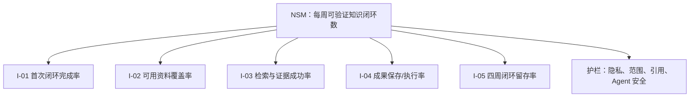

# 个人知识工作台指标体系（v2 草案）

> 对应需求：[PRD v5 草案](PRD-v5-DRAFT.md) · [用户旅程 v2 草案](USER_JOURNEY-v2-DRAFT.md) · 文档版本：`v3.0-draft.1` · 更新日期：2026-08-24 · 状态：评审草案

> **文档边界：**本文定义 v2 目标口径和验收门槛，不代表已经取得相应结果。v1.x 的 4 周 PM 验证指标仍保留在 [METRICS.md](METRICS.md)，不得与本文数据混算。

## 1. 度量原则

1. 以用户完成可信知识任务为价值，不以导入文件数、图谱节点数、回答次数或 Agent 调用次数代替价值；
2. 自动测试、内部试用、外部用户行为和商业数据分层记录；
3. 所有百分比同时报告分子、分母、样本构成和观察周期；
4. PM/AI PM 可以作为一种任务样本，但不能成为唯一、默认或过半样本；
5. 本地优先产品默认只在本机保存必要事件；任何外部遥测需用户主动同意，且不得上传正文、绝对路径、密钥或完整查询；
6. 当前没有外部价值基线。未实测的数据标为“目标”或“待校准”，不能写成现状。

## 2. 产品类型与北极星指标

### 2.1 产品类型

本产品属于 **Productivity Game（生产力型产品）**：帮助用户更快、更可信地完成资料组织、查找、核验、连接和行动。速度本身不是最终价值，必须同时满足证据与控制要求。

### 2.2 北极星指标

> **NSM：每周完成的可验证知识闭环数（Weekly Verified Knowledge Loops，WVKL）**

一次闭环只有同时满足以下事件才计数：

1. `knowledge_goal_started`：用户带着真实查询、理解或整理目标开始任务；
2. `scope_confirmed`：用户选择或确认知识空间和来源范围；
3. `evidence_opened`：用户打开支持结果的系统内原文锚点；
4. `knowledge_outcome_saved`：用户保存链接、反链、行动、笔记，或确认一个有审计记录的 Agent 操作；
5. 任务不是演示脚本、自动测试、重复事件或被取消的操作。

WVKL 采用“闭环”而不是“回答次数”，因为它同时反映检索价值、来源信任和实际行动。报告时必须同时提供：

- 完成至少 1 个 WVKL 的周活跃用户数；
- 每位完成用户的 WVKL 中位数；
- 不同任务类型和知识空间数量的分布；
- 因错误引用、范围错误或安全事件被剔除的闭环数。

### 2.3 北极星有效性检查

| 检查项 | 判断 |
|---|---|
| 是否反映用户价值 | 是；用户获得了可核验且被保存的结果 |
| 是否受产品直接影响 | 是；导入、检索、引用、链接和 Agent 共同影响 |
| 是否可持续增长 | 是；随真实知识任务和持续使用增长，而非依靠内容灌入 |
| 是否可理解 | 是；可以解释为“完成一次从问题到证据再到结果的闭环” |
| 是否可及时观测 | 是；本地事件可在每周汇总 |
| 是否适用于不同职业 | 是；与主题和职业无关 |
| 是否容易被刷高 | 有风险；通过排除演示/测试、要求原文打开和结果保存降低风险 |

## 3. 北极星输入指标

| ID | 输入指标 | 定义 | v2 草案目标 | 影响路径 |
|---|---|---|---:|---|
| I-01 | 首次有效闭环完成率 | 无维护者代操作完成首次 WVKL 的目标用户 / 开始真实建库的目标用户 | ≥80% | 激活 |
| I-02 | 可用资料覆盖率 | 支持等级内成功解析、索引且能定位的样本 / 全部应支持样本 | ≥95% | 供给与可靠性 |
| I-03 | 检索与证据任务成功率 | 限时内找到有效内容并打开正确锚点的任务 / 全部标准任务 | ≥90% | 查找与信任 |
| I-04 | 知识成果形成率 | 打开有效证据后保存成果或确认安全操作的任务 / 已打开有效证据任务 | 先记录基线 | 行动转化 |
| I-05 | 四周闭环留存率 | 首周完成 WVKL 且第 4 周再次完成 WVKL 的用户 / 首周完成用户 | 先记录基线 | 持续价值 |

## 4. 当前阶段唯一关键指标（OMTM）

M0 至 M1 验证阶段只使用一个首要决策指标：

> **OMTM：首次有效知识闭环自助完成率。**

原因：如果用户不能独立完成建空间、导入、查询、核验和保存结果，增加图谱、格式或 Agent 都只会放大复杂度。OMTM 必须在至少 3 类真实任务中验证，且 PM/AI PM 样本不得过半。

## 5. 目标与验收指标

### 5.1 PRD 关键结果

| ID | 指标定义 | 目标 | 最小证据要求 | 当前状态 |
|---|---|---:|---|---|
| KR-01 | 首次知识闭环成功率 | ≥80% | ≥10 名外部个人用户，覆盖 ≥3 类任务 | 未验证 |
| KR-02 | 多空间范围正确率 | 正确判断并执行当前/跨空间范围的任务 / 全部范围任务 | ≥90%，且至少包含 2 个空间 | 未验证 |
| KR-03 | 导入可靠性 | 支持等级内成功解析、索引和定位的样本 / 应支持样本 | ≥95%；部分失败可恢复 | 未验证 |
| KR-04 | 来源锚点准确率 | 打开后正确定位支持结论内容的引用 / 抽查引用 | ≥98%；覆盖 M1 格式 | 未验证 |
| KR-05 | 检索质量 | Recall@10、MRR、nDCG@10 | 冻结评测集后校准；新方案不得低于已接受基线 | 待校准 |
| KR-06 | 查询速度 | 从提交查询到可交互结果返回 | P95 ≤2 秒 | 设备、数据规模和冷热缓存需先冻结 |
| KR-07 | 可解释关系覆盖率 | 具有类型、方向、来源和可回跳证据的已展示事实关系 / 全部已展示事实关系 | 100% | 未验证 |
| KR-08 | Agent 安全 | 未确认写入、越权读取/写入、可撤销覆盖 | 前两项 0；可逆写操作撤销覆盖 100% | 未验证 |
| KR-09 | 可选模板闭环 | 启用指定模板后完成其标准任务的用户 / 开始模板任务用户 | ≥80%；不计入通用核心发布前置 | 未验证 |

### 5.2 导入与数据新鲜度

| ID | 指标 | 口径 | 目标/处理方式 |
|---|---|---|---|
| ING-01 | 批次成功率 | 无 P0 错误且至少一个文件可用的批次 / 全部批次 | 记录；不能掩盖单文件失败 |
| ING-02 | 单文件处理成功率 | 按格式分别统计解析、索引和锚点建立 | 支持等级内 ≥95% |
| ING-03 | 部分失败恢复率 | 用户通过重试、跳过或换方式解决的失败项 / 可恢复失败项 | 先记录基线 |
| ING-04 | 重复识别准确率 | 正确识别相同、更新或冲突的样本 / 全部重复样本 | 发布前冻结目标 |
| ING-05 | 索引新鲜度 | 来源变化到新版本可查询的时长 | 按数据规模报告 P50/P95 |
| ING-06 | 原文件完整性事件 | 未经确认修改、移动或删除源文件 | 0，发布否决 |

### 5.3 搜索、问答与来源

| ID | 指标 | 口径 | 目标/处理方式 |
|---|---|---|---|
| RET-01 | Recall@5/10 | 标准问题的相关内容是否进入前 5/10 | 冻结评测集后校准 |
| RET-02 | MRR / nDCG@10 | 首个相关结果位置与整体排序质量 | 冻结评测集后校准 |
| RET-03 | 无证据拒答准确率 | 无支持证据时正确拒答 / 无答案样本 | 发布前冻结目标 |
| RET-04 | 来源锚点准确率 | 引用打开到正确文档版本与具体位置 | ≥98% |
| RET-05 | 范围隔离错误 | 返回未授权或未选择空间内容的任务 | 0，发布否决 |
| RET-06 | 查询延迟 | 按关键词、语义、混合、问答分别记录 P50/P95 | 搜索 P95 目标 ≤2 秒 |
| RET-07 | 查询修正率 | 因结果无关而在短时间改写查询的任务 / 全部查询任务 | 诊断指标，不单独追求越低越好 |
| RET-08 | 原文打开率 | 有结果任务中打开来源锚点的任务 / 全部有结果任务 | 结合任务类型解释 |

### 5.4 链接与知识图谱

| ID | 指标 | 口径 | 目标/处理方式 |
|---|---|---|---|
| GRA-01 | 可解释关系覆盖率 | 已展示事实边中具有完整关系元数据和证据的比例 | 100% |
| GRA-02 | 建议关系采用率 | 用户确认或据此创建正式链接的建议 / 已审查建议 | 记录基线 |
| GRA-03 | 关系回跳成功率 | 从边或反链打开正确支持证据的次数 / 尝试次数 | ≥98% |
| GRA-04 | 关系发现任务成功率 | 用户通过图谱完成指定理解任务 / 全部图谱任务 | 先记录基线 |
| GRA-05 | 关系冲突解决率 | 被确认、拆分、合并或拒绝的冲突 / 已审查冲突 | 记录基线 |
| GRA-06 | 图谱规模 | 节点数和边数 | 仅作容量指标，不作价值 KPI |

### 5.5 Agent 效率与安全

| ID | 指标 | 口径 | 目标/处理方式 |
|---|---|---|---|
| AGT-01 | 计划理解率 | 用户能正确复述对象、变化和风险的任务 / 抽查任务 | 发布前冻结目标 |
| AGT-02 | 首次确认率 | 未修改计划即确认的任务 / 全部需确认任务 | 诊断计划质量，不追求 100% |
| AGT-03 | 任务净节省时间 | 同类手工总时长 - Agent 计划、审查和返工总时长 | 必须大于 0 才支持效率价值 |
| AGT-04 | 撤销成功率 | 成功恢复至操作前状态的可逆任务 / 撤销任务 | 100% |
| AGT-05 | 未确认写操作 | 未满足风险级确认规则却改变数据的操作 | 0，发布否决 |
| AGT-06 | 越权操作 | 读取或修改未授权空间、来源或对象 | 0，发布否决 |
| AGT-07 | 重试重复写入 | 因重试产生重复创建、移动或链接 | 0，发布否决 |
| AGT-08 | 用户返工率 | 需要手工修正 Agent 结果的任务 / 已执行任务 | 按工具和风险级别分析 |

### 5.6 留存与商业信号

| ID | 指标 | 口径 | 当前用途 |
|---|---|---|---|
| VAL-01 | 4 周闭环留存率 | 首周与第 4 周均完成 WVKL 的用户比例 | 验证持续价值 |
| VAL-02 | 第二空间激活率 | 首次闭环后建立并使用第二空间的用户比例 | 验证多空间真实需求 |
| VAL-03 | 跨格式闭环率 | 一次闭环使用两种以上格式证据的任务比例 | 验证多格式价值 |
| VAL-04 | 无维护者介入率 | 无项目所有者代操作完成任务的用户比例 | 验证自助性 |
| VAL-05 | 付费意愿证据 | 真实报价下的支付、预付或明确拒绝原因 | 不用口头“会考虑”代替 |
| VAL-06 | 推荐/导出行为 | 完成脱敏分享、导出或主动推荐 | 辅助信号，不替代留存 |

## 6. 发布护栏与否决项

| 类别 | 护栏 | 门槛 |
|---|---|---:|
| 数据安全 | 原文件未经确认被修改、移动或删除 | 0 |
| 范围隔离 | 搜索、问答或 Agent 串库/越权 | 0 |
| Agent 控制 | 未确认写入或不可恢复的误操作 | 0 |
| 隐私 | 本地模式静默联网；密钥、绝对路径或正文进入公开日志 | 0 |
| 引用 | 错误文档或错误位置被当成有效证据 | 必须可识别并低于冻结门槛；关键样本 0 |
| 关系可信 | 建议关系未标注却显示为事实 | 0 |
| 恢复 | 应持久化的导入、索引和 Agent 任务在重启后丢失 | 0 |
| 可访问性 | 键盘、焦点或屏幕阅读阻断核心闭环 | 0 个阻断缺陷 |

任何否决项发生时，不得用 WVKL 增长、响应速度或自动化测试通过抵消。

## 7. 证据等级

| 等级 | 证据 | 能支持的结论 |
|---|---|---|
| E1 | 外部个人用户的真实行为、留存、付费或拒绝数据 | 用户价值、市场和商业判断 |
| E2 | 当前代码、自动化测试、冻结评测集和可复现环境 | 实现、质量和性能判断 |
| E3 | 项目所有者长期使用、访谈陈述或内部 Dogfood | 问题假设与优先级 |
| E4 | 原型、需求推演、竞品桌研和设计评审 | 方向、风险和待验证假设 |

同一指标必须标记证据等级。例如，“内部样本锚点准确率 98%（E2）”不能改写为“98% 用户能找到原文（E1）”。

## 8. 最小事件与隐私字段

### 8.1 核心事件

| 事件 | 触发条件 | 最小参数 | 用途 |
|---|---|---|---|
| `workspace_started` | 本地工作区进入可用状态 | mode、version、time | 设置漏斗 |
| `space_created` | 创建知识空间 | anonymous_space_id、time | 多空间激活 |
| `source_import_started` | 用户确认导入 | source_type、format_counts、copy_mode | 导入漏斗 |
| `source_import_completed` | 批次结束 | result_counts、duration、failure_categories | ING 指标 |
| `knowledge_goal_started` | 发起真实查询或整理任务 | task_type、scope_count、time | WVKL 起点 |
| `scope_confirmed` | 查询/Agent 范围生效 | scope_count、cross_space | 范围理解 |
| `search_completed` | 搜索返回或失败 | strategy、duration、result_count、failure_category | RET 指标 |
| `evidence_opened` | 打开系统内原文锚点 | format、anchor_type、result | WVKL/RET |
| `link_saved` | 创建或确认链接 | relation_type、source_kind | WVKL/GRA |
| `agent_plan_reviewed` | 用户审查计划 | risk_level、action_count、decision | Agent 质量 |
| `agent_action_completed` | 操作完成 | risk_level、result_counts、undo_available | WVKL/安全 |
| `knowledge_outcome_saved` | 保存链接、行动、笔记或已确认操作 | outcome_type | WVKL 终点 |
| `undo_completed` | 撤销执行结束 | action_type、result | AGT-04 |
| `safety_event_recorded` | 发现范围、隐私、写入或数据损失问题 | category、severity、build | 发布护栏 |

### 8.2 禁止采集

- 笔记正文、问题全文、回答全文或 OCR 全文；
- 用户姓名、公司、电话、邮箱等直接身份信息；
- 绝对路径、本地用户名、模型密钥和访问令牌；
- 未经同意的第三方遥测；
- 能反推出私人项目内容的文件名、空间名或来源标题。

本地调试确需查看内容时，使用独立、明确授权的诊断导出，不混入产品指标。

## 9. 评测集与报告规范

### 9.1 冻结评测集

评测集至少包括 Markdown、TXT、可选中文本 PDF，以及 M2 的表格和图片样本；覆盖精确术语、同义改写、跨文档综合、无答案、相似干扰、中文/英文/混合文本和空间隔离。数据集、相关性标注、设备和软件版本必须版本化。

### 9.2 外部验证样本

- 至少覆盖 3 类真实任务；
- PM/AI PM 不得成为唯一、默认或过半样本；
- 同时记录知识空间数量、格式组合和原有工作方式；
- 先报告绝对数量和失败原因，再报告百分比；
- 项目所有者代操作的任务不能计为“自助完成”。

### 9.3 报告模板

每次评审至少报告：版本、时间、设备/数据规模、样本构成、指标定义版本、分子/分母、P50/P95、失败分类、证据等级、是否触发否决项和下一决策。

## 10. 阶段决策门槛

| 决策 | 最低条件 |
|---|---|
| M0 → M1 | 指标定义、事件隐私、评测集结构和发布否决项通过评审 |
| M1 → M2 | I-01、KR-02、KR-03、KR-04 达到当前门槛；无否决事件 |
| M2 → M3 | 检索基线冻结且改善有证据；关系可解释覆盖 100%；图谱任务显示实际价值 |
| M3 → M4 | 多格式样本通过；Agent 未确认写入/越权为 0；撤销覆盖 100%；净节省时间为正 |
| M4 → M5 | 至少一个非 PM 模板或无模板任务走通通用核心；模板不引入职业专用底层对象 |
| 个人版发布 | 首次闭环、4 周留存、性能、隐私、迁移和可访问性共同达标，无发布否决项 |
| 团队方向研究 | 个人版持续价值成立，且团队需求、权限和付费主体获得独立 E1 证据 |

阶段顺序与候选交付详见 [ROADMAP-v2-DRAFT.md](ROADMAP-v2-DRAFT.md)。

---

*v3.0-draft.1：建立不限职业的生产力北极星、输入指标、质量评测、Agent 安全护栏和多场景证据规则。*
