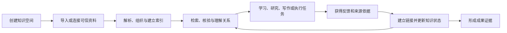

# 个人知识工作台市场需求文档（MRD，v2 工作名）

> 文档导航：[产品文档索引](README.md) · [BRD](BRD.md) · [现行 PRD v4](PRD.md) · [PRD v5 草案](PRD-v5-DRAFT.md)

| 文档属性 | 内容 |
|---|---|
| 文档版本 | v3.2 |
| 当前仓库名 | `pm-knowledge-hub`；不代表 v2 用户边界 |
| 产品阶段 | v2 通用个人知识工作台定义；目标用户不设职业边界 |
| 产品负责人 | 项目所有者 |
| 创建日期 | 2026-06-29 |
| 本次修订 | 2026-08-24 |
| 研究截止日 | 2026-07-27 |
| 当前状态 | 有效；v2 产品方向已确认，新增市场需求仍待外部验证 |
| 上游依据 | [BRD.md](BRD.md) |

---

## 1. 执行结论

### 1.1 本文回答的问题

本 MRD 回答八个市场问题：

1. 在线学习市场已经有哪些主要商业形态？
2. “不同人群、不同资料、个性化学习”是否仍有市场机会？
3. 哪类客户的需求与现有产品最匹配？
4. 如何保留现有 PM/AI PM 场景，而不让它继续限制 v2 的目标用户？
5. 综合内容平台、个性化学习系统和人工私人定制之间应如何选择？
6. 在扩展人群和引入内容供给方前，需要获得哪些证据？
7. 多知识空间、多格式、系统原生反链、知识图谱和混合检索是通用底座，还是只属于 PM 场景？
8. Agent 在个人知识管理中应解决什么任务，哪些操作必须由用户控制？

### 1.2 市场判断

- 在线学习和 AI 个性化学习需求已经被大型平台验证，但同时也是高度拥挤的市场。
- Coursera、Udemy 等拥有课程、大学、企业、讲师、证书和分发网络；新进入者不适合正面竞争内容数量。
- Duolingo、Khan Academy、有道等依靠垂直内容、教研数据和长期用户行为提供自适应学习，新进入者难以快速复制。
- Google NotebookLM、Quizlet 等已经能把用户资料转成学习指南、测验和闪卡，说明“用户自带资料学习”是现实需求，也意味着简单的 AI 内容生成不是市场空白。
- 当前可进入的机会不是“做一个覆盖所有人的课程网站”，而是：**为拥有多个主题和多种格式资料的个人用户提供本地优先的知识工作台，解决组织、检索、核验、连接和受控行动这条共同任务链。**
- 目标用户按问题和任务定义，不按职业定义。PM/AI PM、Agent 学习、研究、项目管理、职业学习和兴趣知识都是可参与首发验证的场景。
- 多知识空间、多格式、原生反链、混合检索、真实关系图谱和受控 Agent 是跨场景基础能力，不等于通用市场需求已经被验证。
- Obsidian 可以作为来源和兼容对象，但不能成为用户使用产品的前提；系统需要拥有独立的文档标识、链接和来源定位模型。
- 团队知识库属于相邻市场。个人知识库的可用性、检索质量和数据安全未成熟前，不进入团队协作、权限和多租户开发。
- 长期可扩展市场应按共同任务链而非人口标签定义：职业转型、岗位提升、专业证书和项目型学习均可能适用，但必须逐个验证。
- 当前已确认的长期用户样本仍只有项目所有者本人，不能据此推导大众市场规模或付费意愿。

### 1.3 市场策略

> **产品定位为“本地优先的个人知识工作台”，面向需要管理多个主题和多种格式资料的个人用户；PM 面试只是现有内置模板，不是用户边界或商业入口。**

市场进入顺序：

1. 完成多知识空间、统一文档模型和本地数据边界；
2. 让用户用 Markdown、PDF、表格和图片等资料完成导入、检索、核验和连接；
3. 完善系统原生反链、混合检索和可解释知识图谱；
4. 在受控 Agent 的帮助下完成查询、整理和用户自定义操作；
5. 同时从个人知识管理、AI/Agent 学习、职业学习/PM、研究或项目中覆盖至少 3 类真实任务；
6. 比较不同任务的首次闭环、重复使用、付费意愿和核心复用度；
7. 个人价值成立后，才验证团队空间、专家、创作者和机构供给。

---

## 2. 研究范围与证据质量

### 2.1 研究范围

本次研究覆盖五类相邻市场：

- 个人知识管理与本地笔记；
- 基于用户资料的 AI 学习与研究；
- 在线课程、职业技能和证书平台；
- 垂直自适应学习与 AI 辅导；
- AI 面试、练习与职业成果训练。
- 多来源、多格式的个人知识工作台；
- Agent 驱动的个人文件与知识管理。

暂不对以下市场作进入判断：

- K12 全学科教育；
- 学校教学管理系统；
- 企业知识管理平台；
- 团队知识库、协作文档和企业权限系统；
- 纯兴趣内容社区；
- 招聘撮合和人才测评平台。

### 2.2 研究方法

| 方法 | 样本 | 用途 |
|---|---|---|
| 内部资产盘点 | 204 篇笔记、现有产品和验收记录 | 确认产品起点与可复用能力 |
| v2 产品方向决策 | 项目所有者提出的多空间、多格式、反链、图谱、检索、Agent 和团队后置要求 | 确定产品假设；不能替代外部市场证据 |
| 官方产品与经营资料 | Coursera、Duolingo、Khan Academy、NotebookLM、Quizlet、有道等 | 核验市场形态、能力和进入壁垒 |
| 相邻工具研究 | Obsidian、Notion、ChatGPT Projects、Yoodli | 核验用户当前替代工作流 |
| 创始用户观察 | 项目所有者本人 | 形成初始任务和问题假设 |
| 桌面研究 (Desk Research) | V2EX、知乎、牛客网等公开社区讨论 | 提取目标用户高频痛点，弥补缺乏直接访谈的局限，详见 [Community_Research_Report.md](Community_Research_Report.md) |
| 外部用户访谈 | 尚未执行（暂由桌面研究和AI模拟走查替代） | 验证问题普遍性、频率和替代方案满意度 |
| 真实资料试用 | 尚未执行 | 验证导入意愿、个性化价值和隐私顾虑 |
| 付费测试 | 尚未执行 | 判断是否存在可持续商业空间 |

### 2.3 证据等级

| 等级 | 定义 | 本文用法 |
|---|---|---|
| E1 已验证外部事实 | 官方资料、经营披露或可复查产品说明 | 可用于判断市场存在、竞品能力和行业门槛 |
| E2 已验证内部事实 | 运行记录、知识资产和产品验收记录 | 可用于判断当前起点，不能证明外部需求 |
| E3 单用户证据 | 项目所有者真实使用和观察 | 可形成产品假设，不可外推 |
| E4 桌面研究数据 | 公开社区讨论的二手资料分析 | 可补充验证真实用户痛点，作为直接访谈前的次级研究 |
| H 待验证假设 | 尚无访谈、行为、留存或付费证据 | 必须进入验证计划 |

### 2.4 证据限制

- 注册用户、月活用户和企业客户数量只能证明市场规模和竞品实力，不能证明本产品会获得用户；
- 竞品提供某项功能只能证明任务存在，不能证明该功能本身能收费；
- AI 生成学习资料不等于学习效果改善；
- 用户口头表达兴趣不等于导入资料、持续使用或付款；
- 在缺少可靠人群数量、转化率和付费数据前，不提供虚构的 TAM、SAM、SOM。

---

## 3. 市场结构

### 3.1 市场不是单一赛道

“面向不同人群提供不同学习资料，再进行个性化学习”至少包含三门不同的生意：

| 市场形态 | 核心资产 | 代表方案 | 主要进入壁垒 |
|---|---|---|---|
| 内容与证书平台 | 大规模课程、讲师、院校、证书和分发 | Coursera、Udemy | 版权与供给、品牌、渠道、企业销售、规模获客 |
| 垂直自适应学习 | 专业教研、结构化知识、题库和行为数据 | Duolingo、Khan Academy、有道 | 教研质量、数据规模、评价体系、长期留存 |
| 用户自带资料学习 | 用户资料、来源理解、生成与交互体验 | NotebookLM、Quizlet | 激活成本、长期记忆、学习效果、通用平台竞争 |

PM Knowledge Hub 更适合第三类市场，并通过第一类的专业学习包和第二类的目标评价方法增强价值；不适合从第一天同时经营三类业务。

### 3.2 市场规模与竞争强度信号

- Coursera 在 2026 年第一季度披露累计注册学习者达到 2.05 亿；2026 年完成与 Udemy 的合并，双方 2025 年合计年收入超过 15 亿美元。这表明职业在线学习需求巨大，也表明综合平台竞争需要远超个人项目的供给和资本能力。
- Duolingo 截至 2025 年第四季度披露 1.331 亿月活、5270 万日活和 1220 万付费用户，并从语言扩展至数学、音乐和国际象棋。这说明“先建立垂直优势，再扩展相邻学习领域”比起步即覆盖所有人群更可行。
- 好未来披露其 AI 学习设备在 2025 年 2 月最后一个自然周达到 110 万周活设备，并拥有自研、采购或授权的内容体系。这说明 K12 个性化学习依赖内容、硬件、教研和规模化运营的组合。

这些数据不用于估算本产品收入，只用于判断市场成熟度和进入壁垒。

### 3.3 结构性机会

大型平台的优势集中在内容和分发，通用 AI 工具的优势集中在生成和问答。两者之间仍存在以下待验证机会：

- 用户有大量自己的资料，但不愿整体迁移到一个课程平台；
- 用户的目标来自具体岗位、证书、项目和时间约束，而不是“浏览感兴趣内容”；
- 用户需要系统记住其掌握程度、错误和反馈，而不是每次重新提问；
- 用户需要以真实来源为依据形成练习和成果；
- 用户需要在多个来源之间建立一条学习路径；
- 用户需要把 PM、Agent、研究或其他主题放在不同知识空间中，而不是混在单一目录和索引里；
- 用户需要从搜索结果和 AI 回答精确返回系统内原文，必要时再打开本地源文件；
- 用户需要区分手工链接、文档引用、实体关系和 AI 推断，而不是接受无法解释的图谱连线；
- 用户可能希望用自然语言批量整理知识，但不会因此接受 Agent 越权修改或删除文件；
- 用户重视私人资料控制，希望理解哪些内容离开本地；
- 专业创作者可能擅长内容和评价，却没有能力独立开发个性化学习产品。

---

## 4. 市场任务定义

### 4.1 共同 Job to Be Done

本产品未来市场不以“学生、职场人、兴趣人群”这样宽泛的人口分类定义，而以共同任务定义：

> 当我需要在有限时间内达到一个明确的职业或学习目标时，我希望系统理解我已有的资料、当前水平和时间约束，为我安排下一步学习与练习，并根据结果持续调整，使我不必在课程、笔记、AI 和手工计划之间反复组织。

### 4.2 通用学习任务链

### 4.3 当前 PM 任务链

当前 PM 场景是通用任务链的一个具体实例。未来扩展必须证明新细分也能复用该闭环。

---

## 5. 市场细分

### 5.1 细分矩阵

| 细分 | 典型目标 | 问题强度 | 与现有资产匹配度 | 当前证据 | 决策 |
|---|---|---:|---:|---|---|
| S1 多主题个人知识管理者 | 管理学习、研究、项目和 Agent 等不同资料 | 中至高 | 高 | E3；外部价值 H | **首发目标用户** |
| S2 目标导向的学习者与研究者 | 课程、证书、论文、专题研究或能力提升 | 中至高 | 中高 | H | **首发验证用户** |
| S3 重视隐私的知识工作者 | 管理个人工作资料、项目文档和敏感经验 | 中至高 | 中高 | H | **首发验证用户** |
| S4 PM/AI PM 学习与求职者 | 面试、转岗、能力提升、作品展示 | 高 | 高 | E3：现有实现 | 现有内置场景，不是市场边界 |
| S5 Agent/AI 学习者 | 管理框架、论文、工具、代码和实践记录 | 中至高 | 中高 | H；项目方向明确 | 首发场景样本之一 |
| S6 一般自主学习者 | 兴趣或开放式知识学习 | 低至中 | 中 | H | 目标不明确、付费弱，不优先 |
| S7 专家和内容创作者 | 将专业方法包装为可交付学习产品 | 供给侧 | 低 | H | 需求侧成立后验证 |
| S8 培训机构、高校和企业 | 批量学习、管理和效果报告 | 中至高 | 低 | H | 后期团队与机构市场 |
| S9 K12 学习者、家长和学校 | 全学科成绩与教学管理 | 高 | 低 | E1 市场成熟；无内部能力 | **近期排除** |

### 5.2 首发用户画像

**角色名称：需要管理多个主题和多种格式资料的个人用户**

| 维度 | 描述 |
|---|---|
| 触发事件 | 新增学习或研究主题、资料跨工具增长、需要快速核验、准备项目或成果任务 |
| 已有资产 | Markdown/Obsidian、PDF、表格、图片、课程资料、研究材料、项目经历或工作文档 |
| 当前替代方案 | 文件夹、笔记搜索、通用 AI、来源型 AI、表格和手工整理 |
| 核心约束 | 资料分散；格式不同；不愿整体迁移；重视隐私；希望保留原有结构 |
| 成功结果 | 分空间管理资料，快速找到并核验原文，理解关系并完成学习、研究或项目行动 |
| 购买者 | 当前假设为本人；独立付费尚未验证 |

### 5.3 首发验证覆盖规则

首发不限制职业，但也不等于同时满足所有人群。样本必须围绕同一底层任务链，并满足：

- 用户拥有两个以上主题或一批跨格式资料；
- 需要完成组织、检索、核验、连接或受控行动中的多个步骤；
- 用户愿意导入真实或脱敏资料；
- 核心流程可以直接复用，不需要开发职业专用产品；
- 验证样本至少覆盖 3 类任务，例如个人知识管理、AI/Agent 学习、职业学习/PM、研究或项目；
- 每类任务分别记录首次闭环、两周使用、检索质量和付费意愿；
- 监管、未成年人保护和版权风险可控。

依据以上规则，PM/AI PM 可以作为一类样本，但不能成为唯一、默认或过半的验证来源。暂不优先 K12 全学科、团队协作和开放内容平台。

### 5.4 市场规模结论

| 层级 | 当前结论 |
|---|---|
| 已确认用户 | 1 名长期用户，即项目所有者 |
| 当前可验证用户 | 有多主题、多格式个人资料，并需要组织、检索、核验、连接或行动的个人用户 |
| 首发验证覆盖 | 至少 3 类知识任务，不按职业设限 |
| 长期可服务市场 | 有个人资料控制、可信查询、知识关系和持续行动需求的个人用户 |
| 供给侧市场 | 专家、创作者、培训机构和企业 |
| 商业市场规模 | 未知；缺少细分人群、问题频率、留存和付费数据 |

---

## 6. 市场需求

### 6.1 v1.x 历史需求

为保持与现有 [PRD.md](PRD.md) 的可追溯性，`MR-01` 至 `MR-06` 保留为 v1.x PM 工作台的历史需求，不再定义 v2 目标用户边界。

| ID | 市场需求 | 优先级 | 当前证据 |
|---|---|---|---|
| MR-01 | 延续现有个人知识资产，不要求整体迁移到新的内容系统 | Must | 单用户验证 |
| MR-02 | 从问题快速回到可核验的原始资料，而不只获得生成答案 | Must | 单用户验证；相邻市场 E1 |
| MR-03 | 将练习结果转化为明确的补弱方向和后续行动 | Must | 单用户验证 |
| MR-04 | 对私人资料、模型调用和公开内容保持透明控制 | Must | 单用户验证；风险明确 |
| MR-05 | 让外部评审者在有限时间内理解学习成果和个人贡献 | Should | 待外部评审 |
| MR-06 | 降低初次配置、资料导入和持续维护成本 | Should | 待外部用户验证 |

### 6.2 v2 个人知识工作台需求

以下需求来自已确认的产品方向和当前系统缺口。它们可以进入 [PRD v5 草案](PRD-v5-DRAFT.md)，但其外部频率、付费价值和长期留存仍按 `H` 处理：

| ID | 市场需求 | 产品意义 | 当前证据 |
|---|---|---|---|
| MR-14 | 在一个个人工作区中建立多个知识空间，并按主题、项目或目标分层管理 | 不再把 PM 和单一目录写死，为场景包与未来迁移建立边界 | 产品方向已确认；外部价值 H |
| MR-15 | 导入 Markdown、PDF、表格、图片等资料，并在不同格式下保持统一浏览、检索和引用 | 降低资料整理与工具切换成本 | 产品方向已确认；格式优先级 H |
| MR-16 | 从搜索结果、回答和图谱精确返回系统内原文；本地来源可在授权后打开原文件 | 建立证据闭环，避免只有文件级模糊引用 | 当前引用能力 E2；跨格式精确定位 H |
| MR-17 | 在系统内创建、展示和维护链接与反链，不要求用户使用 Obsidian | 让关系成为产品资产而非来源工具副作用 | 产品方向已确认；使用价值 H |
| MR-18 | 支持关键词、向量、过滤、重排等组合检索，并以基准集持续评估速度和质量 | 扩大可查询内容并控制规模增长后的体验退化 | 当前向量与子串检索 E2；混合检索 H |
| MR-19 | 图谱呈现空间、目录、文档、内容块、实体和关系的真实结构，并标识关系来源与可信度 | 解决当前标题和关键词连线无法表达知识结构的问题 | 当前图谱缺口 E2；目标价值 H |
| MR-20 | 用户可通过 Agent 查询、整理和执行自定义知识操作；写操作必须预览、确认、撤销和审计 | 降低维护成本，同时控制误操作与越权 | 产品方向已确认；效率价值 H |
| MR-21 | PM 面试训练作为现有可选 Agent 模板，支持多轮追问、引用个人证据和把反馈沉淀为后续行动 | 保留已有能力并验证“通用核心 + 场景模板”，不限制其他用户 | 单轮能力 E2；多轮闭环 H |
| MR-22 | 未来可扩展团队空间、成员权限和共享知识，但不进入个人知识库当前验收 | 避免底层模型封死，又防止近期范围失控 | 长期方向；市场证据 H |

### 6.3 长期学习系统需求

以下需求用于指导市场验证，不直接进入当前 PRD：

| ID | 市场需求 | 商业意义 | 进入产品的前提 |
|---|---|---|---|
| MR-07 | 根据目标、基础、期限和可投入时间形成个性路径 | 区别于静态资料库 | 个性路径能改善完成率 |
| MR-08 | 持续记录掌握程度、错误、反馈和进步 | 支撑长期留存和个性化 | 用户同意并持续使用 |
| MR-09 | 根据学习表现调整顺序、难度和练习方式 | 形成真实自适应，而非表面个性化 | 评价准确性得到验证 |
| MR-10 | 用统一标准将不同职业内容包装为学习包 | 支撑低成本市场扩张 | 至少两个细分复用成功 |
| MR-11 | 支持专家或机构发布、维护和评价学习包 | 建立第三方供给 | 需求侧稳定且有供给意愿 |
| MR-12 | 输出可被本人、导师或机构理解的成果证据 | 支撑求职、证书和企业采购 | 成果指标与真实目标相关 |
| MR-13 | 在隐私、便利和模型能力之间提供可理解选择 | 建立可信的付费分层 | 用户选择行为得到验证 |

### 6.4 个性化的市场验收定义

“个性化学习”不能仅指生成不同措辞。市场价值至少应体现在：

- 不同基础的用户获得不同起点；
- 不同目标和期限获得不同学习顺序；
- 练习结果会改变后续任务和难度；
- 系统能记住已掌握内容和反复错误；
- 解释和练习基于用户选择的可信资料；
- 用户能看到系统为何推荐下一步，并可以调整；
- 个性化使完成率、效率或成果质量至少一项明显改善。

---

## 7. 竞争与替代方案

### 7.1 综合内容与职业学习平台

| 方案 | 已确认的市场能力 | 核心优势 | 对本产品的含义 |
|---|---|---|---|
| Coursera + Udemy | 大规模课程、证书、企业学习、AI 辅导和课程建设；合并后 2025 年合计收入超过 15 亿美元 | 内容供给、大学与企业合作、品牌和全球分发 | 不竞争课程总量；寻找内容之外的个人资料和学习闭环 |
| Coursera Coach | 基于课程内容提供学习辅助、实时反馈、职业指导和互动教学 | 课程上下文、教学研究和规模用户 | 通用“AI 学习教练”已被大型平台覆盖 |
| Udemy AI | 课程问答、个性化测验、技能映射和企业学习路径 | 讲师市场、企业客户和技能内容 | 企业个性学习需要内容、技能模型和组织数据 |

### 7.2 垂直自适应学习

| 方案 | 已确认的市场能力 | 核心优势 | 对本产品的含义 |
|---|---|---|---|
| Duolingo | 语言、数学、音乐和国际象棋；AI 扩大内容生产和对话练习 | 极强的习惯、游戏化、内容结构和行为数据 | 证明“垂直先行、再扩相邻领域”的路径 |
| Khanmigo | AI 导师与教师助手；根据兴趣、对话和学习历史调整辅导 | Khan Academy 内容、教学法和学校场景 | 学习历史和教学行为比通用聊天更重要 |
| 网易有道 | 全学段答疑、题库、知识图谱、学习画像、个性路径和教育解决方案 | 长期教研、题库、硬件、学校和家庭渠道 | K12 不是个人项目适合进入的早期市场 |

### 7.3 用户自带资料学习

| 方案 | 已确认的市场能力 | 核心优势 | 对本产品的含义 |
|---|---|---|---|
| Google NotebookLM | 从用户来源生成学习指南、闪卡、测验和引用；Learning Guide 进行引导式辅导 | 通用来源理解、多模态生成和 Google 生态 | 是最接近的通用替代品；仅生成学习资料不足以差异化 |
| Quizlet | 从笔记、课件和 PDF 生成学习指南、练习题、闪卡和辅导 | 大量学习集、主动回忆工具和学生品牌 | 学习准备自动化已成熟；需要在目标和长期反馈上形成区别 |
| Obsidian | 本地 Markdown、搜索、链接、标签和图谱 | 数据所有权、插件生态和个人知识工作流 | 可作为资料层与渠道，不应重复建设笔记工具 |
| Notion AI | 工作区和连接来源搜索、引用和协作 | 工作空间、团队协作和内容组织 | 托管便利和协作是本地产品的潜在弱点 |
| ChatGPT Projects | 文件、对话、指令和长期任务上下文 | 通用模型能力和低学习门槛 | 通用 AI 会持续覆盖基础问答和计划生成 |

### 7.4 练习与职业结果工具

| 方案 | 已确认的市场能力 | 核心优势 | 对本产品的含义 |
|---|---|---|---|
| Yoodli | 面试练习、追问和沟通反馈 | 语音交互、专项训练和低压力练习 | 面试训练不是空白市场；应连接个人资料和后续补弱 |
| 通用 AI 对话 | 模拟面试、解释知识、生成计划 | 低成本、灵活、随手可用 | 单次问答和生成内容很难单独收费 |
| 人工导师 | 根据个人情况提供高质量反馈 | 判断力、情境理解和信任 | 可作为高价值补充，但不适合作为规模化主体 |

### 7.5 值得警惕的市场事实

Quizlet 曾推出独立 AI 导师 Q-Chat，但官方页面注明该功能已于 2025 年 6 月停止；Quizlet 同时继续提供练习、学习指南和闪卡等 AI 工具。由此可以推断：

- 一个会聊天的 AI 导师不等于稳定产品；
- 个性化必须嵌入高频学习行为，而不是成为孤立入口；
- 产品壁垒来自内容、任务、反馈、习惯和结果的组合；
- 不应把底层模型或单个 AI 功能作为商业成立依据。

### 7.6 事实型能力对比

“已确认”表示官方资料明确描述；“部分”表示可完成部分任务；“—”表示本次研究未确认，不代表绝对不具备。

| 方案 | 用户自带资料 | 来源追溯 | 学习路径 | 练习反馈 | 长期学习记忆 | 专门职业成果 |
|---|---|---|---|---|---|---|
| Coursera / Udemy | 部分 | 课程内 | **已确认** | **已确认** | 部分 | 课程与证书 |
| Duolingo / Khanmigo | 平台内容为主 | 平台内容 | **已确认** | **已确认** | **已确认** | 特定学科 |
| NotebookLM | **已确认** | **已确认** | 部分 | **已确认** | 笔记本上下文 | — |
| Quizlet | **已确认** | 部分 | **已确认** | **已确认** | 部分 | 考试学习为主 |
| Obsidian / Notion | **已确认** | **已确认或可回跳** | — | — | 内容长期保存 | — |
| Yoodli | 部分 | — | 训练流程 | **已确认** | 部分 | **面试与沟通** |
| PM Knowledge Hub 当前形态 | **已交付** | **已交付** | PM 场景部分交付 | 文本训练已交付 | 部分交付 | **PM 求职与作品** |

---

## 8. 市场定位与差异化

### 8.1 当前定位

> 对于已经维护个人 Obsidian/Markdown 资料、正在准备 PM 或 AI PM 面试与能力提升的用户，PM Knowledge Hub 是一个本地优先的职业学习工作台，帮助用户用自己的原始资料完成检索、核验、练习、反馈和补弱。不同于通用知识问答或独立面试工具，它把训练结果重新连接到个人来源和后续学习。

### 8.2 长期定位

> 对于需要管理多个知识主题和多种格式资料的个人用户，本产品是一个本地优先、来源可信、可持续演进的个人知识工作台，将分散资料转化为可检索内容、原生关系、知识结构和受控行动。对于有明确职业目标的学习者，它进一步把这些知识转化为个性路径、练习反馈和成果证据。

### 8.3 v2 目标定位

> **用自己的资料，建立真正属于自己的多个知识空间；任何答案都能回到原文，任何关系都能说明来源，任何 Agent 操作都在用户控制之下。**

这个定位包含三层：

1. **通用底座：**多知识空间、多格式、目录和文档、原生链接与反链、混合检索、知识图谱；
2. **智能层：**有证据的问答、关系建议、受控 Agent 和用户自定义操作；
3. **场景层：**PM 学习、面试训练、Agent 知识整理以及以后经验证的新场景包。

### 8.4 差异化优先级

| 差异化 | 当前重要性 | 长期防御性 | 说明 |
|---|---:|---:|---|
| 复用个人原始资料 | 高 | 中 | 通用工具也能导入，但迁移和组织成本仍有机会 |
| 来源可追溯 | 高 | 中 | 是信任基础，未来会成为行业标配 |
| 学习反馈回到下一步行动 | 高 | 高 | 从内容生成转向学习闭环 |
| 长期能力状态和学习记忆 | 中 | 高 | 能提高迁移成本并改善个性化 |
| 职业目标与评价标准 | 高 | 高 | 需要专业方法和结果校准 |
| 本地优先和数据控制 | 高 | 中高 | 对敏感资料用户有价值，但增加使用门槛 |
| 多职业学习包标准 | 低 | 高 | 只有跨市场复用后才成立 |
| 创作者和机构生态 | 低 | 高 | 只有需求侧规模形成后才成立 |
| 多知识空间与统一对象模型 | 高 | 中高 | 用户可管理不同主题，垂直场景不再要求代码分叉 |
| 系统原生链接与反链 | 高 | 中高 | 不依赖来源工具，跨格式关系可进入检索、问答和图谱 |
| 可解释知识图谱 | 高 | 中高 | 关系有类型、来源和置信度，不以标题相似代替知识结构 |
| 受控 Agent 操作 | 中高 | 中高 | 将自然语言转化为安全的知识维护行为 |

### 8.5 不采用的差异化表达

- “比所有平台功能更多”；
- “拥有更强的通用大模型”；
- “使用 RAG、知识图谱或 Agent”；
- “覆盖所有学习人群”；
- “无限生成个性化内容”；
- “保证通过面试或考试”。
- “自动替用户整理一切且不需要确认”；
- “支持团队”——在个人知识库尚未完善前不作为近期卖点。

---

## 9. 进入市场与扩展验证

### 9.1 首发个人用户验证

| 验证问题 | 方法 | 最低样本 | 进入下一阶段的信号 |
|---|---|---:|---|
| 用户是否经常遇到多主题、多格式资料难以组织和调用 | 问题访谈，不先展示产品 | 15 人，覆盖至少 3 类任务 | 至少 9 人过去 30 天遇到同类问题 |
| 替代方案是否需要多个工具拼接 | 追问最近一次真实行为 | 15 人 | 至少 8 人使用两个以上工具 |
| 用户是否愿意导入自己的脱敏资料 | 陪伴式真实试用 | 10 人 | 至少 7 人完成导入和首次闭环 |
| 检索、反链、图谱或 Agent 是否改变后续行动 | 两周行为试点 | 10 人 | 至少 6 人完成 4 次有效知识任务 |
| 用户是否愿意付款 | 试用后给出真实价格 | 10 人以上 | 至少 5 名非关联用户付款或付订金 |

### 9.2 多场景核心复用验证

首发验证同时覆盖不同任务，不等待 PM 场景先成立：

1. 从个人知识管理、AI/Agent 学习、职业学习/PM、研究或项目中选择至少 3 类任务；
2. 每类至少招募 5 名问题访谈对象，并从总体中招募真实资料试用者；
3. 全部使用同一工作区、空间、文档、检索、关系和 Agent 模型；
4. PM 面试可以使用模板，但不能要求其他场景先经过 PM 流程；
5. 比较各场景的首次闭环、两周重复使用、付费意愿和新增支持成本；
6. 如果某场景需要独立核心模型或大量专用开发，则作为独立产品机会评估，不反向限制通用核心。

### 9.3 用户自带资料价值表达实验

需要比较至少三种市场主张：

- A：把不同主题和格式的资料分空间管理；
- B：任何搜索和答案都能回到可信原文；
- C：用原生反链、图谱和受控 Agent 把资料转化为知识与行动。

测试指标包括：

- 落地页到试用转化；
- 用户愿意导入资料的比例；
- 首次有效闭环完成率；
- 两周重复使用；
- 付款和退款；
- 对隐私、便利和专业内容的优先级选择。

### 9.4 供给侧验证

在开发创作者平台前：

| 验证对象 | 关键问题 | 最小证据 |
|---|---|---|
| 职业导师 | 是否愿意把方法、任务和评价标准整理为学习包 | 5 人访谈，至少 1 个试制 |
| 内容创作者 | 是否认可订阅、买断或分成模式 | 至少 3 份明确意向 |
| 培训机构 | 是否需要自有资料、个性路径和效果报告 | 至少 3 家访谈 |
| 学习者 | 是否愿意为第三方专业学习包付款 | 至少 5 笔真实购买或预售 |

供给意向不能替代购买行为；平台开发必须以后者为前提。

---

## 10. 市场风险与应对

| 风险 | 影响 | 市场信号 | 应对 |
|---|---|---|---|
| PM 品牌继续制造用户限制 | 非 PM 用户误以为产品不适合自己 | 招募和反馈仍主要来自 PM 圈层 | v2 使用中性上层定位，PM 只作为模板和历史案例 |
| “不限职业”演变成“满足所有需求” | 定位和渠道失焦 | 每类用户都要求独立工作流 | 只服务多空间、多格式、可信检索、关系和受控行动这条共同任务链 |
| NotebookLM 等通用工具快速增强 | 基础能力商品化 | 用户用通用工具已完成大部分任务 | 聚焦目标评价、长期记忆和结果闭环 |
| 大型课程平台加入个性学习 | 内容优势进一步放大 | 平台将 AI 教练覆盖更多课程 | 不比内容量，连接用户自有与跨来源资料 |
| 用户不愿导入资料 | 自带资料模式失去基础 | 激活低、隐私顾虑高 | 渐进导入、本地模式、清楚授权与删除 |
| 个性化不能改善学习结果 | 用户不持续付费 | 对话多但完成率不变 | 用结果指标而非生成量评估 |
| 每个场景都需要重做产品 | 横向扩展不经济 | 独有需求和支持成本过高 | 停止该场景扩展或拆分独立业务 |
| 人工服务成为主要交付 | 毛利低、无法规模化 | 创始人时间随客户数线性增长 | 自动化高频任务，专家服务高价分层 |
| 创作者供给质量不稳定 | 信任与退款风险 | 来源不清、评价标准不一致 | 小规模邀请制、审核和可追溯来源 |
| K12 市场诱惑导致偏航 | 合规和组织复杂度失控 | 尚无能力却开始全学科扩张 | 明确列为近期排除市场 |
| 本地优先限制大众采用 | 可服务市场缩小 | 用户更偏好托管便利 | 测试托管层，不放弃透明数据边界 |
| 多格式承诺超过实际质量 | 首次导入失败、信任下降 | PDF、表格或图片只能导入但无法可靠检索和定位 | 按格式定义能力等级和验收样本，不用“支持”掩盖降级 |
| 图谱缺少真实关系依据 | 图谱成为装饰功能 | 节点很多但用户无法解释连线或回到证据 | 关系必须有类型、来源和置信度；标题相似不作为事实关系 |
| Agent 效率以失去控制为代价 | 用户不敢授权真实资料 | 误改、误删、越权访问或无法撤销 | 读取与写入分权，写操作预览、确认、撤销、审计 |
| 过早进入团队知识库 | 权限与云端复杂度拖慢个人价值 | 个人导入和检索尚不稳定就开发成员与协作 | 团队需求独立验证，并设置个人知识库成熟门槛 |

---

## 11. 待验证假设与决策问题

### 11.1 关键假设

| 假设 | 当前信心 | 需要的证据 |
|---|---|---|
| 不同职业和主题的个人用户存在相同知识任务 | 低 | 覆盖至少 3 类任务的问题访谈和最近行为 |
| 用户愿意导入自己的真实或脱敏资料 | 低 | 多场景真实资料试用 |
| 可信知识闭环优于单次 AI 问答 | 低 | 完成率、后续行动和结果对比 |
| 个人用户愿意为 Pro 使用周期付费 | 低 | 真实付款或订金 |
| 多主题使用能形成持续留存 | 低 | 单次任务结束后的继续使用和续费 |
| 不同场景可以复用同一个人知识核心 | 低 | 至少 3 类任务无核心代码分叉 |
| 创作者愿意提供结构化学习包 | 低 | 访谈、试制和商业意向 |
| 本地与隐私优势能够抵消配置摩擦 | 低 | 选择实验和转化数据 |
| 用户会长期维护两个以上知识空间 | 低 | 真实资料建库和两周使用记录 |
| 跨格式统一检索比单工具检索明显减少切换 | 低 | 对照任务时间、成功率和回跳行为 |
| 原生反链和可解释图谱能帮助发现遗漏关系 | 低 | 关系发现任务、采用率和回到原文比例 |
| 受控 Agent 能降低整理时间且不会降低信任 | 低 | 操作成功率、撤销率、授权率和误操作记录 |

### 11.2 待决策问题

- 当前产品名是否只服务 PM 品牌，长期是否需要独立的上层品牌？
- v2 首发是否先覆盖 Markdown/TXT/PDF，再逐步加入表格与图片 OCR？
- 本地文件采用“连接并保持原位”还是“复制进入工作区”，两种模式是否同时提供？
- 跨知识空间搜索默认关闭还是开启，用户如何理解查询范围？
- 哪些 Agent 写操作可以一次确认，哪些必须逐项确认或只能进入回收站？
- 首发验证的 3 类任务应如何组合，才能覆盖知识管理、学习和行动差异？
- 用户最愿意为多空间、多格式检索、原生关系、Agent 还是隐私控制付费？
- 使用周期包、年度订阅和本地买断能否共存？
- 托管便利层是否会显著提高激活，且不破坏数据控制定位？
- 专家点评应作为高价增值服务，还是用于提高学习包质量？
- 什么学习结果足以支持机构采购？

---

## 12. 研究来源

以下优先使用产品或企业官方资料：

### 12.1 综合职业学习平台

- [Coursera — 2026 年第一季度经营数据](https://investor.coursera.com/news/news-details/2026/Coursera-Reports-First-Quarter-2026-Financial-Results/default.aspx)
- [Coursera — 完成与 Udemy 的合并](https://investor.coursera.com/news/news-details/2026/Coursera-Completes-Combination-with-Udemy-to-Build-the-Worlds-Most-Comprehensive-Skills-Platform/default.aspx)
- [Coursera Coach — 个性化学习、职业指导与互动教学](https://blog.coursera.org/announcing-ai-powered-capabilities-enabling-educators-to-use-coursera-coach-to-deliver-interactive-personalized-instruction/)
- [Udemy Business — AI 个性化学习](https://business.udemy.com/spotlight/ai-enabled-learning/)

### 12.2 垂直与自适应学习

- [Duolingo — Company Strategy Overview](https://investors.duolingo.com/company-strategy-overview-0)
- [Khan Academy — Khanmigo 个性化兴趣](https://blog.khanacademy.org/new-khanmigo-interests/)
- [Khan Academy — 利用学习历史改进 AI 辅导](https://blog.khanacademy.org/how-khan-academy-is-building-a-better-ai-tutor-our-most-recent-learnings/)
- [网易有道 — AI 教育解决方案](https://ai.youdao.com/new/ai-education.s)
- [好未来 — 2025 Form 20-F](https://ir.100tal.com/static-files/d098ab68-8afd-4c08-92d6-0e186768da0e)

### 12.3 用户资料、知识与练习工具

- [Google NotebookLM — 学习指南、闪卡与测验](https://blog.google/innovation-and-ai/models-and-research/google-labs/notebooklm-student-features/)
- [Quizlet — AI 学习工具](https://quizlet.com/features/ai-study-tools)
- [Quizlet — Q-Chat 页面及停止说明](https://quizlet.com/blog/meet-q-chat)
- [Obsidian Search](https://obsidian.md/help/plugins/search)
- [Obsidian Graph view](https://obsidian.md/help/plugins/graph)
- [Notion Enterprise Search](https://www.notion.com/help/enterprise-search)
- [ChatGPT Projects](https://openai.com/academy/projects/)
- [Yoodli Overview](https://support.yoodli.ai/en/articles/9550461-yoodli-overview)

### 12.4 社区桌面调研与定性调研

- [真实用户痛点调研报告 (Social Listening Report)](Community_Research_Report.md)

---

## 13. 下游承接

- 当前 [PRD v4](PRD.md) 继续只承接 `MR-01` 至 `MR-06`，作为 v1.x 现状基线，不追加 v2 需求。
- [PRD v5 草案](PRD-v5-DRAFT.md) 承接 `MR-14` 至 `MR-21`，并把 `MR-22` 标记为未来架构约束而非当前交付范围。
- `MR-07` 至 `MR-13` 继续作为长期学习系统需求假设；它们不因通用知识底座立项而自动获得市场证据。
- [v2 路线图草案](ROADMAP-v2-DRAFT.md) 应安排多场景个人验证，不设置“先 PM、后其他用户”的职业顺序；不得把“平台化”直接排入近期版本。
- 团队知识库必须在个人知识库达到导入、检索、可追溯、稳定性和安全门槛后单独立项。
- 任何未来市场扩展必须更新本 MRD 的用户行为、付费、留存、复用成本和竞争证据。

---

*MRD v3.2 — v2 面向具有共同个人知识任务的用户，不设 PM/AI PM 职业边界；PM 只是现有模板和历史实现样本。*
