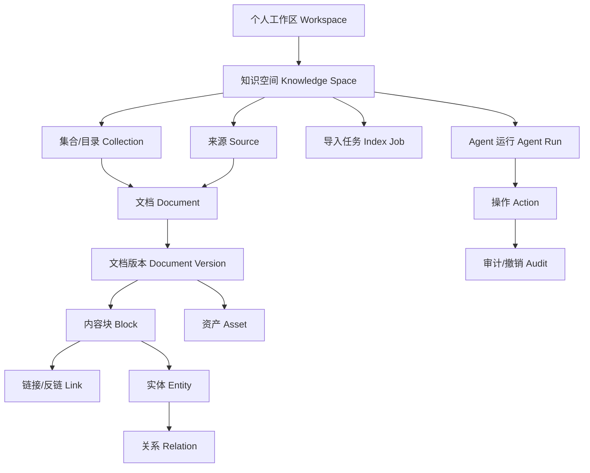
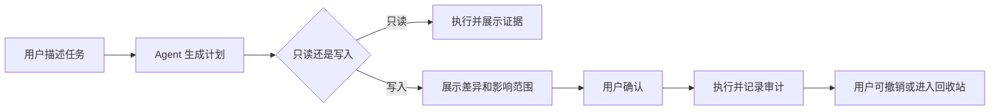

# 个人知识工作台产品需求文档（PRD v5 草案）

> 文档导航：[产品文档索引](README.md) · [BRD v5.2](BRD.md) · [MRD v3.2](MRD.md) · [现行 PRD v4](PRD.md) · [v1.x 归档基线](../archive/baselines/2026-08-24-v1.6.0-rc.1/BASELINE.md)

| 文档属性 | 内容 |
|---|---|
| 文档版本 | `v5.0-draft.7` |
| 目标产品版本 | `v2.0` |
| 当前运行基线 | `v1.6.0-rc.1` |
| 状态 | 产品定义草案；评审通过前不替代现行 PRD v4 |
| 产品负责人 | 项目所有者 |
| 协作角色 | 产品、设计、研发、测试、外部个人用户、评审者 |
| 创建日期 | 2026-08-24 |
| 上游依据 | [BRD v5.2](BRD.md) · [MRD v3.2](MRD.md) |
| 当前实现依据 | [现行 PRD v4](PRD.md) · [系统架构](../architecture/README.md) · [交付状态](../delivery/STATUS.md) |

> **重要边界：**本文描述 v2 目标产品。除明确标记“v1.x 已实现”的内容外，所有功能均不得写成已经交付。架构、原型、排期和代码必须在本文评审后分别承接。

---

## 1. Summary｜摘要

v2 将 PM Knowledge Hub 从“单一 Obsidian/Markdown 目录驱动的 PM 工作台”升级为“本地优先的个人知识工作台”。用户可以为 PM、Agent、研究、项目、职业学习或兴趣等主题建立多个知识空间，导入多种格式资料，在系统内部使用原生链接与反链、混合检索、可信问答、知识图谱和受控 Agent。

产品从 v2 起面向所有具有共同个人知识任务的用户，不按职业限制。PM 学习和面试训练保留为现有可选模板，Agent 学习、研究、项目和其他主题无需等待 PM 场景验证即可使用。团队知识库属于未来方向，不进入 v2 当前验收。

### 1.1 一句话定位

> 用自己的资料，建立真正属于自己的多个知识空间；任何答案都能回到原文，任何关系都能说明来源，任何 Agent 操作都在用户控制之下。

### 1.2 本文要解决的问题

1. 如何把单一 PM 目录升级为多个独立知识空间和分层目录；
2. 如何让 Markdown、PDF、表格、图片等格式进入统一产品体验；
3. 如何在系统内部实现双链、反链和精确原文定位，而不依赖 Obsidian；
4. 如何扩大可查询内容、控制查询速度并提高检索质量；
5. 如何让知识图谱呈现真实知识结构，而不是标题或关键词连线；
6. 如何引入 Agent 对话式管理和自定义操作，同时避免误改、误删和越权；
7. 如何保留 PM 面试训练优势，并让它成为可复用的场景包；
8. 如何为未来团队知识库预留边界，但不让当前版本失控。

---

## 2. Contacts｜角色与治理

| 角色 | 责任 | 决策范围 |
|---|---|---|
| 项目所有者 | 产品负责人、数据所有者、最终验收人 | 定位、范围、优先级、数据边界和发布 |
| 产品与设计维护者 | 维护需求、信息架构、原型和内容规范 | 交互方案与需求追踪 |
| 研发维护者 | 设计并实现模块、迁移和兼容策略 | 技术方案、风险和可行性 |
| 测试与评审者 | 建立样本集、验证核心流程和降级行为 | 验收证据与发布建议 |
| 个人试用者 | 使用真实或脱敏资料完成任务 | 问题、行为和价值证据 |

### 2.1 文档治理

- 评审通过前，`PRD.md` 仍是 v1.x 单一事实源，本文件只是 v2 草案；
- 本文评审通过后，先完成目标架构、数据模型、迁移计划和核心原型，再决定是否将本文件提升为正式 PRD；
- “已实现”“开发中”“规划中”“假设”必须明确区分；
- 市场方向、产品行为、技术实现和历史证据分别由 BRD/MRD、PRD、Architecture、Delivery/Quality 负责；
- 不在多个文件重复维护同一份详细验收标准，其他文档应引用需求 ID。

---

## 3. Background｜背景

### 3.1 当前基线

v1.x 已具备以下能力：

- 接入单一 Obsidian/Markdown 目录；
- 建立向量索引并进行语义或子串搜索；
- 浏览笔记、查看来源并进行有来源问答；
- 完成单轮文本面试反馈和部分复盘；
- 展示目录/笔记级知识地图；
- 以本地优先、降级模式和公开演示区分数据边界。

这些能力证明了端到端流程可运行，但当前产品模型存在根本限制：

- PM、Obsidian、Markdown 和单目录被写入核心流程；
- 缺少工作区、知识空间、统一文档对象和稳定内容标识；
- PDF、表格、图片不能进入一致的检索、引用和关系体验；
- 现有图谱主要依赖目录、学习路径、标题或关键词推断，无法表达真实知识结构；
- 搜索缺少标准化混合检索、重排和离线评测；
- 回答能显示来源，但缺少跨格式精确内容锚点和系统原生反链；
- 面试助手尚未成为多轮、可配置、能沉淀行动的 Agent；
- 缺少对 Agent 写操作的预览、确认、撤销和审计模型。

### 3.2 为什么现在调整

项目所有者已确认产品不会长期局限于 PM 工作台，并提出以下方向：

- 用户自行导入希望学习和管理的内容；
- 一个个人工作区中建立多个知识空间和分层目录；
- 支持 Markdown、PDF、Excel、图片等多格式资料；
- 重做知识图谱，使其呈现结构、来源和真实关系；
- 扩大知识查询范围，提高速度和质量；
- 在系统内部实现双链、反链和本地来源回跳；
- 引入 Agent，支持对话式管理、自定义操作和完善面试训练；
- 个人知识库成熟后再考虑团队知识库。

如果继续在 v1.x 单目录模型上增加功能，未来每增加一种格式、场景或协作方式都会放大迁移成本。因此 v2 必须先统一产品对象和数据边界。

### 3.3 产品原则

| 原则 | 要求 |
|---|---|
| 本地优先 | 用户知道数据存在哪里、哪些内容离开本地、如何删除和恢复 |
| 来源无关 | Obsidian、普通文件夹和上传文件都是来源，不是系统内部模型 |
| 证据优先 | 搜索、回答、关系和 Agent 结论尽可能回到具体原文位置 |
| 真实关系 | 图谱区分显式链接、引用、结构、实体关系和语义建议 |
| 范围可见 | 用户始终知道当前操作属于哪个知识空间和哪些资料 |
| 人在回路 | 读取可自动化；写入、移动、重命名和删除必须按风险确认 |
| 渐进支持 | 格式与高级能力分阶段上线，但统一对象模型从第一阶段建立 |
| 场景解耦 | PM 是场景包，不把 PM 字段和流程写进通用核心 |
| 团队后置 | 预留所有权边界，不提前开发成员、权限和多租户 |

### 3.4 证据边界

- 产品方向由项目所有者确认，属于已批准决策；
- v1.x 能力和缺口可由代码、测试和归档基线验证；
- 外部用户对多空间、多格式、反链、图谱和 Agent 的需求频率仍待验证；
- 性能指标是 v2 设计目标，必须在目标架构阶段基于基准设备和数据集校准；
- 本文不声称团队知识库、商业化或跨职业市场已经成立。

---

## 4. Objective｜目标

### 4.1 产品目标

在不要求用户采用特定笔记工具的前提下，让个人用户可以安全地建立多个知识空间，将不同格式资料转化为可浏览、可检索、可链接、可追溯、可对话和可行动的知识系统。

### 4.2 关键结果草案

以下是产品验收目标，不是当前实测结果。最终口径由 [v2 指标草案](METRICS-v2-DRAFT.md) 承接。

| KR | 目标 | 草案门槛 |
|---|---|---:|
| KR-01 首次知识闭环 | 新用户创建空间、导入资料、完成一次查询并回到原文 | 目标用户成功率 ≥80% |
| KR-02 多空间可理解性 | 用户能正确判断当前空间和搜索范围 | 标准任务正确率 ≥90% |
| KR-03 导入可靠性 | 支持等级内的样本被正确解析、索引和定位 | 成功率 ≥95%；部分失败可恢复 |
| KR-04 来源可追溯 | 搜索结果和有证据回答能打开正确原文锚点 | 准确率 ≥98% |
| KR-05 检索质量 | 标准问题的相关结果进入前列 | Recall@10、MRR、nDCG 达到基线门槛，具体值由评测集校准 |
| KR-06 查询速度 | 参考数据集上的本地搜索保持可交互 | P95 ≤2 秒，参考设备和规模待架构阶段冻结 |
| KR-07 关系可信 | 展示的关系具有类型、来源和可回跳证据 | 可解释关系覆盖率 100% |
| KR-08 Agent 安全 | 写操作经过规定确认且可以撤销 | 未确认写操作 0；越权操作 0；可撤销覆盖率 100% |
| KR-09 PM 场景闭环 | 面试反馈可引用个人证据并沉淀为复习行动 | 标准任务成功率 ≥80% |

### 4.3 非目标

v2 当前范围不包括：

- 团队成员、组织、角色权限、审批流和云端多租户；
- 实时多人编辑、评论、通知和企业身份登录；
- 完整替代 Obsidian、Notion、Word 或专业文件编辑器；
- 首个里程碑一次支持所有文件格式和所有边缘情况；
- 让 Agent 无确认地移动、重命名、覆盖或永久删除资料；
- 自营海量课程、开放学习包交易市场和复杂计费；
- 保证面试、考试、录用、涨薪或学习结果；
- 依靠未经核验的 AI 推断自动改写知识事实。

---

## 5. Market Segments｜市场细分与产品角色

### 5.1 首发目标用户

有多个知识主题或多种格式资料，需要完成组织、检索、核验、连接、学习、研究或项目行动的个人用户。目标用户由共同任务定义，不由 PM、AI PM 或其他职业名称定义。

### 5.2 场景覆盖与验证样本

典型知识空间可能包括：

- PM 知识与项目经历；
- Agent、AI 和工程学习资料；
- 研究主题与参考文献；
- 工作项目资料；
- 个人课程、证书或兴趣学习。

首发验证必须覆盖至少 3 类任务，且 PM/AI PM 不能成为唯一、默认或过半样本。各类用户使用相同核心对象和流程；场景差异通过模板、配置和 Agent 工具组合承载。

### 5.3 产品角色

| 角色 | 主要任务 | 当前版本 |
|---|---|---|
| 工作区所有者 | 管理本机个人工作区和数据边界 | v2 当前角色 |
| 知识空间维护者 | 建立目录、导入来源、处理失败和维护关系 | v2 当前角色 |
| 检索与学习者 | 搜索、问答、核验来源、建立理解和行动 | v2 当前角色 |
| Agent 操作者 | 发起自然语言任务、审查计划、确认或撤销操作 | v2 当前角色 |
| 场景模板使用者 | 使用 PM 面试、研究或其他可选模板完成专项任务 | v2 当前角色 |
| 团队成员/管理员 | 共享资料、管理成员和权限 | 未来角色，不进入当前验收 |

### 5.4 核心 Job to Be Done

> 当我的学习、研究和项目资料分散在不同目录与格式中时，我希望把它们放入边界清楚的知识空间，在需要时快速找到可信内容、理解相互关系、回到原文并安全地执行整理或学习行动，而不必更换所有原有工具或把控制权交给 AI。

---

## 6. Value Propositions｜价值主张

### 6.1 通用个人知识工作台

| 之前 | 产品如何帮助 | 之后 |
|---|---|---|
| PM、Agent、研究资料混在一个目录或多个工具 | 用多个知识空间和分层目录管理 | 每个主题边界清楚，需要时可跨空间搜索 |
| Markdown、PDF、表格和图片分别处理 | 统一成文档、内容块、资产和来源锚点 | 不同格式进入一致的浏览、检索和引用体验 |
| 搜索只能按文件名或单一向量相似度 | 关键词、向量、过滤和重排组合 | 更快找到相关内容，并知道为何命中 |
| AI 回答只有文件级来源或无法回跳 | 引用稳定内容块、页码、工作表或图片区域 | 可以核验答案并回到系统内容或本地文件 |
| 图谱只是好看的连线 | 关系带类型、来源、方向和置信度 | 图谱可以解释知识结构并支持导航 |
| 整理资料需要大量手工操作 | Agent 先展示计划，再执行可撤销操作 | 在保持控制的前提下降低维护成本 |

### 6.2 可选场景模板示例：PM 面试

PM 场景不是独立产品分支，而是基于通用能力提供：

- PM 能力结构和知识空间模板；
- 项目经历与知识证据关联；
- 多轮面试训练和追问；
- 引用个人资料的反馈；
- 将反馈转化为复习行动和知识关系；
- 可追溯的训练记录和结果导出。

### 6.3 替代方案与取舍

| 替代方案 | 优势 | 本产品不重复的部分 | 本产品尝试形成的价值 |
|---|---|---|---|
| Obsidian | 本地 Markdown、链接、插件和编辑体验 | 不重做完整笔记编辑器 | 跨格式、统一检索、证据问答和受控 Agent |
| NotebookLM 等来源型 AI | 低门槛、多来源理解和生成 | 不以单次生成能力竞争 | 多空间长期结构、原生关系、可控本地来源和场景行动 |
| Notion/团队知识库 | 托管、编辑和协作成熟 | v2 不开发团队协作 | 本地优先、个人资料边界和来源独立 |
| 通用 AI 对话 | 灵活、模型能力强 | 不承诺模型本身形成壁垒 | 稳定知识对象、可信证据和可审查工具操作 |
| 文件系统搜索 | 原文件无需迁移 | 不替代系统级文件管理 | 语义检索、关系、问答和学习闭环 |

---

## 7. Solution｜解决方案

### 7.1 产品信息模型



#### 7.1.1 对象定义

| 对象 | 定义 | 关键要求 |
|---|---|---|
| Workspace | 当前用户控制的个人知识环境 | v2 只有一个本地所有者；为未来所有权边界预留 ID |
| Knowledge Space | 按主题、项目或目标隔离的顶层知识容器 | 搜索、Agent 和隐私范围必须可见 |
| Collection | 空间内的目录或逻辑集合 | 支持树形层级，不等同于本地物理目录 |
| Source | 本地目录、单个文件、上传副本或未来连接器 | 记录授权范围、同步方式和可用状态 |
| Document | 用户可识别的知识文件或内容单元 | 具有稳定 ID，不以文件路径作为永久身份 |
| Document Version | 文档在某次导入或更新后的版本 | 支持变更检测、重建索引和引用迁移 |
| Block | 可独立检索、引用和建立关系的最小内容单元 | 具有稳定 ID、顺序和格式锚点 |
| Asset | 图片、附件、表格区域等非纯文本对象 | 可关联 OCR、描述和坐标 |
| Link | 两个对象之间可导航的有向关系 | 必须有类型、创建来源和时间 |
| Backlink | 系统根据 Link 反向计算的关系 | 不独立复制事实，随原链接更新 |
| Entity/Relation | 从内容中识别或由用户维护的概念和关系 | 区分用户确认与模型推断 |
| Index Job | 导入、解析、OCR、嵌入或重建任务 | 可观察、可重试、支持部分成功 |
| Agent Run/Action | 一次 Agent 计划及其具体工具操作 | 记录范围、输入、结果、确认和撤销状态 |

#### 7.1.2 稳定地址与内容锚点

系统内部使用稳定地址，不暴露为某个来源工具的私有链接：

```text
workspace://{workspaceId}/spaces/{spaceId}/documents/{documentId}#block={blockId}
```

不同格式的来源锚点至少包含：

| 格式 | 锚点要求 |
|---|---|
| Markdown/TXT | 标题路径、内容块 ID、字符范围和内容指纹回退 |
| PDF | 页码、文本范围；需要时保留页面坐标 |
| Excel/CSV | 工作表、单元格范围、表格名称或记录标识 |
| 图片 | 图片 ID、区域坐标、OCR 文本范围 |
| 本地文件 | Source ID、相对路径和版本指纹；公开界面不泄露绝对路径 |

### 7.2 信息架构

v2 采用“知识空间优先”的信息架构。完整层级、页面责任、桌面/移动范围和交互约束见 [v2 信息架构](../design/V2_INFORMATION_ARCHITECTURE.md)，对应交互草案见 [v2 可运行原型说明](../design/V2_PROTOTYPE_SPEC.md)。

1. **全局栏：**知识空间、搜索与问答、知识图谱、Agent、任务模板和设置；
2. **空间上下文栏：**空间切换器、Collection 树、来源和最近文档；仅在需要空间上下文的页面持续显示；
3. **顶部状态栏：**面包屑、当前 Space/Scope、模型/索引状态、后台任务和待确认动作；
4. **工作区首页：**多空间总览、最近文档、导入异常和待确认事项；
5. **文档工作区：**阅读器与多级大纲、链接、反链、实体关系、来源锚点和版本并置；
6. **搜索与问答：**当前空间或显式跨空间检索，解释召回范围、排序原因、引用和证据缺口；
7. **知识图谱：**分别提供结构、关系和聚焦视图；空间、目录、文档、标题、内容块和实体不可混为同一层级；
8. **Agent：**完整页面与上下文面板共享计划、范围、风险、逐项确认、结果、审计和撤销模型；
9. **任务模板：**资料综述、知识整理、学习教练等通用模板；PM 面试只是一个可选实例；
10. **移动端：**完成空间切换、查询、阅读、反链和 Agent 审批；完整大图谱和批量管理保留在桌面端。

### 7.3 核心流程

#### 7.3.1 首次建库


#### 7.3.2 查询与证据闭环


#### 7.3.3 Agent 操作闭环



### 7.4 功能需求

#### F-01 个人工作区与多知识空间（P0）

**对应需求：**`MR-14`

**目标：**用户可以在一个个人工作区中管理多个主题，始终理解当前操作范围。

**业务规则：**

- 工作区是本地数据边界，v2 只有一个所有者；
- 用户可以创建、重命名、排序、归档和恢复知识空间；
- 空间具有稳定 ID，重命名不改变文档引用；
- 空间内支持树形 Collection；同一文档默认只属于一个主空间，可通过链接被其他空间引用；
- 当前空间必须持续显示在导航、搜索、问答、图谱和 Agent 中；
- 跨空间搜索和 Agent 操作必须由用户显式选择，不能静默扩大范围；
- 从 v1.x 迁移时，原单一 PM 目录进入默认 PM 空间，不改变原文件。

**验收草案：**

- 用户可以创建两个空间并分别导入资料，空间内搜索不串库；
- 归档空间后默认查询不再包含其内容，恢复后关系和历史仍存在；
- 空间重命名后已有引用和反链仍可打开；
- 所有高风险操作都明确显示空间名称和影响数量。

#### F-02 多来源、多格式导入与索引任务（P0/P1）

**对应需求：**`MR-15`

**目标：**用户可以连接本地来源或导入文件，并理解每个文件的支持等级和处理状态。

**业务规则：**

- 来源模式至少包括“连接并保持原位”和“复制进入工作区”；首发是否同时提供由架构与原型评审决定；
- 导入前展示文件数量、类型、预计处理方式、模型/OCR 是否需要联网及目标空间；
- 任务状态包括排队、处理中、部分成功、成功、失败、取消和等待确认；
- 单个文件失败不能使整个批次不可用；用户可查看原因、跳过、重试或更换处理方式；
- 解析、切块、OCR、嵌入和关系提取是可观察的独立阶段；
- 使用内容指纹检测重复和变更，重复导入不得静默产生多份文档；
- 源文件删除、移动或权限丢失时，保留系统记录并明确标记来源不可用；
- 不支持的格式必须明确说明，不能显示“导入成功”后只保留文件名。

**验收草案：**

- 用户可以把一批混合格式文件导入指定空间，并看到逐文件状态；
- 部分失败后，成功文件可立即浏览和检索；
- 同一来源再次导入时识别未变、更改、新增和删除项；
- 需要外部 AI/OCR 时，在调用前显示数据范围并取得同意。

#### F-03 文档目录、阅读器与来源定位（P0）

**对应需求：**`MR-02`、`MR-15`、`MR-16`

**目标：**不同格式在系统中拥有一致的目录、详情和证据回跳体验。

**业务规则：**

- 文档列表支持按空间、目录、类型、来源、标签、更新时间和索引状态过滤；
- 文档详情显示来源、版本、解析状态、可用能力和最近更新时间；
- 阅读器至少支持标题/段落、PDF 页码、表格工作表/单元格区域和图片/OCR 区域定位；
- 搜索、回答、图谱和反链跳转后，高亮目标内容并保留返回路径；
- 本地来源可通过明确操作“打开原文件”或“在文件夹中显示”；公开演示和未授权环境不显示本地路径；
- 源文件发生变化后，旧引用显示版本状态，并尝试迁移到新锚点；无法迁移时保留旧证据说明。

**验收草案：**

- 四类目标格式都能从搜索结果进入正确文档位置；
- 用户能区分系统解析内容和本地原文件；
- 本地文件不可用时提供定位、重新授权或保留快照的恢复方案；
- 不向公开界面、日志或外部模型暴露无必要的绝对路径。

#### F-04 系统原生链接与反链（P0）

**对应需求：**`MR-16`、`MR-17`

**目标：**关系由系统维护，用户是否使用 Obsidian 不影响双链能力。

**链接类型：**

| 类型 | 来源 | 是否自动成为事实关系 |
|---|---|---|
| `explicit` | 用户在系统中创建 | 是 |
| `source_explicit` | 从 Markdown WikiLink、普通链接等来源解析 | 是，保留来源 |
| `citation` | 回答、笔记或文档引用某内容块 | 是 |
| `structural` | 空间、目录、文档和块的层级 | 是 |
| `entity_confirmed` | 用户确认的实体关系 | 是 |
| `semantic_suggestion` | 模型或相似度建议 | 否，确认前只能作为建议 |
| `agent_proposed` | Agent 建议建立的关系 | 否，用户确认后转为明确类型 |

**业务规则：**

- Link 为有向事实，Backlink 由系统反向计算；
- 每条关系记录来源、创建者、时间、目标版本和可选置信度；
- 用户可以在文档或内容块之间创建、编辑和删除链接；
- 来源中的 Obsidian WikiLink 可以导入，但转换为内部稳定 ID；
- 被链接文件重命名、移动或重新导入后，内部关系保持有效；
- 语义相似不能自动写成“相关事实”，必须标记为建议；
- 文档详情展示出链、反链、未解决链接和待确认建议。

**验收草案：**

- 用户不安装 Obsidian 也能创建和使用双链；
- 从答案引用可以反链到引用该内容的问答或行动记录；
- 移动或重命名来源文件后，内部链接不会因路径变化全部失效；
- 用户能看出关系是手工、来源导入、引用还是 AI 建议。

#### F-05 范围搜索与混合检索（P0）

**对应需求：**`MR-02`、`MR-18`

**目标：**在知识规模和格式增加后，仍然快速、准确、可解释地找到内容。

**检索流程：**

1. 读取用户选择的空间、目录、格式、时间和标签范围；
2. 进行关键词/全文召回；
3. 进行向量召回；
4. 合并去重并应用元数据过滤；
5. 依据配置执行重排；
6. 返回命中片段、来源锚点、命中原因和分数解释；
7. 记录匿名或本地评测信号，不默认上传查询内容。

**业务规则：**

- 默认搜索当前空间；跨空间需要显式选择；
- 用户可以在“精确关键词”“语义”“混合”之间切换或使用自动模式；
- 搜索结果按文档聚合时仍需保留具体命中块；
- 重排服务不可用时降级到合并排序并显示状态；
- 不同格式采用统一结果结构，但可以显示页码、工作表、区域等专属信息；
- 建立版本化评测集，覆盖事实查询、概念查询、跨文档综合、中文术语、表格和 OCR；
- 任何性能宣传必须绑定数据规模、设备和索引状态。

**验收草案：**

- 标准检索集可重复计算 Recall@K、MRR、nDCG 和查询时延；
- 搜索范围、过滤条件和降级状态在结果页可见；
- 对完全没有证据的问题不返回伪相关结果；
- 在冻结的参考数据集和设备上达到 KR-05、KR-06。

#### F-06 可解释知识图谱（P0/P1）

**对应需求：**`MR-17`、`MR-19`

**目标：**展示知识结构、证据和关系，帮助用户导航与发现缺口。

**视图层级：**

- **结构视图：**空间、目录、来源、文档和内容块；
- **关系视图：**显式链接、引用、实体关系和确认后的 Agent 关系；
- **聚焦视图：**以一个文档、块或实体为中心查看上下游；
- **建议视图：**单独显示未确认的语义或 Agent 建议；
- **学习视图：**由场景包提供能力、知识、证据、练习和行动关系。

**业务规则：**

- 图谱不再用标题关键词相似直接生成事实边；
- 每条边显示类型、方向、来源、创建时间和置信度；
- 用户可以过滤空间、节点类型、关系类型、时间和确认状态；
- 点击节点或边可以回到原文或关系证据；
- 大图默认聚合和裁剪，不一次渲染所有节点；
- 孤立节点、未解决链接和冲突关系可作为知识维护入口；
- 删除图谱关系不得删除原文，除非用户另行执行文档操作。

**验收草案：**

- 用户能够从一个概念看到其来源文档、引用和相关行动；
- 任意事实关系都可解释并回到证据；
- 语义建议与确认关系在视觉和数据上明确区分；
- 参考规模下的聚焦视图在目标时延内可交互。

#### F-07 有证据问答与知识查询（P0）

**对应需求：**`MR-02`、`MR-16`、`MR-18`

**目标：**用户可以查询更多内容，并始终理解答案依据和范围。

**业务规则：**

- 问答继承当前空间和过滤范围，并允许用户在提交前调整；
- 回答引用具体内容块和跨格式锚点，不只显示文件名；
- 每个引用可在系统内打开，并在授权环境下继续打开本地来源；
- 证据不足时明确说明，不以模型常识伪装成知识库结论；
- 允许“仅基于知识库”“知识库优先 + 通用模型补充”等模式，且模式持续可见；
- 多轮对话记录本轮实际使用的空间、版本和证据；
- 回答、用户保存的结论和引用关系可以形成反链。

**验收草案：**

- 引用跳转准确率达到 KR-04；
- 删除或更新来源后，历史回答显示引用版本状态；
- 无证据、服务失败和降级模式都有清楚恢复路径；
- 跨空间查询不会静默引用未选择的空间。

#### F-08 受控知识 Agent（P1）

**对应需求：**`MR-20`

**目标：**让用户通过自然语言查询、整理和维护知识，同时保留完整控制权。

**首批工具候选：**

- 列出空间、目录、文档和导入任务；
- 搜索、读取、比较和总结选定内容；
- 建议标签、目录、链接和关系；
- 创建集合、标签、链接、学习行动或摘要文档；
- 移动、重命名、批量更新元数据；
- 重新索引、检查失效来源和未解决链接；
- 调用 PM 面试或其他场景包。

**风险等级：**

| 等级 | 示例 | 默认策略 |
|---|---|---|
| R0 只读 | 搜索、读取、统计、比较 | 在已选择范围内可直接执行 |
| R1 可逆新增 | 新建标签、链接、集合或行动 | 展示计划；用户可设置本次确认 |
| R2 批量修改 | 移动、重命名、批量元数据更新 | 必须展示差异、影响数量并确认 |
| R3 删除/覆盖/外发 | 删除文档、覆盖内容、发送外部模型 | 二次确认；优先回收站；永久删除不进入首发 |

**业务规则：**

- Agent 只能调用登记工具，不能执行任意系统命令；
- 每次运行固定 Workspace、Space、Source 和文件范围；
- 写操作必须先生成结构化计划和差异预览；
- 执行记录包括输入、模型、工具、目标、结果、确认人和时间；
- 可逆操作必须提供撤销；删除默认进入回收站；
- 操作中途失败时显示已完成和未完成项，不重复执行成功项；
- 用户可以取消运行、拒绝部分步骤或缩小范围；
- 自定义操作必须基于安全工具组合，不能注入任意脚本；
- 外部模型调用遵守空间隐私策略和最小数据原则。

**验收草案：**

- 未确认写操作和越权操作为 0；
- 批量任务可查看逐项结果并撤销成功项；
- Agent 不能读取未选择的空间或来源；
- 关闭外部 AI 后，仍可使用本地可用的只读管理能力。

#### F-09 可选场景模板与 PM 面试模板（P1）

**对应需求：**`MR-03`、`MR-21`

**目标：**在通用知识底座上提供可选专项模板；PM 面试是现有模板之一，不构成用户边界或发布前置条件。

**业务规则：**

- 场景包提供能力结构、问题模板、评价规则和推荐行动，不拥有独立文档模型；
- 用户选择目标岗位、面试类型、难度、轮数和允许引用的知识空间；
- 面试官根据回答进行多轮追问，避免每轮独立评分；
- 反馈区分回答内容、表达结构、证据充分度和知识缺口；
- 引用个人经历和知识时必须回到原文；
- 训练结束后生成可编辑的复习行动，并可链接到知识块、实体或能力；
- 用户可以把优秀回答保存为新文档或链接，不自动覆盖原始经历；
- 报告明确模型、资料范围和证据边界，不承诺录用结果。

**验收草案：**

- 完成一组多轮面试后可查看问题链、反馈、引用和行动；
- 行动可以进入选定知识空间并形成反链；
- 证据不足时面试官不能虚构项目细节；
- 场景包关闭后，通用知识库仍可独立使用。

#### F-10 隐私、模式与数据控制（P0）

**目标：**用户始终知道资料位置、模型调用和公开边界。

**运行模式：**

| 模式 | 数据行为 | 必须显示 |
|---|---|---|
| 本地模式 | 解析、索引、检索和支持的模型全部本地完成 | 本地状态和不可用的在线能力 |
| 本地 + 外部 AI | 文件保留本地，只发送用户确认的最小内容 | 服务商、发送范围、用途和保留策略 |
| 公开演示 | 仅使用演示数据，不访问本地路径和私人空间 | 演示标签和能力限制 |

**业务规则：**

- 每个 Source 记录授权路径和权限，不默认扫描工作区外目录；
- 每个 Knowledge Space 可选择允许的模型和外发规则；
- 日志、导出和公开演示不得包含密钥、绝对路径或私人内容；
- 用户可以删除索引、删除工作区副本、解除来源连接或清空运行记录；
- 删除索引不等于删除本地原文件，界面必须明确区分；
- 破坏性操作优先使用回收站或可恢复状态；
- 所有 Agent 外发和写入操作进入审计记录。

#### F-11 质量评测、可观察性与恢复（P0）

**目标：**用可重复证据保证格式、检索、图谱和 Agent 质量。

**业务规则：**

- 建立版本化的解析、检索、引用、图谱和 Agent 测试样本；
- 指标区分本地真实运行、自动化测试、原型演示和外部用户行为；
- 导入、搜索、问答、图谱和 Agent 都提供可理解的失败原因与重试入口；
- 后台任务可恢复且尽量幂等，应用重启后不丢失任务状态；
- 本地指标持久化，不能只保存在进程内存；
- 重大隐私、数据损失和越权事件是发布否决项；
- 不把自动化通过率、静态截图或项目所有者使用写成外部价值证据。

#### F-12 团队知识库预留（Future，非 v2 验收）

**对应需求：**`MR-22`

v2 只做以下约束：

- Workspace、Knowledge Space、Document、Link 和 Agent Action 使用稳定所有权标识；
- 数据访问通过服务边界完成，不把“当前只有一个用户”写成不可迁移的全局假设；
- 文档明确哪些能力未来需要权限、共享和审计扩展。

v2 不实现：成员邀请、角色权限、共享空间、评论、通知、实时协作、组织管理、企业登录、云端多租户和团队计费。

### 7.5 格式支持矩阵

“支持”必须拆成明确能力等级：发现文件、提取内容、结构化浏览、检索、精确引用、增量更新和原文件回跳。

| 格式 | v2 目标能力 | 建议里程碑 | 已知降级 |
|---|---|---|---|
| Markdown | 标题、段落、代码、列表、链接、Frontmatter；块级引用 | M1 | 复杂插件语法可保留原文但不完全解析 |
| TXT | 段落切分、检索和引用 | M1 | 缺少天然结构 |
| PDF（可选中文本） | 页码、文本块、目录、引用和页面预览 | M1 | 扫描件转入 OCR 流程 |
| CSV | 表头、记录、字段范围、过滤和引用 | M2 | 超大文件按行/块分页 |
| XLSX/XLS | 工作表、表格、单元格范围和基础公式结果 | M2 | 宏、复杂图表和外部连接只保留文件级信息 |
| PNG/JPG/WebP | 图片预览、OCR、区域引用和可选描述 | M2 | OCR/描述必须标注模型和置信度 |
| DOCX | 段落、标题、表格和图片 | Future | 版式与批注可能降级 |
| PPTX | 幻灯片、文本、备注和图片 | Future | 动画和复杂图形可能降级 |
| 网页/连接器 | 需要单独定义授权、快照和更新策略 | Future | 不进入 v2 首批交付 |

### 7.6 搜索与问答质量体系

#### 7.6.1 评测集

至少包含：

- 精确术语和文件名查询；
- 同义改写和概念查询；
- 跨文档证据综合；
- 只存在于 PDF 页面的事实；
- 表格字段、行和数值查询；
- 图片 OCR 文本查询；
- 无答案和相似干扰项；
- 中文、英文和中英混合内容；
- 当前空间与跨空间范围隔离。

#### 7.6.2 指标

- Recall@5/10；
- MRR、nDCG@10；
- 来源锚点准确率；
- 无证据拒答准确率；
- P50/P95 查询时延；
- 索引新鲜度；
- 重排降级率；
- 用户打开原文、修改查询和保存结果的行为。

### 7.7 图谱质量规则

- 节点和关系必须具备稳定 ID；
- 事实边与建议边使用不同存储状态和视觉样式；
- 关系至少包含 `type`、`source`、`createdAt`、`direction` 和可选 `confidence`；
- 关系抽取必须保留支持证据，不能只保存模型结论；
- 同一实体的合并需要别名、空间范围和人工确认策略；
- 图谱指标不使用“节点越多越好”，重点观察可解释率、回跳率、关系采用率和冲突处理；
- 学习路径是图谱的一种场景视图，不等同于整个知识图谱。

### 7.8 Agent 安全规则

- 默认最小权限；
- 只允许调用登记工具；
- 计划与执行分离；
- 写操作展示对象、旧值、新值和影响数量；
- 批量操作支持部分拒绝；
- 可逆操作保存逆向动作或版本；
- 删除默认进入回收站，永久删除不进入首发；
- 重试使用幂等键，避免重复创建、移动或链接；
- 外部模型只接收完成任务所需的最小内容；
- 审计记录对用户可见，并支持按空间、工具和时间过滤；
- Agent 不能通过文本指令突破 Source 授权范围或调用任意系统命令。

### 7.9 非功能需求

| 类别 | v2 目标 |
|---|---|
| 性能 | 参考数据集上的搜索 P95 目标 ≤2 秒；图谱聚焦视图 P95 目标 ≤3 秒；具体设备和规模在架构阶段冻结 |
| 规模 | 设计基线暂按 10 个空间、10,000 个文档或 100,000 个内容块评估；不是当前实测承诺 |
| 可靠性 | 导入和重建任务可恢复、可重试、尽量幂等；单文件失败不阻塞整个批次 |
| 一致性 | 文档、引用、链接、图谱和 Agent 使用同一稳定 ID 与版本语义 |
| 安全 | 不记录密钥；不越权扫描；路径与私人内容不进入公开日志；高风险操作可恢复 |
| 隐私 | 数据外发前明确服务商、内容范围和用途；本地模式不静默联网 |
| 可访问性 | 核心流程目标达到 WCAG 2.2 AA；键盘、焦点、对比度和减少动态效果必须验收 |
| 兼容性 | 优先支持当前本地开发环境和主流桌面浏览器；移动端支持查询和阅读，复杂管理可后置 |
| 可维护性 | 格式解析、检索策略、向量存储、模型和 Agent 工具通过明确接口替换 |
| 可观察性 | 任务、查询、引用、图谱和 Agent 均有持久化状态和错误分类 |

### 7.10 假设、风险与待决策事项

#### 已确认决策

| ID | 决策 | 状态 |
|---|---|---|
| D-001 | v2 面向具有共同个人知识任务的用户，不按职业限制；专项能力通过可选场景模板承载 | 已确认 |
| D-002 | 系统内部实现原生链接与反链，不依赖 Obsidian | 已确认 |
| D-003 | Markdown、PDF、表格、图片进入统一模型，分阶段交付 | 已确认 |
| D-004 | 知识图谱必须基于可解释关系和证据 | 已确认 |
| D-005 | 增加混合检索、范围过滤、重排和评测体系 | 已确认 |
| D-006 | Agent 可查询和管理知识，但写操作必须受控 | 已确认 |
| D-007 | 团队知识库进入未来计划，个人知识库先完善 | 已确认 |
| D-008 | 仓库名暂保留 `pm-knowledge-hub`，v2 上层品牌后续决定 | 暂定 |
| D-009 | v2 先用 SQLite typed edges 实现完整多层图谱；Neo4j 保留为可替换候选投影 | 已确认 |

#### 关键假设

| 假设 | 风险 | 最小验证 |
|---|---|---|
| 用户需要两个以上知识空间 | 多空间增加复杂度但没有价值 | 用真实资料创建两个空间并持续使用两周 |
| 跨格式检索能减少工具切换 | 解析成本高但用户仍回到原工具 | 对照任务时间、成功率和回跳行为 |
| 原生反链和图谱能促进发现 | 图谱仍然只是展示 | 关系发现任务、采用率和原文回跳率 |
| Agent 能降低整理成本 | 审查成本抵消自动化收益 | 对比手工时间、确认次数、撤销和误操作 |
| PM 能作为场景包复用通用核心 | 垂直逻辑继续侵入底座 | 用配置和工具组合完成，不新增 PM 专用数据对象 |

#### 待决策事项

1. v2 产品上层名称是否继续包含 PM；
2. 首发是否同时提供“连接原位”和“复制进入工作区”；
3. M1 是否只交付 Markdown/TXT/可选中文本 PDF，表格和图片进入 M2；
4. 跨空间搜索默认关闭还是记住用户上次选择；
5. 本地元数据数据库、向量存储和 OCR/模型的具体技术选择；
6. 复杂表格、扫描 PDF 和图片描述的质量等级；
7. 哪些 R1 操作允许用户设置“一次确认本轮执行”；
8. v1.x PM 数据迁移后是否保留兼容入口和多长时间。

---

## 8. Release｜发布与范围

### 8.1 版本策略

- `v1.6.x`：维护现有 PM 工作台事实和必要缺陷修复；
- `v2.0`：个人知识工作台目标版本，通过多个里程碑逐步完成；
- `v3.0` 或独立立项：团队知识库、成员权限和组织能力，版本号待未来评审。

### 8.2 里程碑

| 里程碑 | 主要交付 | 退出条件 |
|---|---|---|
| M0 产品定义 | PRD v5、目标架构、数据模型、迁移计划、核心原型和测试策略 | 文档一致，范围和关键决策通过评审 |
| M1 个人知识库底座 | Workspace/Space/Collection、稳定文档模型、Markdown/TXT/PDF、导入任务、文档阅读与精确锚点 | 两空间隔离、导入可靠、原文回跳和迁移演练通过 |
| M2 检索、反链与图谱 | 混合检索、评测集、原生链接/反链、结构/关系/聚焦图谱 | 检索与图谱质量门槛通过，事实关系 100% 可解释 |
| M3 多格式与受控 Agent | CSV/Excel、图片 OCR、Agent 工具、计划、确认、撤销和审计 | 格式样本和 Agent 安全门槛通过 |
| M4 场景模板 | 通用模板机制，以及 PM 多轮面试、个人证据、反馈行动和报告作为一个实例 | 模板机制不引入职业专用核心对象，关闭模板后通用知识库仍完整可用 |
| M5 个人版发布门槛 | 性能、稳定性、隐私、可访问性、迁移和外部试用 | 个人核心流程达到发布标准，无否决性事件 |
| Future 团队评估 | 团队 JTBD、共享边界、权限和商业证据研究 | 个人版成熟且团队需求独立验证，不自动进入开发 |

### 8.3 发布优先级

**v2 必须先成立的能力：**

- 多知识空间和稳定对象模型；
- Markdown/TXT/PDF 导入、任务状态和精确回跳；
- 范围可见的搜索与有证据问答；
- 系统原生链接、反链和可解释图谱；
- 本地数据边界、恢复和可重复评测。

**在基础稳定后增加：**

- 表格、图片 OCR 和更多格式；
- Agent 写操作和自定义工具组合；
- PM 多轮面试等可选场景模板；
- 跨空间综合与高级关系建议。

**未来单独立项：**

- 团队空间、成员、权限和协作；
- 托管多租户、企业登录和组织审计；
- 创作者学习包和交易市场；
- DOCX/PPTX/网页等扩展格式的完整能力。

### 8.4 迁移要求

- v1.x 单一目录迁移为默认 PM Knowledge Space；
- 原文不被移动或重写，除非用户明确选择复制模式；
- 旧笔记和切块建立新稳定 ID，并保留旧来源路径映射；
- 旧搜索、问答和面试历史尽可能关联到新空间；无法迁移时明确标记只读历史；
- 旧图谱不直接作为新关系事实导入，需区分结构关系、已解析显式链接和旧启发式连线；
- 迁移前生成备份和预览，迁移过程可取消或回滚；
- 在迁移质量通过前保留 v1.x 兼容入口，具体期限由迁移计划决定。

### 8.5 发布否决项

出现任一情况不得发布个人正式版：

- 空间范围串库或 Agent 越权读取；
- 搜索或回答引用错误文档/内容位置且无法识别；
- Agent 无确认执行写入、覆盖或删除；
- 导入失败导致原文件丢失或被修改；
- 本地模式静默外发数据；
- 密钥、绝对路径或私人内容进入公开演示或日志；
- 迁移不可回滚且可能破坏 v1.x 数据；
- 图谱把未确认语义建议展示为事实关系。

### 8.6 下游文档承接

本草案评审通过后，按顺序新增或更新。第 7～10 项当前为 v2 草案，不替代同名 v1.x 现行文件：

1. [`docs/architecture/TARGET_ARCHITECTURE.md`](../architecture/TARGET_ARCHITECTURE.md)；
2. [`docs/architecture/DATA_MODEL.md`](../architecture/DATA_MODEL.md)；
3. [`docs/architecture/MIGRATION_PLAN.md`](../architecture/MIGRATION_PLAN.md)；
4. [`docs/architecture/adr/`](../architecture/adr/README.md) 架构决策记录；
5. [`docs/design/V2_INFORMATION_ARCHITECTURE.md`](../design/V2_INFORMATION_ARCHITECTURE.md)；
6. [`docs/design/V2_PROTOTYPE_SPEC.md`](../design/V2_PROTOTYPE_SPEC.md) 与 [`docs/design/prototypes/prd-v5/`](../design/prototypes/prd-v5/index.html)；
7. [`docs/product/USER_JOURNEY-v2-DRAFT.md`](USER_JOURNEY-v2-DRAFT.md)；
8. [`docs/product/METRICS-v2-DRAFT.md`](METRICS-v2-DRAFT.md)；
9. [`docs/product/ROADMAP-v2-DRAFT.md`](ROADMAP-v2-DRAFT.md)；
10. [`docs/product/PRD_EVIDENCE_MATRIX-v5-DRAFT.md`](PRD_EVIDENCE_MATRIX-v5-DRAFT.md)；
11. `docs/quality/TEST_STRATEGY_V2.md`。

### 8.7 草案验收清单

- [ ] 目标用户按共同知识任务定义，不存在 PM/AI PM 职业限制；
- [ ] 通用底座和可选场景模板边界清楚；
- [ ] 工作区、空间、目录、来源、文档、内容块和关系术语无冲突；
- [ ] 多格式支持采用能力等级与里程碑，而不是模糊承诺；
- [ ] 双链、反链、本地文件回跳和图谱关系来源可追溯；
- [ ] 混合检索包含范围、评测、降级和性能口径；
- [ ] Agent 读取、写入、删除和外发风险分级清楚；
- [ ] PM 面试训练作为场景包承接，不污染通用模型；
- [ ] 团队知识库明确列为 Future；
- [ ] v1.x 迁移、兼容和回滚要求存在；
- [ ] 架构、原型、指标和测试有明确下游承接。

### 8.8 修订记录

| 版本 | 日期 | 内容 |
|---|---|---|
| v5.0-draft.1 | 2026-08-24 | 建立 v2 产品定义：多知识空间、多格式、原生链接/反链、混合检索、可解释图谱、受控 Agent、PM 场景包和团队后置 |
| v5.0-draft.2 | 2026-08-24 | 移除“PM/AI PM 商业滩头”限制；目标用户改为具有共同个人知识任务的用户，PM 面试降为现有可选模板 |
| v5.0-draft.3 | 2026-08-24 | 接入 v2 用户旅程、指标、结果路线图和需求证据矩阵草案，保留 v1.x 现行文档不动 |
| v5.0-draft.4 | 2026-08-24 | 接入 v2 目标架构、统一数据模型、v1.x 迁移计划和六项 Proposed ADR |
| v5.0-draft.5 | 2026-08-25 | 确认图谱存储决策：SQLite typed edges 为当前事实模型，Neo4j 保留为未来候选投影 |
| v5.0-draft.6 | 2026-08-25 | 确认“知识空间优先”信息架构，接入覆盖 V5-P01～P14 的可运行交互原型草案；正式前端实现仍未开始 |
| v5.0-draft.7 | 2026-08-26 | 项目所有者验收 v2 信息架构和 V5-P01～P14 交互原型，将其确认为后续实现的设计基线 |

---

*PRD v5.0-draft.7 — 本地优先的个人知识工作台；不限职业，评审通过前不替代现行 PRD v4。*
