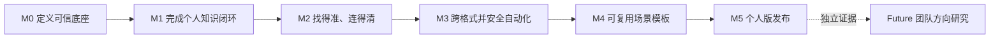

# 个人知识工作台结果导向路线图（v2 草案）

> 对应需求：[PRD v5 草案](PRD-v5-DRAFT.md) · [指标 v2 草案](METRICS-v2-DRAFT.md) · [v2 测试策略](../quality/TEST_STRATEGY_V2.md) · 文档版本：`v3.0-draft.2` · 更新日期：2026-08-26 · 状态：M0 定义进行中

> **文档边界：**本文描述 v2 的结果顺序、验证门槛与候选交付，不是日期承诺或已实现清单。v1.x 当前路线仍以 [ROADMAP.md](ROADMAP.md) 和[交付状态](../delivery/STATUS.md)为准。

## 1. 路线图原则

1. 先写用户和业务结果，再选择实现方案；
2. 里程碑只有达到退出条件才进入下一阶段，不以“代码已经写了”代替结果；
3. 多主题、多格式和可信来源属于通用个人知识能力，不按 PM、Agent、研究等职业或场景排先后；
4. PM 面试是一个可选模板实例，不是通用核心的商业滩头、用户门槛或发布前置；
5. 团队知识库只做未来研究和底层边界预留，不进入 v2 开发承诺；
6. 候选交付可以调整，只要目标结果、指标和安全边界不被削弱。

## 2. 结果链与关键依赖



关键依赖顺序：

```text
稳定对象与所有权
  → 多来源导入与版本
    → 内容块与跨格式锚点
      → 范围检索与可信引用
        → 原生链接、反链和可解释关系
          → 受控 Agent 工具
            → 可选场景模板
```

Agent 不能先于稳定对象、权限范围、版本和撤销模型；图谱不能先于关系类型与证据；更多格式不能只增加“能上传”，必须同时定义浏览、检索和锚点能力。

## 3. 阶段总览

| 阶段 | 结果陈述 | 用户可感知变化 | 主要度量 | 状态 |
|---|---|---|---|---|
| M0 产品定义 | 团队对 v2 的对象、范围、风险和验收形成同一理解 | 原型和说明不再把 PM、Obsidian 或单目录写成用户边界 | 文档追踪覆盖率、关键决策关闭率 | 进行中；测试策略待验收 |
| M1 个人知识底座 | 用户能独立建立两个知识空间并完成首次可信闭环 | 可导入 M1 格式，查询后精确回到原文并保存结果 | I-01、KR-02～04 | 未开始 |
| M2 可信发现与关系 | 用户在清楚范围内更快找到内容，并理解可解释的链接与图谱 | 混合检索、反链、结构/关系/聚焦图谱可用于真实任务 | KR-05～07、GRA 指标 | 未开始 |
| M3 多格式与受控自动化 | 用户能处理表格和图片，并让 Agent 安全减少重复整理 | 计划、差异、确认、撤销和审计形成闭环 | ING、AGT、净节省时间 | 未开始 |
| M4 可复用场景 | 不同任务可用同一核心组合模板，而不新增职业专用底层对象 | PM 面试、研究或其他模板按用户选择启用 | 模板任务成功率、核心复用率 | 未开始 |
| M5 个人版发布 | 外部个人用户可长期、自助、安全地使用 | 性能、迁移、隐私、可访问性和恢复达到门槛 | WVKL、4 周留存、全部护栏 | 未开始 |
| Future 团队研究 | 确认是否存在独立的共享、权限和付费需求 | 仅研究，不承诺团队功能 | 团队 E1 证据 | 未来 |

## 4. M0：产品定义与可执行边界（Now）

### 4.1 目标结果

产品、设计、研发和测试能用同一套对象、术语和需求 ID 解释 v2；评审者能明确区分“v1.x 已实现”“v2 目标”“待验证假设”和“未来方向”。

### 4.2 候选交付

- PRD v5、用户旅程、指标、路线图和证据矩阵；
- 目标系统架构、数据模型、迁移计划和关键 ADR；
- v2 信息架构、桌面/移动核心流程和异常状态原型；
- [v2 测试策略](../quality/TEST_STRATEGY_V2.md)和[核心测试场景](../quality/TEST_SCENARIOS_V2.md)；
- [版本化评测集结构](../quality/fixtures/v2/README.md)、设备/规模口径和事件隐私规范。

### 4.3 退出条件

- 所有 `F-01`～`F-12` 都能追溯到市场需求、用户旅程、指标、原型和架构责任；
- Workspace、Space、Collection、Source、Document、Version、Block、Asset、Link、Relation、Index Job 和 Agent Action 无冲突定义；
- 连接原位/复制模式、跨空间默认范围、M1 格式和 R1 确认策略等关键决策有明确负责人；
- 团队功能、职业专用核心对象和无确认破坏性操作明确排除；
- v2 信息架构和 V5-P01～P14 原型已形成验收设计基线；新增未映射原型能力不得进入实现。

## 5. M1：个人知识库底座（Next）

### 5.1 目标结果

不限职业的个人用户可以在不修改原文件的前提下，创建至少两个知识空间，导入 Markdown、TXT 和可选中文本 PDF，完成“查询—核验原文—保存结果”的首次有效知识闭环。

### 5.2 候选交付

- Workspace / Knowledge Space / Collection 与稳定 ID；
- 本地目录和单文件来源、导入预览与持久化 Index Job；
- Markdown、TXT、可选中文本 PDF 的解析、阅读和精确锚点；
- 空间级范围过滤、基础关键词/向量搜索和有证据问答；
- 文档阅读器、来源状态、系统内回跳与授权后的本地文件打开；
- v1.x 单目录迁移预览、默认空间、兼容入口与回滚演练；
- 空状态、部分失败、权限丢失、重启恢复和移动端查询/阅读。

### 5.3 退出条件

| 条件 | 门槛 |
|---|---|
| 首次有效闭环自助完成率 | ≥80%，外部样本覆盖至少 3 类任务 |
| 多空间范围正确率 | ≥90%，串库或越权为 0 |
| M1 格式导入可靠性 | ≥95%，部分失败可恢复 |
| 来源锚点准确率 | ≥98% |
| 原文件安全 | 未确认修改、移动或删除为 0 |
| 迁移 | 预览、取消、回滚和 v1.x 原文完整性通过 |

### 5.4 可调整范围

如果 PDF 精确锚点阻塞 M1，可以把扫描 PDF 明确降到 M3 OCR，但不能把“仅能上传、无法检索和引用”写成完整支持。空间、稳定对象和来源回跳不能因进度压力被绕过。

## 6. M2：可信发现、原生反链与可解释图谱（Next）

### 6.1 目标结果

用户能在当前或显式选择的多个空间中快速找到相关内容，理解结果为何命中，并通过链接、反链和图谱发现可回到证据的真实关系。

### 6.2 候选交付

- 关键词、向量、元数据过滤、融合和重排的可替换检索管线；
- 冻结评测集、Recall@10、MRR、nDCG、拒答和 P50/P95 报告；
- 系统内部稳定 URI、链接类型、反链计算、重命名/移动后的引用迁移；
- 结构视图、关系视图和单点聚焦视图；
- 显式链接、引用、结构关系、用户确认关系和语义建议的视觉分层；
- 每条事实关系的类型、方向、来源、时间和证据回跳；
- 大图过滤、聚合、文本摘要与无障碍替代视图。

### 6.3 退出条件

- 新检索方案在冻结评测集上不低于已接受基线，关键查询类型有明确改善；
- 参考设备和规模下搜索 P95 达到校准后门槛，目标 ≤2 秒；
- 已展示事实关系的可解释覆盖率为 100%；
- 关系和反链回跳准确率 ≥98%；
- 外部用户能完成至少一种关系发现任务，而不是只浏览图形；
- 未确认的语义建议不会显示为事实。

### 6.4 停止信号

若用户持续通过列表和搜索完成任务，图谱没有提高关系发现成功率，则保留可解释关系数据和聚焦视图，暂停大图可视化投入，不以节点数量证明价值。

## 7. M3：多格式与受控知识 Agent（Later）

### 7.1 目标结果

用户可以把表格和图片纳入同一知识闭环，并让 Agent 在明确范围内安全执行整理任务；自动化带来的时间节省高于计划审查和返工成本。

### 7.2 候选交付

- CSV、XLSX/XLS 的工作表、表格、单元格区域解析与引用；
- PNG/JPG/WebP 预览、OCR、区域锚点、处理方式和置信度；
- 可登记的 Agent 工具、最小权限和范围授权；
- R0～R3 风险分级、计划/执行分离、差异预览和部分拒绝；
- 可逆操作、版本、回收站、幂等键、逐项结果和用户可见审计；
- 只读查询、创建链接/行动、批量归类等代表性任务；
- 外部 AI 的最小内容发送、服务商和用途确认。

### 7.3 退出条件

| 结果 | 门槛 |
|---|---|
| M2 格式样本 | 支持等级内解析、检索和锚点达到冻结门槛 |
| 未确认写操作 | 0 |
| 越权读取/写入 | 0 |
| 撤销覆盖率 | 可逆写操作 100% |
| 重试重复写入 | 0 |
| 净节省时间 | 代表任务中位数 >0，且不以降低安全确认换取 |
| 计划可理解性 | 外部用户能说清将修改的对象、范围与风险 |

永久删除、任意系统命令和无审计外发不进入首发 Agent。

## 8. M4：可复用场景模板（Later）

### 8.1 目标结果

用户可以按自己的任务选择模板；模板只组合通用知识对象、检索、关系、Agent 工具和输出规则，关闭模板后通用个人知识工作台仍完整可用。

### 8.2 候选交付

- 模板清单、参数、允许空间、工具组合、评价规则和输出位置；
- PM 多轮面试模板：追问、个人证据、反馈、复习行动和报告；
- 至少一个非 PM 验证任务，例如研究综述、Agent 学习复盘或项目复盘；
- 模板运行历史、来源边界和可撤销写入；
- 自定义操作的受限配置方式，而不是任意代码执行。

候选模板不按职业排队。选择哪两个模板做验证，应由真实任务频率、核心复用价值和实现风险决定，不默认“先 PM、后其他”。

### 8.3 退出条件

- 至少两个不同任务类型使用同一核心对象和 Agent 工具完成闭环；
- PM/AI PM 不构成唯一或过半验证样本；
- 模板标准任务成功率达到冻结门槛，草案目标 ≥80%；
- 模板没有引入 PM、研究或其他职业专用的底层 Document/Link 数据对象；
- 关闭或卸载模板后，空间、文档、关系和历史不损坏。

## 9. M5：个人版发布准备（Later）

### 9.1 目标结果

外部个人用户能在真实环境中持续、自助、安全地完成多个知识主题的闭环，产品具备可恢复、可迁移、可解释和可维护的发布质量。

### 9.2 候选工作

- 性能和容量优化、后台任务恢复与降级；
- 桌面完整管理与移动核心查询/阅读；
- WCAG 2.2 AA 核心流程验收；
- 隐私说明、诊断导出、数据删除和模型模式；
- 安装、升级、v1.x 迁移和回滚；
- 外部多场景试用、4 周留存和真实付费/拒绝实验；
- 发布材料、版本、文档、测试证据和演示边界一致性。

### 9.3 发布门槛

- WVKL 和 4 周闭环留存显示持续价值，且不依赖维护者代操作；
- 至少 3 类个人知识任务完成端到端验证，PM/AI PM 不过半；
- 性能、格式、引用、图谱、Agent、迁移和可访问性达到已冻结门槛；
- 所有发布否决项为 0；
- 当前代码、文档、原型、测试证据、tag 和 Release 状态一致；
- 产品负责人基于证据明确作出 GO、PIVOT 或 STOP 决策。

## 10. Future：团队知识库研究（非 v2 承诺）

### 10.1 进入研究的条件

只有同时满足以下条件，才启动团队方向独立发现：

1. 个人版核心流程稳定，4 周留存和付费/持续使用取得 E1 证据；
2. 至少 3 个真实团队表达共享资料、权限、审计或协作需求；
3. 能识别明确的付费主体、数据责任人和采购障碍；
4. 团队需求不能只用“把个人空间发给别人”解决；
5. 项目具备承担身份、权限、云端、安全和运维的资源。

### 10.2 v2 仅做的预留

- 对象具有稳定所有权 ID；
- 数据访问经过服务边界；
- 文档标注未来需要权限判断的位置；
- 不把单用户写成无法迁移的全局常量。

v2 不开发成员邀请、角色权限、共享空间、评论、通知、实时协作、组织登录、云端多租户或团队计费。

## 11. 当前明确不排期

- 一次性支持所有文档格式和所有复杂版式；
- 完整替代 Obsidian、Notion、Word、Excel 或专业文件编辑器；
- 无确认的 Agent 批量改写、永久删除或任意系统命令；
- 团队协作、多租户和企业身份；
- 自营课程、开放学习包市场和复杂计费；
- 用更多节点、更多回答或更多 Agent 调用作为产品成功标准。

## 12. 风险、信号与调整规则

| 风险 | 早期信号 | 调整规则 |
|---|---|---|
| 多空间增加认知负担 | 范围任务频繁失败 | 简化空间/集合层级，默认单空间但保留扩展，不取消隔离模型 |
| 多格式拖慢核心闭环 | 解析投入大但格式使用低 | 依据真实频率调整 M2 格式顺序，保留统一适配接口 |
| 检索优化无实际收益 | 离线指标上升但任务时间不降 | 联合用户任务评估，避免只优化 benchmark |
| 图谱成为装饰 | 回跳和关系采用接近 0 | 收缩为聚焦关系和反链，不继续堆大图 |
| Agent 审查成本过高 | 净节省时间 ≤0 | 缩小工具范围，优化计划表达；不降低高风险确认 |
| 模板污染通用核心 | 新增职业专用底层字段 | 退回模板配置/扩展层，不并入核心模型 |
| 团队需求过早拉动范围 | 个人核心尚未稳定就出现协作开发 | 只记录研究问题，不进入 v2 Sprint |

## 13. 路线图治理

- 每个阶段开始前，更新 [PRD 证据矩阵](PRD_EVIDENCE_MATRIX-v5-DRAFT.md)并冻结对应指标口径；
- 候选交付进入 Sprint 前必须具备需求 ID、原型状态、架构责任、验收测试和回滚方案；
- 新格式、新 Agent 工具、数据外发或高风险操作必须更新 PRD/ADR 后再实现；
- 阶段评审记录 GO、PIVOT、STOP 或继续验证，不因已投入成本自动进入下一阶段；
- 实际交付事实只写入 `docs/delivery/`，路线图不把计划改写成完成状态。

---

*v3.0-draft.2：接入 v2 测试策略、核心场景和冻结夹具规范；M0 仍需验收质量合同并关闭关键实现决策。*
