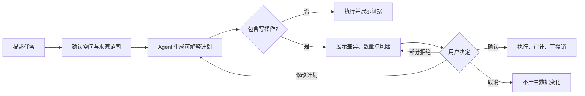

# 个人知识工作台用户旅程与服务蓝图（v2 草案）

> 对应需求：[PRD v5 草案](PRD-v5-DRAFT.md) · [MRD v3.2](MRD.md) · 文档版本：`v3.0-draft.1` · 更新日期：2026-08-24 · 状态：评审草案

> **文档边界：**本文描述 v2 目标体验，不代表这些能力已经实现。v1.x 当前旅程仍以 [USER_JOURNEY.md](USER_JOURNEY.md) 为准。

## 1. 旅程对象与核心任务

### 1.1 主要用户：多主题个人知识管理者

这类用户至少有两个需要长期维护的知识主题，资料分散在多个目录或格式中，希望在保留原有文件和工具的同时，建立可检索、可连接、可核验、可行动的个人知识系统。

典型场景可以是 Agent/AI 学习、研究、工作项目、PM 知识、课程或个人兴趣，但职业和主题不构成产品准入条件。

| 用户特征 | 当前做法 | 核心困难 | 期望结果 |
|---|---|---|---|
| 管理多个主题 | 用多个文件夹、笔记工具或临时对话分散保存 | 范围混乱，难以持续维护 | 每个知识空间边界清楚，需要时可显式跨空间 |
| 资料格式不同 | Markdown、PDF、表格、图片分别查看 | 无统一检索和引用 | 不同格式进入一致的查找与证据体验 |
| 需要可信答案 | 搜索文件名或直接询问通用 AI | 结果难核验，容易丢失上下文 | 每个结论可回到系统原文锚点或本地来源 |
| 希望理解关系 | 靠记忆、目录或手工链接 | 图谱好看但不可解释 | 关系有类型、方向、来源与证据 |
| 想减少整理成本 | 手工移动、重命名、归类和补链接 | 操作重复，AI 自动化又不可信 | Agent 先计划、再确认、可撤销、有审计 |

### 1.2 核心 Job to Be Done

> 当我的学习、研究和项目资料分散在不同目录与格式中时，我希望把它们放入边界清楚的知识空间，在需要时快速找到可信内容、理解相互关系、回到原文并安全地执行整理或学习行动，而不必更换所有原有工具或把控制权交给 AI。

### 1.3 旅程成功定义

一次“有效知识闭环”必须同时满足：

1. 用户带着真实问题、目标或整理任务进入；
2. 用户明确知道当前知识空间和资料范围；
3. 系统返回可用内容或明确说明证据不足；
4. 用户能核验具体原文位置；
5. 用户形成至少一个可保存结果，例如链接、反链、笔记、行动或已审查的 Agent 操作。

只完成导入、只生成回答、只浏览图谱或只触发 Agent 都不单独算作有效闭环。

## 2. 全生命周期旅程

| 阶段 | 用户行为与触点 | 用户在想什么 | 情绪 | 主要障碍 | 产品机会与成功信号 |
|---|---|---|---|---|---|
| 认知 | 从演示、介绍或他人分享了解产品 | “它和文件搜索、Obsidian、NotebookLM 有什么不同？” | 好奇但怀疑 | 容易被误解为 PM 专用、AI 聊天壳或 Obsidian 插件 | 用多主题、多格式、可回到原文的演示说明边界；用户能正确复述价值 |
| 考虑 | 查看本地优先、格式、模型和数据说明 | “我的文件会被复制、修改或上传吗？” | 谨慎 | 隐私与来源模式不透明 | 在安装前说明连接原位/复制模式、联网条件和可删除内容 |
| 获取与设置 | 安装或启动本地工作区，选择运行模式 | “我能否不改代码就开始？” | 期待夹杂不安 | 环境、路径、权限和模型配置复杂 | 引导完成率、错误可恢复率、零静默联网 |
| 初次建库 | 新建第一个知识空间，导入一组真实资料 | “系统识别了什么？失败的文件怎么办？” | 进展感 | 格式支持含糊、批量失败、处理状态不可见 | 展示预览、支持等级、逐文件状态和恢复动作 |
| 首次价值时刻 | 搜索真实问题，打开精确原文并保存链接或行动 | “这个结果可信吗？我以后还能回来吗？” | 获得信任 | 错误引用、范围不清、只能到文件级 | 首次有效知识闭环完成率；正确锚点打开率 |
| 日常使用 | 新增第二个空间，更新资料，查询、问答、链接和看图谱 | “它是否比原流程更快，也不会串库？” | 逐步依赖 | 搜索退化、关系噪声、更新不新鲜 | 范围正确率、检索成功率、关系采用率和索引新鲜度 |
| 深度使用 | 让 Agent 整理、批量链接或生成学习行动 | “它会改哪些东西？出错能否撤销？” | 高效与警惕并存 | 黑盒执行、确认疲劳、误改或越权 | 计划可理解、写操作确认率、撤销成功率、零越权 |
| 留存 | 持续维护多个空间，回看历史与待处理建议 | “资料变化后，旧链接和答案还可靠吗？” | 安心或流失 | 引用失效、任务丢失、维护成本回升 | 4 周有效闭环留存、引用迁移率、任务恢复率 |
| 推荐与迁移 | 分享脱敏结果，导出或解除连接 | “我能否带走数据，又不会暴露私人内容？” | 掌控感 | 导出不完整、私人路径泄露、数据被锁定 | 可验证导出与删除；他人能理解价值和边界 |

## 3. 核心旅程 A：首次可信知识闭环（P0）

| 阶段 | 1. 建空间 | 2. 选来源 | 3. 审查导入 | 4. 发起查询 | 5. 核验原文 | 6. 保存结果 |
|---|---|---|---|---|---|---|
| 用户行为 | 命名主题与目标 | 连接目录或选择文件 | 确认格式、范围和外发规则 | 选择当前空间并输入真实问题 | 打开系统内容锚点，可选回到本地文件 | 建链接、保存行动或继续查询 |
| 前台触点 | 工作区首页 | 来源选择器 | 导入预览与任务页 | 空间搜索/问答 | 文档阅读器与来源卡 | 链接面板/行动区 |
| 必要反馈 | 当前工作区和空间 | 连接原位/复制模式 | 成功、跳过、失败和重试 | 搜索范围和模式持续可见 | 高亮具体块、页码、单元格或图片区域 | 保存位置、反链和撤销结果 |
| 失败恢复 | 保留输入并解释命名冲突 | 权限、路径和格式分类处理 | 单文件重试，不推翻成功项 | 保留问题，可改写或切换范围 | 锚点失效时回退到版本与附近内容 | 保存失败可重试，不产生重复项 |
| 成功信号 | 创建成功 | 来源获授权 | 至少一份文档可用 | 得到相关结果或可信拒答 | 打开支持结论的原文 | 形成可再次访问的知识成果 |

### 3.1 Aha Moment

用户第一次从自己的资料得到有用结果，点击后直接定位到支持该结果的具体原文，并看到该结果已形成可返回的链接、反链或行动。这个时刻必须发生在 PM 面试、图谱和 Agent 等高级功能之前。

## 4. 核心旅程 B：系统原生链接、反链与本地回跳（P0）

| 关键问题 | 体验要求 | 验证方式 |
|---|---|---|
| 是否依赖 Obsidian | 系统内部地址和链接独立于来源工具 | 普通文件夹导入后也能创建链接与反链 |
| 能否精确回跳 | Markdown 到块、PDF 到页/文本、表格到区域、图片到区域 | 冻结样本逐条核验锚点 |
| 文件移动后怎么办 | 稳定文档 ID 不随空间重命名变化；来源变更触发重定位 | 重命名、移动和重建索引回归测试 |
| 本地文件打不开怎么办 | 原因可理解，并保留系统内可用版本或定位信息 | 权限丢失、文件移动和应用缺失测试 |
| 反链是否真实 | 反链由正向链接计算，不复制第二份事实 | 删除或修改正向链接后反链同步变化 |

## 5. 核心旅程 C：跨空间查询与知识发现（P0/P1）

1. 用户从当前空间开始，默认只搜索当前范围；
2. 用户显式选择一个或多个其他空间，界面立即显示范围变化；
3. 系统按关键词、向量、过滤与重排返回结果，并解释命中范围；
4. 用户可从结果进入原文、相关链接或图谱聚焦视图；
5. 如果证据跨空间，回答按来源分别标注，不能隐藏范围扩大；
6. 用户离开跨空间任务后，系统按已确认的产品决策恢复默认范围或记忆选择。

**主要流失风险：**系统静默跨空间、结果多但不相关、关系图过密、用户不知道为何命中。对应设计必须优先保证范围可见、过滤可用和证据回跳，而不是增加节点数量。

## 6. 核心旅程 D：受控 Agent 操作（P1）

| 风险级别 | 用户任务示例 | Agent 行为 | 用户控制 |
|---|---|---|---|
| R0 只读 | “找出这两个空间中关于 RAG 评估的分歧” | 在授权范围检索、总结并列出证据 | 可直接执行；范围和来源可见 |
| R1 可逆创建 | “把这些结果整理为学习清单并补链接” | 生成计划和新增项预览 | 执行前展示计划；可按会话确认；可撤销 |
| R2 批量修改 | “把 40 份文档按主题重组” | 展示逐项旧值、新值和影响 | 必须确认；允许部分拒绝；保留版本 |
| R3 破坏性/外发 | “覆盖原文、永久删除、发送到外部服务” | 默认拒绝或进入更高风险流程 | 二次确认、回收站和审计；永久删除不进入首发 |

## 7. 核心旅程 E：导入部分失败与恢复（P0）

| 场景 | 不可接受结果 | 目标恢复体验 |
|---|---|---|
| 个别文件损坏或不支持 | 整批回滚、只显示“导入失败” | 成功项立即可用，失败项按原因分组并可单独重试 |
| 扫描 PDF 或图片 OCR 不可靠 | 把低置信文本当作确定事实 | 标注处理方式和置信度，允许仅保留预览或更换 OCR |
| 文件重复 | 静默生成多个文档并污染搜索 | 显示相同、更新或冲突，用户决定跳过、更新或另存 |
| 源文件移动或权限丢失 | 原文回跳失效且无解释 | 保留系统记录，提示重新定位来源并验证指纹 |
| 应用在索引中退出 | 任务状态丢失或重复写入 | 重启后恢复状态，使用幂等操作继续或安全重试 |

## 8. 可选旅程 F：场景模板

场景模板建立在同一 Workspace、Document、Block、Link、Search 和 Agent 对象之上，不改变通用主导航，也不成为使用产品的前置步骤。

以 PM 面试模板为例：

1. 用户主动启用模板并选择允许引用的知识空间；
2. 用户设置岗位、类型、难度和轮数；
3. 面试 Agent 根据上一轮回答追问，并引用用户已授权的个人证据；
4. 反馈区分内容、结构、证据和知识缺口；
5. 用户将复习行动保存到选定空间，原知识块自动得到反链；
6. 用户关闭模板后，通用知识空间、搜索和关系功能仍完整可用。

Agent 学习、研究综述或项目复盘等模板应使用相同机制，不需要等待 PM 模板验证后才进入通用产品。

## 9. 服务蓝图

| 用户动作 | 前台体验 | 后台/本地能力 | 可见证据 | 失败补偿 |
|---|---|---|---|---|
| 创建/切换空间 | 持续显示当前范围 | 稳定 Space ID 与隔离过滤 | 空间名称、状态和文档数 | 冲突说明、恢复上一步范围 |
| 导入资料 | 预览和逐项任务状态 | 解析、切块、OCR、嵌入、关系提取 | 格式、阶段、成功/失败原因 | 跳过、重试、换处理方式 |
| 搜索或问答 | 结果、解释、引用和可信拒答 | 混合召回、过滤、重排、引用组装 | 命中范围、来源与锚点 | 保留问题、降级检索、重试 |
| 打开原文 | 高亮具体内容并显示上下文 | 稳定 ID、版本与格式适配器 | 块、页、区域或单元格 | 指纹重定位、版本回退 |
| 建链接/看反链 | 选择关系类型并即时更新 | 正向 Link 存储、反向关系计算 | 创建来源、时间和证据 | 冲突提示、撤销 |
| 看知识图谱 | 结构/关系/聚焦视图 | 实体解析与显式/推断关系分层 | 边类型、方向、来源和置信度 | 隐藏建议边、回到列表视图 |
| 运行 Agent | 计划、差异、确认和历史 | 工具授权、幂等执行、审计与逆向动作 | 范围、风险、逐项结果 | 取消、部分拒绝、撤销、回收站 |

## 10. 关键时刻与流失触发器

| 类型 | 时刻 | 产品判断 |
|---|---|---|
| 信任时刻 | 首次点击引用就定位到正确原文 | 来源准确性优先于回答措辞 |
| 掌控时刻 | 用户在 Agent 执行前看懂会改什么 | 计划和差异优先于自动执行速度 |
| 结构时刻 | 用户从图谱发现关系并能解释其来源 | 关系采用和回跳优先于节点数量 |
| 留存时刻 | 第二个空间和新增文件仍能稳定工作 | 隔离、新鲜度和稳定 ID 优先于新模板 |
| 流失触发 | 首次导入失败且没有恢复入口 | P0 阻断 |
| 流失触发 | 搜索串库或引用回到错误位置 | 发布否决 |
| 流失触发 | Agent 未确认改写或删除资料 | 发布否决 |
| 流失触发 | 关闭模板后核心功能缺失 | 说明场景耦合，必须回退设计 |

## 11. 跨端、可访问性与状态要求

- 桌面端承载导入、批量管理、图谱和 Agent 审查；移动端首发至少支持切换空间、搜索、问答、阅读原文和查看链接；
- 核心流程支持键盘操作、清晰焦点、屏幕阅读标签、减少动态效果和不依赖颜色的关系区分；
- 首次空状态必须告诉用户“下一步做什么”和“哪些资料不会被修改”；
- 加载、无结果、证据不足、部分成功、离线、权限丢失和任务恢复均需独立状态；
- 所有破坏性动作使用明确对象名称和影响数量，不使用模糊的“确定继续吗”。

## 12. 验证计划与待证假设

当前旅程主要来自项目所有者决策、v1.x 实现缺口和产品推演，不能替代外部用户证据。首轮验证至少覆盖 3 类知识任务，PM/AI PM 不得成为唯一、默认或过半样本。

| 假设 | 最小验证 | 通过信号 |
|---|---|---|
| 多空间能降低主题混乱 | 用户用真实资料建立两个空间并完成范围任务 | 范围正确率达到 [指标草案](METRICS-v2-DRAFT.md) 门槛 |
| 跨格式统一检索有价值 | Markdown、PDF 和至少一种 M2 格式配对任务 | 成功率提升且用户能核验锚点 |
| 原生反链促进复用 | 用户从结果建立关系，并在后续任务使用反链 | 反链被打开或用于下一步行动 |
| 图谱能支持理解而非展示 | 给定关系发现任务，不提示用户点击路径 | 用户找到关系并说清来源 |
| Agent 节省维护时间 | 同类任务比较手工与 Agent 的总时间和返工 | 节省时间且无安全门禁事件 |
| 通用核心不依赖 PM | 至少两个非 PM 任务完整走通主旅程 | 无需新增职业专用核心对象 |

## 13. 与需求和下游文档的关系

- 功能范围和验收来源：[PRD v5 草案](PRD-v5-DRAFT.md)；
- 指标口径和发布护栏：[METRICS-v2-DRAFT.md](METRICS-v2-DRAFT.md)；
- 阶段顺序和退出条件：[ROADMAP-v2-DRAFT.md](ROADMAP-v2-DRAFT.md)；
- 逐项追踪：[PRD_EVIDENCE_MATRIX-v5-DRAFT.md](PRD_EVIDENCE_MATRIX-v5-DRAFT.md)；
- v1.x 已实现旅程：[USER_JOURNEY.md](USER_JOURNEY.md)。

---

*v3.0-draft.1：将旅程从 PM 单场景重构为不限职业的个人知识闭环；新增多空间、多格式、原生反链、可解释图谱和受控 Agent 旅程。*
